# ❓Git

* 프로젝트 버전 관리 프로그램
* 형상 관리 도구
* 분산 버전 관리 프로그램

**👉[Git 명령어 바로가기](#1git)**

# ❓Markdown

* 문서를 구조화 하는 것
* HTML이 가벼운 마크업 언어
* text - to - HTML 전환하는 도구
* easy - to - write , easy - to - read 순수한 text 형태
* GitHub에서 *Readme.MD* 파일이 Markdown을 이용한 파일
* Typora - Markdown editor 을 이용

**👉[Markdown 명령어 바로가기](#2markdown)**

# ❓CLI

* commend line interface 의 약자로 터미널을 통하여 컴퓨터와 상호 작용하는 방식
* 사용자가 문자열 형태로 입력하며 명령어 등을통하여 의사소통을 주고 받음

**👉[CLI 명령어 바로가기](#3cli)**

# 명령어 모음

## 1.Git
> **1. git init - 저장소 처음 만들때**
 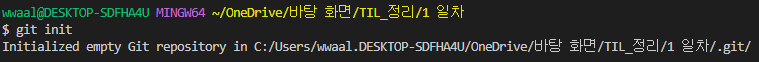

 시행하면 아래 그림과 같이 master가 뜬 것을 볼 수 있다.
 
 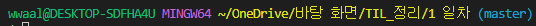

> **2. git add - 버전을 기록할때**
 파일 한개를 추가할 경우 git add <파일이름>

 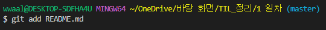
 
 파일 여러개를 추가할 경우 git add .
 
 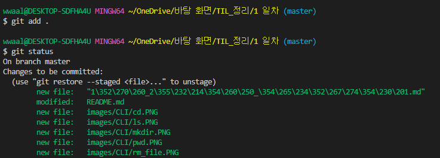
 
 한개를 추가할 때와는 다르게 여러개가 추가된 것이 보인다.

> **3. git commit -m '<커밋 메세지>' - 커밋에 메세지를 적을때**
 git add를 진행 한 후 commit을 이용하여 git에 commit한 후 log를 통하여 확인한다
 
 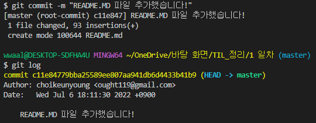
 
 add를 통하여 모든 파일을 올린 후 commit
 
 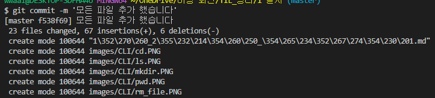
 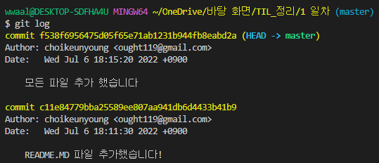

> **4. git status - git 상태 확인**
 현재 git의 상태를 확인한다 git에 commit이 됐는지 안됐는지 확인용
 
 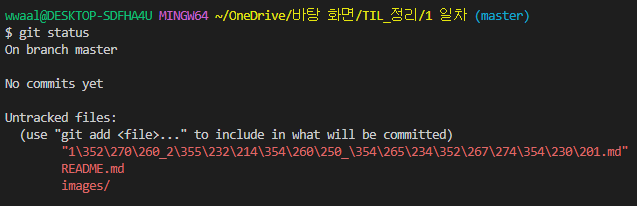

> **5. git log - git  버전 확인**
 commit이 된 기록들을 확인한다. (현재 없음)
 
 
 
 commit을 한 후
 
 

**git은 빈 폴더는 status에서 감지 못하기 때문에 .gitkeep 을 통하여 빈 폴더 내부에 만들어주면 빈 폴더도 git에서 인식할 수 있다.**

## 2.Markdown
> **1. Heading : 문서의 제목이나 소제목으로 사용 (h1~h6 까지 존재 #의 개수로 차이가 생김)**
 
 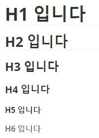

> **2. List : 순서가 있는거와 없는거로 나뉨**
 > 순서가  없는 리스트 : -(hypen) 로 사용이 가능하며 Shift 와 Tab 을 이용하여 단계 조정
 
 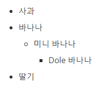
 
 > 순서가 있는 리스트 : *(asterisk), 1. 로 사용이 가능 Shift 와 Tab을 이용하여 단계 조정
 
 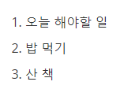

> **3. Fenced code block : \`(backtick)기호 3개를 이용하여 작성하며 특정 언어를 명시하면 syntax highlighting 기능이 적용된다.**
 
 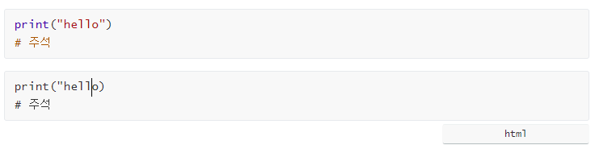
 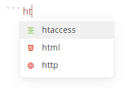
 
 CTRL + ENTER 을 이용하여 탈출이 가능하다.

> **4. inline code block : \`(backtick) 기호 1개를 이용하여 작성 (\ 하고 원하는 기호 넣으면 그대로 사용 가능)**
 기호나 함수의 이름 등 다양하게 사용 가능 하다.
  ex) ` * `

> **5. link - [내가 표현할 글씨]\(url)**
 [유튜브](https://naver.com)
  > 실행은 ctrl + 클릭

> **6. 이미지 -  을 이용하여 이미지를 받음**
 
 

> **7. 표 - 직접 만든다. ( 본문 - 표 삽입 // ctrl + T )**
 
 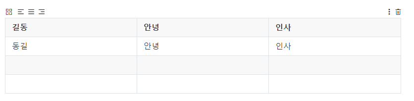
 
 - 소스 코드로 볼 경우
 
 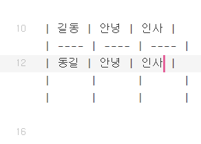
    많이 복잡하므로 Typora 기능을 적극적으로 활용 하자

> **8. 텍스트**
 **굵게(볼드체)** : **
 *기울임체* : *
 ~~취소선~~ : ~~ 로
 수평선 : —
 window + . : 이모지

## 3.CLI
> 1. mkdir : 폴더 생성
 
 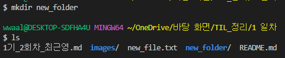

> 2. pwd : 현재 위치
 
 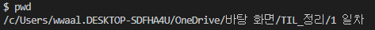

> 3. ls : 현재 위치 에서 존재하는 리스트 표시

 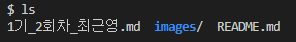

> 4. touch : 파일 생성
 
 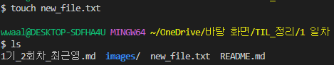

> 5. rm : 삭제하기
 
 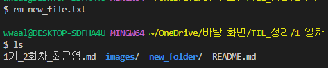

> rm : -r 폴더 지우기
 
 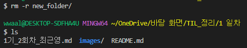

> 폴더 삭제시 주의사항!!
 
 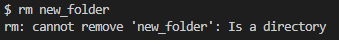

> 폴더는 -r을 사용하여 지워줘야 한다.

> 6. cd : 위치 이동
 
 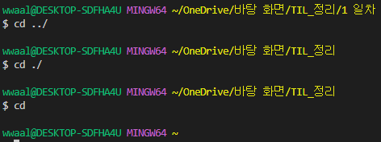