# **💅에러처리**
  - 오류가 가장 많이 발생하는 부분은 어디인가? => 변수가 어떻게 저장되는지 확인하는 구조
  - 오류는 다양한 오류들이 존재하며 각각 상황에 맞게 오류를 해결해야 한다.
  - print 함수 활용
    - 특정 함수 결과, 반복/조건 결과 등 나눠 생각하며 코드를 bisection으로 나눠 생각
    - branches : 모든 조건이 원하는대로 동작하는지
    - for loops : 반복문에 진입하는지, 원하는 횟수만큼 실행되는지
    - while loops : for loops와 동일, 종료조건이 제대로 동작하는지
    - function : 함수 호출시, 함수 파라미터, 함수 결과
  - 에러 메세지 발생
    - 해당 위치 찾아서 해결
  - 로직 에러가 발생
    - 명시적 에러없이 예상과 다른 결과가 나옴
      - 정상적으로 동작한 부분찾고 그 아래부터 수정
      - 전체 코드를 살펴봄
      - 휴식을 취하거나 누군가에게 설명
  

  **👉 문법 에러(Syntax Error)**
   - SyntaxError가 발생하면, 프로그램이 실행되지 않는다.
   - 파일이름, 줄 번호, ^문자를 통해 파이썬이 코드를 해석해 가며 문제가 발생한 위치를 나타남
   - 줄에서 에러가 감지된 가장 앞의 위치를 가키리는 캐럿(caret) 기호(^) 표시

   - EOL(End of Line)

   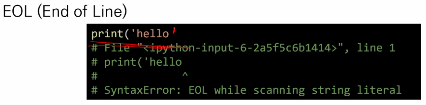

   - EOF(End of File)

   

   - Invalid Syntax

   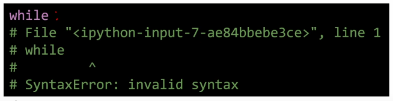

   - assign to literal (숫자, 문자 등 변하지 않는 값들에 잘못된 값을 넣은 느낌!)

   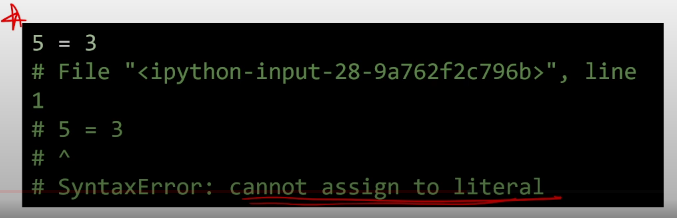

   - ZeroDivisionError : 0으로 나누고자 할 때 발생

   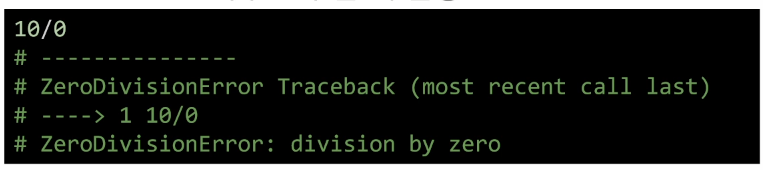

   - NameError : namespace 상에 이름이 없는 경우

   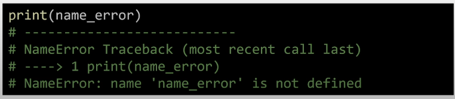

   - TypeError : 타입 불일치

   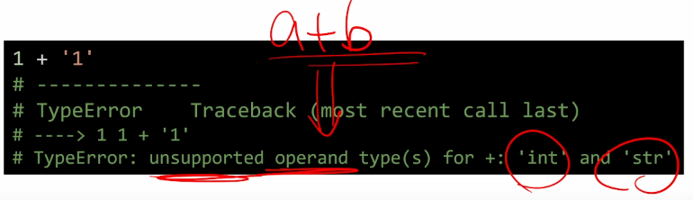

   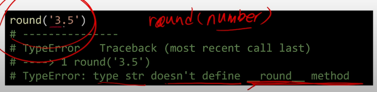

   - TypeError - arguments 부족 (divmod는 함수이다. => 두 수를 나누는 함수지만 요소를 제대로 안넣었다.)

   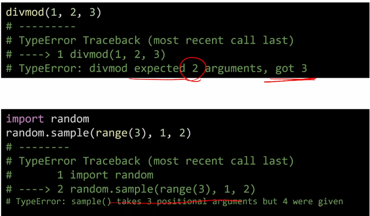

   

   argument의 갯수에 문제가 있는경우 위와 같은 오류들이 발생한다.

   - ValueError - 값이 바르지않거나 적절하지 않은 경우

   

   - IndexError - 인덱스 범위가 올바르지 않을때

   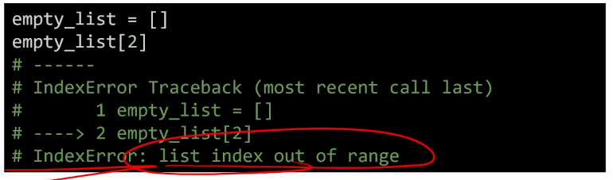

   - KeyError - 키 값이 올바르지 않을때

   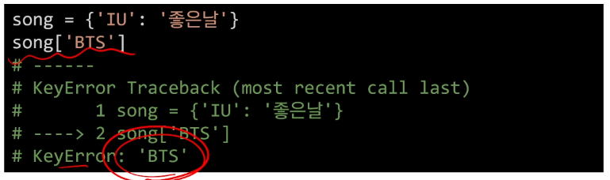
   
   - ModuleNotFoundError - 모듈이 존재하지 않을때

   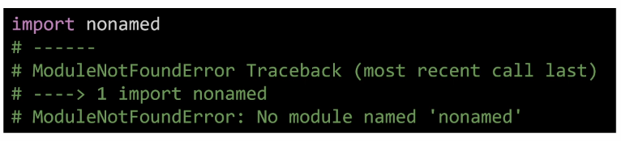

   - ImportError - Module은 있는데 class or function이 존재하지 않을때
   
   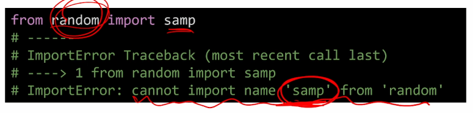

   - IndentationError - Indentation이 적절하지 않는 경우 (스페이스나 띄어쓰기등이 적절하지 않은경우)

   

   - KeyboardInterrupt - 임의로 프로그램을 조작하여 종료하였을 때

   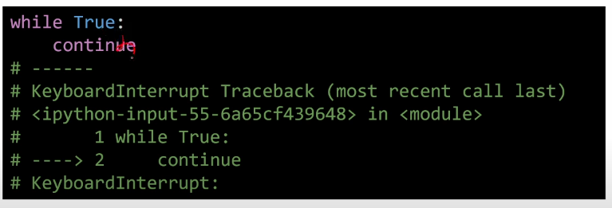

# **💅예외처리**
   - 실행 도중 예상치 못한 상황을 맞이하면, 프로그램이 실행을 멈춤
   - 실행 중에 감지되는 에러들을 예외(Exception)이라고 부름

   - try 문 / except 절
      - try 문
        - 오류가 발생할 가능성이 있는 코드를 실행
        - 예외가 발생하지 않으면, except 없이 실행 종료
      - except 문
        - 예외가 발생시 except 문 실행

```python
    num = input('숫자입력 : ')
    print((int(num)))
    # 숫자입력 : 3
    # 3
 ----------------------------------------------------------------
 num = input('숫자입력 : ')
    print((int(num)))
    # 숫자입력 : hi
    # ValueError : invalid literal for int() with base 10: 'hi'
    # 사용자가 잘못 입력한경우
-----------------------------------------------------------------
    num = input('숫자입력 : ')
    print((int(num)))

    try:
        if int(num) == 5:
            print('오오~')
        else:
            print('오가 아닙니다.')
    except:
        print("숫자를 입력하지 않았습니다.")
    # 숫자 입력 : hi
    # 숫자를 입력하지 않았습니다.
```
   - 상위의 개념으로 묶어버릴 경우 except 가 제대로 시행이 안됨.

```python
    number = input()

    try :
        print(100/int(number))
    except ZeroDivisionError:
        print("0으로 나눌 수 없습니다.")
    except ValueError:
        print("숫자 형식을 입력해주세요.")
    except Exception:
        print("오류")

```
   - 코드가 위에서부터 아래로 내려오기 때문에 작은 오류부터 큰 오류순으로 내려가는 구조로 만들어야 한다.

   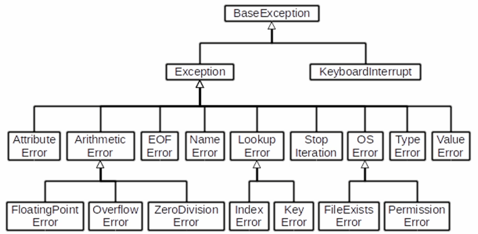

   👆 같은 Error의 구조를 잘 파악해두면 어느 Error 부터 except 구문을 사용해야하는지 잘 알 수 있다.

```python
    try:
        <실행할 내용>
    except:
        <try 문에서 예외가 발생 시 실행할 내용>
    else:
        <try 문에서 예외가 발생하지 않으면 실행함>
    finally:
        <예외 발생 여부와 관계없이 항상 실행>

    try:
        f = open('noofile.txt')
    except FileNotFoundError:
        print('해당 파일이 없습니다.')
    else:
        print('파일 읽기 시작합니다.')
        print(f.read())
        print('파일을 모두 읽었습니다.')
        f.close()
    finally:
        print('파일 읽기를 종료합니다.')
    # 파일이 없는 경우 except 구문 시행
    # 파일이 있는 경우 else 구문 시행
```
   
   위와 같이 try except 구문도 사용이 가능하다.


   - raise <표현식>(메세지) : 예외 발생시키기
     - 라이브러리등 내부적으로 에러라는 것을 알려주기 위해서 사용


  **`코드의 상태를 신중하게 출력해가며 심사숙고하는 것보다 효과적인 디버깅 도구는 없다.`**

  