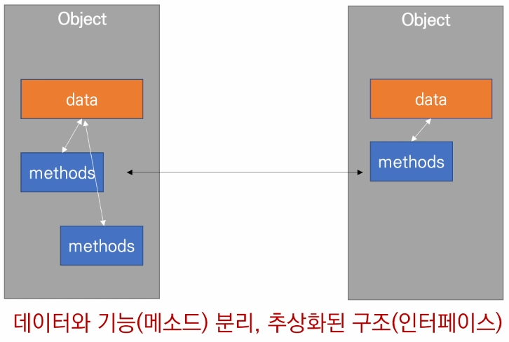
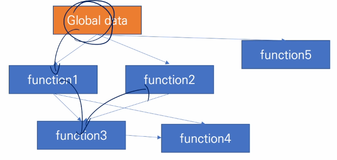
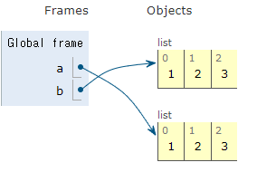
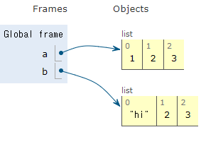
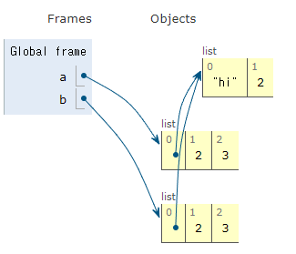
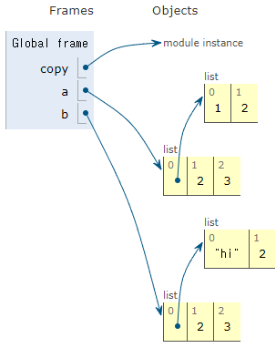

# 객체
  - 특정 타입의(클래스) 인스턴스(사례) 이다.
```python
    a = [1,2,3]
    print(a, type(a))
    # [1,2,3] <class 'list'>
    b = '123'
    print(b, type(b))
    # '123', <class 'str'>
```
  - 객체의 특징
    - 타입(type) : 어떤 연산자와 조작이 가능한가?
    - 속성(attribute) : 어떤 상태를 가지는가
    - 조작법(method) : 어떤 행위를 할 수 있는가
  

  - 객체지향 프로그래밍 : 여러 개의 독립된 객체들과 그 객체간 상호작용으로 프로그래밍 하는 것
  
  

  **객체 지향 프로그래밍의 예시**
```python
    class Person:
        def __init__(self, name, gender):
            self.name = name
            self.gender = gender

        def greeting_message(self):
            return f'안녕하세요, {self.name}입니다.'
    jimin = Person('지민', '남')
    print(jimin.greeting_message())
    # 안녕하세요, 지민입니다.
```  

  - 절차지향 프로그래밍 구조 : 데이터와 함수로 인한 변화를 주며 위에서부터 아래로 내려가는 구조를 취함

  

```python
    def area(x, y):
        return x*y

    def circumference(x, y):
        return 2 * (x + y)
    
    a=10
    b=30
    c=300
    d=20
    square1_area = area(a,b)
    square1_circumference = circumference(a,b)
    square2_area = area(c,d)
    square2_circumference = circumference(c,d)
```

  - 현실 세계를 프로그램 설계에 반영(추상화)


   **✨클래스,인스턴스,객체✨**
   - 클래스 : str, Person, ..... (사람 그 자체)
   - 인스턴스 : '123', iu (사람들 중 하나)
   - 객체 : 모든 것

```python
    my_list = [1,2,3]
    # 리스트.sort()
    # 리스트 데이터를 직접 정렬
    my_list.sort()

    my_list = [1,2,3]
    # 리스트는 sorted 함수의 인자로 전달될 뿐
    sorted(my_list)
```

# OOP
  - 파이썬은 모든것이 객체다.

```python
    # 클래스 정의 => 객체들의 분류
    class MyClass: 
        pass
    # 인스턴스 생성 => 하나하나의 실체
    my_instance = MyClass()
    # 메서드 호출 => 특정 데이터 타입/클래스의 객체에 공통적 적용 가능한 행위 (클래스 내부 정의된 함수)
    my_instance.my_method()
    # 속성
    my_instance.my_attribute
    # MyClass => CarmelCase(대문자를 섞어쓰는 것)
    # snake_case => 변수 | 함수
```

   - **객체 비교하기**
     - ==
       - 동등한 의미
       - 변수가 참조하는 객체가 동등한 경우 True
       - 두 객체가 같아 보이지만 실제로 동일한 대상을 가리키고 있다고 확인한 것이아님(주소값이 다를 수 있음)
     - is
       - 동일한
       - 두 변수가 동일한 객체를 가리키는 경우 True(주소값이 같은 경우)

```python
    a = [1,2,3]
    b = [1,2,3]
    print(a == b, a is b)
    # True , False => 값은 같지만 주소가 다름
    a = [1,2,3]
    b = a
    print(a == b, a is b)
    # True True => 같은 주소를 가지기 때문에 값을 수정시 같이 변함
    
```


   - **얕은 복사**

```python
    a = [1,2,3]
    b = a
    b[0]='hi'
    print(a)
    # ['hi',2,3]
    print(b)
    # ['hi',2,3]
```

   

   - 값이 같이 변하는 이유는 주소값을 복사해 주기 때문이다.
   - 같은 주소값이 아닌 다른 주소값을 가진 값들로 저장하게 바꿔준다.

```python
    a = [1,2,3]
    b = list(a)
    # 주소값을 다르게 설정해줌
    b[0]='hi'
    print(a)
    # [1,2,3]
    print(b)
    # ['hi',2,3]
```

   

   - 값은 같지만 다른 주소값이 할당된 것을 볼 수 있다.

   - **깊은 복사**

```python
    a = [[1,2],2,3]
    b = list(a)
    b[0][0]='hi'
    print(a)
    # [['hi',2],2,3]
    print(b)
    # [['hi',2],2,3]
```

   

   - a라는 리스트에서 겉의 리스트의 주소값은 다르다
   - 내부의 또 한개의 리스트의 주소값을 공유하기 때문에 리스트 내부의 리스트 주소가 같은 것을 깊은 복사라고 한다.
   - copy 라는 내장함수를 사용해 해결한다.

```python
    import copy
    a = [[1,2],2,3]
    b = copy.deepcopy(a)
    b[0][0] = 'hi'
    print(a)
    # [[1,2],2,3]    
    print(b)
    # [['hi',2],2,3]
```

   

   - 다른 주소값을 공유하는 것을 볼 수 있다.

   
   - **인스턴스 메소드**
     - 인스턴스 변수를 사용 혹은 변수에 값을 설정하는 메소드
     - 클래스 내부 정의되는 메소드는 기본
     - 호출 시, 첫번째 인자로 인스턴스 자기자신(self)이 전달됨
     - self
       - 인스턴스 자기자신
       - 파이썬에서 인스턴스 메소드 호출 시 첫번째 인자로 인스턴스 자신이 전달됨.
       - 암묵적으로 self를 첫번째 인자로 정의

```python
    class MyClass

        def instance_method(self, arg1, ...)
    
    my_instance = MyClass()
    my_instance.instance_method(...)
```

   - **생성자 메소드**
     - 인스턴스 객체가 생성될 때 자동으로 호출되는 메서드
     - 인스턴스 변수들의 초기값을 설정 (__init__ 메소드 자동 호출)

```python
    class Person:

        def __init__(self):
            print("인스턴스가 생셩되었습니다.")
```

   - **소멸자 메소드**
     - 인스턴스 객체가 소멸되기 직전에 호출되는 메소드
       - __del__

```python
    class Person:

        def __del__(self):
            print("인스턴스가 사라졌습니다.")
```

   - **인스턴스, 생성자 메소드 활용**

```python
    class Person:
        
        # 생성자! 인스턴스가 생성될때 어떠한 작업!
        def __init__(self, name):
            # 그 인스턴스의 이름을 name으로 해줘야함 => 어떻게?
            # self.name = name => 인스턴스의 속성을 name으로 정의
            print("응애!")

    # Person 클래스의 인스턴스인 iu를 생성
    iu = Person("아이유")
    jimin = Person("지민")
```