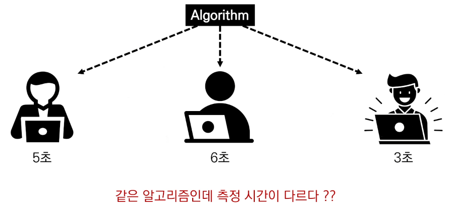
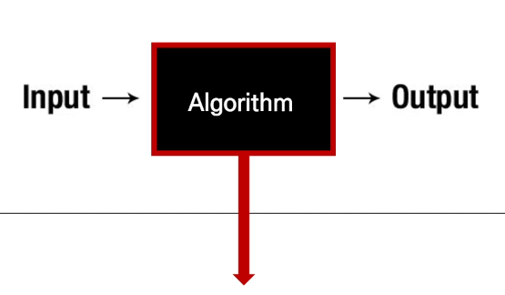
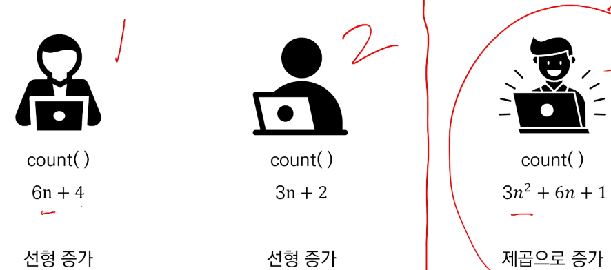
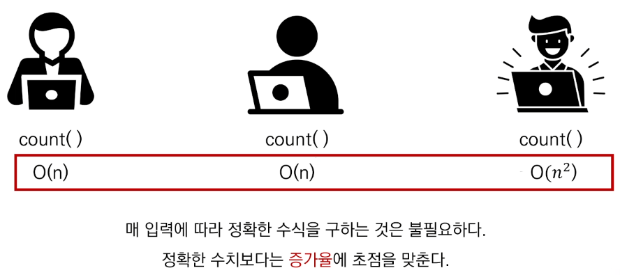
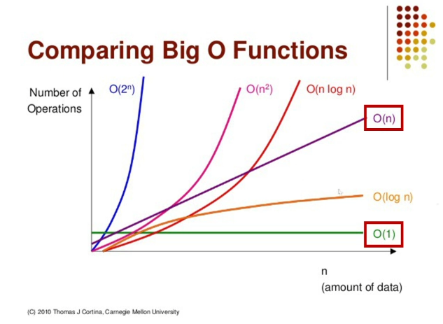
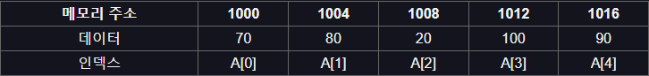
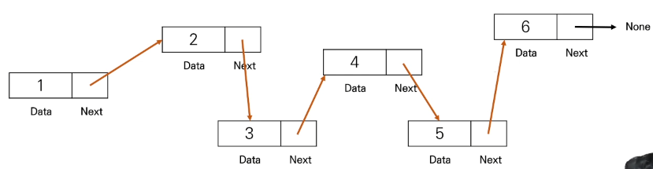
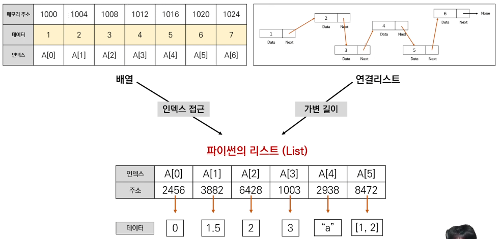

# 시간 복잡도
  - 좋은 알고리즘이란 무엇일까?
    - 효율성이 좋은 알고리즘?
    - 성능이 좋은 알고리즘?
    - Input을 넣은 후 Ouput이 나오는 시간이 짧은 알고리즘 
  
  - 소요 시간 측정하기

  

    - 개개인의 컴퓨터 사양등에 따라 달라진다.

  - 객관적인 측정을 위해 알고리즘 내부에서 기본연산이 몇 번 일어나는지 살펴본다.

  

```python
    def count(word, char):
        total =0

        for i in word:
            if i == char:
                total += 1
        return total
```
  **기본연산 : 단위 시간 1이 소요되는 연산 ( 기본연산의 총 횟수 == 알고리즘의 소요 시간)**

  - 시간 복잡도 : 문제 해결하는데 걸리는 시간과 입력의 함수의 관계
    - 알고리즘의 수행 시간을 의미
      - 시간 복잡도가 높다 => 느린 알고리즘
      - 시간 복잡도가 낮다 => 빠른 알고리즘
  
  

  - 시간복잡도가 연산이 많아질 수록 높아진다. (3 > 1 > 2 )

# Big-O 표기법
  
  

  - 점근적 표기법에 의해 1번과 2번은 동일한 시간 복잡도를 나타낸다.

  

  - 1억개의 데이터를 넣어도 상수의 시간복잡도를 낼 수 있다면 불가능을 가능하게 만드는 기술

  - 다양한 종류의 시간 복잡도
    - O(1) 상수 복잡도 : 단순 산술 계산 (덧셈, 뺄셈, 곱셈, 나눗셈)
      - O(1) : 단순계산 => a + b, 100 * 200

    - O(logN) : 크기 N인 리스트를 반절씩 순회/탐색
      - O(logN) => 이진탐색(Binary Search), 분할정복(Divide & Conquer)
    
    - O(N) : 크기 N인 리스트를 순회
      - O(N) => 리스트 순회, 1중 for 문
    
    - O(NlogN) : 크기 N인 리스트를 반절씩 탐색 * 순회
      - O(NlogN) => 높은 성능의 정렬(Merge/Quick/Heap Sort)
    
    - O(N^2) : 크기 M, N인 2중 리스트를 순회
      - O(N^2) => 2중 리스트 순회, 2중 for 문
    
    - O(N^3) : 3중 리스트를 순회
      - O(N^3) => 3중 리스트 순회, 3중 for 문

    - O(2^N): 크기 N 집합의 부분 집합
      - O(2^N) => 크기가 N인 집합의 부분 집합

    - O(N!) : 크기 N 리스트의 순열
      - O(N!) => 크기가 N인 순열

  [시간복잡도](https://wiki.python.org/moin/TimeComplexity)

  [Big-O 관련 참고](https://jojozhuang.github.io/tutorial/big-o-cheat-sheet/)

# 리스트
  
  1. 배열(Array) : 여러 데이터들이 연속된 메모리 공간에 저장된 자료구조
   - 인덱스(Index)를 통해 데이터에 빠르게 접근
   - 배열의 길이는 변경 불가 => 길이를 변경하고 싶으면 새로 생성
   - 데이터 타입은 고정

  

  2. 연결 리스트 (Linked List) : 데이터가 담긴 여러 노드들이 순차적 연결된 형태의 자료구조

  - 맨 처음 노드부터 순차적 탐색
  - 연결리스트의 길이 자유롭게 변경 가능 =\> 삽입, 삭제가 편리
  - 다양한 데이터 타입 저장
  - 데이터가 메모리에 연속적으로 저장되지 않음

  

  Python 의 리스트는 배열과 연결 리스트를 병합시켜놓은 느낌으로

  

  처럼 배열이지만 크기를 마음대로 늘리거나 줄이는 등 다양한 장점을 가지고 있다.

  3. 리스트의 메서드
   - .append() : 리스트 맨 끝에 새로운 원소 삽입 => O(1)
```python
    a = [1, 2, 3]
    a.append(4)
    # a = [1, 2, 3, 4]
```
   - .pop() : 특정 인덱스에 있는 원소를 삭제 및 반환 => O(1)
```python
    a = [1, 2, 3, 4]
    a.pop()
    # a = [1, 2, 3]
```
   - .count() : 리스트에서 해당 원소의 개수를 반환 => O(n)
```python
    a = [1, 2, 2, 3, 3, 3]
    print(a.count(2))
    # 2
```
   - .index() : 리스트에서 처음 원소가 등장하는 인덱스 반환 => O(n) 항상 가장 최악의 상황에서의 복잡도를 고려한다
```python
    a = [1, 2, 3, 5, 5]
    print(a.index(2))
    # 1
```
   - .sort() : 리스트를 오름차순 정렬 => 
     reverse=True 옵션을 통해 내림차순 가능
```python
    a = [5, 2, 4, 0, -1]
    a.sort()
    print(a)
    # [-1, 0, 2, 4, 5]
    a.sort(reverse=True)
    print(a)
    # [5, 4, 2, 0, -1]
```

   - .reverse() : 리스트의 원소들의 순서를 거꾸로 뒤집기 => O(n)
```python
    a = [1, 2, 3, 4, 5]
    a.reverse()
    print(a)
    # [5, 4, 3, 2, 1]
```
  4. 리스트의 함수

   - len(a) : 문자열의 길이를 측정한다. => O(1)
```python
    a = [1, 2, 3, 4]
    len(a)
    # 4
```
