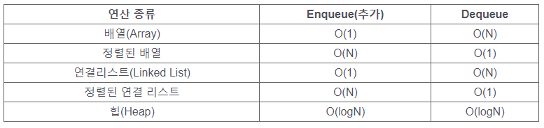
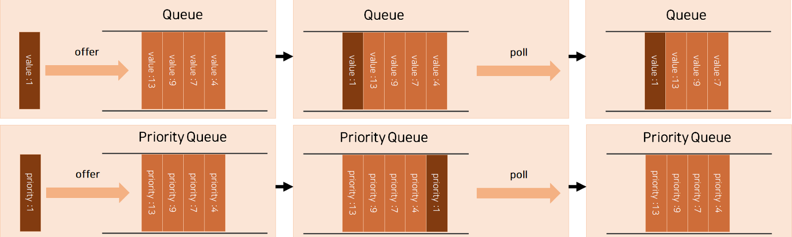
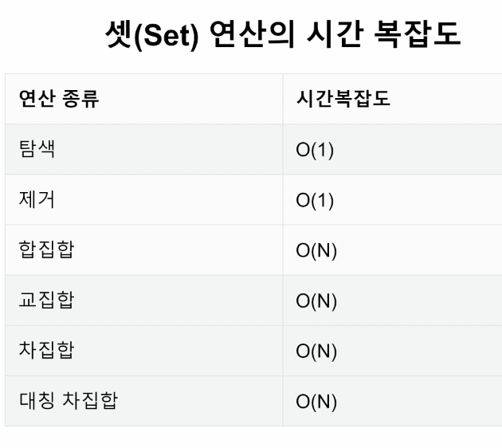

# 힙

  - 일반적인 큐는 순서를 기준으로 가장 먼저 들어온 데이터가 나가는 FIFO(First-in First-out) 선입선출 방식

  - 순서가 아닌 다른 기준으로 줄을 세우는 방식

  - 우선순위 큐(Priority Queue)는 우선순위(중요도, 크기 등 순서 이외의 기준)으로 우선순위가 높은 데이터가 가장 먼저 나가는 방식

  

  - 우선순위를 기준으로 가져올 요소를 결정하는 큐
    1. 가중치가 있는 데이터
    2. 작업 스케줄링
    3. 네트워크

  - 우선순위 큐(Priority Queue)를 구현하는 방법
    1. 배열(Array)
    2. 연결 리스트(Linked List)
    3. 힙(Heap) => 우선순위 큐 라고 보면 되는가? : 우선순위 큐를 구성하는 방법으로 생각하면 됨.

  - 구현 시간 별 복잡도

  

  - Heap을 사용하면 Enqueue와 Dequeue 를 구현할때 매우 효율적으로 사용이 가능하다.

  - 최대값 또는 최솟값을 빠르게 찾아내도록 만들어진 데이터 구조
  
  - 완전 이진 트리의 형태로 느슨한 정렬 상태를 지속적으로 유지 한다.
  
  - 힙 트리에서는 중복 값을 허용한다.

  - Heap은 언제 사용할까?
    1. 데이터가 지속적으로 정렬되야 하는 경우
    2. 데이터에 삽입/삭제가 빈번할때

  - 파이썬의 heapq 모듈
    - Minheap(최소 힙)으로 구현되어 있음(가장 작은 값이 먼저 옴)
    - 삽입, 삭제, 수정, 조회 등 연산의 속도가 리스트보다 빠르다.

   < Heap과 Queue>

  - heapq 의 문법
    - heapq.heapify(numbers) : numbers를 destructive method 이기 때문에 기존의 데이터를 바꿔준다.
    - heapq.heappop(numbers) : numbers에서 젤 처음 값을 빼준다. 이때 빼준 다음 list 값이 최소값으로 바뀐다.
    - heapq.heappush(numbers, item) : numbers에 값을 넣어준다.
```python
    numbers = [5,3,2,4,1]
    heapq.heapify(numbers)
    # numbers => [1,3,2,4,5]
    heapq.heappop(numbers)
    # numbers => [2,3,4,5]
    heapq.heappop(numbers)
    # numbers => [3,4,5]
    heapq.heappush(numbers, 10)
    # numbers => [3,4,5,10]
    heapq.heappush(numbers, 10)
    # numbers => [0,3,5,10,4]
```

# 셋 (Set)
  - Set은 언제 사용해야 할까?
    1. 데이터의 중복이 없어야 할 때(고유값들로 이루어진 데이터가 필요할 때)
    2. 정수가 아닌 데이터의 삽입/삭제/탐색이 빈번히 필요할때

  