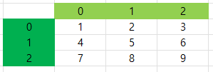

# 이차원 리스트
  - 이차원 리스트는 리스트를 원소로 가지는 리스트일 뿐이다.
```python
    matrix = [[1, 2, ,3], [4, 5, 6], [7, 8, 9]]
    matrix = [
     # 0  [1, 2, 3],
     # 1  [4, 5, 6],
     # 2  [7, 8, 9]
    ]
```
  - 이차원 리스트는 행렬(matrix)이다

  

  - 특정 값으로 초기화 된 이차원 리스트 만들기
  - 반복문으로 작성(n * m 행렬)
```python
    n = 4 # 행
    m = 3 # 열
    matrix = []

    for _ in range(n):
        matrix.append([0] * m)
    
    print(matrix)
    # [[0, 0, 0 ], [0, 0, 0], [0, 0, 0], [0, 0, 0]]
```
  - 리스트 컴프리헨션으로 작성 (n * m 행렬)
```python
    n = 4 # 행
    m = 3 # 열
    matrix = [ [0] * m for _ in range(n)]

    print(matrix)
    # [[0, 0, 0 ], [0, 0, 0], [0, 0, 0], [0, 0, 0]]

    matrix2 = [[0] * m] * n
    # [[0, 0, 0 ], [0, 0, 0], [0, 0, 0], [0, 0, 0]]
```
  - 컴프리헨션과 곱셈연산으로 만든 리스트는 다르다.
    - 컴프리헨션으로 만든 리스트는 각각의 주소가 다르다.
    - 곱연산으로 만든 리스트일 경우 주소를 공유하기 때문에 값을 한개만 바꿔도 전체가 바뀐다.
    
 1. 입력 받기
  - 리스트 컴프리헨션을 사용하여 행렬 생성
