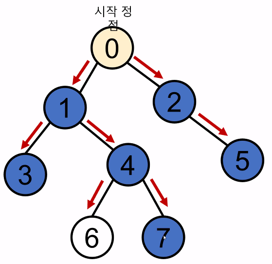
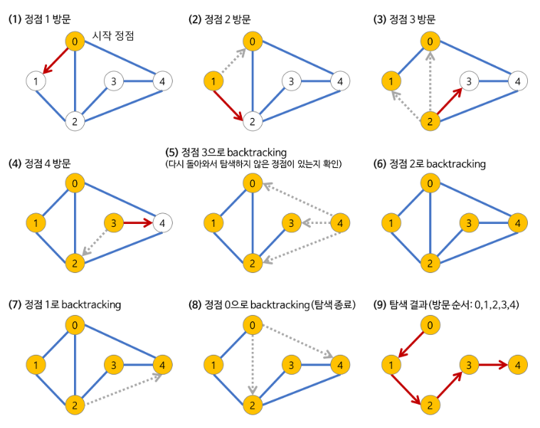

# 그래프 탐색 알고리즘
  - 시작 정점에서 간선을 타고 이동할 수 있는 모든 정점을 찾는 알고리즘

  

  - 그래프 탐색 알고리즘에는 깊이우선탐색(DFS) 와 너비우선탐색(BFS) 가 있다.
## 깊이우선탐색(DFS, Depth-First Search)
  - 시작 정점으로부터 모든 갈 수 있는 하위 정점까지 가장 깊게 탐색하고 갈 곳이 없다면  마지막 갈림길로 돌아와 다른 정점을 탐색하여 모든 정점을 순회
  - 너비우선탐색에 비해 코드 구현이 간단하다.
  - 너비우선탐색(BFS)에 비하여 느림
  - 자기 자신을 호출하는 순환 알고리즘의 형태를 지님
  - 그래프 탐색의 경우 어떤 노드를 방문했었는지 여부를 반드시 검사해야 한다.

  

  - DFS는 정점의 수 N 과 간선의 수 E의 모든 간선을 조회한다.
  - 인접 리스트로 표현된 그래프는 O(N+E) 의 시간 복잡도를 가진다.
  - 인접 행렬로 표현된 그래프는 O(N^2) 의 시간 복잡도를 가진다.

  - DFS 코드 구현 해보기
```python
    graph = [
        [1, 2],
        [0, 3, 4],
        [0, 4, 5],
        [1],
        [1, 2, 6],
        [2],
        [4]
    ]
    visited = [False] * n # n개의 방문 처리 리스트 생성

    def dfs(start):
        stack = [start] # 돌아갈 곳을 기록
        visited[start] = True # 시작 정점 방문 처리

        while stack: # 스택이 빌때까지 (돌아갈 곳이 없을때까지) 반복
            cur = stack.pop() # 현재 방문 정점(후입선출)

            for adj in graph[cur]: # 인접한 모든 정점에 대해
                if not visited[adj]: # 아직 방문하지 않았다면
                    visited[adj] = True # 방문 처리
                    stack.append(adj) # 스택에 넣는다
``` 