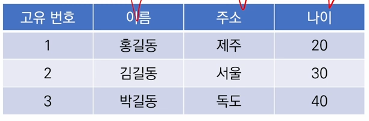
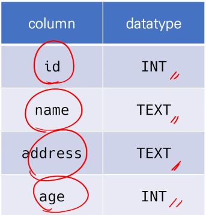
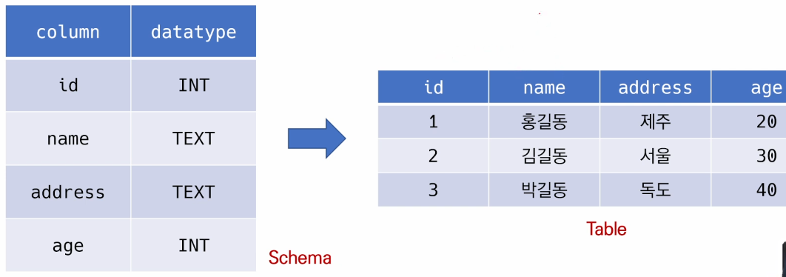
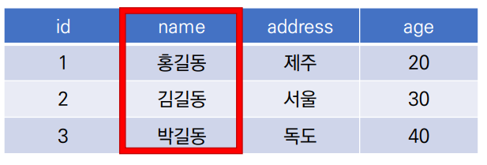
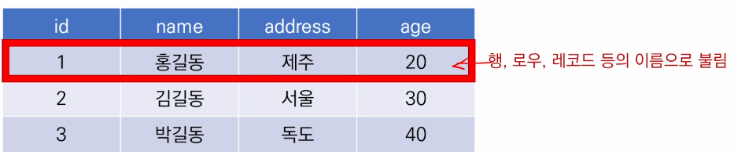
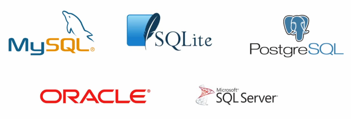
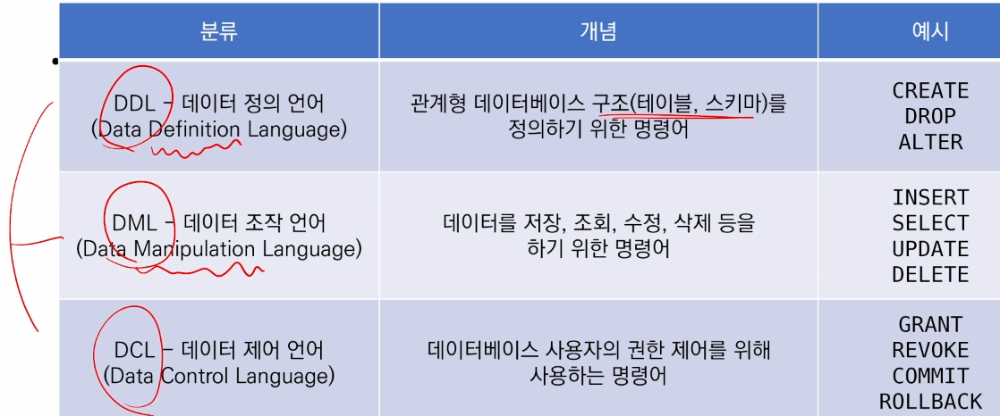
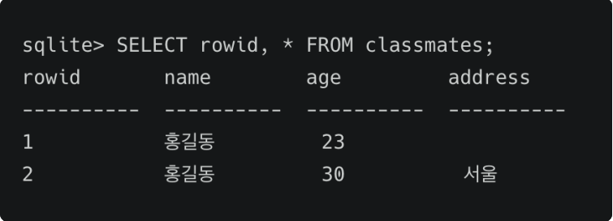

# Database
  - 주요 사용 언어는 SQL
  - 체계화 된 데이터의 모임
  - 여러 사람들이 공유하고 사용할 목적으로 통합 관리되는 정보의 집합
  - 논리적 연관된 자료의 모음, 고도로 내용을 구조화 함으로써 검색과 갱신의 효율화 한 것
  - 몇 개의 자료 파일을 조직적으로 통합하여 중복 자료항목을 제거하고 자료를 구조화 하여 기억시켜 놓은 자료의 집합체
  - 데이터베이스로 얻는 장점들
    - 데이터 중복 최소화
    - 데이터 무결성 ( 정확한 정보를 보장 )
    - 데이터 일관성
    - 데이터 독립성 ( 물리적 / 논리적 )
    - 데이터 표준화
    - 데이터 보안 유지

# RDB (RDB, Relational Database)
  - 관계형 데이터베이스
  - 서로 관련된 데이터를 저장하고 접근할 수 있는 데이터베이스 유형
  - 키(key)와 값(value)들의 간단한 관계(relation)를 표(talbe) 형태로 정리한 데이터베이스
   
   

  - 스키마(schema)
   - 데이터베이스에서 자료의 구조, 표현방법, 관계등 전반적인 명세를 기술한 것

   

  - 테이블(table)
   - 열(컬럼/필드)과 행(레코드/값)의 모델을 사용해 조직된 데이터 요소들의 집합

   

  - 열(column)
   - 각 열에 고유한 데이터 형식 지정

   
  
  - 행(row)
   - 실제 데이터가 저장되는 형태

   

  - 기본키(Primary Key)
   - 각 행(레코드)의 고유 값
   - 반드시 설정해야 하며, 데이터베이스 관리 및 관계 설정 시 주요하게 활용 됨

   

  - 관계형 데이터베이스 관리 시스템 (RDBMS)
   - 관계형 모델을 기반으로 하는 데이터베이스 관리시스템을 의미

   

  - SQLite
   - 서버 형태가 아닌 파일 형식으로 응용 프로그램에 넣어서 사용하는 비교적 가벼운 데이터베이스
   - 구글 안드로이드 운영체제에 기본적으로 탑재된 데이터베이스이며, 임베디드 소프트웨어에도 많이 활용됨
   - 로컬에서 간단한 DB 구성을 할 수 있으며, 오픈소르 프로젝트이기 때문에 자유롭게 사용가능
   - 학습을 하는데 있어서 사용이 편하다.

  - SQLite Data Type
   1. NULL
   2. INTEGER : 크기에 따라 0, 1, 2, 3, 4, 6 또는 8바이트 저장된 부호 있는 정수
   3. REAL : 8바이트 부동 소수점 숫자로 저장된 부동 소수점 값
   4. TEXT
   5. BLOB : 입력된 그대로 정확히 저장된 데이터

# SQL (Structured Query Language)
  - 관계형 데이터베이스 관리시스템의 데이터 관리를 위해 설계된 특수 목적의 프로그래밍 언어
  - 데이터베이스 스키마 생성 및 수정
  - 자료의 검색 및 관리
  - 데이터베이스 객체 접근 조정 관리

  

  - SQL Keywords
    1. INSERT : 새로운 데이터 삽입(추가)
    2. SELECT : 저장된 데이터 조회
    3. UPDATE : 저장된 데이터 갱신
    4. DELETE : 저장된 데이터 삭제

```SQL
  CREATE TABLE students (
    id INTEGER PRIMARY KEY, -- id 는 정수로 기본 값
    name TEXT NOT NULL, -- name 은 TEXT 이지만 비어있으면 안된다.
    age INTEGER DEFAULT 1 CHECK ( 0 < age ) -- age는 기본 1로 하되 0보다 age가 큰것을 확인해라
);
```
  - 필드 제약 조건
    - NOT NULL : NULL 값 입력 금지
    - UNIQUE : 중복 값 입력 금지 (NULL 값은 중복 입력 가능)
    - PRIMARY KEY : 테이블에서 반드시 하나. NOT NULL + UNIQUE
    - FOREIGN KEY : 외래키, 다른 테이블의 KEY
    - CHECK : 조건으로 설정된 값만 입력 허용
    - DEFAULT : 기본 설정 값

# CRUD ( Create, REead, Update, Delete)
  - Create
   - CREATE TABLE : 데이터베이스에서 테이블 생성
   - DROP TABLE : 데이터베이스에서 테이블 제거
   - INSERT
    - insert a single row into a table
    - 테이블에 단일 행 삽입
    > INSERT INTO 테이블_이름 (컬럼1, 컬럼2) VALUES (값1, 값2);
    - 테이블에 정의된 모든 컬럼에 맞춰 순서대로 입력
    > INSERT INTO 테이블_이름 VALUES (값1, 값2, 값3);

  **실습**
  - classmate 에 이름 홍길동 나이 23인 데이터를 넣어보자

```SQL
    CREATE TABLE classmates (
        name TEXT,
        age INT,
        adress TEXT
    );
    INSERT INTO classmates (name, age) VALUES ('홍길동', 23); -- 삽입
    SELECT * FROM classmates; -- 출력
```
   - rowid는 SQLite에서 자동으로 제공하고 있는 PK. 값이 1씩 증가하는 모습을 보임
    - rowid 보는 방법 > **SELECT rowid, * FROM classmates;**

   - table 지우는 방법 > **DROP table
   - 한번에 여러 값 넣는 방법
```SQL
INSERT INTO classmates VALUES
('홍길동', 30, '서울')
('김철수', 30, '제주')
('이호영', 26, '인천')
('박민희', 29, '대구')
('최혜영', 28, '전주')
```
  - rowid : SQLite에서 PRIMARY KEY가 없는 경우 자동으로 증가하는 PK 컬럼

   

  - READ
   - SELECT
    - 테이블에서 데이터 조회
    - 가장 기본이 되는 문이며 다양한 절들과 함께 사용
    > (ex ORDER BY, DISTINCT, WHERE, LIMIT, GROUP BY ...)
   
   - LIMIT
    - 쿼리에서 반환되는 행 수를 제한
    - 특정 행부터 시작해서 조회하기 위해 OFFSET 키워드를 함께 사용하기도 함

   - WHERE
    - 쿼리에서 반환되는 행에 대한 특정 검색 조건을 지정

   - SELECT DISTINCT
    - 조회 결과에서 중복 행을 제거
    - DISTINCT 절은 SELECT 키워드 바로 뒤에 적어야함
    
   - OFFSET : 처음부터 주어진 요소나 지점까지의 차이를 나타내는 정수형
    - OFFSET 5를 지정할 경우 6번째 행부터 탐색
   
   - DELETE : 테이블 이름에서 지우고 싶은 값을 지운다

   - UPDATE : 수정하는데 사용

   > UPDATE [테이블] SET [열] = '변경할값' WHERE [조건]

   > SELECT COUNT(*) FROM classmates; > 데이터 갯수 세는 코드
  
  
   - **예시**
    - classmates 테이블에서 id, name 만을 조회해서 출력
    >SELECT id, name FROM classmates;

    - classmates 테이블에서 id, name 컬럼 값을 하나만 조회
    >SELECT id, name FROM classmates LIMIT 1;

    - classmates 테이블에서 id, name 컬럼 값을 세 번째에 있는 하나만 조회
    >SELECT id, name FROM classmates LIMIT 1 OFFSET 2;
    >두 칸을 띄우고 난 후가 3번째기 때문에 OFFSET 은 2

    - classmates 테이블에서 id, name 컬럼 값 중에 주소가 서울인 경우 데이터를 조회
    >SELECT id, name FROM classmates WHERE address='서울';

    - classmates 테이블에서 age값 전체를 중복없이 조회하세요
    >SELECT DISTINCT age FROM classmates;

    >DELETE FROM classmates WHERE rowid=5;