# ✍✍Git 복습
> ✨ Git 분산 버전 관리 시스템이다.
> - git init 을 통하여 git파일을 설정해준다.
> - 설정된 내부의 폴더에서 작업을 한 후 add 이후 commit 를 진행한다.
> - 진행하는 단계별로 log 와 status 를 꼭 확인한다❗
>
> **항상 저장하는 습관을 들이기!! ctrl + S 자주자주 눌러요!!💯**
>
> git 의 구조
>
> 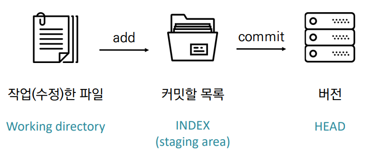
>
> 위 그림이 어려울 경우 아래 그림 참조
>
> 
>
> **추후에 추가할 예정 (이번 주 주말)**

# Git Branch
> - root의 상태에서 나무가 가지를 뻣어 나가듯 다른 환경을 만드는데 사용된다.
> - 설명을 들으면서 [닥터 스트레인지 : 대혼돈의 멀티버스](https://www.youtube.com/watch?v=Sevp6NksVJI) 처럼 다른 세계가 존재하며 다른 시간선으로 옮겨다니며 그 시간선에 영향을 주는 것 과 같다고 생각했다. ( 조금 찾아봤는데 요약된 영상 )
> - 아래 그림과 같이 root 뿌리부터 다른 branch들을 겪으며 기존의 root와 합쳐보며 더 나은 결과를 내기 위해 사용된다.
>
> 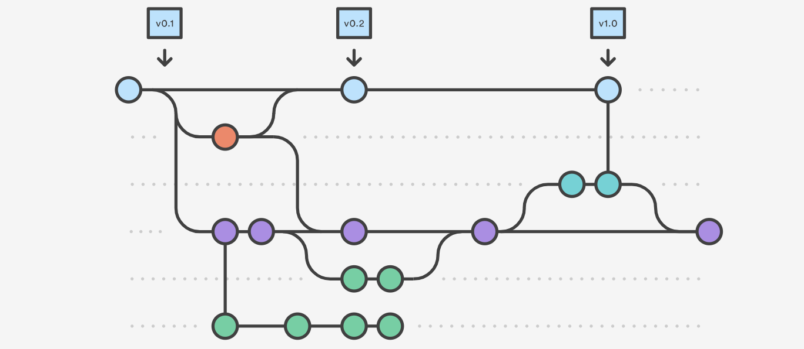
>
> - 만약 잘못되더라도 기존의 root 와 다른 branch를 사용하기 때문에 그 branch를 지우고 다시 만들면 문제없이 여러가지 시도를 할 수 있다는 장점이 있다.
>

# Git Branch 명령어
> touch README.md => 파일 생성
> 
> 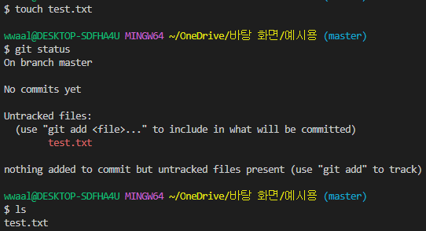
> 
> git add. or git add <파일이름> => 가상환경에 파일 추가
>
> 
>
> git commit -m <메세지> => commit을 할때 추가할 메세지를 넣는다
>
> 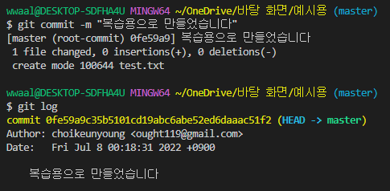
>
> git branch <이름> => branch를 <이름>으로생성
>
> 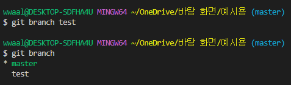
>
> git checkout <이름> => master(root) 에서 <이름> branch로 환경 변경
>
> 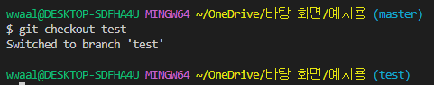
>
> git status => 현재 상태확인 (자주자주 사용하는 습관 들여야함)
>
> 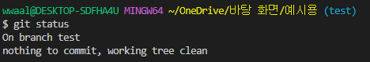
>

# Git Branch 실습
>
> 1. git init 한 후 touch or mkdir 을 통하여 내부에 변화를 준다.
>
> 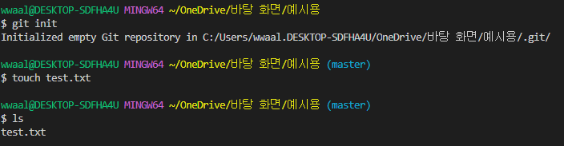
>
> 2. 변화된 내용을 git add . 혹은 git add <파일명>을 통하여 가상의 공간에 저장한다.
>
> 
>
> 3. 가상의 공간에 저장된 내용을 git commit -m <설명할내용> 을 입력하면 root 뿌리를 만들어 준다.
>
> 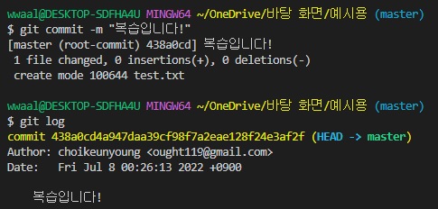
>
> 4. 이후 master(root)에서 git branch <이름> 을 통해 branch를 생성해준다.
>
> 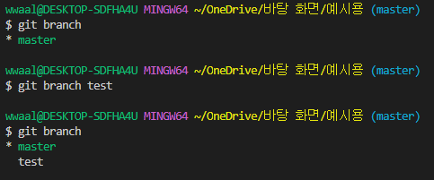
>
> 5. 만들어진 branch로 이동 후 test2 라는 파일 생성
>
> 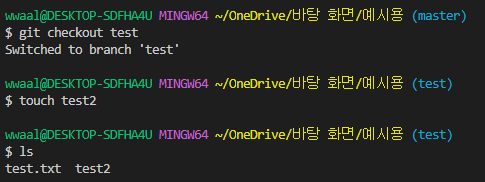
>
> 6. 추가한 test2 파일을 add 함
>
> 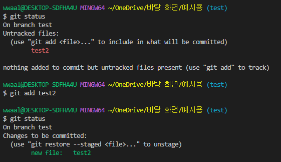
>
> 7. add 한 파일을 commit을 한 후 master branch에서 확인 (현재 test branch)
>
> 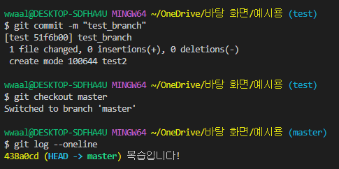
>
> 8. commit을 하였지만 master branch에는 없다. 이유는 test에서 아직 master로 merge를 해주지 않았기 때문이다.
>
> 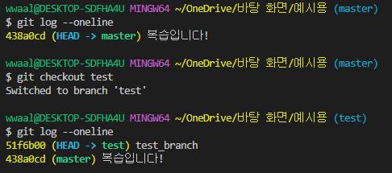
>
> 9. test branch에서 수정한 내용이 오류가 날경우 master 에 합쳐주고 그렇지 않은경우 branch를 삭제한 후 다시 만들어 작업한다.
> 합친 경우 master branch로 이동 후 git merge <branch 이름> 👇
> 
> 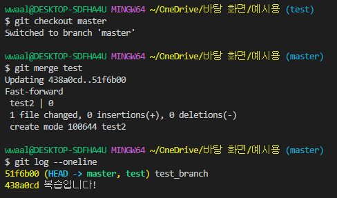
>
> 삭제 하는 경우 git branch -d <이름> 해준다 👇
>
> 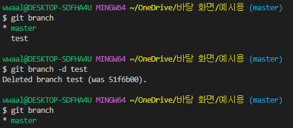
>

# 그 외 자주 일어나는 충돌 상황
>
> 은 주말에 정리하겠습니다!
>