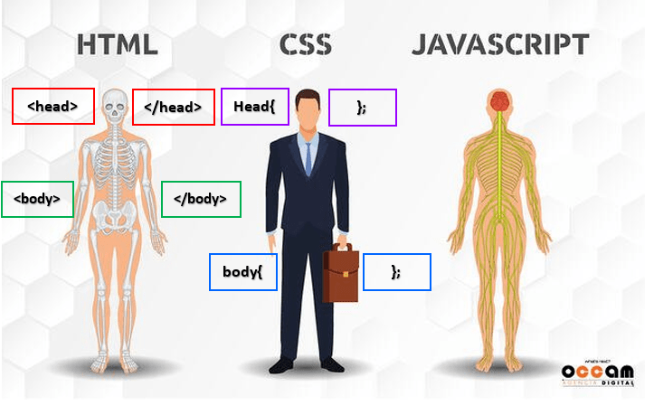
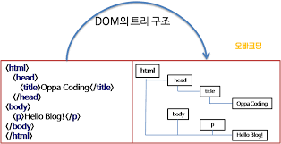
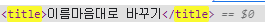

# Web
  
  

  - HTML => 구조
  - CSS => 표현
  - JavaScript => 동작
  - 웹 사이트와 브라우저
    - 웹 사이트는 브라우저를 통해 동작함
    - 브라우저마다 동작이 약간씩 달라서 문제가 생기는 경우가 많음
    - 해결책으로 웹 표준이 등장하게 됨
  - 웹 표준
    - 웹 표준적으로 사용되는 기술이나 규칙
    - 어떤 웹 브라우저든 웹 페이지가 동일하게 보이도록 함
  - 브라우저 별 호환성 사이트
    - [caniuse?](https://caniuse.com/)

## <span style='color: blue'>HTML (Hyper Text Markup Language)</span>

  - 참조를 통해 사용자가 한 문서에서 다른 문서로 즉시 접근할 수 있는 텍스트
  - HTML 기본 구조
    - html : 문서의 최상위(root) 요소
    - head : 문서의 메타데이터 요소
      - 문서 제목, 인코딩, 스타일, 외부 파일 로딩 등
      - 일반적으로 브라우저에 나타나지 않은 내용
    - body : 문서의 본문 요소
      - 실제 화면 구성과 관련된 내용
    ### head 예시
    - <title> : 브라우저 상단 타이틀
    - <meta> : 문서 레벨 메타
    - Open Graph Protocol
      - 메타 데이터를 표현하는 새로운 규약
      - HTML 문서의 메타 데이터를 통해 문서의 정보를 전달
      - 메타정보에 해당하는 제목, 설명 등을 쓸 수 있도록 정의
    - 요소(element)
    > <h1> contents </h1> html 요소는 태그와 내용으로 구성되어있다.
      - HTML 요소는 시작 태그와 종료 태그 그리고 태그 사이에 위치한 내용으로 구성
      - 요소는 태그로 감싸는 것으로 그 정보의 성격과 의미를 정의
      - 내용이 없는 태그들도 존재(닫는 태그가 없음)
        - br, hr, img, input, link, meta
      - 요소는 중첩이 
    - 속성(attribute)
    > <a href="https://google.com"></a> 태그별로 사용할 수 있는 속성은 다르다. (공백 없이!!)
      - 속성을 통해 태그의 부가적인 정보를 설정할 수 있음
      - 요소는 속성을 가질 수 있으며, 경로나 크기와 같은 
      
      - HTML Global Attribute
        - 모든 HTML 요소가 공통으로 사용할 수 있는 대표적인 속성
          - id :
          - ti
    - 렌더링(Rendering)
      - 웹사이트 
      - [참조사이트](​https://d2.naver.com/helloworld/59361)
      - DOM(Document Object Model) 트리
        - 텍스트 파일인 HTML 문서를 브라우저에 렌더링 하기 위한 구조
        - HTML 문서에 대한 모델을 구성함
        - HTML 문서 내의 각 요소에 접근 / 수정에 필요한 프로퍼티와 메서드를 제공함

        

    - 텍스트 요소

    

## CSS (Cascading Style Sheets)
  - 스타일을 지정하기 위한 언어
  - 기본 구문
```css
    h1(선택자) {
        color : blue; /* 선언 */
        font-size(속성) : 15px(값);
    }
```
  - CSS 구문은 선택자를 통해 스타일을 지정할 HTML 요소를 선택
  - 