# Web
  
  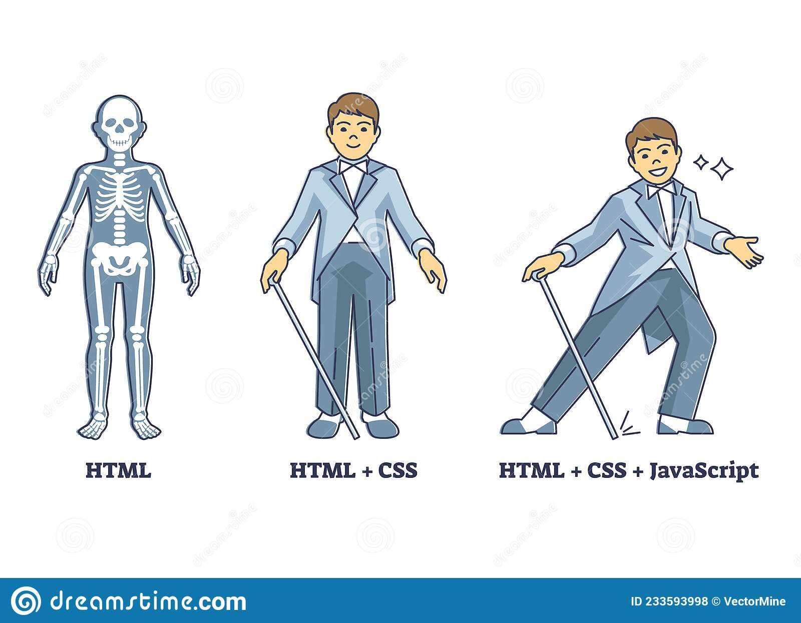

  - HTML => 구조
  - CSS => 표현
  - JavaScript => 동작

  - 웹 사이트와 브라우저
    - 웹 사이트는 브라우저를 통해 동작함
    - 브라우저마다 동작이 약간씩 달라서 문제가 생기는 경우가 많음
    - 해결책으로 웹 표준이 등장하게 됨

  - 웹 표준
    - 웹 표준적으로 사용되는 기술이나 규칙
    - 어떤 웹 브라우저든 웹 페이지가 동일하게 보이도록 함

  - 브라우저 별 호환성 사이트
    - [caniuse?](https://caniuse.com/)

## HTML (Hyper Text Markup Language)

  - 참조를 통해 사용자가 한 문서에서 다른 문서로 즉시 접근할 수 있는 텍스트
  - HTML 기본 구조
    - html : 문서의 최상위(root) 요소
    - head : 문서의 메타데이터 요소
      - 문서 제목, 인코딩, 스타일, 외부 파일 로딩 등
      - 일반적으로 브라우저에 나타나지 않은 내용
    - body : 문서의 본문 요소
      - 실제 화면 구성과 관련된 내용

### HTML 기본 구조 및 내용

```html
    <!DOCTYPE html>
    <html lang='en'>
    <head>
        <meta charset="UTF-8">
        <title>Document</title>
    </head>
    <body>
        여기에 내용을 채우는 공간
    </body>
    </html>
```
  - <!DOCTYPE html> : DOCTYPE는 HTML 페이지가 따라야 할 일련의 규칙으로의 연결 통로로써 작동하는 것을 의미하였다.
  - <html></html> : 페이지 전체의 컨텐츠를 감싸는 역할, 루트(root) 요소라고도 함.
  - <head></head> : HTML 페이지에 포함되어 있는 모든 것들의 컨테이너 역할 ( 다양한 페이지 설명, 컨텐츠 꾸미기를 위한 CSS, 문자 집합 선언 등 )
  - <body></body> : 페이지에 방문한 모든 웹 사용자들에게 보여주고 싶은 컨텐츠를 담는 곳.
  - <meta charset="UTF-8"> : 문서가 사용해야할 문자 집합 선언.
  - <title></title> : 페이지 제목을 설정하는 것으로 페이지가 로드되는 브라우저 탭에 이 제목이 표시됨.
        
   - head 예시
      - <title> : 브라우저 상단 타이틀
        - <title>이 사이에 적는 이름으로 변경됨</title>
        
        
        - 실제 웹사이트에서 적힌 title 내용을 수정해봄

      - <meta> : 문서 레벨 메타데이터 요소
        - 메타 태그는 웹 서버와 브라우저간 상호 교환되는 정보를 정의하는데 사용됨 문서가 어떠한 내용을 담고 있는지, 문서의 키워드가 무엇인지, 누가 제작하였는지 등의 정보를 담고 있다.
        [정리잘된 참조 사이트](https://webclub.tistory.com/354)

      - <link> : 외부 리소스 연결 요소 (CSS파일, favicon 등)
        - 해당 문서와 외부 소스 사이의 관계를 정의할 때 사용
        - 빈 태그이며 속성만을 포함하며 <head> 내부에 위치할 수 있고 갯수의 제한이 없다.

        

      - <script> : 스크립트 요소 (JavaScript 파일/코드)
        - HTML 문서에 Javascript 파일을 가져오는 요소이다.
        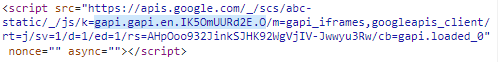
        - 실제 script 가 없을 경우

      - <style> : CSS 직접 작성
        - CSS의 스타일을 HTML 요소에 직접 설정할 수 있다 오직 단 하나의 HTML 요소에만 스타일을 적용할 수 있다.
        - 글자색, 글자크기, 배경색, 글자 정렬 등
        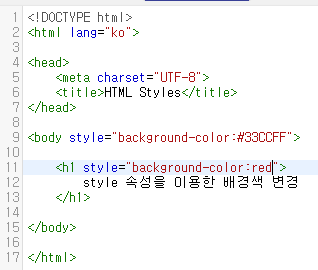
        

      - Open Graph Protocol
       - 메타 데이터를 표현하는 새로운 규약
       - HTML 문서의 메타 데이터를 통해 문서의 정보를 전달
       - 메타정보에 해당하는 제목, 설명 등을 쓸 수 있도록 정의
       - og(open graph protocol)을 지원할 경우 웹사이트에 들어가기 전에 뭐하는 사이트인지 알 수 있다.
       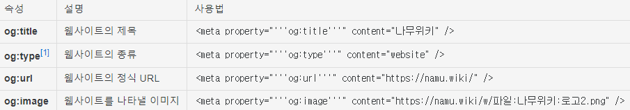
       

   - 요소(element)

    > <h1> contents </h1> html 요소는 태그와 내용으로 구성되어있다.
      - HTML 요소는 시작 태그와 종료 태그 그리고 태그 사이에 위치한 내용으로 구성
      - 요소는 태그로 감싸는 것으로 그 정보의 성격과 의미를 정의
      - 내용이 없는 태그들도 존재(닫는 태그가 없음)
        - br, hr, img, input, link, meta
      - 요소는 중첩이될 수 있다.
        - 요소의 중첩을 통해 하나의 문서를 구조화
        - 여는 태그와 닫는 태그의 쌍을 잘 확인해야 한다. (오류가 발생하는 것이 아닌 레이아웃이 깨져서 나타남)
      **[참조할만한 사이트](https://developer.mozilla.org/ko/docs/Web/HTML/Element)**

    - 속성(attribute)
    > <a href="https://google.com"></a> 태그별로 사용할 수 있는 속성은 다르다. (공백 없이!!, 쌍따옴표 사용(" <<))
      - 속성을 통해 태그의 부가적인 정보를 설정할 수 있음
      - 요소는 속성을 가질 수 있으며, 경로나 크기와 같은 추가적인 정보 제공
      - 요소의 시작 태그에 작성하며 보통 이름과 값이 하나의 쌍으로 존재
      - 태그와 상관없이 사용 가능한 속성(HTML Global Attribute)들도 있음
        - 주요 범위
         1. <HTML> : 문서 범위를 설정
         2. <head> : 문서의 정보를 설정
         3. <body> : html 문서의 구조를 설정
        
        - 메타데이터
         1. <title> : 브라우저의 제목 표시줄이나 페이지 탭에 보여지는 문서의 제목을 설정
         2. <base /> : html 문서에 포함된 모든 상대 URL들의 기준 URL를 설정 ( 한 문서에 하나의 <base /> 요소만 포함 가능)
         3. <link /> : 외부 리소스의 연결 및 현재 문서와의 관계를 명시 ( HTML, CSS, ICON 등 가져오기)
         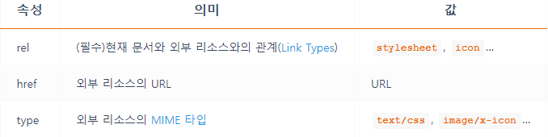
         4. <meta /> : 기타 메타데이터 요소( <link />, <style> 같은 )로 나타낼 수 없는 메타데이터를 나타내기 위해 설정. ( 검색엔진 혹은 브라우저에 정보 제공 )
         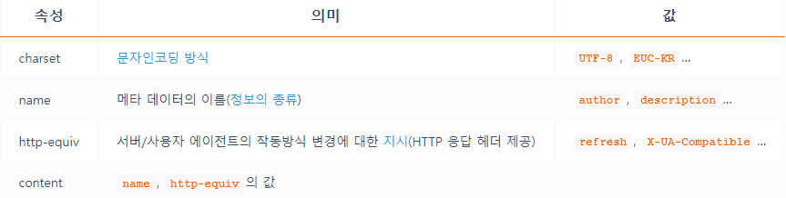
         5. <style> : 스타일 정보(CSS) 설정

        - 콘텐츠 구분
         1. <h1>,<h2>,<h3>,<h4>,<h5>,<h6> : 문서의 정보 계층을 구조화
         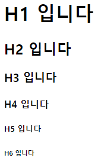
         2. header : 문서의 헤더를 설정 ( 제목, 로고, 검색 등 )
         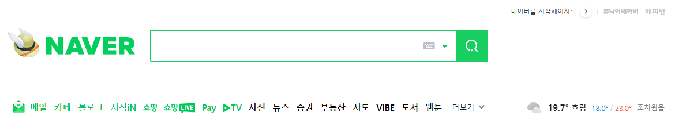
         3. footer : 문서의 푸터 ( 하단의 저작권, 작성자, 관련 문서 등 )
         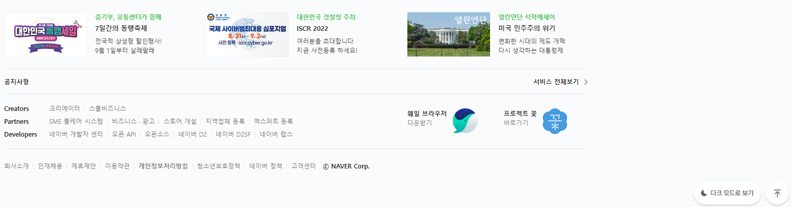
         4. main : 문서의 주요 콘텐츠 설정 ( IE 지원 불가, 한 문서에 하나의 <main> 요소만 포함 가능 )
         
         5. article : 독립적으로 구분되거나 재사용 가능한 영역을 설정 ( <h1> ~ <h6> 포함하여 식별, 작성일자와 시간을 <time>의 datetime 속성으로 작성)
         6. div 아무것도 나타내지 않는 콘텐츠 영역을 설정 ( 꾸미는 목적으로 사용됨 )

        - 문자 콘텐츠
         1. <ol>, <ul>, <li>
           - <ol>과 <ul> 은 자식으로 <li> 만 포함이 가능하며 ol은 정렬된 항목, ul은 정렬되지 않은 항목
         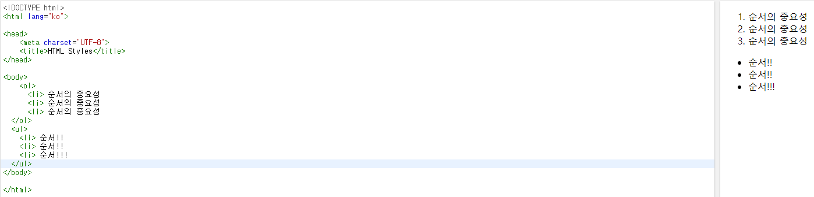
         2. <dl>, <dt>, <dd>
           - <dt>와 <dd> 쌍들의 영역 <dl> 을 설정 dl 은 dd, dt 만을 포함해야 하며 Key/Value 형태를 표시할 때 유용함.
         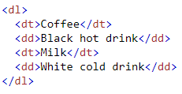
         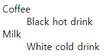
         3. <p> : 하나의 문단을 설정
         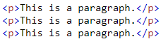
         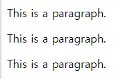
         4. <hr /> : 문단의 분리를 위해 설정
         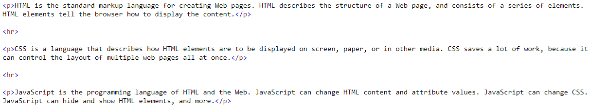
         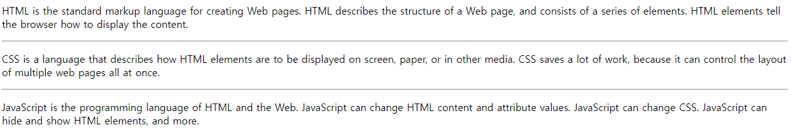
         5. <pre> 서식이 미리 지정된 텍스트를 설정
           - 텍스트의 공백과 줄바꿈을 유지하여 표시할 수 있음.
         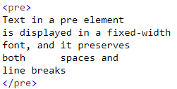
         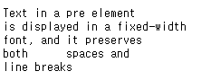

        **추가적으로 더 많은 종류가 있으며 참조할 사이트 첨부**
        [elements 참조사이트](https://heropy.blog/2019/05/26/html-elements/)

      - HTML Global Attribute
        - 모든 HTML 요소가 공통으로 사용할 수 있는 대표적인 속성
          - id : 문서 전체에서 유일한 고유 식별자 지정
          - class : 공백으로 구분된 해당 요소의 클래스의 목록 ( CSS, JS에서 요소를 선택하거나 접근 )
          - data-* : 페이지에 개인 사용자 정의 데이터를 저장하기 위해 사용
          - style : inline 스타일
          - title : 요소에 대한 추가 정보 지정
          - tabindex : 요소의 탭 순서

    - 렌더링(Rendering)
      - 웹사이트 코드를 사용자가 보게 되는 웹 사이트로 바꾸는 과정
      - [참조사이트](​https://d2.naver.com/helloworld/59361)
    
    - DOM(Document Object Model) 트리
      - 텍스트 파일인 HTML 문서를 브라우저에 렌더링 하기 위한 구조
      - HTML 문서에 대한 모델을 구성함
      - HTML 문서 내의 각 요소에 접근 / 수정에 필요한 프로퍼티와 메서드를 제공함

        
    - 인라인 / 블록 요소
      - HTML 요소는 크게 인라인 / 블록 요소로 나뉨
      - 인라인 요소는 글자처럼 취급
      - 블록 요소는 한 줄 모두 사용
      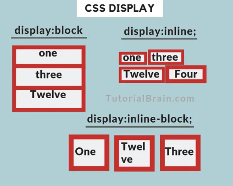

    - 텍스트 요소
      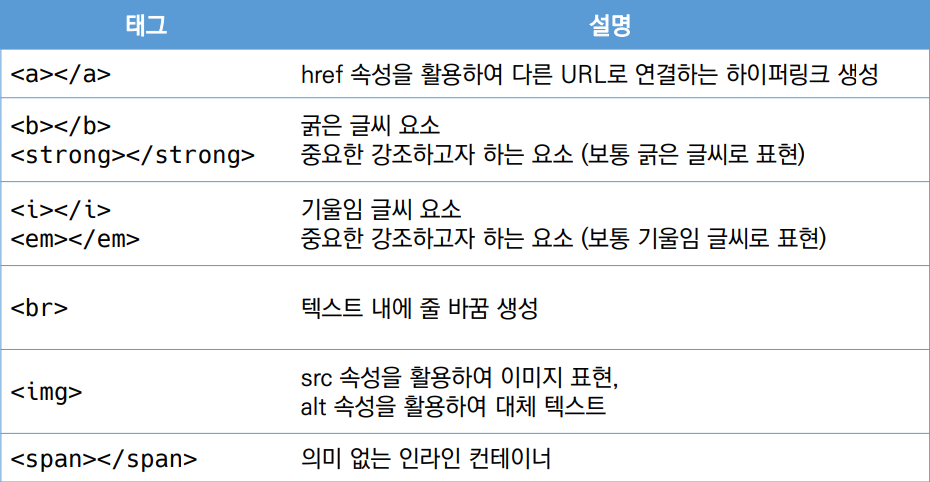

## CSS (Cascading Style Sheets)
  - 스타일을 지정하기 위한 언어
  - 기본 구문
```css
    h1(선택자) {
        color : blue; /* 선언 */
        font-size(속성) : 15px(값);
    }
```
  - CSS 구문은 선택자를 통해 스타일을 지정할 HTML 요소를 선택
  - 중괄호 안에서는 속성과 값, 하나의 쌍으로 이루어진 선언을 진행
  - 각 쌍은 선택한 요소의 속성, 속성에 부여할 값을 의미
    - 속성(Property) : 어떤 스타일 기능을 변경할지 결정
    - 값(Value) : 어떻게 스타일 기능을 변경할지 결정
  
  - CSS 정의 방법
    - 인라인(inline)
    - 내부 참조(embedding) - <style>
    - 외부 참조(link file) - 분리된 CSS 파일

    1. 인라인
      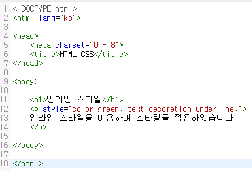
      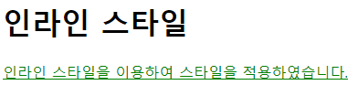
    
    2. 내부 참조
      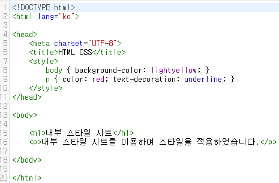
      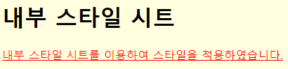

    3. 외부 참조
      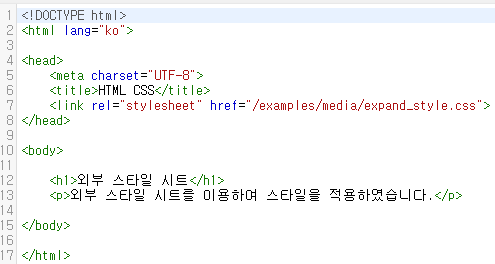
      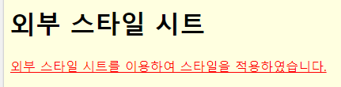

  - 스타일 적용의 우선순위
    - 위 방법들이 혼합될 경우 1, 2, 3의 순서대로 스타일 적용이 우선순위가 된다.
    - 인라인 스타일이 적용된 태그는 내부나 외부 스타일 시트와는 상관없이 인라인 스타일이 적용되고 내부 스타일 시트와 외부 스타일 시트는 가장 마지막에 적용된 스타일 시트가 적용된다.
    ( 인라인 > 내부 == 외부 )

  - CSS 선택자
    - HTML 요소 선택자
    - 아이디(id) 선택자
      - '#' 문자로 시작하며, 해당 아이디가 적용된 항목을 선택
      - 일반적으로 하나의 문서에 1번만 사용
      - 여러번 사용해도 동작하지만, 단일 id 사용하는 것을 권장
    - 클래스(class) 선택자
      - 마침표(.)문자로 시작하며, 해당 클래스가 적용된 항목을 선택

    1. 전체 선택자 : ( * 을 이용하여 선택 )
      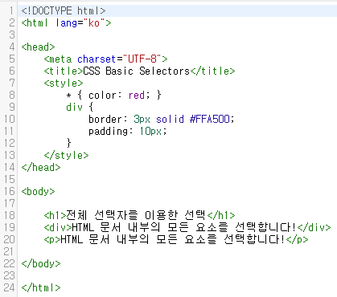
      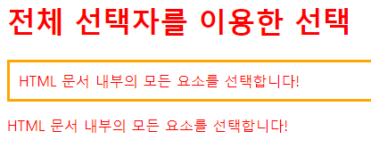

    2. HTML 요소 선택자 : CSS를 적용할 대상으로 HTML 요소의 이름을 직접 사용하여 선택
      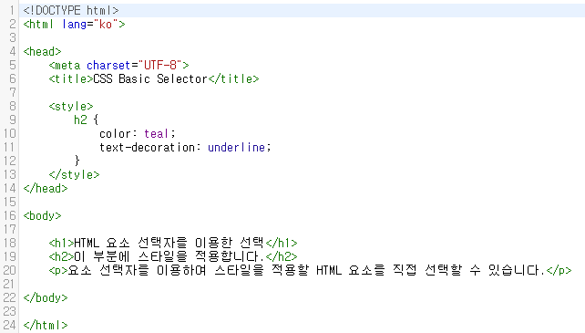
      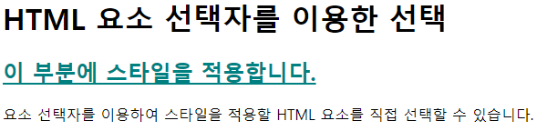

    3. 아이디(id) 선택자 : CSS를 적용할 대상으로 특정 요소를 선택할 때 사용 ( 여러 요소 중 특정 아이디 이름을 가진 요소만을 선택 )
      
      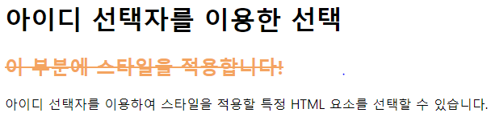

    4. 클래스(class) 선택자 : 특정 집단의 여러 요소를 한 번에 선택할 때 사용
      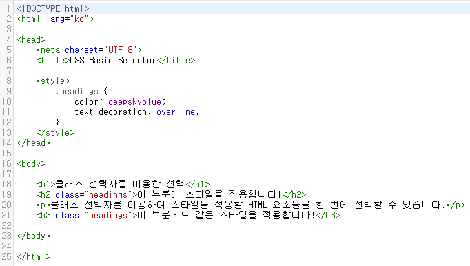
      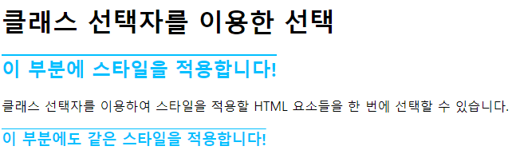

    5. 그룹 선택자 : 여러 선택자를 같이 사용하고자 할 때 사용한다. 쉼표(,)로 구분하여 연결한다.
      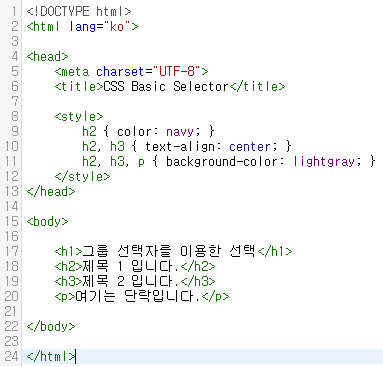
      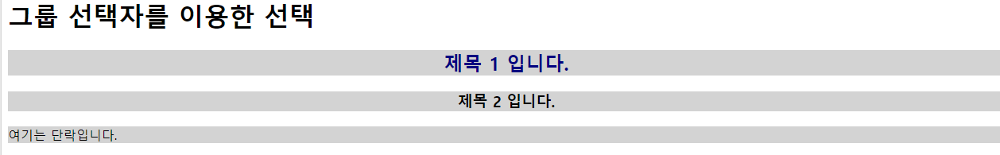

**참고할만한 사이트**
[w3schools](https://www.w3schools.com/tags/tag_meta.asp)
[TCPschool](http://www.tcpschool.com/)