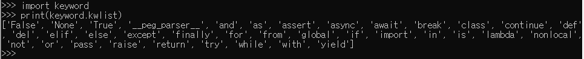
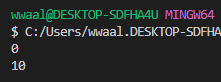
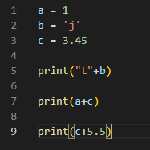
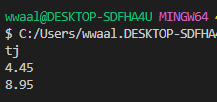
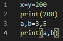
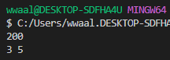
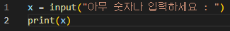
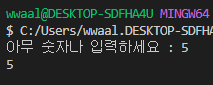
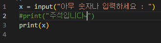

# Python 기초
 - Easy to learn > 다른 프로그래밍 언어에 비해 문법과 접근이 간단함.
 - 프로그래밍의 지식이 없어도 습득하는데 어려움이 크지 않아서 좋음.
 - 크로스 플랫폼 언어 > Windows, macOS, Linux, Unix등 다양한 운영체제에서 실행 가능
 - 인터프리터 언어
   - 소스코드를 기계어로 변환하는 컴파일 없이 실행 가능
   - 코드를 대화 하듯이 한 줄 입력하고 실행 후 확인 가능

   

 - 객체 지향 프로그래밍 언어 > 객체 : 숫자, 문자, 클래스 등 모든 값
 - 파이썬에서 제안하는 가이드 [PEP8](https://www.python.org/dev/peps/pep-0008/)
 - 문장을 구분하기 위해서는 들여쓰기를 사용
 - 들여쓰기는 Space 4칸 혹은 Tab 키 1번을 입력
 - Space와 Tab을 혼합해서 사용하면 안됨 (통일 해서 사용해야 함.)
 - 변수를 선언할때 안되는 이름
   - 영문 알파벳, 언더스코어(_), 숫자로 구성
   - 첫 글자에 숫자가 올 수 없음
   - 길이에 제한이 없고, 대소문자 구별
   - False, None, True, as, finally, import, is, not ,or 등등 사용 불가
   - 사용불가능한 이름 확인방법 => (import keyword // print(keyword.kwlist))

   

# Python 문법

 1. 변수 => 객체를 참조하기 위해 사용되는 이름 으로 연산자(=) 을 통해 값을 할당.

  

  

 2. 변수 연산 => 정수 + 실수 , 문자열 + 변수 다양하게 사용이 가능함

  

  

 3. 변수 할당

  

  

 4. 사용자 입력

  

  

 5. 주석 => 중요한 점이나 다시 확인을 해야할때 쓰는 메모기능 (컴퓨터는 인식못하고 사람만 인식 가능)

  

# 자료형 분리
 - 불린형(Boolean Type) : 컴퓨터는 0과 1로 이루어져 있으며 불린형은 True(1) or False(0)을 판단하는데 사용
   - True or Flase 값을 가진 타입을 bool
   - 비교 or 논리 연산수행에 자주 사용
   - 0, 0.0, (), [], {}, None 등은 모두 False(0)으로 사용됨
   - 특정 데이터가 0인지 1인지 판단하는데 자주 사용됨
 - 연산자 : 논리식을 판단하여 True(참) or False(거짓)을 판단함
   - A and B = A와 B 모두 True일 경우 True
     - True and True => True
     - True and False => False
     - False and True => False
     - False and False => False
   - A or B = A 혹은 B 하나만 True 경우 True
     - True or True => True
     - True or False => True
     - False or True => True
     - False or False => False
   - Not A가 True 면 False로, False면 True로
     - not True => False
     - not False => True
  - 수치형(Numeric Type) : int(정수), float(소수), complex(복소수) 등 존재
    - 정수(int) : 모든 정수 타입은 int 로 표기, 매우 큰 수를 나타낼 때 overflow가 발생하지 않음. (overflow는 데이터 타입별 사용할 수 있는 메모리 크기 초과)
    - 실수(float) : 정수가 아닌 모든 실수는 float 계산시 3.12 - 3.02 = 0.1 (x) => 0.100000000001 등 오차가 발생함.
    - 산술 연산자
      - \+ : 덧셈 => a += b : a = a+b 
      - \- : 뺄셈 => a -= b : a = a - b
      - \* : 곱셈 => a *= b : a = a * b
      - % : 나머지 => a /= b : a = a / b
      - / : 나눗셈 => a //= b : a = a // b
      - // : 몫 => a %= b : a = a % b
      - \*\* : 거듭제곱 => a \*\*= b : a = a \*\* b
  - 문자열(String Type) : 문자들 a,b,c or 가나다라
  - None : 값이 없음을 나타내기 위해서 사용
 