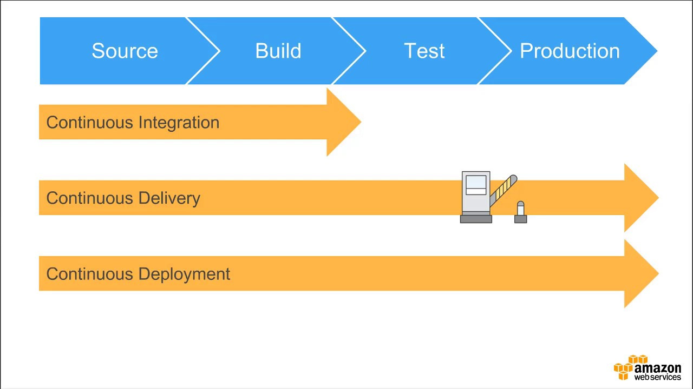
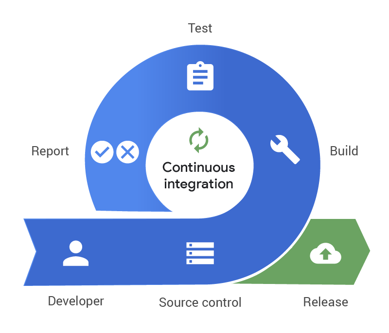
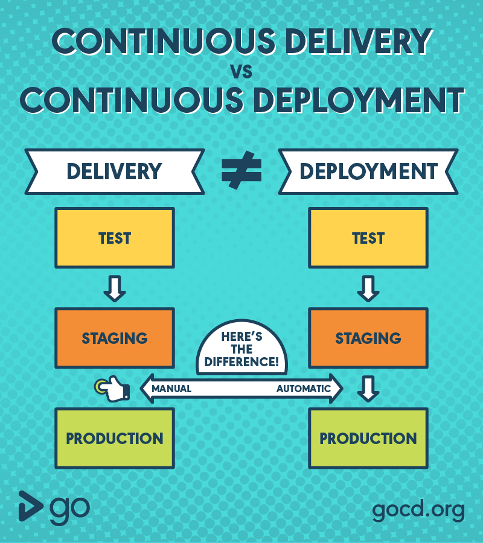

# CI/CD 란?

## CI

- Continuous Integration => 지속적 통합
- 새로운 코드 변경 사항이 정기적으로 빌드 및 테스트 되고 레포지토리에 통합되는 것을 의미
- 다수의 개발자가 형상 관리 툴을 공유하는 환경 => 자동화된 빌드 & 테스트를 통하여 원천 소스코드 충돌 방어
- MSA(Micro Service Archietecture) 환경 => 기능별로 서비스를 쪼개어 개발하는 환경에서 기능 충돌 방지
- 버그를 신속하게 찾아 해결, 소프트웨어 품질 개선, 새로운 업데이트 검증 및 릴리즈 시간을 단축

## CD

- 지속적인 서비스 제공(Continuous Delivery)과 지속적인 배포(Continuous Deployment)를 의미
  - Continuous Delivery => 공유 레포지토리로 자동 Release
  - Continuous Deployment => Production 레벨까지 자동으로 deploy 하는 것

### CI/CD

- CI에서 새로운 소스코드, 테스트, 병합을 진행한 후 CD를 통해 개발자의 변경 사항이 레포지토리 혹은 고객의 프로덕션 까지 릴리즈 되는 것을 의미
