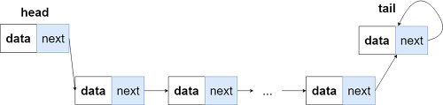
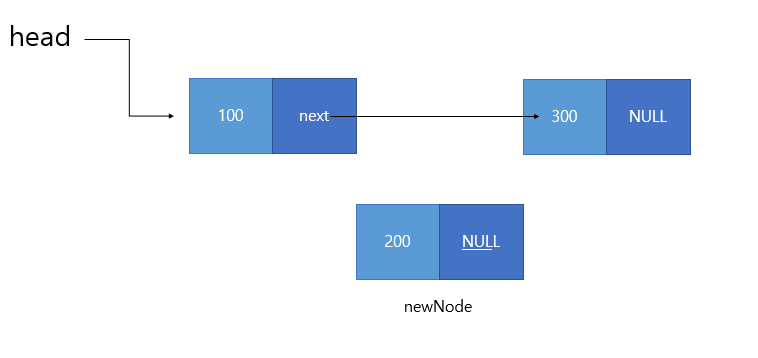
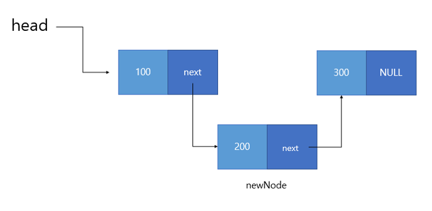
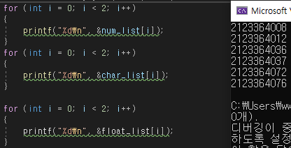
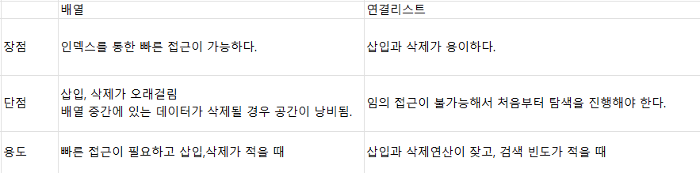

# 선형 자료구조
  - 일렬로 나열된 자료 구조
  
## 연결 리스트
  - 데이터를 감싼 노드를 포인터로 연결하여 공간적 효율성을 극대화 시킨 구조
  - 삽입 삭제가 O(1)의 복잡도를 가지며 탐색은 O(n)을 가진다.

  

  - python 에서는 리스트를 [] 로 정의하고 값을 append, pop 등으로 뽑아낼 수 있지만 다른 언어에서 (C, C++)는 리스트 크기를 정의해줘야 리스트가 생성되기 때문에 연결 리스트를 이용하여 리스트 크기를 가변적으로 설정 가능하다.

  

  

  - 싱글 연결 리스트 : 다음 노드의 주소값만 가진다
  - 이중 연결 리스트 : 앞의 노드의 주소값과 다음 노드의 주소 값을 가진다.
  - 원형 이중 연결 리스트 : 이중 연결 리스트와 같은 모습이지만 맨 마지막 노드가 헤드 노드를 가리킨다. (반복)

## 배열
  - 같은 타입의 정변수들로 이루어져 있으며 크기가 정해져 있다.
  - 인접한 메모리의 데이터를 모아놓은 집합 중복을 허용하고 순서가 있다.
    - INT => 주소값이 4씩 증가
    - char => 주소값이 1씩 증가
    - float => 주소값이 4씩 증가
    
  

  - 탐색에는 O(1)이 되어랜덤 접근이 가능 하고 삽입,삭제에는 O(n)이 소요.
  - 연결리스트로 추가,삭제 / 배열로는 탐색 하는 것이 좋다

  - 랜덤 접근과 순차적 접근
    - 랜덤 접근 => 동일한 시간에 배열과 같은 순차적 데이터가 있을 때 임의의 인덱스의 데이터에 접근하는 기능
    - 순차적 접근 => 저장된 순서대로 데이터를 접근

    

## 벡터
  - 동적으로 요소를 할당할 수 있는 동적 배열 => 유동적인 리스트
  - 중복을 허용하고 순서가 있는 랜덤 접근이 가능함
  - 탐색과 요소 삽입에 O(1) 시간이 소요 되지만 맨 앞 혹은 맨 뒤 요소를 삭제하고 삽입 시에는 O(n)의 시간이 걸린다.
  - 2^n 배 만큼씩 크기가 증가하지만 평균을 낼 경우 3에 수렴하기 때문에 O(1) 상수 복잡도와 비슷하다고 한다.
  - 장점
    1. 마지막 위치 추가나 삭제가 쉽다.
    2. 구현이 용이하다
    3. 랜덤적으로 직접접근 가능
  - 단점
    1. 중간 값의 삭제나 삽입이 많은 경우 비효율적
    2. 많은 데이터에서의 검색이 느리다.
  - 사용하기 좋은 경우
    - 저장하려는 데이터 개수가 가변적일때
    - 중간 데이터 삽입, 삭제가 거의 없고 마지막 추가나 삭제 정도만 할 경우
    - 저장할 데이터가 적고 많은경우 검색이 빈번하지 않을 경우
    - 랜덤하게 데이터를 접근하고 싶을때

## 스택과 큐
  - 스택
    - 가장 먼저 들어간 데이터가 가정 처음으로 나오는 (LIFO, Last In First Out) 구조
    - 재귀함수, 알고리즘, 브라우저 방문 기록 등에 사용
    - 삽입, 삭제 O(1) / 탐색에 O(n)
    - DFS(Depth-First Search)
    
  - 큐
    - 먼저 넣은 데이터가 먼저 나오는 성질 (FIFO, First In First Out)
    - 삽입, 삭제 O(1) / 탐색에 O(n)
    - 작업을 기다리는 프로세스, 스레드행렬 or 네트워크 접속을 기다리는 행렬 등에 사용
    - BFS(Breadth-First Search)