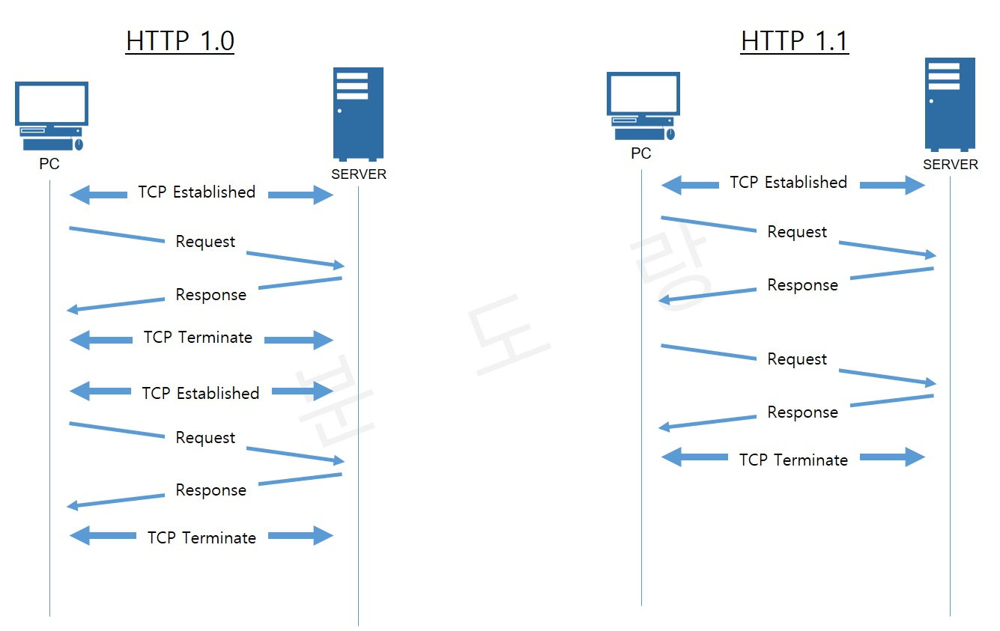

# HTTP

- 하이퍼 텍스트 전송 프로토콜로 링크를 사용하여 웹 페이지를 로드하는데 사용
- 네트워크 장치 간 정보를 전송하도록 설계된 애플리케이션 계층 프로토콜

## 2.5.1 HTTP/1.0

- HTTP 1.0 기본적으로 한 열결당 하나의 요청을 처리하도록 설계
- RTT(Round Trip Time) 증가 => 시작점에서 목적지 까지 다녀오는 시간


- RTT 증가 => 서버 부담 사용자 응답시간이 길어짐 => 이미지 스플리팅, 코드 압축, 이미지 Base 64 인코딩

  - 이미지 스플리팅 : 큰 이미지 한개를 가지고 쪼개는 기술
  - 코드 압축 : 개행 문자, 빈칸 없애는 등 코드 크기 최소화
  - 이미지 Base 64 인코딩 : 64진법으로 이루어진 문자열로 인코딩하는 방법 이미지를 HTTP에 요청하는 방식이 아니라 서버 부담 X 대신 문자열로 변환하기 때문에 37% 더 커지는 단점

## 2.5.2 HTTP/1.1

- HTTP 1.1 은 매번 TCP 연결하는 것이 아닌 초기화 한 이후 keep-alive 옵션으로 여러 개의 파일 송수신 가능
- keep-alive => 한번 TCP 연결을 통하여 여러개의 HTTP request/response를 주고 받을 수 있는 방식 리소스 갯수에 따라서 대기 시간이 길어지는 단점이 있음



### HOL Blocking(Head Of Line Blocking)

- 앞서 들어온 작업이 길어질 경우 다른 작업들이 미뤄지는 것을 의미
- HTTP/1.1 에서 응답은 항상 순서를 유지하고 동기적 수행이기 때문에 앞선 요청이 완료전까지 막히는 것을 의미

```
|---a.png---|
            |---b.png---|
                        |---c.png---|
```

- 위와 같은 구조로 요청을 보낼 경우

```
|------------a.png------------|
                              |-b.png-|
                                      |---c.png---|
```

- 위와 같이 요청이 완료전 까지 전달이 되지 못하는 것을 의미한다.

## 2.5.3 HTTP/2

- 1.x보다 지연 시간을 줄이고 응답 시간을 빠르게 할 수 있으며 멀티플렉싱, 헤더 압축, 서버 푸시, 요청의 우선순위 처리를 지원

### 멀티플렉싱

- 여러 개의 스트림을 송수신 하는 것 => 스트림: 시간이 지남에 따라 사용할 수 있게 되는 일련의 데이터 요소를 가리키는 데이터 흐름
  - 한개의 connections을 통하여 동시에 여러 개의 메세지를 주고 받을 수 있으며 Response는 순서에 상관없이 stream으로 주고 받는다
  - 리소스 간의 우선순위를 통하여 클라이언트가 필요한 리소스부터 보낼 수 있다.
  - 한마디로 선생님 한명이 손을 든 학생들에게 질문을 받는 구조


### 헤더압축

- Huffman coding 기법 사용 => 문자 단위로 쪼개 빈도수 높은 정보는 적은 비트를 사용하고 빈도수가 낮은 정보는 비트수를 많이 사용하여 전체 데이터 표현을 줄인 것
- 이전 Header의 내용과 중복되는 필드는 재전송하지 않음

### 서버푸쉬

- HTTP/2 는 1.1과 다르게 서버에서 클라이언트가 요청하지 않은 리소스도 마음대로 보낼 수 있다 (ex. html 만 요청하였는데 서버에서 css,JS를 같이보내주는 것)


## 2.5.4 HTTPS(Hyper Text Transfer Protocol Secure)

- 애플리케이션 계층과 전송 계층 사이 SSL/TLS 계층을 넣은 신뢰 가능한 HTTP 요청을 의미하며 이를 통하여 통신을 암호화 한다

### SSL(Secure Socket Layer)/TLS(Transport Layer Security)

- 전송 계층에서 보안을 제공하는 프로토콜.
  - 클라이언트와 서버가 통신을 할때 도청등 제 3자가 메세지에 접근하는 것을 방지하기 위한 것
  - 사람의 신분증과 유사한 것 SSL 인증서에는 공개 키가 존재하며 이 덕분에 암호화가 가능하고 서버에 공개되지 않은 개인 키를 통하여 암호화된 데이터를 복호화 한다.
  - 클라이언트와 서버가 키를 공유 하며 이를 기반으로 인증, 확인 작업이 일어나는데 사이퍼 슈트(cypher suites) 서버에 전달하면 받은 내용을 바탕으로 암호화를 적용 가능한지 확인.
  - 제공가능하면 클라이언트에게 인증서를 보내는 매커니즘이 시작되고 다양한 암호화된 데이터의 송수신이 시작된다.
- 사이퍼 슈트 : 프로토콜, AEAD, 사이퍼 모드, 해싱 알고리즘 등 나열된 규악
  - TLS_AES_128_GCMSHA256
  - TLS_AES_256_GCM_SHA384
  - TLS_CHACHA20_POLY1305_SHA256
  - TLS_AES_128_CCM_SHA256
  - TLS_AES_128_CCM_8_SHA256


- 인증 메커니즘 : CA(Certificate Authorities)에서 발급한 인증서를 기반으로 이루어짐

  - 공개키를 클라이언트에 제공하고 사용자가 접속한 서버가 신뢰할 수 있는 서버임을 보장
  - 서비스 정보, 공개키, 지문, 디지털 서명 등으로 구성
  - Comodo, GoDaddy, GlobalSign, 아마존 등 존재

- 암호화 알고리즘
  - 키 교환 암호화 알고리즘으로는 대수곡선 기반의 ECDHE(Elliptic Curve Diffie-Hellman Ephermeral) 또는 모듈식 기반의 DHE(Diffie-Hellman Ephermeral)를 사용
  - 디피-헬만 키 교환 암호화 알고리즘은 암호키를 교환하는 하나의 방법
  - 디피-헬만 키 교환 암호화 알고리즘
    - 상대방의 공개키와 나의 개인키를 이용하여 계산할 경우 비밀키가 나온다는 것.
    - 처음 공개 값을 공유 후 각자 비밀 값과 혼합한 후 혼합 값을 공유하여 각자의 비밀 값과 혼합하면 공통된 암호키가 생성됨.


- 해싱 알고리즘

  - 데이터를 추정하기 힘든 더 작고 섞인 조각으로 만드는 알고리즘
  - 단반향성 알고리즘 => output 을 통하여 input을 추정하는 것이 매우 어려움

  

  - 충돌회피 => 입력이 다르면 서로 다른 해시 결과 값이 나오기 때문

  

  - SHA-256 알고리즘
    - 메세지의 길이를 512bit 단위로 잘라서 저장하여 bit 수가 부족한 경우 zero padding을 추가 한다.
    - 512bit 단위 조각을 chunk 라고 부름

  

  - 1Byte = 8bit

  

  - input 을 'abc'로 넣을 경우 각각 아스키 코드 치환할 경우 97,98,99
  - binary 값으로 변경하면
    - a == 0110 0001
    - b == 0110 0010
    - c == 0110 0011
    - 입력 길이는 8bit \* 3 = 24bit
    - 24 == 0001 1000

  

  

  - input 데이터가 이런식으로 들어오고 변환하는 과정은 복잡해서 생략

  **출처:https://m.blog.naver.com/doksg/221811748218** 자세한 SHA256 동작방법이 나와있음.

### SEO(Search Engine Optimizations)

- 검색엔진 최적화를 뜻하며 HTTPS 서비스 하는 사이트가 (보안이 높은 사이트) 그렇지 않은 사이트 보다 SEO 순위가 높을 것이다.

  - 캐노니컬 태그 : 한 페이지를 가리키는 여러 개의 주소가 존재할 때, 검색 엔진의 로봇이 어떤 주소가 원본인지 알 수 있도록 하기 위해 사용하는 태그
    - 검색엔진 스스로 어떤 URL이 표준인지 판단하는 방법 => 임의로 표준 URL을 설정하기 때문에 페이지 소유주가 원한 주소가 표준 URL이 되지 않을 가능성 존재
    - 페이지에 어떤 URL이 표준인지 표기하는 방법 => 구글 등에서 HTML문에서 캐노니컬 태그를 추가해주는 방식 사용
  - 메타 설정 : 페이지의 콘텐츠를 설명하는 텍스트, 페이지가 무엇을 설명하는지 검색엔진에게 알려주는 역할
  - 페이지 속도 개선 : SEO 관점에서 동일 조건 웹사이트, 블로그, 쇼핑몰 경우 접속속도가 빠른 것일 수록 상위에 등록시킴
    1. 외부파일로 CSS, JS 활용 : CSS로 제작한 웹페이지가 더 빠른 로딩을 하지만 불필요한 CSS는 활용하지 않아야 하며 외부 CSS 불러오는 방식이 더욱 효과적
    2. 과도한 이미지, 플래쉬, 사운드 파일 자제 : 동적gif, 동영상, 사운드파일은 웹사이트 속도를 줄이기 때문에 사용을 최대한 자제시켜야 한다.
    3. 이미지 용량 줄이기 : 포토샵, PNG(potable network graphics) 사용 등으로 이미지 용량을 단축 시킴.
    4. 자바스크립트 압축 : JS는 로딩속도에 영향을 주기 때문에 압축하는 것이 좋다
    5. gzip을 활용하여 파일 및 데이터를 압축
  - 사이트맵 관리 : 무슨 사이트를 이용하여 관리하는 것 같다. (.xml 파일)
    **https://torotoblog.tistory.com/63** 뭔가 설명이 나오는거 같은데 봐도 잘 모르겠다.

## 2.5.5 HTTP/3

- TCP 위에서 돌아가는 HTTP/2 와 달리 QUIC라는 계층 위에서 돌아가며 TCP 기반이 아닌 UDP 기반으로 작동

  - TCP(Transmission Control Protocol) : 연결 지향적 프로토콜 => 상호 연결된 상태에서 데이터를 송수신

    - 데이터를 중요시하여 확실하게 주고받고 싶은경우 사용 => 정확성, 신뢰성
    - 웹이나 메일, 파일 공유 등 데이터를 누락시키고 싶지 않을 경우 TCP 사용

  - UDP(User Datagram Protocol) : 전송계층의 비연결 지향적 프로토콜 => 일방적인 데이터 발신
    - 데이터를 보내면 통신을 주고받는 절차를 생략하여 신속성을 높이는 것
    - VoIP(Voice over IP)와 같은 시간 동기가 필요한 => 속도를 필요로하는 서비스들에 사용됨

  

- QUIC : UDP를 바탕으로 사용되기 때문에 데이터 전송이 되었을 때 제대로 전송이 되었는지 확인한 후 되지 않았을 경우 다시 전송하는 로직을 구현하여 TCP와 비슷한 형태로 구성

  - UDP를 통하여 기존에 발생하던 HOL Blocking 을 막음. => 기존 HTTP/2에서 여러 논리적 스트림을 사용해도 하나에서 막힐 경우 다른 스트림들도 전달되지 않았는데 UDP에서(비연결성) 구현하게 되어 막힌 스트림만 개별적으로 처리함.

  
