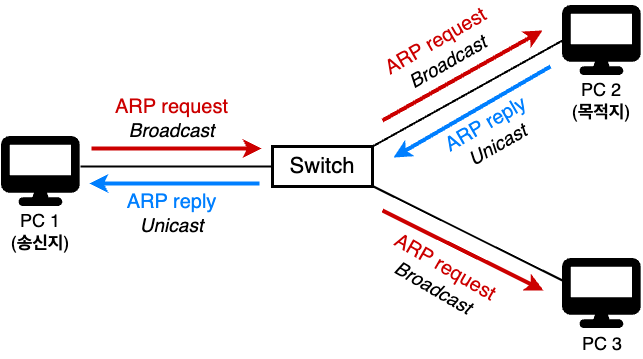
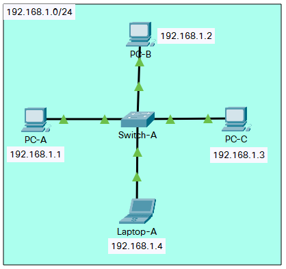
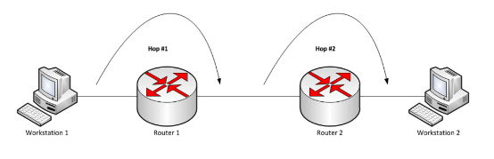
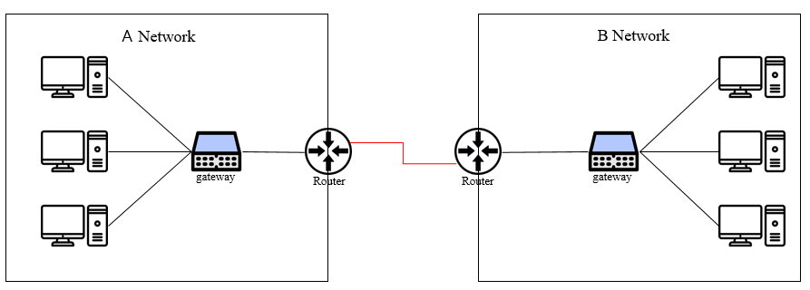
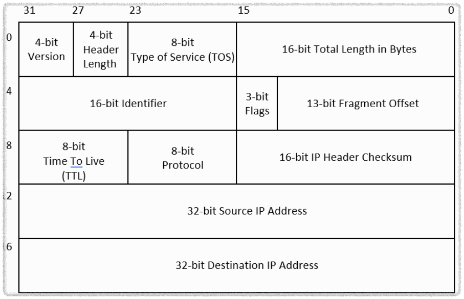
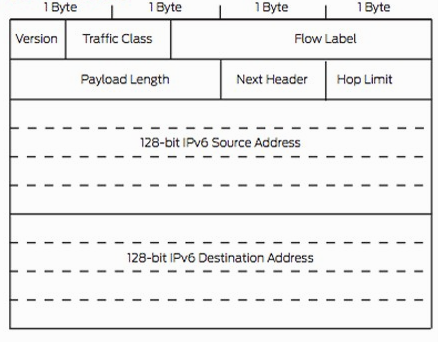
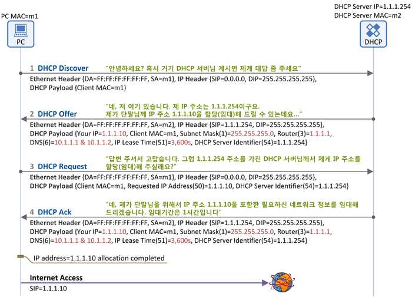
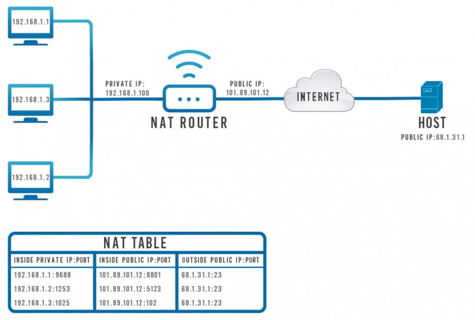

# IP 주소

- 컴퓨터 네트워크 장치들이 서로 인식하고 통신하기 위한 특수한 번호

## 2.4.1 ARP(Address Resolution Protocol)

- IP 주소로부터 MAC 주소를 구하는 다리역할을 하는 프로토콜
  - IP : 인터넷에 연결된 모든 호스트나 라우터 장비의 인터페이스에 할당된 논리적 가상주소
  - MAC : 물리적 네트워크 주소로 데이터 링크 계층에서 사용하는 고유 식별 번호 (NIC)
- 가상 주소인 IP를 실제 주소인 MAC로 변환
- 컴퓨터와 컴퓨터간 통신으ㄹ 담당
- RARP는 실제 주소인 MAC 주소를 가상 주소인 ARP 로 변환 해주는 기능

- 192.168.1.1 / 24 에서 요청을 보내서 192.168.1.4 / 24 를 찾기위해 Switch-A 를 통해 요청을보냄
- Switch-A 에서 ARP Request(아이피 주소를 찾는 요청) 패킷을 받고 MAC 주소를 테이블에 저장
- ARP 테이블에 MAC 주소가 없는 경우 네트워크 전체에 브로드캐스팅을 진행
- 192.168.1.4 / 24 IP를 가진 컴퓨터에서 ARP 테이블에 본인의 MAC 주소를 기록하고 ARP Reply 패킷을 전달
- Switch-A 에서는 이 정보를 저장 후 기존의 요청을 보낸곳에 정보를 전달

**브로드캐스트 : 송신 호스트가 전송한 데이터가 네트워크에 연결된 모든 호스트에 전송되는 방식**

**유니캐스트 : 고유 주소로 식별된 하나의 네트워크 목적지에 1:1로 데이터 전송하는 방식**

**ARP table : IP 주소와 MAC 주소를 1:1 대응하여 정리한 테이블**

## 2.4.2 홉바이홉 통신

- IP 주소를 통해 통신하는 과정
- 홉(hop) : 통신망에서 각 패킷이 여러 라우터를 건너가는 모습을 비유
- 많은 서브 네트워크 속 라우터에 있는 라우팅 테이블 IP를 기반으로 패킷을 전달하며 최종 목적지까지 패킷을 전달

**라우팅 : IP 주소를 찾아가는 과정**

### 라우팅 테이블(Routing Table)

- 송신지에서 수신지까지 도달하기 위해 사용
- 들어있는 목적지 정보들과 목적지로 가는 방법이 리스트로 저장되어 있음 ( 다음 목적지는 어디인지 어떻게 가야 하는지 )

### 게이트웨이(Gateway)

- 서로 다른 통신망, 프로토콜을 사용하여 네트워크 간 통신을 가능하게 하는 관문 역할
- 인터넷 접속을 위해 많은 톨게이트를 거쳐야 하고 다른 네트워크상의 통신 프로토콜을 변환해주는 역할
- 라우팅 테이블을 통해 게이트웨이를 확인할 수 있다.

## 2.4.3 IP 주소 체계

- IPv4와 IPv6 로 구분됨

  - IPv4 : 32비트를 8비트 단위로 점을 찍어 표기 (123.45.67.89)

    

    - 32-bit Source IP Address 와 32-bit Destination IP Address를 통해서 목적지와 출발지를 나타냄

  - IPv6 : 64비트를 16비트 단위로 점을 찍어 표기 (2001:db8::ff00:42:8329)

    

- 현재 IPv4 를 가장 많이쓰이지만 점점 IPv6 주소 체계로 바뀌는중

### 클래스 기반 할당 방식

- 기존에는 클래스 기반 할당방식(CIDR) 사용
- 앞 부분을 네트워크 주소, 뒤 부분을 호스트 주소로 사용
  - 네트워크 주소 : 호스트들을 모은 네트워크를 지칭하는 주소 (OO시 OO아파트 OO동)
  - 호스트 주소 : 하나의 네트워크 내 존재하는 호스트를 구분하기 위한 주소

| 클래스 | 네트워크/호스트   | 시작 주소 ~ 마지막 주소                   |
| ------ | ----------------- | ----------------------------------------- |
| A      | 1번째 / 2,3,4번째 | 0.0.0.0 (시작) ~ 127.255.255.255 (종료)   |
| B      | 1,2번째 / 3,4번째 | 128.0.0.0 (시작) ~ 191.255.255.255 (종료) |
| C      | 1,2,3번째 / 4번째 | 192.0.0.0 (시작) ~ 223.255.255.255 (종료) |

- A클래스 배정시

  - 12.0.0.0 네트워크를 부여받음
  - 12.0.0.1 ~ 12.255.255.254의 호스트 주소를 부여 받음
  - 12.0.0.0 은 네트워크 구별 주소로 사용하면 안됨, 12.255.255.255는 브로드캐스트용으로 남겨둬야함

- 이 방식의 경우 사용하는 주소보다 버리는 주소가 많은 단점이 발생
- 해결하기 위해서 DHCP, IPv6, NAT 가 나옴

### DHCP(Dynamic Host Configuration Protocol)

- 해당 IP 주소와 기타 관련 구성정보를 IP 호스트에 자동으로 제공하는 클라이언트/서버 프로토콜
- 네트워크 장치의 IP 주소를 수동으로 설정할 필요 없이 자동으로 IP 할당

#### DHCP 동작 방식

### NAT(Network Address Translation)

- IP 패킷의 TCP/DP 포트 숫자와 소스 및 목적지 IP 주소 등을 재기록하며 네트워크 트래픽을 주고받는 기술
- IPv4 만으로 많은 주소들을 감당하지 못하는 단점이 존재하기 때문에 NAT로 공인 IP/ 사설 IP 구분하여 많은 주소 처리

- 192.168.0.0 ~~ 사용자들이 68.1.31.1에 접속을 원하는 상황이다
- 라우터는 NAT을 사용하여 공인 IP 와 포트번호를 할당해준다
- 할당받은 IP와 포트번호로 인터넷을 통해 68.1.31.1.1 에 도달한다
- 할당받은 IP와 포트번호에 응답을 돌려준다

#### NAT의 사용 목적

- 공인 IP 주소를 절약
  - 인터넷 상의 IP 주소는 한정되어 있기 때문에 IPv4 로 할당할 수 있는 주소는 한정적이므로 절약을 위해 사용
- 보안의 목적
  - 내부에서 사용하는 IP 주소와 외부에 드러나는 IP 주소를 다르게 유지할 수 있어서 보안에 유리함
