# 네트워크

- 네트워크란 컴퓨터 장치들이 통신 기술을 이용하여 구축하는 연결망을 지칭하는 용어

## 네트워크 기초

- 노드(node)와 링크(link)가 서ㅏ로 연결돼 있거나 연결되지 않은 집합체 ( 노드 = 서버, 라우터, 스위치 / 링크 = 유,무선)

### 2.1.1 처리량과 지연 시간

- 좋은 네트워크

  1. 성능 : 처리량과 지연시간의 측면에서 짧고 많은 처리를 할 수 있어야 한다.
  2. 신뢰성 : 장애빈도, 장애 발생 후 회복시간, 재난에 대한 견고성 등
  3. 보안성 : 불법적 침입이나 정보 유출에 대한 보안 확보

#### 처리량

- 링크를 통해 전달되는 단위 시간당 데이터양을 의미

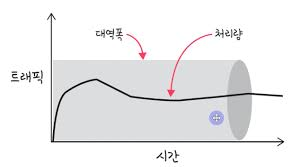

- 단위 시간당 성공률을 의미한다. / 단위는 bps(bits per second)
- 많은 사용자들이 접속할 때마다 커지는 트래픽, 네트워크 장치 간 대역폭, 중간에 발생하는 에러, 장치의 하드웨어 스펙에 영향을 받는다.

#### 지연 시간

- 요청이 처리되는 시간을 의미함
- 데이터가 이동하는 거리, 전송 매체 및 네트워크 홉, 데이터 패킷 크기 및 네트워크 혼잡, 하드웨어 성능

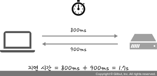

##### 지연 시간이 중요한 이유

- 생산성, 협업, 성능 및 사용자의 경험에 직접적인 영향을 준다.
- 사용자의 입장에서 지연 시간이 길 수록 경험이 나빠지기 때문에 짧은 지연 시간을 유지하는 것이 좋다.

##### 짧은 지연시간을 유지하는 방법

- 데이터가 가장 효율적인 경로를 따라 이동하는가?
- 애플리케이션 최적의 성능을 발휘하는 데 필요한 리소스를 확보하고 있는가?
- 네트워크 인프라가 최신 상태이며 업무에 적합한가?

### 2.1.2 네트워크 토폴로지와 병목 현상

- 네트워크 토폴로지 : 노드와 링크가 배치된 방식이자 연결 형태

#### 트리 토폴로지

- 트리 형태로 배치한 네트워크 구성
- 양방향 모든 노드에 데이터를 전송한다.

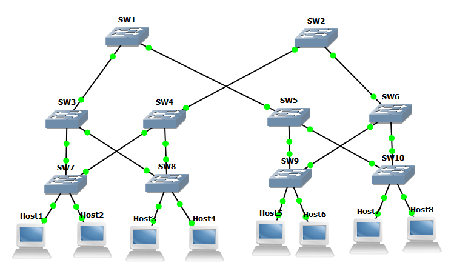

- 장점

  - 네트워크 확장이 쉽고 관리가 편함
  - 통신 선로가 짧고, 통신 회선수가 절약된다.

- 단점
  - 네트워크 확장이 많아지면 트래픽이 집중된다.
  - 상위 회선에 문제가 생기면 하위 회선 모두가 문제가 생긴다.

#### 버스 토폴로지

- 중앙 통신 회선 하나에 여러 노드가 연결되어 공유하는 형태 ( 근거리 통신망에 사용 )
- 하나의 케이블에 호스트를 연결해야기 때문에 T커넥트를 사용한다.

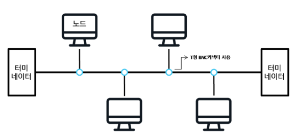

- 장점

  - 적은 설치비용, 높은 신뢰성
  - 한 컴퓨터에 문제가 생겨도 다른 컴퓨터간 통신이 가능하다.
  - 관리와 확장이 쉽다.

- 단점
  - 케이블에 문제가 생길 경우 네트워크에 영향을 준다.
  - 동시 통신이 불가능하다.
  - 문제 처리가 어렵고 시간도 오래 걸림 ( 어느 장치에 문제가 생긴지 파악이 어려움 )
  - 스푸핑이 가능한 단점

##### 스푸핑?

- LAN 상에서 송신하고자 하는 대상과 관련 없는 호스트에게 전달되는 것을 고장내는 것을 의미함

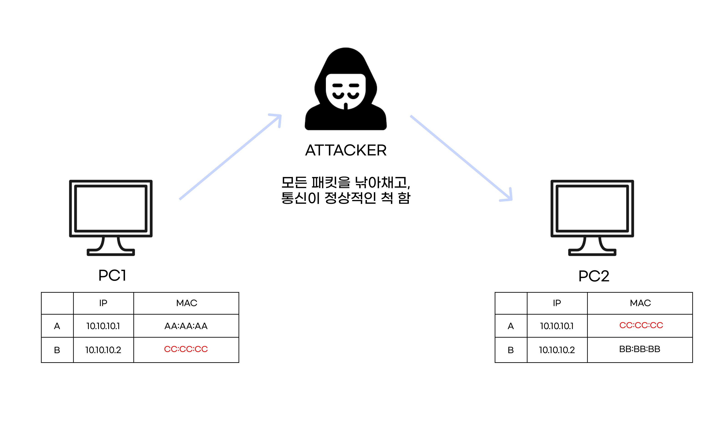

#### 스타 토폴로지

- 중앙 노드를 통해 모든 네트워크가 연결된 형태
- 중앙 노드에서 모든 노드를 제어한다.

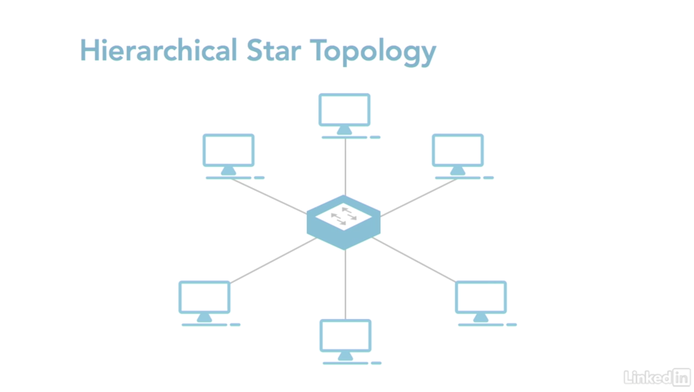

- 장점

  - 네트워크 확장 유지보수가 쉬움
  - 장애 발견이 쉽고, 처리가 빠름
  - 중앙에 집중되어 관리 자체가 쉽다.

- 단점
  - 중앙에 집중되기 때문에 중앙 시스템이 고장 나면 전체가 마비된다.
  - 사용자가 많아지면 트래픽이 증가되어 속도가 저하됨

#### 링형 토폴로지

- 각 노드가 양 옆 노드와 연결하여 고리적 형태를 띄움
- 연속된 길을 통해 통신하는 망 구성 방식

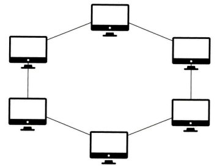

- 장점

  - 노드 수가 증가되어도 네트워크 손실이 거의 없다
  - 충돌 발생 가능성이 적다.
  - 고장 발견에 용이함
  - 토큰을 통한 통신으로 권한 여부를 통해 데이터를 전달하고 주고 받음

- 단점
  - 네트워크 구성 변경 자체가 어렵다.
  - 회선 장애가 발생하면 전체 네트워크에 영향을 끼친다.
  - 토큰 없는 노드의 경우 데이터 공유가 안된다.

#### 메시 토폴로지

- 그물망처럼 연결되어있는 구조

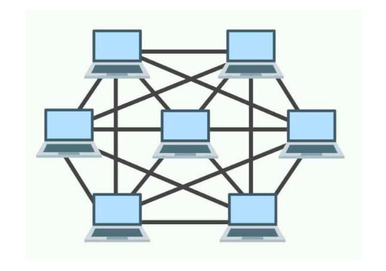

- 장점

  - 많은 경로로 인해 특정 회선에 문제가 생겨도 다른 경로로 데이터 전송이 가능
  - 트래픽 분산 처리가 가능, 효율성이 높다.

- 단점
  - 네트워크 관리, 설치, 재구성이 어렵다.
  - 많은 설치비용이 필요함 ( 다량의 링크를 사용 )

#### 병목 현상

- 트래픽에 의해 데이터 흐름이 제한되는 상황
- 들어가고자 하는 입구보다 많은 데이터 혹은 요청이 올 경우 하나씩 천천히 처리하는것을 의미함
- 토폴로지에 따라서는 엔드포인트를 늘리는 방식으로 해결이 가능함

### 2.1.3 네트워크 분류

- 규모를 기반으로 분류
  1. LAN(Local Area Network) : 사무실과 개인적 규모
  2. MAN(Metropolitan Area Network) : 시 규모
  3. WAN(Wide Area Network) : 세계 규모

#### LAN(Local Area Network)

- 근거리 통신망을 의미, 좁은 공간 및 거리에서 운영된다.
- 전송 속도가 빠르고 혼잡하지 않다.

#### MAN(Metropolitan Area Network)

- 대도시 지역 네트워크를 의미, 도시 같은 넓은 지역에서 운영된다.
- 전송 속도느 평균적이고 LAN 보다는 혼잡하다.

#### WAN(Wide Area Network)

- 광역 네트워크를 의미, 국가 또는 대륙 같은 더 넓은 지역에서 운영된다.
- 전송 속도는 낮고 MAN보다 더 혼잡하다.

### 2.1.4 네트워크 성능 분석 명령어

- 네트워크 성능을 저하 시키는 병목현상의 요인들

  - 네트워크 대역폭
  - 네트워크 토폴로지
  - 서버 CPU, 메모리 사용량
  - 비효율적 네트워크 구성

- 위와 같은 사항들이 요인이 되는 것인지 네트워크 테스트와 무관한 테스트를 통해 어디 부분에서 성능이 저하되는지 체크를 진행할 수 있다.

#### Ping(Packet INternet Groper)

- 대상 노드를 향해 일정 크기의 패킷을 전송하는 명령어
- 노드의 패킷 수신 상태와 도달하기 까지 시간을 체크할 수 있음
- ping [ IP 주소 혹은 도메인 주소 ] (통해 IP 가 네트워크와 통신하고 있는지 체크 가능)

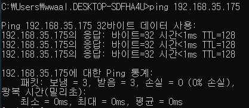

#### netstat

- 접속되어 있는 서비스의 네트워크 상태를 표시
- 네트워크 접속, 라우팅 테이블, 네트워크 프로토콜 등 리스트를 보여줌

#### nslookup

- DNS 관련된 내용을 확인하기 위해 사용
- 특정 도메인에 메핑된 IP 확인

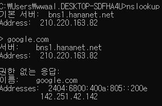

#### tracert

- 목적 노드까지 네트워크 경로를 탐색하는 명령어
- 이를 통해 어느 노드에서 응답 시간이 느려지는지 체크할 수 있다.

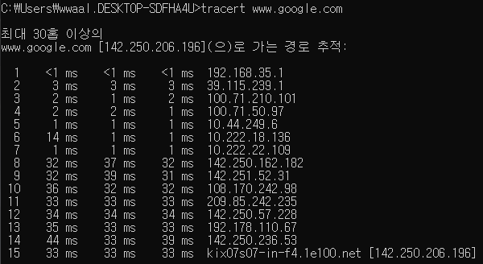

### 2.1.5 네트워크 프로토콜 표준화

- 다른 장치끼리 데이터를 주고받기 위해 설정된 공통된 인터페이스

## TCP/IP 4계층 모델

- 패킷 통신방식의 인터넷 프로토콜(IP) / 전송 조절 프로토콜 (TCP)
- 인터넷에서 컴퓨터들이 서로 정보를 주고 받는데 사용하는 용어
- 4계층 혹은 7계층 모델로 설명을 진행한다.

### TCP/IP 사용한다는 것은?

- IP 주소 체계를 따르고 Routing을 이용해 목적지에 도달한 후 TCP 특성을 활용해 송신자와 수신자의 논리적 연결을 생성, 신뢰성 유지를 하겠다는 것을 의미한다.

### TCP/IP 4계층 OSI 7계층 비교

- TCP/IP는 4계층을 가지고 있으며 OSI 7계층과 비교를 많이함

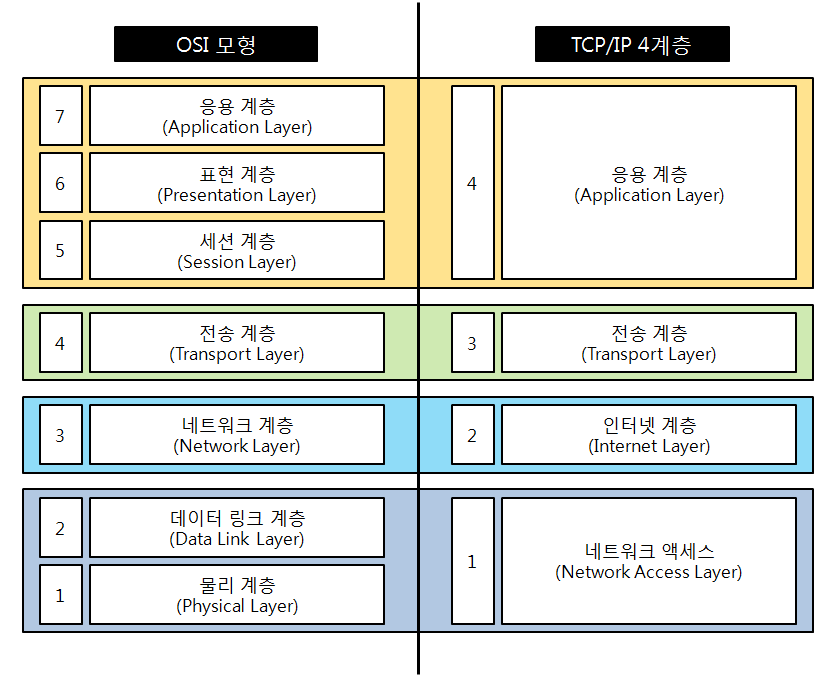

- 데이터 통신을 표현한 계층이지만 OSI의 경우 필요한 계층을 좀 더 정확하게 정의한 모델
- TCP/IP의 경우 좀 더 실무적인 프로토콜 중심의 단순화 한 모델

### TCP/IP 4계층 구조

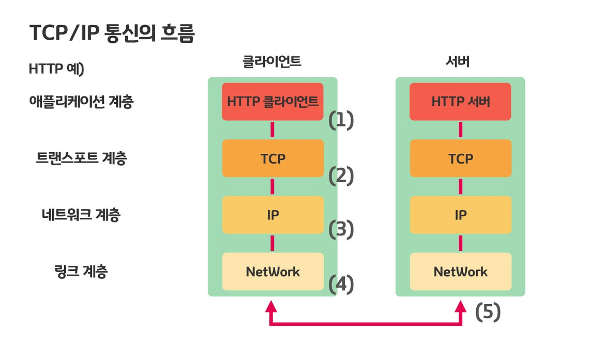

1. 애플리케이션 계층(Application Layer)
2. 전송 계층(Transport Layer)
3. 인터넷 계층(Network Layer)
4. 링크 계층(Link Layer)

- 위와 같이 계층을 나눠 특정 계층이 변경된 경우 다른 계층이 영향을 받지 않도록 설계됨

#### 애플리케이션 계층(Application Layer)

- FTP, HTTP, SSH, SMTP, DNS 등 응용프로그램이 사용되는 계층
- 웹 서비스, 이메일, 실질적으로 사람들에게 제공되는 계층

| 프로토콜        | 동작 방식                                                              |
| --------------- | ---------------------------------------------------------------------- |
| HTTP            | 웹 클라이언트와 서버 페이지 데이터를 주고 받음                         |
| POP, SMTP, IMAP | 메일을 송수신하고 보관                                                 |
| FTP             | 장치와 장치 간 파일 전송하는데 사용                                    |
| SSH             | 보안되지 않은 네트워크 서비스를 안전하게 운영하기 위한 암호화 프로토콜 |
| DNS             | 도메인명과 IP어드레스의 정보를 서로 변환할때 사용                      |
| SMP, AFP        | LAN 안에서 파일을 공유한다                                             |
| DHCP            | LAN 내 컴퓨터에게 IP 어드레스를 할당할 때 사용                         |
| SSL/TLS         | 통신 데이터를 암호화하여 주요 정보를 안전하게 주고받을 때 사용         |

#### 전송 계층(Transport Layer)

- 데이터 송수신 담당
- 통신 노드 간 연결을 제어
- 네트워크 양단의 송수신 호스트 사이에서 신뢰성 있는 전송기능 제공
- TCP, UDP 등이 있음

  - TCP

    - 연결 지향 프로토콜
    - 데이터의 신뢰성 있는 전송을 보장
    - 데이터 패킷을 순서대로 전송하고, 손실된 패킷은 재전송
    - 가상회선 패킷 교환 방식을 사용

  - UDP
    - 비연결 지향적 프로토콜
    - 빠르고 간단한 데이터 전송을 목표
    - 전송 속도가 TCP에 비해 빠름
    - 데이터그램 패킷 교환 방식을 사용

##### 가상회선 패킷 교환 방식

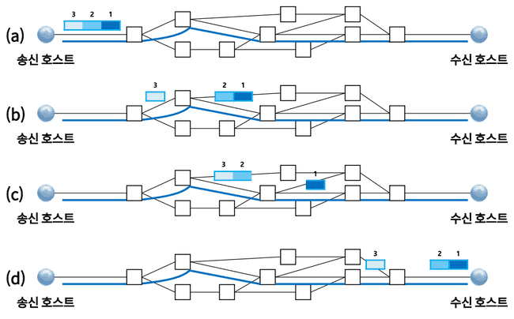

- 각 회선에 식별자가 포함됨
- 모든 패킷을 전송하면 회선이 해제된 후 전송된 순서대로 도착
- 모든 패킷의 경로가 동일

##### 데이터그램 패킷 교환 방식

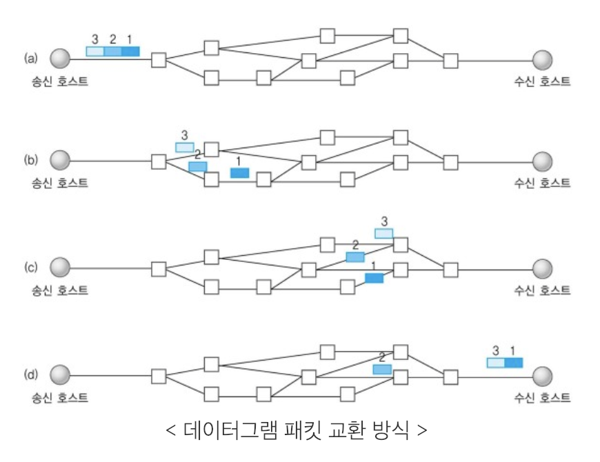

- 독립적 이동하며 최적 경로를 선택
- 분할된 여러 패킷은 모두 다른 경로로 전송될 수 있음
- 도착하는 순서가 다를 수 있음
- 정보의 양이 적거나 신뢰성이 중요하지 않은 환경에서 사용

##### TCP 연결 과정

- 주로 3-way handshake 라는 작업을 통해 신뢰성을 확보
  - 사전에 서로 데이터를 전송하기 전 상대방 컴퓨터 연결을 확인하는 과정

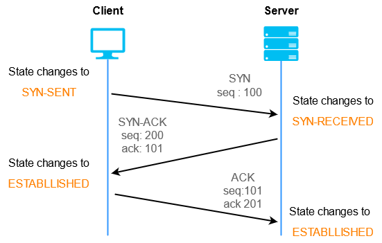

1. Client 측에서 서버에 연결이 가능한지 SYN을 통해 물어보는 과정
2. Server에서 연결이 가능하다는 요청으로 SYN과 ACK를 보냄
3. Client 측에서 요청을 받고 포트를 열어주는 것으로 통신이 시작된다.

- SYN(Synchronize) : TCP 연결시 가장 먼저 보내는 패킷, 상대방에게 연결 요청할 때 사용
- ACK(Acknowledgement) : 상대방으로부터 패킷을 성공적으로 수신했음을 알려주는 패킷

위와 같은 과정을 거치기 때문에 각 사용자들 끼리 신뢰성이 쌓여서 데이터 송수신이 가능함

##### TCP 연결 해제 과정

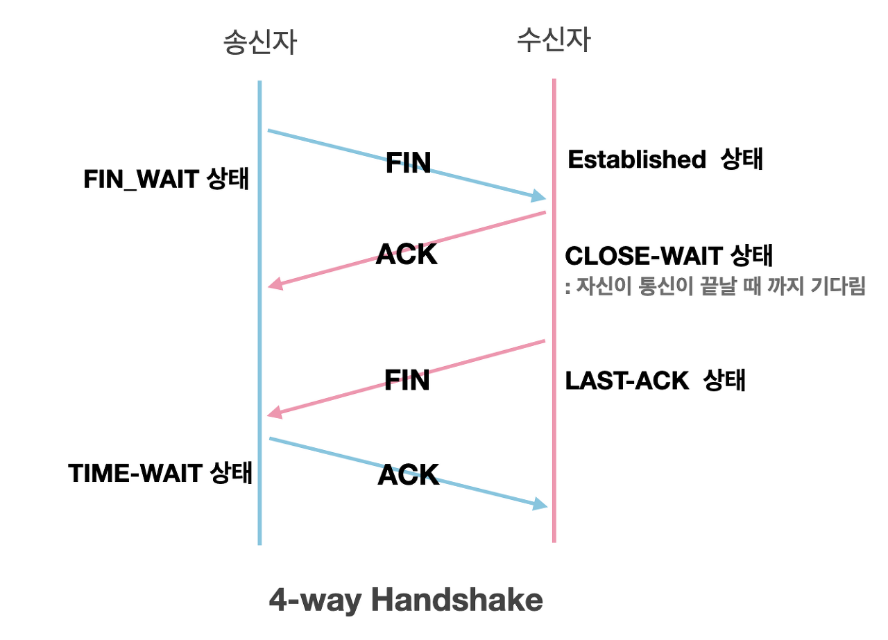

1. Client 측에서 통신을 끝내자는 FIN 요청을 보냄
2. Server 측에서 요청을 받아들이고 종료 대기상태로 들어간다.
3. Server 측에서 종료 대기상태에서 서버를 종료한다는 요청을 Client 측으로 보냄
4. Client 측에서 서버를 종료해라 응답을 진행하면 서버와 통신이 닫히게 된다.

- 위 과정에서 TIME-WAIT 라는 상태가 존재한다.

  1. 지연 패킷이 발생할 경우를 대비
  2. 장치가 연결이 닫혔는지 확인하기 위해

- 비슷한 예시로는 챗봇과 대화 등이 생각날듯?

#### 인터넷 계층(Network Layer)

- 네트워크 패킷을 IP 주소로 지정된 목적지로 전송
- IP, ARP, ICMP 등이 있으며 패킷을 수신하는 상대 IP 지정하여 전송
- 비연결적 특징

#### 단어 및 용어

- 트래픽 : 네트워크 내부에 일정 시간 동안 흐르는 데이터 양
- 대역폭 : 주어진 시간 동안 네트워크 연결을 통해 흐를 수 있는 최대 비트 수
