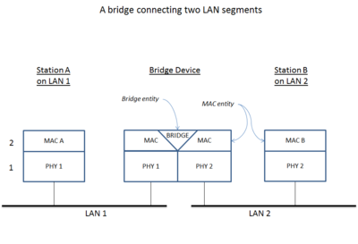

# 네트워크 기기

- 네트워크는 여러 기기를 기반으로 구축된다

## 2.3.1 네트워크 기기의 처리 범위

- 계층별로 처리 범위를 구분 함

  1. 1계층 장비 ( 물리계층 : 실제 장비를 연결하는 장치 )

     | 장비   | 설명                                                                                |
     | ------ | ----------------------------------------------------------------------------------- |
     | 허브   | - 여러 대의 컴퓨터를 연결하여 네트워크로 보내거나, 수신된 정보를 여러 컴퓨터로 송신 |
     | 리피터 | - 디지털 신호를 증폭시킴                                                            |

  2. 2계층 장비 ( 데이터 링크계층 : 오류와 흐름 제거 => 신뢰성 있는 데이터 전송 )

     | 장비                        | 설명                                                                                                                                                                                                                                                                                                                                                                                                   |
     | --------------------------- | ------------------------------------------------------------------------------------------------------------------------------------------------------------------------------------------------------------------------------------------------------------------------------------------------------------------------------------------------------------------------------------------------------ |
     | 브리지                      | - 두 개의 근거리 통신망(LAN)을 서로 연결 해주는 장치                                                                                                                                                                                                                                                                                                                                                   |
     | L2 스위치                   | - 느린 전송속도지만 허브 단점을 개선하기 위한 장치   - 들어온 프레임을 목적지 MAC 주소 기반으로 빠르게 전송시키는 통신 장치   - 3개의 방식 중 한개를 사용   1. Store and Fowarding : 데이터를 전부 받은 다음 처리 하는 방식   2. Cut Through : 데이터 목적지 주소만 확인 후 바로 전송 처리하는 방식   3. Fragment Free : 프레임 앞 64바이트만 읽고 에러 처리 후, 목적지로 전송하는 방식 |
     | NIC(Network Interface Card) | - 외부와 접속하여 가장 빠른 속도로 데이터를 주고받는 컴퓨터 내에 설치되는 장치                                                                                                                                                                                                                                                                                                                         |
     | 스위칭 허브                 | - 스위치 기능을 가진 허브                                                                                                                                                                                                                                                                                                                                                                              |

  3. 3계층 장비 ( 네트워크 계층 : 올바른 경로를 선택하도록 지원 )

     | 장비                 | 설명                                                                                                                                                                                                                                       |
     | -------------------- | ------------------------------------------------------------------------------------------------------------------------------------------------------------------------------------------------------------------------------------------ |
     | 라우터               | - LAN 과 LAN 혹은 LAN 과 WAN 을 연결하기 위한 장비   - 패킷 위치를 추출하여 최적 경로 지정   - 경로를 따라 데이터 패킷을 다음 장치로 전송   - 프로토콜 경로 설정을 하여, 원하는 목적지까지 지정된 데이터가 안전하게 전달되도록 함 |
     | 게이트웨이           | - 프토로콜을 서로 다른 통신망에 접속할 수 있게 해주는 장치                                                                                                                                                                                 |
     | L3 스위치            | - 네트워크 단위들을 연결하는 통신 장비   - IP 레이어에서 스위칭을 수행하여 외부로 전송                                                                                                                                                  |
     | 유무선 인터넷 공유기 | - 외부로부터 들어오는 인터넷 라인을 연결하여 여러 기계에 연결 or 무선 신호로 송출                                                                                                                                                          |
     | 스위칭 허브          | - 광역 네트워크를 커버하는 스위칭 허브                                                                                                                                                                                                     |

  4. 4계층 장비 ( 전송 계층 : 송신, 수신 프로세스 간의 연결 )

     | 장비      | 설명                                                                                                                                                                                                                   |
     | --------- | ---------------------------------------------------------------------------------------------------------------------------------------------------------------------------------------------------------------------- |
     | L4 스위치 | - 4계층 네트워크 단위들을 연결하는 통신 장비   TCP/UDP 스위칭 수행   FTP, HTTP 등 구분하여 스위칭하는 로드 밸런싱 가능   - 4계층 정보인 TCP/UDP 포트번호를 분석하여 포워딩 결정 후, QoS와 GLB/SLB 기능을 제공 |

### 스위치란?

- LAN 과 LAN 을 연결하여 더 큰 LAN 을 만드는 장치
- 하드웨어 기반 처리로 인해 전송 속도가 빠르다
- 어느 계층까지 다루는지에 따라서 종류를 분리함
- 연결된 모든 기기로부터 들어오는 패킷을 수신하고 적당한 기기로 보냄

## 2.3.2 애플리케이션 계층을 처리하는 기기

- 대표적인 예시로 L7 스위치

### L7 스위치란?

- 7계층에 속하는 IP, TCP/UDP 포트 및 패킷 까지 참조하는 URL 기반 스위치
- 여러 장비를 연결하여 데이터 통신 중재를 함
- 목적지가 연결된 포트로만 신호를 보내고 데이터를 전송하는 통신 네트워크 장비
- 로드 밸런서라고도 불림
- 서버 부하를 분산하는 기기
- 시스템이 처리할 수 있는 트래픽 증가를 목표로함
- 데이터 분석을 통해 DDoS 공격 방어, 감염 패킷 필터링 기능 제공

### L4 스위치란?

- 4계층에 속하는 IP, TCP/UDP 포트 정보를 참조하여 패킷 확인하고 세션 관리
- TCP/UDP 패킷 정보를 분석하여 패킷이 서비스를 종류별로 처리 ( 포트 기반 패킷 처리 )
- 서버 IP를 VIP와 매핑한 테이블을 보유 ( VIP(Virtual IP) : 가상의 아이피로 외부에 보여지는 대표 IP )

#### L4 스위치와 L7 스위치 차이

- L4 스위치는 페이로드를 신경쓰지 않지만 (IP와 포트 기반으로 트래픽 분산) L7의 경우 세션을 분리하고 철저하게 클라이언트/서버로 동작
- L7 스위치는 데이터 분석을 통해 보안 기능을 제공하고 HTTP Header 값에 따른 부하 분산 가능

#### 로드밸런서

- 네트워크나 서버에 분산된 작업 부하를 공평하게 분배하는 장치
- 웹 서버, 애플리케이션 서버, 데이터베이스 서버 등과 같은 서버 그룹에 사용
- 다양한 알고리즘에 따라 이 요청을 처리할 서버로 분배

1. 부하 분산: 로드 밸런서는 서버 그룹에 들어오는 트래픽을 여러 서버로 균등하게 분산하여 각 서버의 부하를 분담한다. 이를 통해 특정 서버의 과부하를 방지하고 시스템 전체의 성능을 향상시킨다.

2. 고가용성: 로드 밸런서는 여러 대의 서버를 관리하므로, 한 대의 서버에 장애가 발생해도 다른 서버로 요청을 전달할 수 있다. 이를 통해 시스템의 가용성을 높일 수 있다. (서버 장애가 발생시 다른 서버로 돌릴 수 있음)

3. 확장성: 새로운 서버를 시스템에 추가하거나 기존 서버를 제거하는 경우, 로드 밸런서는 자동으로 이를 감지하고 트래픽을 새로운 서버로 분배한다. 이를 통해 시스템의 확장성을 유지하고 유연한 운영이 가능하다.

## 2.3.3 인터넷 계층을 처리하는 기기 (3계층 장비)

- 라우터와 L3 스위치가 존재

### 라우터

- 여러 네트워크 연결, 분할, 구분하는 역할
- 데이터를 주고받을 때 패킷 소모를 최소화 및 경로를 최적화하여 최소 경로로 패킷을 포워딩
- 공유기라 생각하면 됨

### L3 스위치

- L2 스위치 기능과 라우팅을 갖춘 장비

| 구분        | L2 스위치       | L3 스위치     |
| ----------- | --------------- | ------------- |
| 참조 테이블 | MAC 주소 테이블 | 라우팅 테이블 |
| 참조 PDU    | 이더넷 프레임   | IP 패킷       |
| 참조 주소   | MAC 주소        | IP 주소       |

## 2.3.4 데이터 링크 계층을 처리하는 기기

- L2 스위치와 브리지

### L2 스위치

- 장치들의 MAC 주소 MAC 테이블 통해 관리
- 연결된 장치로 패킷이 들어오면 패킷 전송 담당
- IP 기반 라우팅이 불가능
- 단순한 패킷 MAC 주소를 읽어 스위칭하는 역할
- 목적지가 MAC 테이블에 없으면 전체 포트로 전달 후 일정시간 후 삭제하는 기능도 존재

### 브리지

- 두 개의 근거리 통신망에 상호 접속할 수 있는 통신망 연결 장치
- 포트와 포트 사이의 다리 역할
- 통신망 범위 확장 및 하나의 통신망으로 구축할 때 사용

## 2.3.5 물리 계층을 처리하는 기기

- NIC, 리피터, AP

### NIC(Network Interface Card)

- 2대 이상 컴퓨터 네트워크 구성에 사용
- 네트워크와 빠른 속도로 송수신 가능하도록 컴퓨터 내에 설치하는 카드
- 각각 LAN에는 고유 식별번호인 MAC 주소가 존재

### 리피티(Repeater)

- 약해진 신호 정도를 증폭하여 다른쪽으로 전달
- 광케이블로 인해 현재 사용빈도는 낮음

### AP(Access Point)

- 패킷을 복사하는 기기(공유기)
