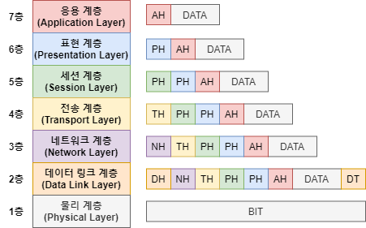
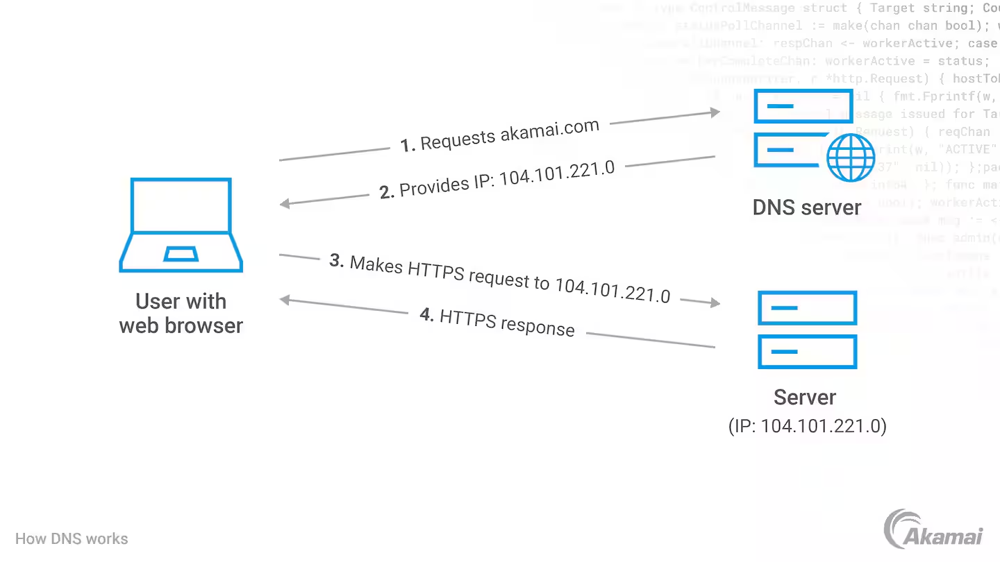
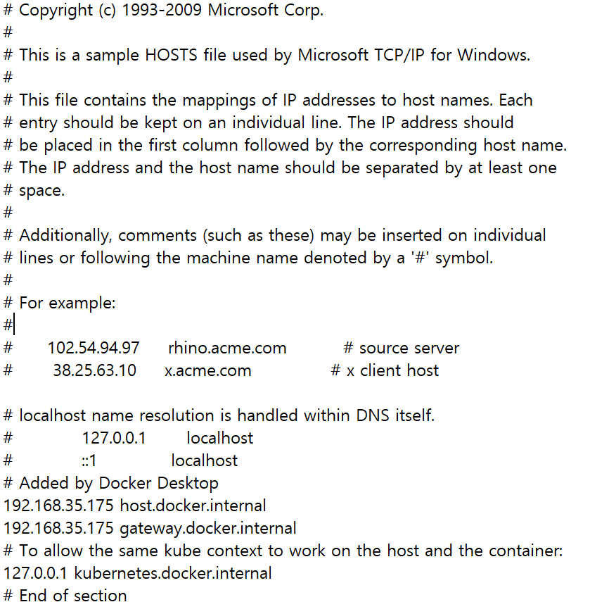
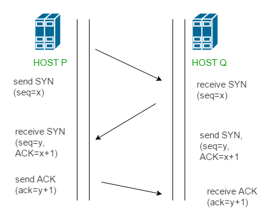
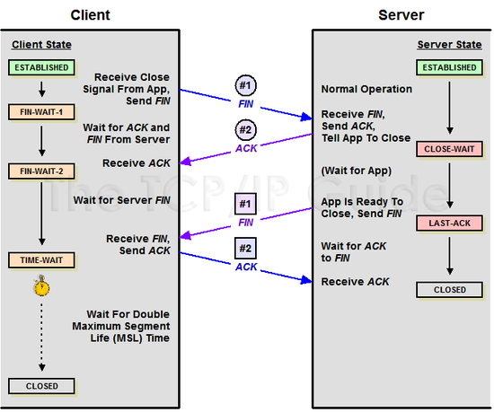

## 1. OSI 7계층에 대해 설명해 주세요.

- 네트워크 통신이 일어나는 과정을 흐름을 파악하기 쉽게 7 단계로 나눈 것

- Transport Layer와, Network Layer의 차이에 대해 설명해 주세요.
  - 전송 계층 : 신뢰성 있는 데이터의 전송을 보장
  - 네트워크 계층 : 전송 경로의 최적화와 라우팅
- 각 Layer는 패킷을 어떻게 명칭하나요? 예를 들어, Transport Layer의 경우 Segment라 부릅니다.
  - 1 계층 : 비트
  - 2 계층 : 프레임
  - 3 계층 : 패킷
  - 4 계층 : 세그먼트
  - 나머지 : 데이터
- 각각의 Header의 Packing Order에 대해 설명해 주세요.
  - Application : 데이터
  - Transport Layer : 송신자/수신자의 포트 번호, 순서 번호, 오류 제어 정보
  - Network : 송신자와 수신자의 IP 주소 및 라우팅 정보
  - Data Link : 송신자/ 수신자 MAC 주소
  - Physical : 데이터를 0/1 로 변환 헤더는 따로 x
- ARP에 대해 설명해 주세요.
  - 주요 기능은 IP 주소를 MAC 주소로 변환 ( 스푸핑에 취약 )

## 2. DNS에 대해 설명해 주세요.

- 주소창에 문자를 입력시 IP주소로 변경해주는 시스템

- DNS는 몇 계층 프로토콜인가요?
  - 사용자와 직접 상호작용하는 응용계층(7계층)
- UDP와 TCP 중 어떤 것을 사용하나요?
  - 기본적으로 UDP 를 사용하지만 512Byte 초과 혹은 신뢰성 있는 데이터 전송이 필요한 경우 TCP 즉 둘다 사용
- DNS Recursive Query, Iterative Query가 무엇인가요?

| 항목              | Recursive Query                                 | Iterative Query                              |
| ----------------- | ----------------------------------------------- | -------------------------------------------- |
| 쿼리 방식         | DNS 서버가 최종 IP 주소를 찾을 때까지 쿼리 수행 | 클라이언트가 각 DNS 서버에 여러 번 쿼리 요청 |
| 클라이언트의 역할 | 한 번 요청 후 최종 응답을 기다림                | 여러 단계의 DNS 서버와 상호작용하며 쿼리     |
| DNS 서버의 역할   | 최종 IP 주소를 찾아 클라이언트에 반환           | 다음 쿼리할 DNS 서버의 정보만 제공           |

- 재귀 쿼리는 일반적 DNS에 조회에 사용 되지만 반복적 쿼리는 DNS 서버간 통신에 사용

- DNS 쿼리 과정에서 손실이 발생한다면, 어떻게 처리하나요?
  - 재시도 요청, 타임아웃 설정, TCP 사용, 로컬 캐쉬 사용 등
- 캐싱된 DNS 쿼리가 잘못 될 수도 있습니다. 이 경우, 어떻게 에러를 보정할 수 있나요?
  - TTL(Time to Live) : TTL 값을 짧게 설정하여 최신의 상태를 유지하고 지난 경우 재요청을 보내 값을 갱신
  - 브라우저 캐시 삭제
- DNS 레코드 타입 중 A, CNAME, AAAA의 차이에 대해서 설명해주세요.
  - A 레코드 : 도메인 이름을 IPv4 주소로 변환
  - CNAME 레코드 : 도메인 이름을 다른 도메인 이름으로 매핑
  - AAAA 레코드 : 도메인 이름을 IPv6 주소로 변환
- hosts 파일은 어떤 역할을 하나요? DNS와 비교하였을 때 어떤 것이 우선순위가 더 높나요?
  - host 파일은 로컬 파일로 도메인 이름을 특정 IP 주소로 매핑해줌
  - 우선순위는 host 파일이 DNS 보다 높음

## 3. 3-Way Handshake에 대해 설명해 주세요.

- 클라이언트와 서버 간의 신뢰성 있는 통신을 보장

- ACK, SYN 같은 정보는 어떻게 전달하는 것 일까요?
  - SYN : 클라이언트와 서버가 연결을 시작할 때 전송하는 패킷
  - ACK : SYN-ACK 패킷을 받은 후 응답하는 패킷으로 서버에 SYN 요청을 확인
- 2-Way Handshaking 를 하지않는 이유에 대해 설명해 주세요.
  - 연결의 한 쪽만 신뢰성을 확인할 수 있기 때문에 지양
- 두 호스트가 동시에 연결을 시도하면, 연결이 가능한가요? 가능하다면 어떻게 통신 연결을 수행하나요?
  - 각 호스트는 서로의 시퀀스 번호와 ACK 정보를 확인하여 신뢰할 수 있는 연결을 설정가능
- SYN Flooding 에 대해 설명해 주세요.
  - DoS 공격의 일종으로 대량의 SYN 패킷을 목표 서버에 보내 자원을 고갈시키는 방식

## 4. 4-Way Handshake에 대해 설명해 주세요.

- TCP 프로토콜의 연결을 종료하기 위한 과정 클라이언트와 서버 간의 연결이 안전하게 종료되도록 보장

- 패킷이 4-way handshake 목적인지 어떻게 파악할 수 있을까요?
  - TCP 헤더의 플래그 필드를 확인 ( FIN 플래그 요청 )
- 빨리 끊어야 할 경우엔, (즉, 4-way Handshake를 할 여유가 없다면) 어떻게 종료할 수 있을까요?
  - RST(Reset) 플래그가 설정된 TCP 패킷을 보냄 => 강제 종료 요청
- 4-Way Handshake 과정에서 중간에 한쪽 네트워크가 강제로 종료된다면, 반대쪽은 이를 어떻게 인식할 수 있을까요?
  - TCP Keep-Alive : 일정 시간 간격으로 연결이 유지되는지 체크
  - 타임 아웃 : 일정 시간 동안 패킷 전송이 없는 경우 TIME_WAIT 상태로 전환
- 왜 종료 후에 바로 끝나지 않고, TIME_WAIT 상태로 대기하는 것 일까요?
  - 데이터 손실 방지, 중복 연결 방지, 정상적인 종료 절차 보장
