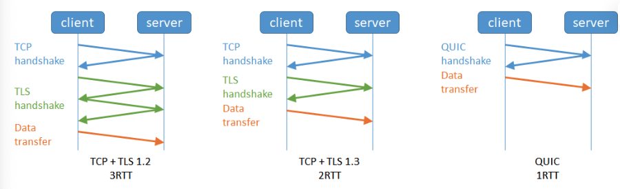
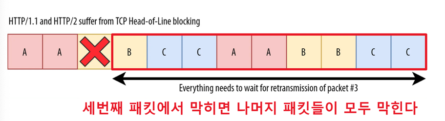
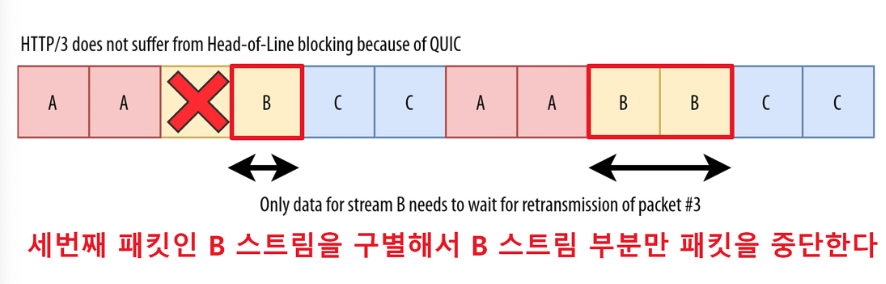
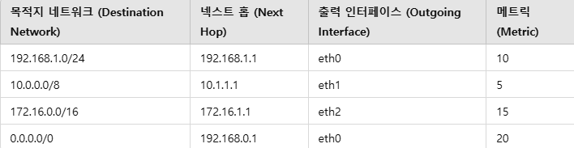
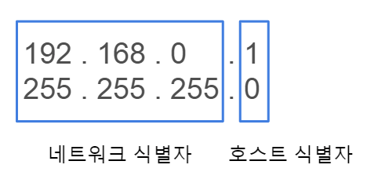

## 1. OSI 7계층에 대해 설명해 주세요.

- 네트워크 통신이 일어나는 과정을 흐름을 파악하기 쉽게 7 단계로 나눈 것

- Transport Layer와, Network Layer의 차이에 대해 설명해 주세요.
  - 전송 계층 : 신뢰성 있는 데이터의 전송을 보장
  - 네트워크 계층 : 전송 경로의 최적화와 라우팅
- 각 Layer는 패킷을 어떻게 명칭하나요? 예를 들어, Transport Layer의 경우 Segment라 부릅니다.
  - 1 계층 : 비트
  - 2 계층 : 프레임
  - 3 계층 : 패킷
  - 4 계층 : 세그먼트
  - 나머지 : 데이터
- 각각의 Header의 Packing Order에 대해 설명해 주세요.
  - Application : 데이터
  - Transport Layer : 송신자/수신자의 포트 번호, 순서 번호, 오류 제어 정보
  - Network : 송신자와 수신자의 IP 주소 및 라우팅 정보
  - Data Link : 송신자/ 수신자 MAC 주소
  - Physical : 데이터를 0/1 로 변환 헤더는 따로 x
- ARP에 대해 설명해 주세요.
  - 주요 기능은 IP 주소를 MAC 주소로 변환 ( 스푸핑에 취약 )

## 2. DNS에 대해 설명해 주세요.

- 주소창에 문자를 입력시 IP주소로 변경해주는 시스템

- DNS는 몇 계층 프로토콜인가요?
  - 사용자와 직접 상호작용하는 응용계층(7계층)
- UDP와 TCP 중 어떤 것을 사용하나요?
  - 기본적으로 UDP 를 사용하지만 512Byte 초과 혹은 신뢰성 있는 데이터 전송이 필요한 경우 TCP 즉 둘다 사용
- DNS Recursive Query, Iterative Query가 무엇인가요?

| 항목              | Recursive Query                                 | Iterative Query                              |
| ----------------- | ----------------------------------------------- | -------------------------------------------- |
| 쿼리 방식         | DNS 서버가 최종 IP 주소를 찾을 때까지 쿼리 수행 | 클라이언트가 각 DNS 서버에 여러 번 쿼리 요청 |
| 클라이언트의 역할 | 한 번 요청 후 최종 응답을 기다림                | 여러 단계의 DNS 서버와 상호작용하며 쿼리     |
| DNS 서버의 역할   | 최종 IP 주소를 찾아 클라이언트에 반환           | 다음 쿼리할 DNS 서버의 정보만 제공           |

- 재귀 쿼리는 일반적 DNS에 조회에 사용 되지만 반복적 쿼리는 DNS 서버간 통신에 사용

- DNS 쿼리 과정에서 손실이 발생한다면, 어떻게 처리하나요?
  - 재시도 요청, 타임아웃 설정, TCP 사용, 로컬 캐쉬 사용 등
- 캐싱된 DNS 쿼리가 잘못 될 수도 있습니다. 이 경우, 어떻게 에러를 보정할 수 있나요?
  - TTL(Time to Live) : TTL 값을 짧게 설정하여 최신의 상태를 유지하고 지난 경우 재요청을 보내 값을 갱신
  - 브라우저 캐시 삭제
- DNS 레코드 타입 중 A, CNAME, AAAA의 차이에 대해서 설명해주세요.
  - A 레코드 : 도메인 이름을 IPv4 주소로 변환
  - CNAME 레코드 : 도메인 이름을 다른 도메인 이름으로 매핑
  - AAAA 레코드 : 도메인 이름을 IPv6 주소로 변환
- hosts 파일은 어떤 역할을 하나요? DNS와 비교하였을 때 어떤 것이 우선순위가 더 높나요?
  - host 파일은 로컬 파일로 도메인 이름을 특정 IP 주소로 매핑해줌
  - 우선순위는 host 파일이 DNS 보다 높음

## 3. 3-Way Handshake에 대해 설명해 주세요.

- 클라이언트와 서버 간의 신뢰성 있는 통신을 보장

- ACK, SYN 같은 정보는 어떻게 전달하는 것 일까요?
  - SYN : 클라이언트와 서버가 연결을 시작할 때 전송하는 패킷
  - ACK : SYN-ACK 패킷을 받은 후 응답하는 패킷으로 서버에 SYN 요청을 확인
- 2-Way Handshaking 를 하지않는 이유에 대해 설명해 주세요.
  - 연결의 한 쪽만 신뢰성을 확인할 수 있기 때문에 지양
- 두 호스트가 동시에 연결을 시도하면, 연결이 가능한가요? 가능하다면 어떻게 통신 연결을 수행하나요?
  - 각 호스트는 서로의 시퀀스 번호와 ACK 정보를 확인하여 신뢰할 수 있는 연결을 설정가능
- SYN Flooding 에 대해 설명해 주세요.
  - DoS 공격의 일종으로 대량의 SYN 패킷을 목표 서버에 보내 자원을 고갈시키는 방식

## 4. 4-Way Handshake에 대해 설명해 주세요.

- TCP 프로토콜의 연결을 종료하기 위한 과정 클라이언트와 서버 간의 연결이 안전하게 종료되도록 보장

- 패킷이 4-way handshake 목적인지 어떻게 파악할 수 있을까요?
  - TCP 헤더의 플래그 필드를 확인 ( FIN 플래그 요청 )
- 빨리 끊어야 할 경우엔, (즉, 4-way Handshake를 할 여유가 없다면) 어떻게 종료할 수 있을까요?
  - RST(Reset) 플래그가 설정된 TCP 패킷을 보냄 => 강제 종료 요청
- 4-Way Handshake 과정에서 중간에 한쪽 네트워크가 강제로 종료된다면, 반대쪽은 이를 어떻게 인식할 수 있을까요?
  - TCP Keep-Alive : 일정 시간 간격으로 연결이 유지되는지 체크
  - 타임 아웃 : 일정 시간 동안 패킷 전송이 없는 경우 TIME_WAIT 상태로 전환
- 왜 종료 후에 바로 끝나지 않고, TIME_WAIT 상태로 대기하는 것 일까요?
  - 데이터 손실 방지, 중복 연결 방지, 정상적인 종료 절차 보장

## 5. 쿠키와 세션의 차이에 대해 설명해 주세요.

- HTTP 프로토콜의 환경은 'connectionless, stateless' 특성을 가지기 때문에 서버가 매번 클라이언트 체크를 해야하는데 이를 방지하기 위해 사용

- 쿠키는 클라이언트가 관리하는 상태, 세션은 서버가 관리하는 상태

- 세션 방식의 로그인 과정에 대해 설명해 주세요.

  1. 사용자가 홈페이지 접속시 세션 ID 발급
  2. 세션 ID에 대한 쿠키를 저장해 가지고 있음
  3. 요청시 세션 ID로 세션에 있는 정보를 가져옴
  4. 가져온 정보를 바탕으로 요청을 처리하여 클라이언트에 응답

- HTTP의 특성인 Stateless에 대해 설명해 주세요.

  - 통신을 하지 않으면 통신을 끊은 상태를 의미, 연결을 끊는 순간 클라이언트와 서버의 통신이 끝나며 상태 정보는 유지하지 않는 특성

- Stateless의 의미를 살펴보면, 세션은 적절하지 않은 인증 방법 아닌가요?

  - 적절하지 않은 방법이긴 하지만 요청시마다 사용자의 모든 정보를 받아서 처리하는것이 서버에 더욱 부담되기 때문에 그를 해결하기 위해 대부분의 웹은 세션 방식을 선호

- 규모가 커져 서버가 여러 개가 된다면, 세션을 어떻게 관리할 수 있을까요?
  - Sticky Session : 처음 접속한 서버에 지속적 연결이 되도록 하는 방법 이지만 특정 서버에 부하가 집중될 수 있음
  - 세션 저장소 사용 : Redis, Memcached 데이터베이스를 세션 저장소로 사용 ( 중앙 저장소에 저장 )
  - JWT : 세션 정보를 토큰으로 만들어 클라이언트 측에서 관리

## 6. HTTP 응답코드에 대해 설명해 주세요.

- 어떠한 요청에 대해서 성공적으로 완료 되었는지 아닌지 알려줌

- 401 (Unauthorized) 와 403 (Forbidden)은 의미적으로 어떤 차이가 있나요?

  - 401은 허가되지 않은 요청으로 로그인등이나 이러한 인증 상태가 없거나 유효한 인증정보가 아닌 경우 발생
  - 403은 클라이언트에 권한이 없어서 접근할 수 없다는 것을 의미

- 200 (ok) 와 201 (created) 의 차이에 대해 설명해 주세요.

  - 둘다 요청이 성공했다는 의미지만 201은 요청이 성공해 새로운 리소스가 생겼다는 의미

- 필요하다면 저희가 직접 응답코드를 정의해서 사용할 수 있을까요? 예를 들어 285번 처럼요.
  - 정해진 표준코드가 있기 때문에 굳이굳이 만들고 싶으면 조합해서 만들수는 있지만 안만드는게 좋음

## 7. HTTP Method 에 대해 설명해 주세요

- GET : 서버로부터 데이터 취득 ( 조회 )
- POST : 서버에 데이터 추가/작성 ( 데이터 갱신 )
- PUT : 서버에 존재하는 리소스를 요청에 담긴 내용으로 대체 ( 수정 )
- Delete : 서버의 데이터 삭제
- HEAD : 서버 리소스의 메타데이터 취득
- OPTIONS : 리소스가 지원하는 메소드 취득
- PATCH : 리소스 일부분 수정
- CONNETC : 프록시 동작의 터널 접속 변경

- HTTP Method의 멱등성에 대해 설명해 주세요.
  - 멱등성 => 동일한 연산을 여러 번 수행해도 결과가 달라지지 않는 성질
- GET과 POST의 차이는 무엇인가요?

  - GET은 서버로부터 어떠한 정보를 요청할때 사용
  - POST는 서버의 리소스를 생성하거나 업데이트 할 때 사용

- POST와 PUT, PATCH의 차이는 무엇인가요?

  - POST 는 리소스를 생성
  - PUT은 리소스를 대체
  - PATCH 는 일부분 대체

- HTTP 1.1 이후로, GET에도 Body에 데이터를 실을 수 있게 되었습니다. 그럼에도 불구하고 왜 아직도 이런 방식을 지양하는 것일까요?
  - Body에 담을 데이터가 거의 의미가 없기 때문에

## 8. HTTP에 대해 설명해 주세요.

- Hyper Text Transfer Protocol 인터넷에서 데이터를 주고받는 프로토콜

- 공개키와 대칭키에 대해 설명해 주세요.

  - 데이터 보안을 위해 사용
  - 공개키 : 공개키와 개인키 두 개의 키를 사용하는 방식으로, 공개키로 암호화하고 개인키로 복호화 ( 보안성 높음 )
  - 대칭키 : 하나의 동일한 키로 암호화와 복호화를 수행하는 방식. 빠르고 자원 소모가 적지만, 키 전달 시 보안 문제가 발생 ( 보안성 낮음 )

- 왜 HTTPS Handshake 과정에서는 인증서를 사용하는 것 일까요?

  - HTTPS 는 인터넷 상에서 정보를 암호화 하기 때문에 본인 식별을 위해

- SSL과 TLS의 차이는 무엇인가요?
  - 둘다 같은 암호화 프로토콜이지만 TLS는 SSL의 향상된 버전

## 9. HTTP/1.1과 HTTP/2의 차이점은 무엇인가요?

- 하나의 연결에서 여러 요청과 응답을 동시에 주고 받을 수 있음
- 헤더 크기를 줄여 데이터 전송량과 응답 시간 단축
- 클라이언트 요청 없이도 필요한 리소스를 미리 푸쉬가 가능

- HOL Blocking 에 대해 설명해 주세요.
  - 앞서 요청한 패킷이 응답이 끝나지 않으면 다음 패킷이 전송되지 않는 것
- HTTP/3.0의 주요 특징에 대해 설명해 주세요.
  - 패킷 손실에 대한 빠른 대응, 사용자 IP 가 변경되어도 연결이 유지 되는 것

## 10. TCP와 UDP의 차이에 대해 설명해 주세요.

- TCP는 연결 지향적이고 신뢰성있는 데이터 전송, UDP는 비연결 지향으로 데이터 전송하는 속도를 중요시

- Checksum이 무엇인가요?

  - 중복 검사의 한 형태로 송신된 자료의 무결성을 보호하는 단순한 방법

- TCP와 UDP 중 어느 프로토콜이 Checksum을 수행할까요?

  - TCP와 UDP 모두 Checksum을 수행하여 데이터 오류를 검출하지만 TCP는 오류가 있을 경우 패킷을 재전송하는 반면 UDP는 그렇지 않음

- 그렇다면, Checksum을 통해 오류를 정정할 수 있나요?

  - 오류를 검출하기는 하지만 정정은 다른 분야이기 떄문에 다른 방법을 찾아봐야함

- TCP가 신뢰성을 보장하는 방법에 대해 설명해 주세요.

  - handshake 방식을 통해서 사용자와 신뢰성 체크를 진행

- TCP의 혼잡 제어 처리 방법에 대해 설명해 주세요.

  - 이해를 못함

- 왜 HTTP는 TCP를 사용하나요?

  - 데이털 전송 및 받는 것을 기본을 신뢰성을 바탕으로 해야지 않을까..?

- 그런데, 브라우저는 어떤 서버가 TCP를 쓰는지 UDP를 쓰는지 어떻게 알 수 있나요?
  - 어떤 프로토콜을 사용하는지에 따라서 TCP를 쓰는지 UDP를 쓰는지 알 수 있음.. (DNS, ALPN? 을 바탕으로 서버가 지원하는 프로토콜 체크)

## 11. IP 주소는 무엇이며, 어떤 기능을 하고 있나요?

- 컴퓨터 네트워크에서 장치들이 서로를 인식하고 통신을 하기 위한 특수한 번호

- IPv6는 IPv4의 주소 고갈 문제를 해결하기 위해 만들어졌지만 아직도 수많은 기기가 IPv4를 사용하고 있습니다. 고갈 문제를 어떻게 해결할 수 있을까요?

  - NAT을 통해 여러 사설 IP 주소를 공인 IP 주소 하나로 변환해주어 공인 IP 주소를 절약하고 여러 장치가 인터넷을 공유

- IPv4와 IPv6의 차이에 대해 설명해 주세요.

  - IPv4: 32비트 주소 체계, 4개의 숫자로 구성된 주소, 약 43억 개의 주소, 주소 부족 문제, NAT 사용
  - IPv6: 128비트 주소 체계, 16진수로 구성된 주소, 사실상 무한대의 주소, NAT 필요 없음, 보안과 성능 개선

- 수많은 사람들이 유동 IP를 사용하고 있지만, 수많은 공유기에서는 고정 주소를 제공하는 기능이 이미 존재합니다. 어떻게 가능한 걸까요?

  - 공유기 내부에서도 DHCP를 사용

- IPv4를 사용하는 장비와 IPv6를 사용하는 같은 네트워크 내에서 통신이 가능한가요? 가능하다면 어떤 방법을 사용하나요?

  - 듀얼스택 ( 장치가 IPv4, IPv6 지원 ), 터널링 ( IPv6 패킷을 IPv4 네트워크에 전달 ), 주소 변환

- IP가 송신자와 수신자를 정확하게 전송되는 것을 보장해 주나요?

  - IP 자체로는 비신뢰성과 비연결성을 가지기 떄문에 보장해주지 않음

- TTL(Hop Limit)이란 무엇인가요?

  - IP 패킷이 무한정 돌지않게 거치는 라우터의 최대 개수

- IP 주소와 MAC 주소의 차이에 대해 설명해 주세요.
  - IP는 네트워크 상 단말을 구분하기 위한 논리적 주소, MAC은 NIC에 부여한 고유한 물리적 주소

## 12. SOP(Same-Origin Policy) 정책에 대해 설명해 주세요.

- 웹 보안을 위한 정책으로, 서로 다른 출처의 리소스에 접근하지 못하도록 제한하는 것

- CORS 정책이 무엇인가요?
  - 다른 출처의 리소스를 안전하게 공유할 수 있도록 허용하는 것
- Preflight에 대해 설명해 주세요.
  - OPTIONS 메서드를 사용하여 서버의 CORS 정책을 확인하는 과정

## 13. Stateless와 Connectionless에 대해 설명해 주세요.

- Stateless : HTTP는 상태 정보를 저장하지 않아서 서버의 확장성과 효율성이 높아진다

- Connetionless : HTTP는 요청-응답 후 연결을 끊음

- 왜 HTTP는 Stateless 구조를 채택하고 있을까요?
  - 서버 확장을 및 상태를 계속 저장해두면 상태 공유를 위한 비용이 높아지기 때문에
- Connectionless의 논리대로면 성능이 되게 좋지 않을 것으로 보이는데, 해결 방법이 있을까요?
  - HTTP Keep-Alive 를 통해서 연결을 유지
- TCP의 keep-alive와 HTTP의 keep-alive의 차이는 무엇인가요?
  - TCP Keep-Alive는 연결을 지속적 점검, HTTP Keep-Alive는 하나의 TCP 연결을 여러 HTTP 요청에 재사용하는 기능

## 14. 라우터 내의 포워딩 과정에 대해 설명해 주세요.

- 라우팅 알고리즘을 통해 포워딩 테이블 구성 => 포워딩 테이블 참조하여 패킷의 목적지에 맞게 적당한 포트로 패킷을 이동 => 라우팅 테이블에서 적절한 인접노드 정보를 찾지 못하면 디폴트 라우터로 보냄

- 포워딩 테이블 : 네트워크 출발지부터 목적지 까지 가는 무수한 경로중 선택된 경로를 저장해둔 테이블
- 디폴트 라우터 : 테이블 정보가 없을 경우 새로운 길을 찾아주는 곳

- 라우팅과 포워딩의 차이는 무엇인가요?
  - 라우팅 : 목적지까지 경로 중 경로를 선택하는 작업
  - 포워딩 : 목적지까지 패킷을 전송하는 작업
- 라우팅 알고리즘에 대해 설명해 주세요.
  - 중앙 집중형 : 다익스트라 알고리즘 ( 네트워크 전체 정보를 가져와 출발지와 목적지 사이 최소 비용 계산 )
  - 분산 라우팅 : 벨만 포드 알고리즘 ( 모든 노드에서 각각 갈 수 있는 최소 거리 계산 )
- 포워딩 테이블의 구조에 대해 설명해 주세요.
  - 목적지 네트워크 , 다음 경로, 패킷을 전송할 인터페이스, 비용

## 15. 로드밸런서가 무엇인가요?

- 서버에 가해지는 트래픽을 여러대의 서버에 균등하게 분산시켜주는 역할

- L4 로드밸런서와, L7 로드밸런서의 차이에 대해 설명해 주세요.

  - L4 : IP, Port를 기준으로 부하를 분산
  - L7 : IP, Port 외에도 URI, Payload, Http Header 등을 기준으로 부하를 분산

- 로드밸런서 알고리즘에 대해 설명해 주세요.

  - 라운드 로빈 : 서버에 들어온 요청을 순서대로 돌아가면서 배정
  - 가중 라운드 로빈 : 각 서버에 가중치를 매기고 가중치가 높은 서버에 요청을 우선적으로 배정
  - 최소 연결 방식 : 요청이 들어온 시점에 가장 적은 연결 상태를 보이는 서버에 배정
  - IP 해시 방식 : 클라이언트의 IP 주소를 특정 서버로 매핑하여 요청을 처리

## 16. 서브넷 마스크와, 게이트웨이에 대해 설명해 주세요.

- 서브넷 마스크 : IP 주소를 네트워크 식별자와 호스트 식별자로 구분할 수 있는 것
- 게이트 웨이 : 네트워크 => 다른 네트워크로 통하는 길을 연결해주는 것

- NAT에 대해 설명해 주세요.

  - Network Address Translation 으로 네트워크 주소를 변환해주는 것으로 주로 사설 IP 와 공인 IP 주소 간 변환을 처리하는 기술

- 서브넷 마스크의 표현 방식에 대해 설명해 주세요.

  - 표준 형식: 255.255.255.0와 같이 점으로 구분된 4개의 숫자로 표현
  - CIDR 표기법 : /24, /16과 같이 슬래시 뒤에 네트워크 비트 수를 명시하는 방식
    - 192.168.1.0/24는 255.255.255.0
    - 10.0.0.0/16은 255.255.0.0
    - 11111111.11111111.00000000.00000000 ( 16비트 )

- 그렇다면, 255.0.255.0 같은 꼴의 서브넷 마스크도 가능한가요?
  - 비트로 연속된 숫자가 나와야 하기 때문에 불가능
    - 11111111.00000000.11111111.00000000 형식이 되므로 네트워크 식별자와 호스트 식별자로 구분이 불가능