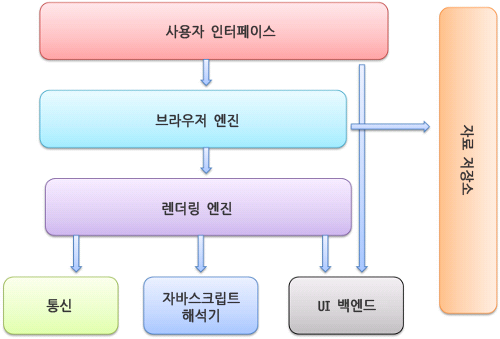
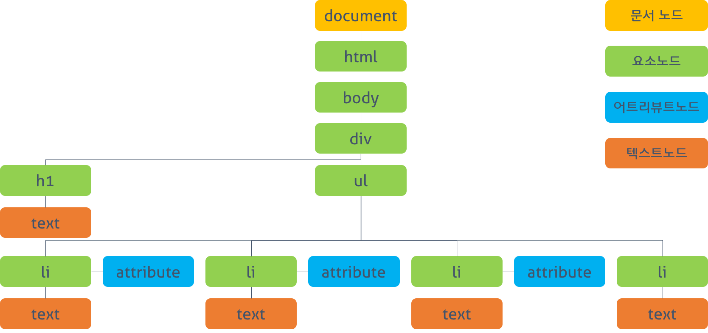
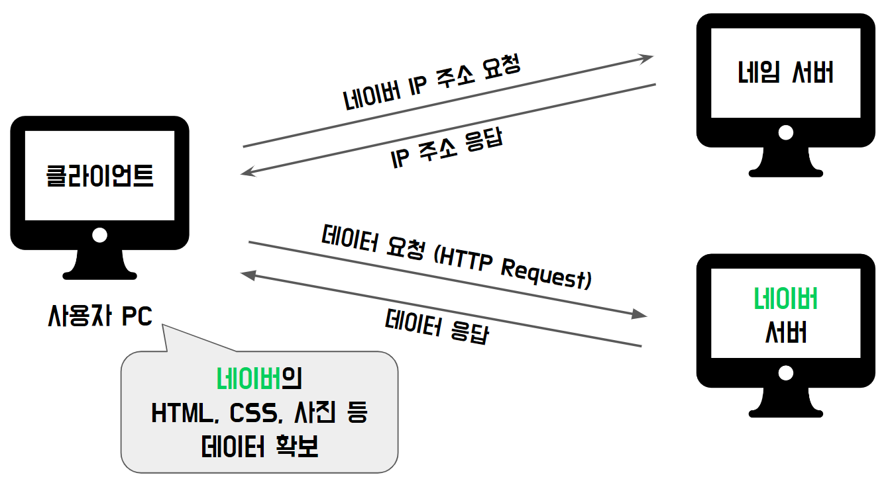
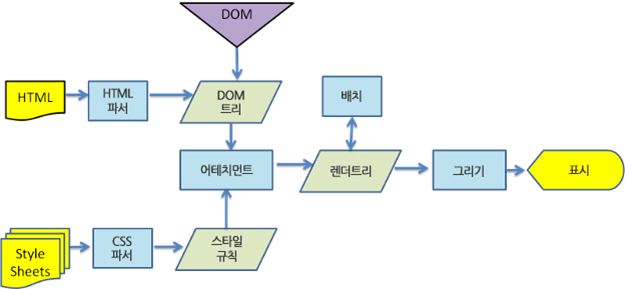
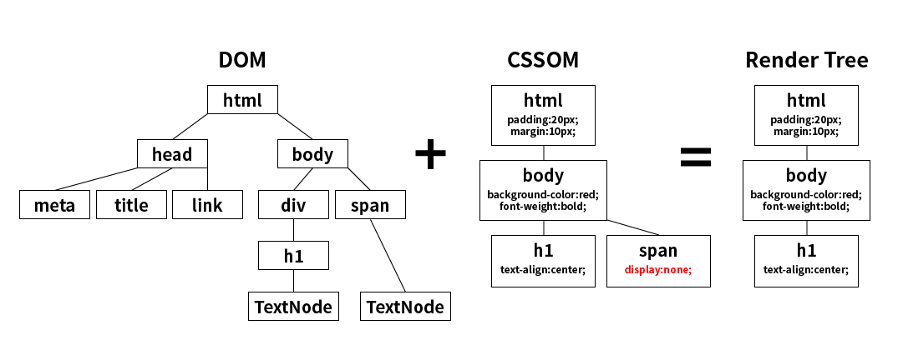

# 웹 브라우저 동작 방식

1. 사용자 인터페이스 - 주소 표시줄, 이전/다음 버튼, 북마크 메뉴 등. 요청한 페이지를 보여주는 창을 제외한 나머지 모든 부분
2. 브라우저 엔진 - 사용자 인터페이스와 렌더링 엔진 사이의 동작을 제어
3. 렌더링 엔진 - 요청한 콘텐츠를 표시. 예를 들어 HTML을 요청하면 HTML과 CSS를 파싱하여 화면에 표시
4. 통신 - HTTP 요청과 같은 네트워크 호출에 사용됨. 이것은 플랫폼 독립적인 인터페이스이고 각 플랫폼 하부에서 실행
5. UI 백엔드 - 콤보 박스와 창 같은 기본적인 장치를 그림. 플랫폼에서 명시하지 않은 일반적인 인터페이스로서, OS 사용자 인터페이스 체계를 사용
6. 자바스크립트 해석기 - 자바스크립트 코드를 해석하고 실행.
7. 자료 저장소 - 이 부분은 자료를 저장하는 계층으로 쿠키를 저장하는 것과 같이 모든 종류의 자원을 하드 디스크에 저장할 필요가 있음

## DOM 트리

- 문서 객체 모델(Document Object Model)
- 트리 내 하나의 객체는 노드라고 부르며 4가지로 구성
  - 문서 노드 : 트리의 최상위 객체, DOM 트리에 접근하기 위한 시작점
  - 요소 노드 : HTML 요소를 객체로 표현한 것
  - 어트리뷰트 노드 : HTML 요소의 "Attribute"를 객체로 표현한 것
  - 텍스트 노드 : HTML 요소의 텍스트를 객체로 표현

### 주소창에 검색을 입력시

**검색어 입력 => 입력한 텍스트 정보 확인 => 네트워크 호출 => 렌더링 작업 => 결과**

- 위 와 같은 구조로 흘러간다.

1. 주소창에 입력한 텍스트 정보 확인

   - 입력한 텍스트가 검색어인 경우 => 검색 엔진의 URL에 검색어를 포함한 주소로 페이지 이동
   - 입력한 텍스트가 URL인 경우 => 브라우저 엔진에서 (네트워크 스레드를 통해) 네트워크 호출

2. 네트워크 호출

   - 내가 입력한 URL에 HTML, CSS, JS, 이미지 등 데이터를 미리 가지고 있어야 한다.
   - 브라우저는 가지고 있지 않기 때문에 서버 컴퓨터로 요청을 날려서 이러한 정보를 받아온다.
   - 서버의 주소를 알아내기 위해서 하는 동작
     1. 자신의 host 파일에서 도메인 이름에 대응하는 IP 주소가 있는지 우선적 확인
     2. 없으면 네임 서버에 원하는 IP 주소를 알려주세요 요청을 보냄 ( 네임 서버 == DNS )
   - 컴퓨터 주소인 IP를 기반으로 동작하기 때문에 DNS(Domain Name Server)를 통해서 도메인 이름을 IP로 변환해야함

3. 네트워크 호출2

   - 서버의 IP 주소를 알게되어 서버와 통신이 가능하게된다.
   - 클라이언트 브라우저는 소켓을 열고 서버에 데이터를 요청하는 HTTP Request 를 보낸다
   - 서버는 클라이언트가 요청한 문서를 찾아 읽고 바이트 형태로 데이터를 보낸다
     

4. 렌더링 작업
   - 서버로부터 응답받은 데이터에 악성바이러스를 체크
   - 바이트 형태의 텍스트 문서이므로 렌더링 엔진에 데이터 해석 후 페이지를 화면에 띄우는 것을 요청한다
   - 렌더링 엔진은 데이터를 바탕으로 렌더링 프로세스를 수행하고, 브라우저 엔진에 작업 완료를 알림

#### 렌더링 프로세스

**HTML,CSS 파싱 => 렌더 트리 생성 => 레이아웃(배치) => 페인트(그리기)**

1. HTML 파싱

   - 바이트 형태의 HTML 문서를 지정된 인코딩 방식에 따라 문자열로 변환
   - 변환된 문자열을 토큰으로 분해 후 내용에 따라 노드로 변환
   - 객체를 트리 구조로 구성하여 DOM을 생성

2. CSS 파싱

   - 바이트 형태의 HTML 문서를 지정된 인코딩 방식에 따라 문자열로 변환
   - 변환된 문자열을 토큰으로 분해 후 내용에 따라 노드로 변환
   - 객체를 트리 구조로 구성하여 CSSOM 생성

3. JS 파싱

   - Script 태그를 만나면 렌더링은 DOM 생성을 잠시 중단 후 JS 리소스를 브라우저에서 받아와 제어권을 넘겨준다.
   - JS 리소스를 파싱 후 추상 구문 트리를 생성 후 바이트코드로 변호나해 실행
   - Script를 body 최하단에 넣는 이유도 DOM이 조작될 수 있어서 위험하기 때문이다

4. Render Tree 생성

   

   - 렌더링이 모두 끝나면 DOM과 CSSOM을 결합하여 렌더 트리를 생성

5. 레이아웃

   - 렌더 트리 생성이 끝나면 웹 페이지 화면 안에서 렌더 트리 내 노드의 위치, 크기 등을 계산 후 화면에 배치
   - 글로벌 레이아웃 => 전체 배치과정이 필요한 경우 ( 초기 배치, font와 같은 전역 스타일 변경 혹은 창이 리사이즈 )
   - 로컬 레이아웃 => 일부의 배치과정만 변경

6. 페인트
   - 렌더 트리의 각 노드를 화면의 실제 픽셀로 변환
