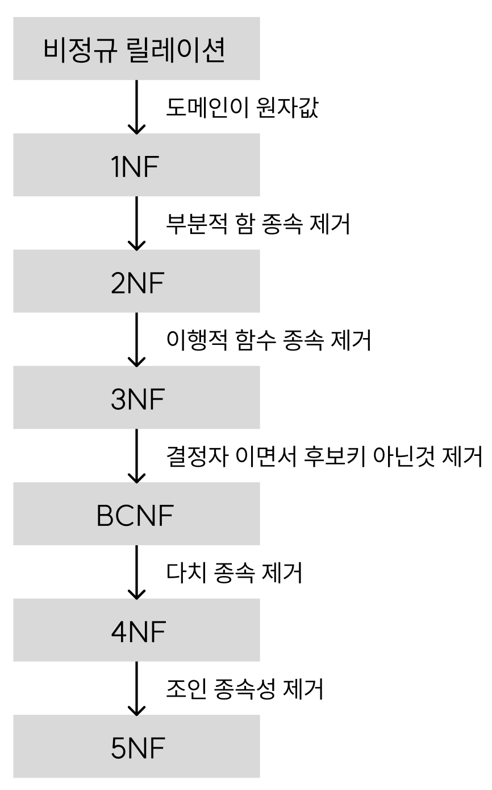
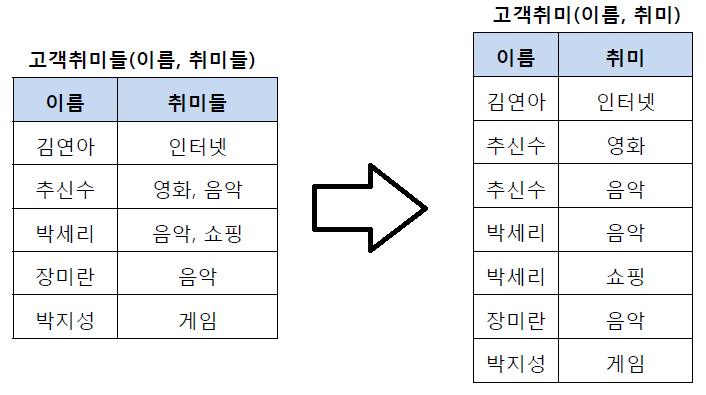

# 4.2 ERD와 정규화 과정

- ERD(Entity Relationship Diagram)는 데이터베이스 구축 시 가장 기초적인 뼈대 역할을 함
- 릴레이션 간의 관계들을 정의한 것
- 시스템 요구 사항을 기반으로 작성되며 ERD를 기반으로 DB를 구축함
- DB 구축 이후 디버깅 혹은 프로세스 재설계가 필요한 경우에 설계도 역할
- ERD 관계형 데이터 구조로 표현할 수 있는 데이터를 구성하는데 유용하다는 장점이 있지만 비정형 데이터를 충분히 표현할 수 없다는 단점이 있음

### 비정형 데이터

- 비구조화 데이터, 미리 정의된 데이터 모델이 없거나 미리 정의된 방식으로 정리되지 않은 정보

## 4.2.3 정규화 과정

- 관계형 데이터 모델에서 데이터의 중복성을 제거하여 이상 현상(Anomaly)을 방지하고, 데이터의 일관성과 정확성을 유지하기 위해 무손실 분해하는 과정
- 정규형 원칙을 기반으로 만들어감
- 정규화 된 정도는 정규형으로 표현

### 정규화의 목적

- 데이터 구조의 안정성 및 무결성 유지
  - 데이터 구성을 논리적, 직관적으로 한다(안정성)
  - 무결성 제약조건의 시행을 간단하게 한다(무결성)
- 효과적인 검색 알고리즘 생성
  - 다양한 관점에서의 쿼리를 지원할 수 있다.
- 불필요한 데이터 제거, 중복 배제, 이상 현상 방지

### 정규형 원칙

1. 정보 표현의 무손실: 같은 의미를 표현하는 릴레이션이지만 좀 더 좋은 구조로 만들어야 하며, 분해로 인한 정보 손실이 발생하지 않아야 한다.
2. 데이터 중복의 최소: 자료의 중복성은 감소해야 한다.
3. 분리의 원칙: 독립적인 관계는 별개의 릴레이션으로 표현해야 한다.

### 제 1정규형

- 릴레이션의 모든 도메인이 더 이상 분해될 수 없는 원자 값으로만 구성되야함
- 하나의 칸에는 하나의 데이터만 보관해야 한다

### 제 2정규형

- 제 1정규형 형태의 릴레이션에서 부분 함수의 종속성을 제거한 형태
- 기본 키가 아닌 모든 속성이 기본키에 완전 함수 종속적인 것
- 기본 키의 일부만 있어도 기본 키 외의 다른 속성이 결정되면 안된다

### 제 3정규형

- 제 2정규형 상태에서 기본 키가 아닌 모든 속성이 이행적 함수 종속을 만족하지 않는 상태
- A => B, B => C 를 통하여 A => C 인 상황이 아닌 상태

### 보이스/코드 정규형(BCNF)

- 결정자가 후보키가 아닌 함수 종속 관계를 제거하여 릴레이션의 함수 종속 관계에서 모든 결정자가 후보키인 상태
- 기존 3 정규형에서 데이터 중복을 발생시키는 종속성이 존재할 수 있기 때문에 사용
