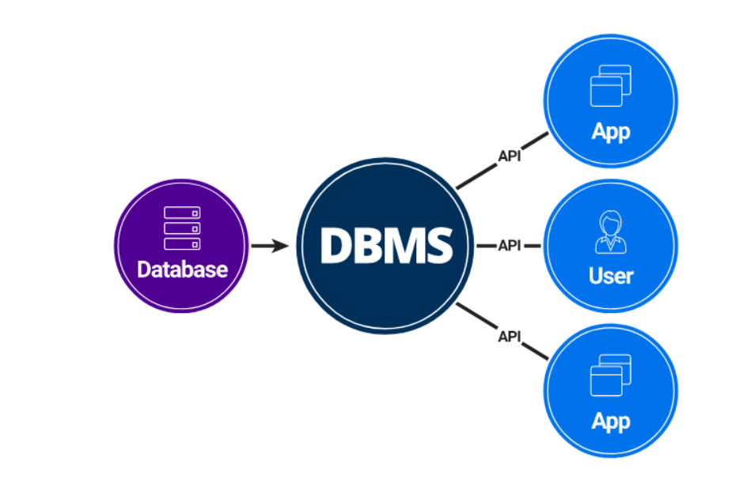
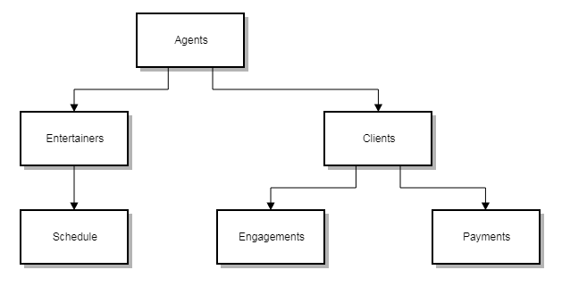

# 데이터베이스의 기본

- 데이터베이스는 일정한 규칙, 혹은 규악을 통해 구조화 되어 저장되는 데이터 모음
- 제어, 관리하는 통합 시스템을 DBMS(DataBase Management System)이라 함
- 특정 DBMS마다 정의된 쿼리 언어를 통해 삽입, 삭제, 수정, 조회 등이 가능
- 실시간 접근과 동시 공유가 가능

### 데이터베이스 특징

- 실시간 접근성 : 사용자의 질의에 대해 즉시 처리하여 응답
- 계속적인 진화 : CRUD(Create-생성, Read-읽기, Update-갱신, Delete-삭제)를 통해 항상 정확한 최신 데이터 동적 유지
- 내용에 의한 참조 : 데이터베이스에 있는 데이터 참조 시, 튜플의 주소나 위치가 아닌 사용자가 원하는 데이터 내용 참조
- 데이터 논리적 독립성 : 응용프로그램과 데이터베이스를 독립시킴으로써 데이터 논리적 구조를 변경하더라도 응용프로그램에 반영되지는 않음

### 데이터베이스 사용 목적

1. 데이터 공유와 접근 용이 : 여러 사람과 데이터 공유, 데이터 접근 편리
2. 일관성, 무결성, 보안성 : 데이터 중복 최소화, 신뢰할 데이터 사용
3. 데이터 표준화 : 다량의 데이터 연관하여 표준화 가능
4. 데이터의 논리적, 물리적 독립성 : 응용프로그램과 분리를 통해 각자 구축
5. 데이터 저장 공간 절약

## DBMS(DataBase Management System)

- 데이터베이스를 관리하고 운영하는 소프트웨어
- 특정 목적을 처리하기 위한 프로그램

| DBMS       | 작동 운영체제             | 제작사     |
| ---------- | ------------------------- | ---------- |
| MySQL      | Unix, Linux, Windows, Mac | Oracle     |
| MariaDB    | Unix, Linux, Windows      | MariaDB    |
| PostgreSQL | Unix, Linux, Windows, Mac | PostgreSQL |
| Oracle     | Unix, Linux, Windows      | Oracle     |
| SQL Server | Windows                   | Microsoft  |
| DB2        | Unix, Linux, Windows      | IBM        |
| Access     | Windows                   | Microsoft  |
| SQLite     | Android, iOS              | SQLite     |

### DBMS 종류

1. 계층형(Hierachical) 데이터베이스 관리 시스템

   

   - 계층적 데이터 베이스 구조로 상하 종속적인 관계를 가짐
   - 트리 형태 계층적 구조로 최상위 데이터부터 검색
   - 현재는 잘 사용하지 않음
     - 데이터 엑세스 속도가 빠르고 데이터 사용량을 쉽게 예측 가능 (장점)
     - 상하 종속적인 관계로 초기 세팅 후 변화하는 프로세스 수용이 어려움 (단점)

2. 망형(Network) 데이터베이스 관리 시스템

   - 데이터 구조를 네트워크상의 노드 형태로 논리적이게 표현한 모델
   - 각각 노드를 서로 대등한 관계로 구성
   - 현재 잘 사용하지 않음
     - 계층형데이터베이스 관리 시스템의 문제인 상하 종속적인 관계 해결 (장점)
     - 구성과 설계가 복잡하여 궁극적으로 데이터 종속성을 해결 못함 (단점)
