# 데이터베이스의 기본

- 데이터베이스는 일정한 규칙, 혹은 규악을 통해 구조화 되어 저장되는 데이터 모음
- 제어, 관리하는 통합 시스템을 DBMS(DataBase Management System)이라 함
- 특정 DBMS마다 정의된 쿼리 언어를 통해 삽입, 삭제, 수정, 조회 등이 가능
- 실시간 접근과 동시 공유가 가능

### 데이터베이스 특징

- 실시간 접근성 : 사용자의 질의에 대해 즉시 처리하여 응답
- 계속적인 진화 : CRUD(Create-생성, Read-읽기, Update-갱신, Delete-삭제)를 통해 항상 정확한 최신 데이터 동적 유지
- 내용에 의한 참조 : 데이터베이스에 있는 데이터 참조 시, 튜플의 주소나 위치가 아닌 사용자가 원하는 데이터 내용 참조
- 데이터 논리적 독립성 : 응용프로그램과 데이터베이스를 독립시킴으로써 데이터 논리적 구조를 변경하더라도 응용프로그램에 반영되지는 않음

### 데이터베이스 사용 목적

1. 데이터 공유와 접근 용이 : 여러 사람과 데이터 공유, 데이터 접근 편리
2. 일관성, 무결성, 보안성 : 데이터 중복 최소화, 신뢰할 데이터 사용
3. 데이터 표준화 : 다량의 데이터 연관하여 표준화 가능
4. 데이터의 논리적, 물리적 독립성 : 응용프로그램과 분리를 통해 각자 구축
5. 데이터 저장 공간 절약

## DBMS(DataBase Management System)

- 데이터베이스를 관리하고 운영하는 소프트웨어
- 특정 목적을 처리하기 위한 프로그램

| DBMS       | 작동 운영체제             | 제작사     |
| ---------- | ------------------------- | ---------- |
| MySQL      | Unix, Linux, Windows, Mac | Oracle     |
| MariaDB    | Unix, Linux, Windows      | MariaDB    |
| PostgreSQL | Unix, Linux, Windows, Mac | PostgreSQL |
| Oracle     | Unix, Linux, Windows      | Oracle     |
| SQL Server | Windows                   | Microsoft  |
| DB2        | Unix, Linux, Windows      | IBM        |
| Access     | Windows                   | Microsoft  |
| SQLite     | Android, iOS              | SQLite     |

### DBMS 종류

1. 계층형(Hierachical) 데이터베이스 관리 시스템

   

   - 계층적 데이터 베이스 구조로 상하 종속적인 관계를 가짐
   - 트리 형태 계층적 구조로 최상위 데이터부터 검색
   - 현재는 잘 사용하지 않음
     - 데이터 엑세스 속도가 빠르고 데이터 사용량을 쉽게 예측 가능 (장점)
     - 상하 종속적인 관계로 초기 세팅 후 변화하는 프로세스 수용이 어려움 (단점)

2. 망형(Network) 데이터베이스 관리 시스템

   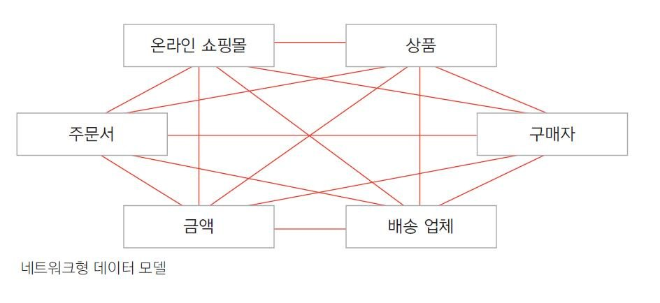

   - 데이터 구조를 네트워크상의 노드 형태로 논리적이게 표현한 모델
   - 각각 노드를 서로 대등한 관계로 구성
   - 현재 잘 사용하지 않음
     - 계층형데이터베이스 관리 시스템의 문제인 상하 종속적인 관계 해결 (장점)
     - 구성과 설계가 복잡하여 궁극적으로 데이터 종속성을 해결 못함 (단점)

3. 관계형 데이터베이스 관리 시스템

   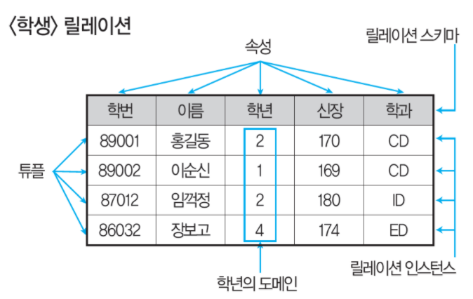

   - 데이터의 분류, 정렬, 탐색 속도가 빠름
   - 신뢰성이 높고 데이터 무결성을 보장
   - SQL이라는 언어로 관리가 가능하기에 DB의 종류 변화가 있어도 기존에 사용하던 애플리케이션은 사용 가능
   - 기존 작성된 스키마는 수정이 어려움

## 4.1.1 엔터티

- 속성을 지닌 명사를 의미

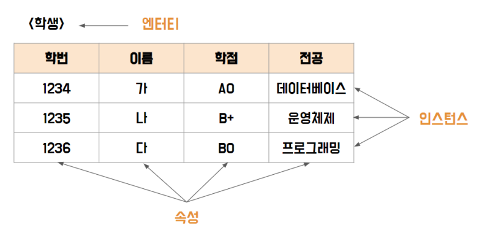

- 엔터티 안에는 인스턴스, 속성 이 존재

  - 인스턴스 : 데이터베이스에 저장된 데이터 내용의 전체 집합
  - 속성 : 인스턴스 구성요소로 더 이상 분리되지 않는 단위

- 유일한 식별자에 의해 식별이 가능해야함
- 두 개 이상의 인스턴스 집합체

## 4.1.2 릴레이션

- DB에 정보를 구분하여 저장하는 기본 단위
- 엔터티에 관련된 데이터를 릴레이션 하나에 담아서 관리

### 엔터티와 릴레이션 테이블 관계

- DB의 설계 단계에서는 엔터티(Entity)
- DBMS로 구현되는 단계에서는 테이블(Table)
- 개념 단계에서 엔터티간 연관관계를 릴레이션(Relation)이라함

## 4.1.3 속성

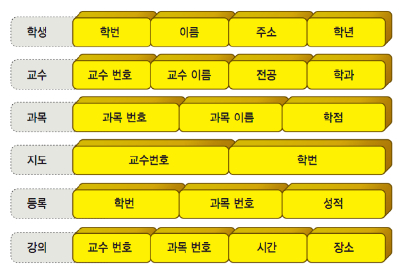

- 엔터티(릴레이션)이 가지고 있는 특징이나 성질

### 속성의 분류

| 종류        | 설명                                         |
| ----------- | -------------------------------------------- |
| 단일 속성   | 하나의 의미로 구성된 것 (ID, 이름)           |
| 복합 속성   | 여러개의 의미가 있는 것 (주소 => 시, 군, 동) |
| 다중값 속성 | 여러개의 값을 가지는 속성 (장바구니 등)      |

## 4.1.4 도메인

- 각각의 속성들이 가질 수 있는 값의 집합

## 4.1.5 필드와 레코드

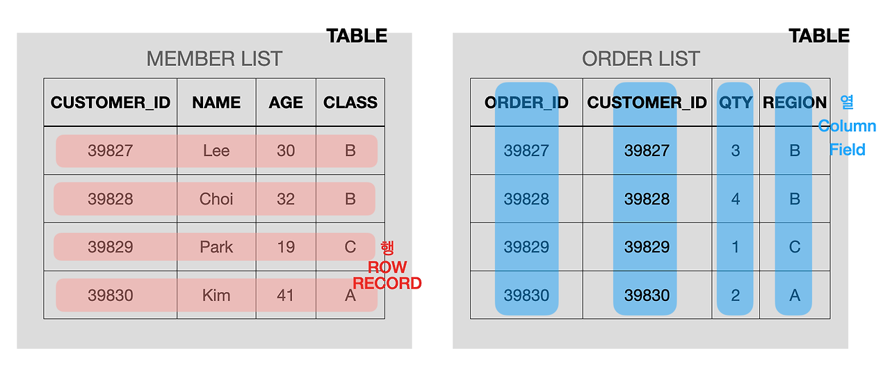

- 필드 : Column에 해당하는 가장 작은 데이터 단위 (엔터티의 속성)
- 레코드 : 논리적으로 연관된 필드의 집합

### 용어 정리

| 파일 시스템    | 데이터베이스 모델링 | 관계형 데이터베이스 |
| -------------- | ------------------- | ------------------- |
| 파일(File)     | 엔터티(Entity)      | 테이블(Table)       |
| 레코드(Record) | 튜플(Tuple)         | 행(Row)             |
| 키(Key)        | 유일값(Identifier)  | 기본키(Primary Key) |
| 필드(Field)    | 속성(Attribute)     | 열(Column)          |

### 필드 타입

- 숫자, 날짜, 문자 등 존재

#### 숫자

- TINYINT, SMALLINT, MEDIUMINT, INT, BIGINT

#### 날짜

- DATE, DATETIME, TIMESTAMP
  - DATE : 날짜는 존재하지만 시간이 없는 부분에 사용
  - DATETIME : 날짜및 시간 모두 포함 (8바이트 용량)
  - TIMESTAMP : 날짜 및 시간 모두 포함 (4바이트 용량)

#### 문자

- CHAR, VARCHAR, TEXT, BLOB, ENUM, SET
  - CHAR : ()를 사용하여 내부에 선언한 글자까지 입력가능 테이블 생성시 선언한 길이로 고정
  - VARCHAR : 가변 길이 문자열로 0 ~ 65,535 사이 값을 지정할 수 있음
  - TEXT : 큰 문자열 저장 (게시판 본문)
  - BLOB : 이미지, 동영상 등 큰 데이터 저장
  - ENUM : 단일 값 선택만 가능함 리스트 내에서
  - SET : 여러 개를 선택가능하며 비트 단위 연산이 가능

## 4.1.6 관계

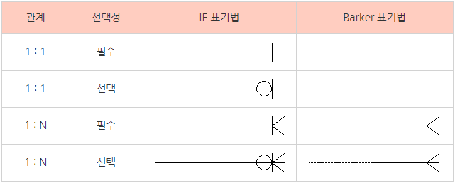

1. 1:1 관계

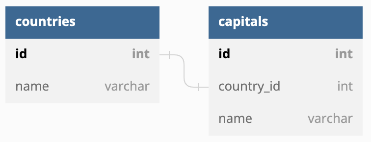

- A 테이블과 B 테이블 한 행이 일대일 매칭
  - 국가 - 수도 : 각 국가에는 하나의 수도가 있는 것
  - 배우자 - 배우자 : 한 사람은 한 명의 배우자를 가짐

2. 1:N 관계

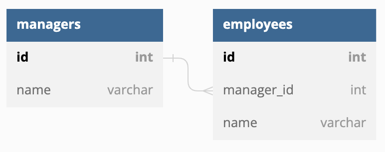

- A 테이블이 B 테이블 여러 행과 연결 되는 관계
  - 국가 - 도시 : 국가에 여러 도시가 존재
  - 부모 - 자식 : 한 쌍의 부모 아래 여러 자녀가 존재

3. N:M 관계

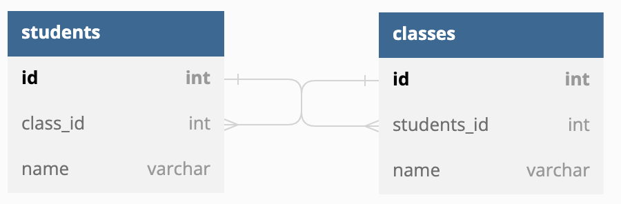

- 학생 - 강의 : 한 학생이 여러 강의를 수강할 수 있듯 강의도 여러명의 학생을 수용 가능함

## 4.1.7 키

- 기본키, 외래키, 후보키, 슈퍼키, 대체키 등 존재
- DB에서 각 행을 구분하는 유일한 식별자
- 유지, 검색, 수정, 삭제 등 작업에 중요한 역할

### 기본키

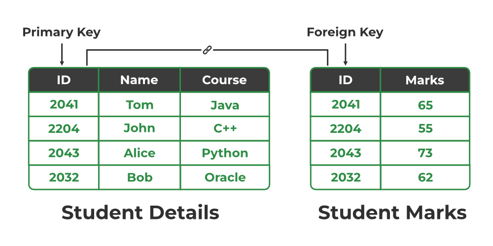

- 테이블 내에서 특정 행을 식별하기 위해 사용되고 중복 X
- NULL 값, 빈 값에 대해 허용하지 않음

### 외래키

- 두 개 이상의 테이블을 연결하는데 사용
- 하나의 테이블에서 다른 테이블의 키를 참조

### 후보키

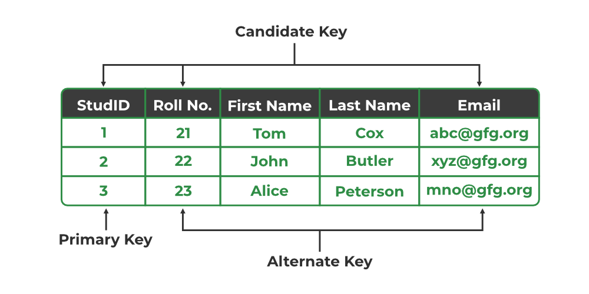

- 기본키로 선택되지 않은 키중 테이블 행을 식별할 수 있는 속성 또는 집합
- NULL 값, 빈 값에 대해 허용하지 않음
- 중복 값이 없어야 하고 고유성과 최소성을 만족해야 함

### 대체키

- 후보 키에서 기본 키를 제외한 집합

### 슈퍼키

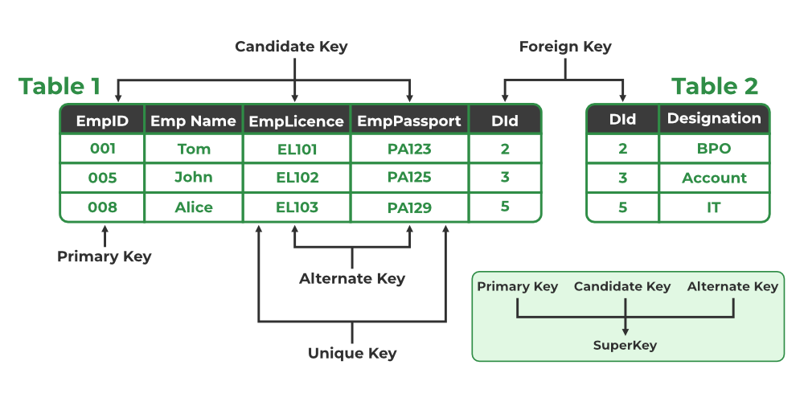

- 행을 고유하게 식별 가능한 모든 필드의 조합

### 전체 구조

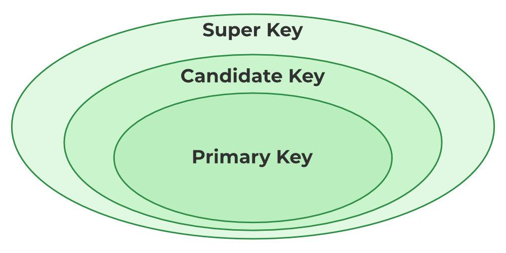
