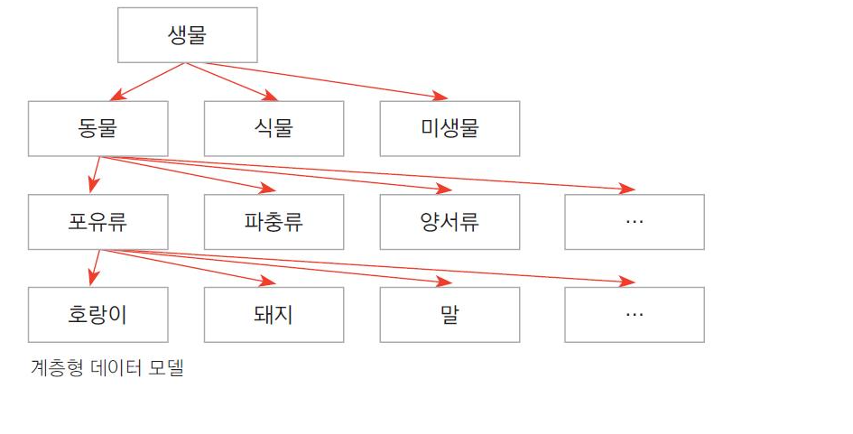
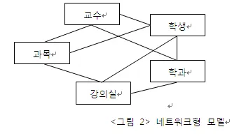
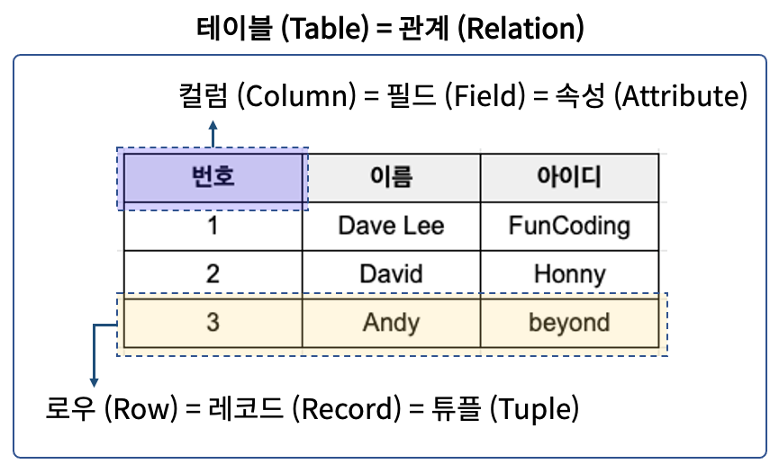
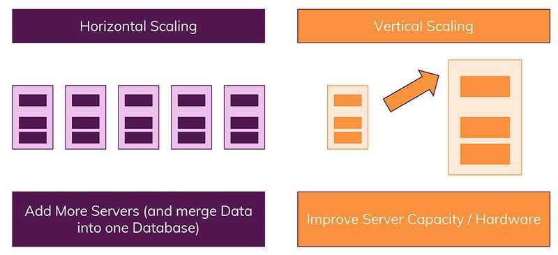
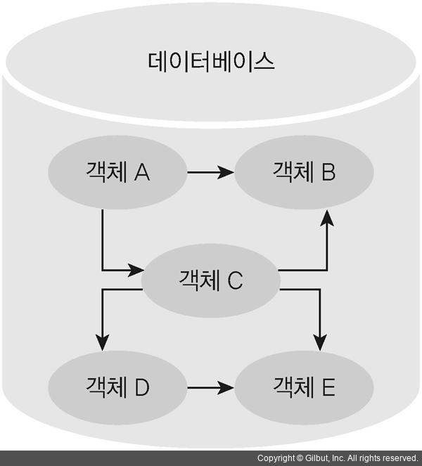

# 데이터베이스의 종류

- 계층형 데이터베이스(HDBMS)
- 네트워크형 데이터베이스(NDBMS)
- 객체지향 데이터베이스(ODBMS)
- 관계형 데이터베이스(RDBMS)
- NoSQL(Not Only SQL)

| 구분  | 모델                    | DBMS                                                              |
| ----- | ----------------------- | ----------------------------------------------------------------- |
| 1세대 | 파일 시스템             | - ISAM   - VSAM                                                |
| 2세대 | 계층형 데이터베이스     | - IMS   - System2000                                           |
| 3세대 | 네트워크형 데이터베이스 | - IDS   - TOTAL   - IDMS                                    |
| 4세대 | 관계형 데이터베이스     | - Oracle   - My-SQL   - DB2   - SQL Server   - Sybase |
| 5세대 | 객체지향 데이터베이스   | - Object Store   - UniSQL                                      |

## 계층형 데이터베이스

- 폴더와 파일 등 계층 구조로 데이터를 저장하는 방식
- 데이터 관계를 트리 구조로 정의, 부모-자식 형태를 가짐
- 종류 => 하드디스크, DVD, 파일 시스템 등

| 장점                      | 단점                                                     |
| ------------------------- | -------------------------------------------------------- |
| 데이터 액세스 속도가 빠름 | 상하 종속적인 관계로 초기 세팅 후 프로세스 수용이 어려움 |
| 데이터 사용량 쉽게 예측   | 　                                                       |

## 네트워크형 데이터베이스

- 데이터 구조를 네트워크상 노드 형태로 논리적이게 표현
- 각각 노드를 서로 대등한 관계로 구성

| 장점                                        | 단점                                          |
| ------------------------------------------- | --------------------------------------------- |
| 계층형 데이터베이스의 데이터 중복 문제 해결 | 추후 변경 시 복잡한 구조로 인해 변경이 어려움 |
| 상하 종속적 관계 해결                       | 　 데이터 종속성을 해결하지 못함              |

## 관계형 데이터베이스

- 행(Columne)과 열(Row)을 가지는 표 형식 데이터를 저장하는 데이터베이스
- 데이터 일관성과 무결성 보장
- SQL을 이용하여 관리 및 접근 (다른 데이터베이스 모델에 비해 학습이 쉽고, 데이터 처리 속도가 빠름)

| 장점                                          | 단점                                                        |
| --------------------------------------------- | ----------------------------------------------------------- |
| 다양한 용도로 사용 가능, 높은 성능            | 대량의 데이터 입력 처리가 힘듬                              |
| 데이터 무결성 보장, 높은 신뢰성               | 갱신이 발생한 테이블 인덱스 생성 및 스키마 변경이 어려움    |
| 명확한 스키마 정의                            | 컬럼 확장이 어려움 => 유연성이 부족하다                     |
| 정규화에 따른 갱신 비용 최소화                | 데이터베이스 부하 분석이 어려움                             |
| 데이터 분류, 정렬, 탐색 속도가 빠름           | 수평 확장의 어려움 => 수직 확장 방식 사용( CPU 업그레이드 ) |
| 관계를 통해 각 데이터를 중복없이 한 번만 저장 |                                                             |

### MySQL

- 전세계적으로 가장 널리 사용되고 있는 오픈소스 데이터베이스
- 무료, 처리되는 속도 빠름, 대용량 데이터 처리 가능, 보안이 뛰어남

#### 사용하는 이유

1. 소규모 ~ 대기업에 이르는 무엇이든 어디든 사용 가능
2. 빠름, 안정적, 사용하기 쉬움
3. 필요에 맞게 사용자가 정의할 수 있는 많은 기능 존재

#### 장점

- ACID 속성을 사용하며 여러 스토리지 엔진에서 트랜잭션 무결성 제공
- 기본 시스템 아키텍쳐 또는 스토리지 엔진에 대해 지식없이 SQL 인터페이스를 통해 데이터베이스 애플리케이션 구축 가능 ( 사용하기 쉽다는 얘기 )
- 복제를 지원하여 추가 개발 노력없이 지리적 분산된 데이터베이스 시스템을 만들 수 있다.
- 커뮤니티가 매우 커서 정보가 많다.
- 멀티 스레드 기반으로 동시 다발적 요청 처리 가능
- 다양한 스토리지 엔진이 존재하여 규모와 요구사항에 따라 적합한 데이터베이스 엔진을 사용하여 관리가능

#### 단점

- NoSQL 기반 데이터베이스에 비해 여러 고급 기능이 다소 부족할 수 있음
- 일부 복잡한 트랜잭션 관리의 경우 다른 RDBMS보다 관리 성능이 떨어지거나 유연하지 않음
- 대용량 데이터 처리에 있어서 한계가 존재
- 엔터프라이즈 환경에서 상업적 지원을 받기 위해 추가적 코스트 발생할 수 있음

##### **스토리지 엔진**

- 데이터베이스 관리 시스템이 데이터를 삽입, 추출, 업데이트 및 삭제 하는데 사용하는 기본 소프트웨어 컴포넌트 ( DB의 CRUD 담당 )

### PostgreSQL

- 복잡한 쿼리에 좋음
- 대용량 데이터 관리에 적합
- Catalog 기반으로 확장이 용이
- Table, Column 에 단순히 데이터를 저장만 하지 않고, 데이터 형식, 인덱스 형식, 함수형 언어를 정의
- NoSQL 및 다양한 데이터 형식 지원

## 객체지향 데이터베이스(ODBMS)

- 객체 그대로를 데이터베이스 데이터에 저장하는 것
- 멀티미디어 데이터 원활한 처리
- RDBMS의 비즈니스형 데이터 타입만 처리되는 제한적 극복

## NoSQL(Not Only SQL)

- Key - Value 형태로 저장되는 데이터베이스, 키를 사용해 데이터 관리 및 접근
- 스키마 없고 관계형이 없음
- Join이 없어서 데이터 가져올 때, 컬렉션에 저장된 데이터를 복제하여 필요한 데이터 일부만 가져옴
- 정확한 데이터 요구 사항을 알 수 없거나 관계를 맺는 데이터가 자주 변경될 때 사용
- 읽기는 자주하지만 데이터를 자주 변경하지 않는 경우 사용
- 비정형 데이터(메신저 텍스트, 음성, 이미지 등)

| 장점                                                                                | 단점                                                                                    |
| ----------------------------------------------------------------------------------- | --------------------------------------------------------------------------------------- |
| 스키마가 없어 유연하며, 언제든지 저장된 데이터를 조정하고 새로운 '필드'를 추가 가능 | 유연성으로 인해 데이터 구조를 결정하지 못하고 미루게 될 수 있음                         |
| 애플리케이션이 필요한 데이터 형식으로 저장되므로 읽는 속도가 빨라짐                 | 데이터 중복 처리가 힘듦                                                                 |
| 수직 및 수평 확장이 가능하므로 모든 읽기/쓰기 요청 처리가 가능                      | 데이터가 여러 컬렉션에 중복되기 떄문에, 수정을 해야하는 경우 모든 컬렉션에서 수정해야함 |

### Key-Value 기반

- Key - Value 기반 저장과 조회라는 가장 간단한 원칙에 충실한 데이터베이스
- 기본적 패턴으로 Key, Value가 한 묶음으로 저장되는 구조
- 단순한 구조이기에 속도가 빠르고 분산 저장 시 용이
- Key 내부에 (Column, Value) 형태로 된 여러 필드를 가짐
  - Key는 unique한 고유값으로 유지
  - 값에 모든 데이터 타입을 허용하기 때문에 데이터 입력 단계에서 검증 로직을 제대로 구현이 필요
  - 테이블간 조인을 고려하지 않기 떄문에 외래키가 필요없음

**사용 조건**

- 성능 향상을 위해 관계형 데이터베이스에서 데이터 캐싱
- 장바구니 같은 일시적 속성 추적
- 이미지나 오디오 파일 같은 대용량 객체 저장

**종류**

- Redis
- Riak
- Oracle Berkely
- AWS DynamoDB

### Document

- 확장성이 뛰어나며 빅데이터를 저장시 좋음
- 고가용성, 샤딩, 레플리카셋을 지원
- XML, JSON, BSON - 계층적 트리 데이터 방식으로 저장
- 집합적 데이터 모델 : 관계형 DB에서 여러개 테이블 데이터를 하나의 Document에 모아둘 수 있음
- 조회시 한번 조회로 필요한 데이터 획득 ( 유사 Join )
- Key - Value 상위느낌 ( Document 내에 Field 정의 )
- 데이터를 여러 서버에 분산 저장 가능하고, 복제와 회복이 가능한 형태 ( 장애 발생시 유리 )

**사용 조건**

- 대용량 데이터 읽고 쓰는 웹 사이트용 백엔드 지원
- 제품처럼 다양한 속성이 있는 데이터 관리
- 다양한 유형의 메타데이터 추적
- JSON 데이터 구조를 사용하는 애플리케이션
- 비정규화된 중첩 구조의 데이터 사용하는 애플리케이션
