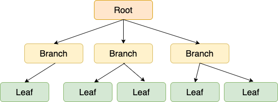
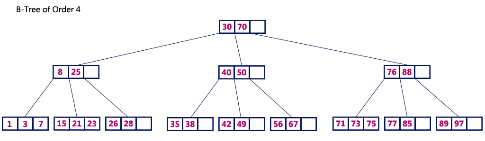

# 인덱스

- 데이터를 빠르게 찾기 위한 하나의 장치
- DBMS는 index를 항상 최신의 정렬된 상태로 유지해야 원하는 값을 빠르게 탐색할 수 있다.
- 전반적인 시스템 부하를 줄일 수 있다.
- 인덱스 관리를 위해 추가 작업이 필요하며, DB의 10%에 해당하는 저장공간이 필요
- 관리에 따라서 오히려 성능이 저하되는 역효과가 발생 => 기본적 이진 트리 구조로 형성

## 사용하기 좋은 경우

- 규모가 작지 않은 테이블
- INSERT, UPDATE, DELETE 가 자주 발생하지 않을 때
- JOIN이나 WHERE or ORDER BY 등 읽기나 조회 관련 테이블
- 데이터 중복도가 낮은 컬럼

## 4.5.2 B-트리

- 보통 DB의 인덱스를 구성하는 자료 구조
- 루트 노드, 리프 노드, 두 노드 사이의 브랜치 노드로 구분
  - 루트 노드 : 경로의 출발점
  - 리프 노드 : 실제 데이터가 저장되는 노드
- Balanced-tree를 의미하며 이진트리를 확장해 하나의 노드가 가질 수 있는 자식 노드 숫자가 2보다 큰 트리 구조
- 균형적인 트리구조로 성능이 안정화 된 특징
- 테이블이 갱신(INSERT/UPDATE/DELETE) 반복을 통해 균형이 깨지고 성능도 악화됨

## 4.5.3 인덱스 만드는 방법

- 클러스터형(Primary) 인덱스와 보조(Secondary) 인덱스가 존재

| 　          | Column B                         | Column C                           |
| ----------- | -------------------------------- | ---------------------------------- |
| 검색 속도   | 빠르다                           | 느리다                             |
| 사용 메모리 | 적다                             | 많다                               |
| 인덱스      | 인덱스가 주요 데이터             | 인덱스가 데이터의 사본             |
| 개수        | 한 테이블에 한 개                | 한 테이블에 여러 개                |
| 리프 노드   | 리프 노드 자체가 데이터          | 리프 노드는 데이터가 저장되는 위치 |
| 저장값      | 데이터를 저장한 블록의 포인터    | 값과 데이터가 저장되는 위치        |
| 정렬        | 인덱스 순서와 물리적 순서가 일치 | 인덱스 순서와 물리적 순서가 불일치 |

### 클러스터 인덱스(Primary Index)

- 특정 나열된 데이터들을 일정 기준으로 정렬해주는 인덱스
  - 클러스터형 인덱스 생성 시 데이터 페이지 전체가 다시 정렬
- 한 테이블에 한개씩만 만들 수 있음

### 보조 인덱스(Secondary Index)

- 논 클러스터 인덱스 (non-clustered index) 라고도 불림
- 후보키에만 부여할 수 있는 인덱스
- 데이터 페이지는 그대로 둔 상태에서 별도의 페이지에 인덱스를 구성
- 자동 정렬을 하지 않음
- 검색 속도는 클러스터보다 느리지만 수정, 삭제, 입력은 덜 느림
- 여러 개 생성할 수 있다

## 4.5.4 인덱스 최적화 기법

1. 인덱스는 무조건 다 사용하는 것이 아님
   - 리스트 => 컬렉션 순으로 탐색하기 때문에 읽기 비용이 듬
   - INSERT, DELETE, UPDATE 시 정렬, B-Tree 높이 조절 이러한 비용 소모
2. 항상 테스팅하여 시간을 최소화
   - 서비스 마다 객체 깊이, 테이블 양이 다름
   - 쿼리를 보낸 후 테스팅을 하며 걸리는 시간을 최소화 해야함
3. 복합 인덱스는 같음, 정렬, 다중값, 카디널리티 순으로 생성
   - 어떠한 값과 같음을 비교하는 == 이나 equal 쿼리가 있으면 제일 먼저 인덱스로 설정
   - 정렬에 쓰는 필드라면 그 다음 인덱스로 설정
   - 다중 값을 출력해야 하는 필드, 쿼리 자체가 > 이거나 < 등 많은 값을 출력해야 하는 쿼리에 쓰는 필드면 그 다음 인덱스로 설정
   - 카디널리티가 높은 순서를 고려해서 인덱스를 생성해야 한다. 예를 들어, age와 email이 있다면 email이 카디널리티가 높으므로 email 필드에 대한 인덱스를 age보다 먼저 설정

**카디널리티 : 특정 데이터 집합의 유니크(Unique)한 값의 개수**
