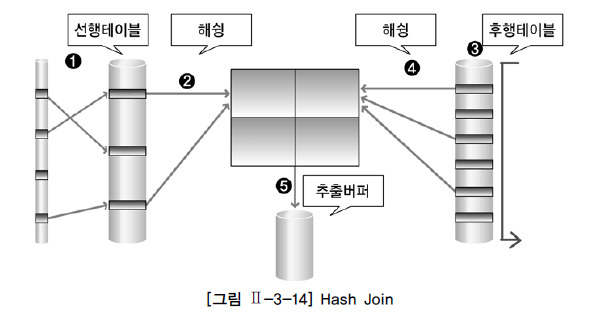

# 조인의 종류

- 데이터베이스에서 두 개 이상의 테이블을 연결하여 하나의 결과의 테이블로 만드는 것
- 테이블을 분리하여 데이터 중복을 최소화 하고 데이터 일관성을 유지하기 위해서
- INNER JOIN, LEFT JOIN, RIGHT JOIN, OUTER JOIN 존재

1. 내부 조인 : 왼쪽 테이블과 오른쪽 테이블 두 행이 모두 일치하는 행이 있는 부분만 표기
2. 왼쪽 조인 : 왼쪽 테이블의 모든 행이 결과 테이블에 표기
3. 오른쪽 조인 : 오른쪽 테이블의 모든 행이 결과 테이블에 표기
4. 합집합 조인 : 두 개의 테이블을 기반으로 조인 조건에 만족하지 않는 행까지 모두 표기

## 조인의 원리

- 중첩 루프 조인, 정렬 병합 조인, 해시 조인 을 기반으로 동작

### 중첩 루프 조인(Nested Loop Join)

- 중첩 반복문과 유사한 동작 방식으로 조인 수행
- 반복문 외부 테이블 => 선행 테이블, 외부 테이블
- 반복문 내부 테이블 => 후행 테이블, 내부 테이블

- 랜덤 액세스 방식으로 데이터를 접근하기 때문에 처리 범위가 작은 테이블에 유리

1. 선행 테이블 조건을 만족하는 첫 번째 행 접근
2. 선행 테이블의 조인 키 값을 가지고 후행 테이블의 인덱스를 거쳐 조인 수행
3. 1-2 반복

### 정렬 병합 조인(Sort Merge Join)

- 스캔 방식으로 데이터를 읽음
- 넓은 범위 데이터 처리할 때 이용하는 조인 방법
- 정렬 데이터가 많은 경우 메모리를 많이 사용하여 성능이 떨어질 수 있음
- 비동등 조인이 가능

1. 선행 테이블 조건을 만족하는 행을 찾음
2. 선행 테이블의 조인 키 기준으로 정렬
3. 1-2 작업을 선행 테이블의 만족하는 모든 행에 대해 반복
4. 후행 테이블에서 조건을 만족하는 행을 찾음
5. 후행 테이블의 조인 키 기준으로 정렬
6. 4-5 작업을 후행 테이블의 만족하는 모든 행에 대해 반복
7. 정렬된 결과로 조인을 수행 후 버퍼에 넣어 출력

### 해시 조인(Hash Join)

- 조인을 수행할 테이블의 조인 칼럼을 기준으로 Hash 함수를 수행
- 서로 동일한 Hash 값을 갖는 것들 사이에 실제 값이 같은지 비교

- Build : 작은 테이블(small row set을 갖는 테이블)의 조인 컬럼을 키 값으로, 해시 테이블을 만듬
- Probe : 큰 테이블의 조인 컬럼을 키 값으로 해시 테이블을 탐색하여 조인

- 메모리 사용 : 해시 테이블을 메모리 공간에 생성하기 때문에, 랜덤 I/O가 발생하지 않음
- 해시 테이블을 통한 탐색 : 해시 함수를 통해 키 값을 얻고, 해당 키 값으로 해시 테이블에서 데이터를 탐색하기 때문에 정렬 연산이 발생하지 않음
