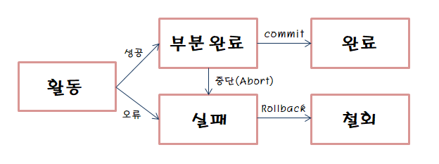
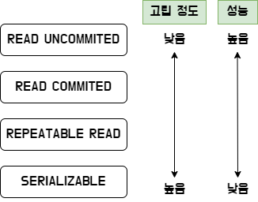

# 4.3 트랜잭션과 무결성

## 4.3.1 트랜잭션

- DB에서 하나의 논리적 기능을 수행하기 위한 작업의 단위
- 여러 쿼리를 하나로 묶는 것
- DB 응용프로그램은 트랜잭션의 집합
- 작업의 완전성을 보장해줌 => 논리적 작업들을 모두 완벽하게 처리하거나 또는 처리하지 못할 경우 이전 상태로 복구하여 일부만 적용되는 현상이 발생하지 않게 만들어줌
- ACID 특징을 가짐

## ACID

### 원자성(Atomicity)

- 트랜잭션의 연산은 데이터베이스에 모두 반영되든지 아니면 전혀 반영되지 않아야 한다.
- 트랜잭션 내의 모든 명령은 반드시 완벽히 수행되어야 하며, 모두가 완벽히 수행되지 않고 하나라도 오류가 발생하면 트랜잭션 전부 취소 되어야 한다.

#### 트랜잭션의 연산 및 상태

- Commit 연산
  - 한 개의 논리적 단위에 대한 작업이 성공적으로 끝났고 DB가 일관된 상태에 있을 때, 트랜잭션이 행한 갱신 연산이 완료된 것을 관리자에게 알려주는 것
- Rollback 연산
  - 트랜잭션 처리가 비정상적으로 종료되어 DB의 일관성을 깨뜨렸을 때, 트랜잭션 원자성을 구현하기 위해 행한 모든 연산을 취소

- 활동 : 트랜잭션이 실행
- 실패 : 트랜잭션 실행에 오류가 발생하여 중단된 상태
- 철회 : 트랜잭션이 비정상적으로 종료되어 Rollback 연산을 수행
- 부분 완료 : 트랜잭션의 마지막 연산이 실행됐고, Commit 연산이 실행되기 직전
- 완료 : 트랜잭션이 성공적으로 종료되어 Commit 을 실행한 후

### 일관성(Consistency)

- 트랜잭션 작업 처리 결과는 항상 일관성 있어야 한다
- 시스템이 가진 요소는 트랜잭션 수행 전과 수행 후의 상태가 같아야 한다는 말

### 독립성(Isolation)/격리성

- 둘 이상의 트랜잭션이 동시에 병행 실행되고 있을 때, 어떤 트랜잭션도 다른 트랜잭션 연사에 끼어들 수 없다.
- 수행중인 트랜잭션이 완전히 완료될 때까지 다른 트랜잭션에서 수행 결과를 참조할 수 없다.

#### 격리 수준

- **SERIALIZABLE**

  - 트랜잭션을 순차적으로 진행시키는 것
  - 여러 트랜잭션이 동일한 레코드에 동시에 접근할 수 없음

- **REPETABLE_READ**

  - 하나의 트랜잭션이 수정한 행을 다른 트랜잭션이 수정할 수 없도록 막음
  - 새로운 행을 추가하는 것은 막지못함
  - 팬텀 리드 발생

- **READ_COMMITTED**

  - 다른 트랜잭션이 커밋하지 않은 정보를 읽을 수 없음 ( 커밋 완료된 데이터에 대해서만 조회 )
  - 다른 트랜잭션이 수정했던 행을 수정할 수 있음
  - 팬텀 리드, 반복 가능하지 않은 조회 발생

- **READ_UNCOMMITTED**
  - 트랜잭션이 커밋되기 전에 다른 트랜잭션이 노출되는 문제가 있지만 속도가 매우 빠름
  - 팬텀 리드, 반복 가능하지 않은 조회 발생, 더티 리드 발생

#### 격리 수준에 따른 현상

- **팬텀 리드**

  - A 유저가 요청보낸 쿼리의 결과와 도중에 B 유저가 요청해서 수정한 후 조회한 결과가 다른경우
  - 조회해온 결과 행의 값이 다른 것

- **반복 가능하지 않은 조회**

  - 같은 트랜잭션 내에서 같은 데이터를 여러번 조회했을 때 읽어온 데이터가 다른 경우
  - 팬텀 리드 => 값의 변화 x / 반복 가능하지 않은 조회 => 조회하는 행 값 변화

- **더티 리드**
  - 특정 트랜잭션 데이터가 변경 되었지만, 커밋되지 않은 상황에서 다른 트랜잭션이 해당 변경 사항을 조회할 수 있는 문제
  - A 유저가 데이터 값을 변경 후 커밋하지 않았을 때 B 유저가 변경된 데이터를 읽어온 후 A 유저가 롤백을 할 경우 치명적임

### 지속성(Durability)

- 트랜잭션이 성공적으로 완료되었으면, 결과는 영구적으로 반영되어야 한다.

## 4.3.2 무결성

- 데이터의 정확성, 일관성, 유효성이 유지되는 것
- 메인 기능으로 데이터에 적용되는 연산에 제한을 두어 무결성을 유지

| 이름        | 설명                                                                                            |
| ----------- | ----------------------------------------------------------------------------------------------- |
| 개체 무결성 | 기본키로 선택된 필드는 빈 값을 허용하지 않는다                                                  |
| 참조 무결성 | 서로 참조 관계에 있는 두 테이블의 데이터는 항상 일관된 값을 유지해야 한다                       |
| 고유 무결성 | 특정 속성에 대해 고유한 값을 가지도록 조건이 주어지는 경우 그 속성 값은 모두 고유한 값을 가진다 |
| NULL 무결성 | 특정 속성 값에 NULL이 올 수 없다는 조건이 주어진 경우 그 속성 값은 NULL이 될 수 없다는 제약     |
