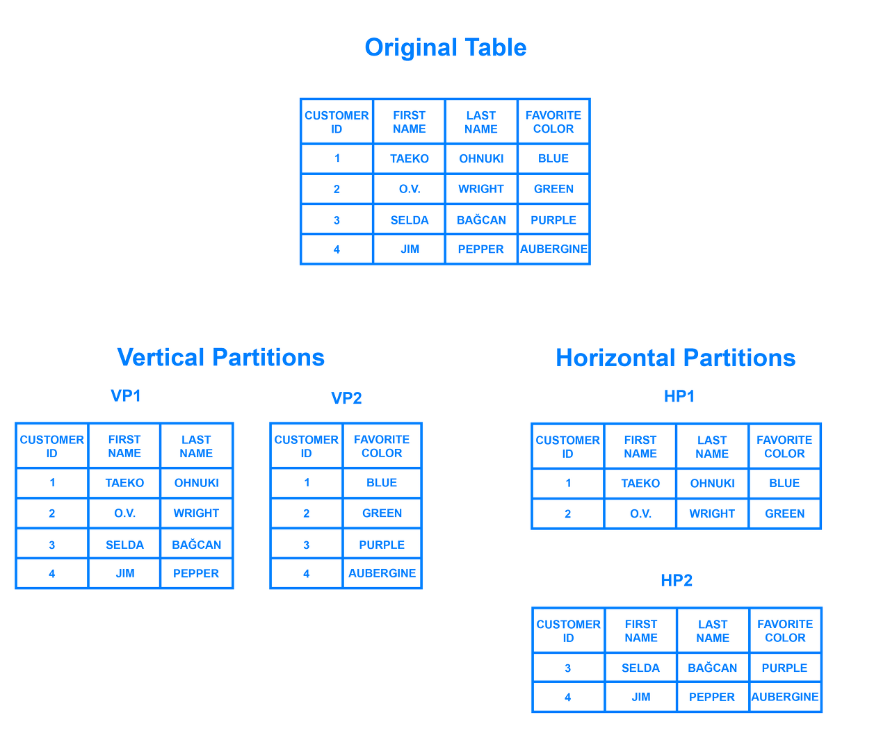
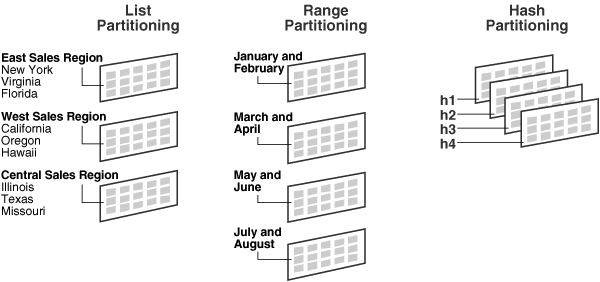
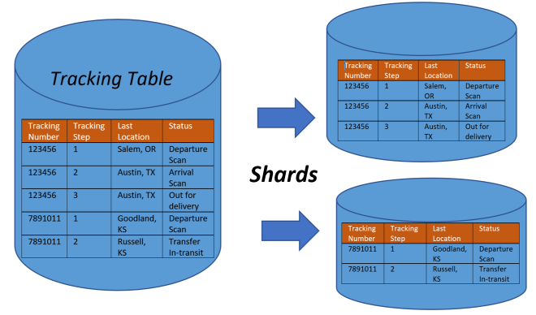
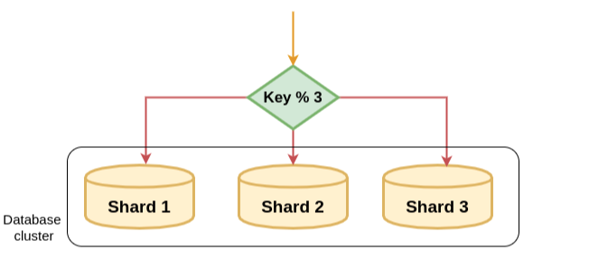
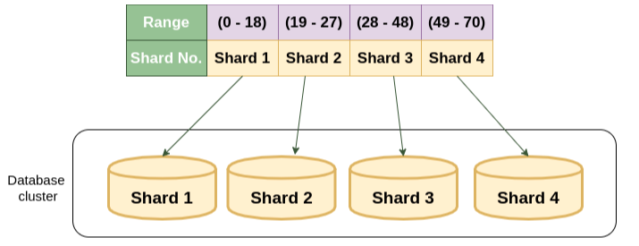
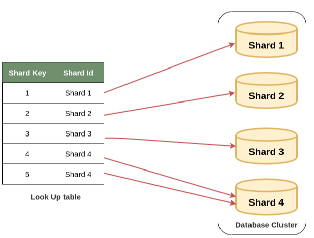

# 파티셔닝, 샤딩

- 데이터를 한 곳에 보관하면 관리 측면에서는 좋을지 몰라도 여러 문제가 발생함
- 데이터 베이스 용량 이슈 및 속도 저하, 이로 인한 CRUD 서비스 성능에 영향
- 데이터베이스를 작은 부분으로 나누어 분산 저장
- 단일 DB에서는 파티셔닝, 물리적으로 분리된 환경에서는 샤딩

## 파티셔닝(Partitioning)

- 쉬운 관리와 빠른 액세스를 위해 DB를 작은 부분으로 나눔
- 행이 아닌 데이터를 열로 구분하는 수직 분할이 포함
- 수평 분할의 경우 샤딩이랑 유사하지만 파티셔닝은 단일 DB에서 주로 사용된다는 차이점이 존재

### 수평 파티셔닝

- 데이터 개수를 기준으로 나누어 파티셔닝 함
- 데이터 개수와 인덱스 개수가 줄어들어 성능이 향상
- 데이터를 찾는 과정이 기존보다 복잡함

### 수직 파티셔닝

- 테이블의 일부 열을 뺴내는 형태로 분할
- 자주 사용하는 칼럼을 분리하여 성능을 향상
- 같은 타입의 데이터가 저장되어 데이터 압축률을 높임
- 조회 시 필요 없는 칼럼을 조회하지 않으므로 성능상 이점
- 데이터 찾는 과정이 기존보다 복잡

### 파티셔닝 범위

1. **범위 분할**
   - 연속적 숫자나 날짜를 기준으로 파티셔닝
   - 분할 키 값이 범위 내에 있는지 여부로
   - 우편 번호, 날짜 등의 데이터에 적합
2. **목록 분할**
   - 값 목록에 파티션을 할당 분할 키 값을 그 목록에 비추어 파티션을 선택
   - 특정 파티션에 저장될 데이터에 대한 명시적 제어가 가능하다
   - 분포도가 비슷하며, 많은 SQL에서 해당 칼럼의 조건이 많이 들어 오는 경우 유용
3. **해시 분할**
   - 파티션 키의 해시 값에 의하 파티셔닝이 이루어진다.
   - 균등한 데이터 분할이 가능
   - 해시 함수 값에 따라 파티션에 포함할지 여부를 결정
   - 파티션을 위한 범위가 없는 데이터에 적합

## 샤딩(Sharding)

- 대규모 데이터베이스를 샤드(Shard)라고도 하며 더 작고 관리하기 쉬운 조각으로 수평 분할해 데이터를 보관하는 방식
- 별도의 물리적 서버에 저장되며 데이터의 하위 집합을 포함
- 대규모 데이터베이스의 성능과 확장성을 개선 하는 것이 목표
- 여러 서버에 데이터를 분산하면 쿼리를 병렬로 실행할 수 있으므로 응답 시간이 빨라지며, 각 샤드의 크기가 작기 때문에 데이터를 더 쉽게 관리하고 백업할 수 있음

**문제점**

- 프로그래밍 복잡도 증가
- 데이터가 한 샤드로 몰릴 경우 무의미
- 잘 못 사용할 경우 위험도가 큼
- 한번 샤딩 사용시 샤딩 이전의 구조로 돌아가기 힘듦

### 샤딩 종류

1. 모듈러 샤딩(Modular Sharding)

- PK 를 모듈러 연산한 결과로 DB를 라우팅하는 방식
- 레인지 샤딩에 비해 데이터가 균일하게 분산
- DB를 추가 증설하는 과정에서 이미 적재된 데이터의 재정렬이 필요 => 데이터 증가에 따른 추가 샤딩이 필요한 경우 큰 부하 발생
- 데이터가 일정 수준에서 예상되는 데이터 성격을 가진곳에 적용할 때 어울림

2. 레인지 샤딩(Range Sharding)

- PK의 범위를 기준으로 DB를 특정
- 모듈러 샤딩에 비해 기본적으로 증설에 재정렬 비용이 들지 않음
- 일부 DB에 데이터가 몰릴 수 있음
- 적절한 Range 기준이 필요

3. 디렉토리 샤딩(Directory Sharding)

- 별도의 조회 테이블을 사용해서 샤딩을 하는 경우
- 샤딩에 사용되는 시스템이나 알고리즘을 사용할 수 있음
- 샤드를 동적으로 추가하는 것도 비교적 쉬움
- 모든 읽기 쓰기 쿼리 전에 조회 테이블을 참조해야 하므로 오버헤드가 발생할 수 있음

## 분산환경의 주의점

- 복잡성 증가 : DB를 분산할 경우 인프라에 복잡성을 추가하여 유지 및 관리가 어려워짐 => 분산 전략을 잘 수립해야함
- 데이터 일관성 : 여러 경로로 분할되기 때문에 일관성 문제가 일어날 수 있다.
- 제한된 유연성 : 수정된 스키마가 모든 분산환경에 동시에 반영되어야 하므로 새로운 기능 추가가 어려울 수 있음
- 인프라를 중간에 추가하거나 변경하는 작업은 고된 작업이거나 물리적으로 불가능할 수 있므로, 적절한 수요 예측과 사전 설계가 매우 중요
