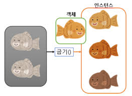
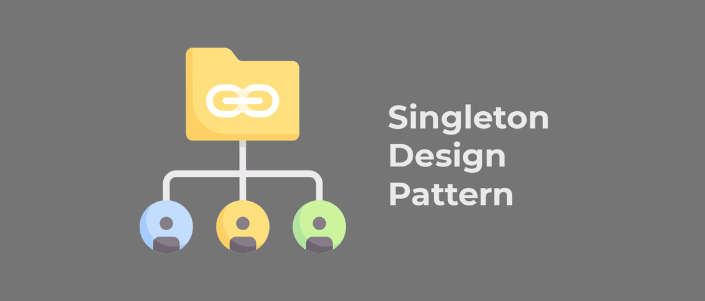
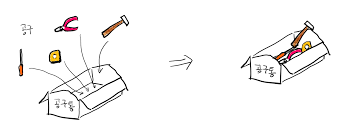
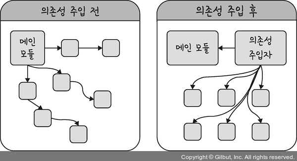

# 싱글톤 패턴

- 하나의 클래스에 오직 하나의 인스턴스만을 가지는 패턴
- 인스턴스란? => 일반적으로 실행 중인 임의의 프로세스, 클래스의 현재 생성된 오브젝트를 의미한다.

  

- 주로 데이터베이스 연결 모듈에 많이 사용된다.



- 하나의 인스턴스를 만들어 해당 인스턴스를 다른 모듈들이 공유하며 사용한다.

  - 인스턴스 비용이 줄어드는 장점
  - 의존성이 높은것이 단점

- 모듈이란? => 프로그램을 구성하는 구성 요소, 관련된 데이터와 함수를 하나로 묶은 단위

  

- 메모리 측면에서 절약을 할 수 있다.
- 데이터 공유가 쉽다.

## JavaScript 에서 싱글톤 패턴

- JS 에서는 리터럴 {} 혹은 new Objecdt로 객체를 생성하면 다른 객체와 같지않은 독립적인 싱글톤 패턴이 만들어진다.

```JS
   const obj = {
       a: 27
   }

   const obj2 = {
       a: 27
   }
   console.log(obj === obj)
   // false
```

- 다른 상황으로는 별도의 객체를 만들어 할당해주는 경우 같은 인스턴스를 가지게 된다.

```JS
    class Singleton {
        constructor() {
            if (!Singleton.instance) {
                Singleton.instance = this
            }
            return Singleton.instance
        }
        getInstance() {
            return this.instance
        }
    }

    const a = new Singleton()
    const b = new Singleton()
    console.log(a === b) // true
```

- 위와 같은 경우 한개의 클래스로 두 변수에 할당을 해주었기 때문에 같은 객체를 가리키게 되며 하나의 인스턴스를 가지게 된다.

- 이러한 활용은 주로 데이터베이스를 연결 모듈에 많이 사용된다.

```JS
    const URL = "http://localhost:5000/home"
    const createConnection = url => ({ "url" : url })
    class DB {
        constructor(url) {
            if (!DB.instance) {
                DB.instanec = createConnection(url)
            }
            return DB.instance
        }
        connect() {
            return this.instance
        }
    }

    const a = new DB(URL)
    const b = new DB(URL)
    console.log(a === b) // true
```

- 하나의 인스턴스를 기반으로 a, b 를 생성하여 비용을 아낄 수 있는 것을 확인할 수 있다.

## 싱글톤 패턴의 단점

- 싱글톤 패턴은 TDD(Test Driven Development)를 할 때 걸림돌이 된다.
- 단위 테스트를 주로하며 독립적으로 진행되는데 싱글 패턴의 경우 하나의 인스턴스를 기반으로 하기 떄문에 독립적으로 만들기가 어렵다.

## 의존성 주입

- 앞서 말한 단점에서 하나의 인스턴스를 기반으로 하기 때문에 모듈간의 결합이 강한 단점이 있다.
- 의존성 주입(DI, Dependency Injection)을 통해 모듈 간 결합을 느슨하게 만들어 해결할 수 있다. ( 의존성 = 종속성 )
- 의존성(종속성)이 있다는 것은 A가 B에 의존적인 경우 B의 변화에 있어서 A도 같이 변하는 것을 의미한다.
  ex. 얕은 복사를 생각하면 쉽게 이해할 수 있다.



- 위 그림과 같이 나타낼 수 있으며 메인 모듈이 "직접" 다른 하위 모듈에 대한 의존성을 주기 보다는 중간에서 "간접" 적으로 의존성을 주입하는 방식이다.

### 의존성 주입의 장점

- 모듈을 쉽게 교체할 수 있는 구조가 되어 테스팅이 쉽고 마이그레이션이 수월하다.
- 구현할 때 추상화 레이어를 넣고 기반으로 구현체를 만들기 때문에 애플리케이션 의존성 방향이 일관되고, 애플리케이션을 쉽게 추론할 수 있으며, 모듈간의 관계들이 좀 더 명확해진다.
- 낮은 결합도로 변경에 용이하고, 다른 객체와 협력 관계에 더 집중한다.

### 의존성 주입의 단점

- 모듈이 더 분리되어 클래스 수가 늘어나 복잡성이 증가한다.
- 약간의 런타임 패널티가 생긴다.

### 의존성 주입 원칙

- 상위 모듈은 하위 모듈에서 어떠한 것도 가져오지 않아야 한다.
- 둘다 추상화에 의존해야한다.
- 추상화는 세부 사항에 의존하지 말아야 한다.

## 의존성 주입 방법

1. 생성자 주입
2. 세터 주입

### 생성자 주입(Constructor Injection)

- 의존성 객체의 생성자를 통해 주입하는 방식
- 객체가 생성될 때 생성자를 통해 의존성 객체가 전달되어 초기화 된다.
- 객체 생성과 동시에 의존성이 해결되므로 의존성을 불변(immutable)하게 만들어 안정성을 높이는 장점

```Java
public class Student {
    private Teacher teacher;

    // 생성자 주입(Constructor Injection)
    public Student(Teacher teacher) {
        this.teacher = teacher;
    }

    public void askQuestion() {
        teacher.answer();
    }
}

public class Teacher {
    public void answer() {
        System.out.println("선생님이 답변합니다.");
    }
}

public class Main {
    public static void main(String[] args) {
        // Teacher 객체를 생성
        Teacher teacher = new Teacher();

        // Student 객체를 생성하면서 Teacher 객체를 생성자에 주입
        Student student = new Student(teacher);

        // Student가 선생님에게 질문
        student.askQuestion();
    }
}
```

- 선생님 클래스값이 변경되더라도 학생 클래스는 생성될 때마다 선생님 클래스를 받기때문에 유연하게 동작함

### 세터 주입(Setter Injection)

- 의존성 객체의 세터(setter) 메서드를 통해 주입하는 방식
- 객체 생성 후 세터 메서드를 호출하여 의존성 객체를 설정한다.
- 필요한 의존성을 동적으로 변경할 수 있는 유연성 제공

```Java
public class Student {
    private Teacher teacher;

    // 세터 주입(Setter Injection)
    public void setTeacher(Teacher teacher) {
        this.teacher = teacher;
    }

    public void askQuestion() {
        teacher.answer();
    }
}

public class Teacher {
    public void answer() {
        System.out.println("선생님이 답변합니다.");
    }
}

public class Main {
    public static void main(String[] args) {
        // Student 객체 생성
        Student student = new Student();

        // Teacher 객체 생성
        Teacher teacher = new Teacher();

        // Student의 세터 메서드를 호출하여 Teacher 객체를 주입
        student.setTeacher(teacher);

        // Student가 선생님에게 질문
        student.askQuestion();
    }
}
```

- 생성자 주입 방식과는 다르게 먼저 객체를 생성 후 setter 메서드를 통해 선생님 객체를 주입하는 방식으로 동작한다.
- 코드를 실행 중간 중간 다른 선생님 클래스로 주입할 수 있는 장점이 생긴다.
