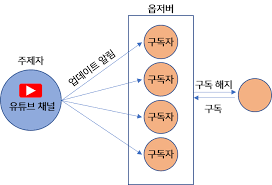
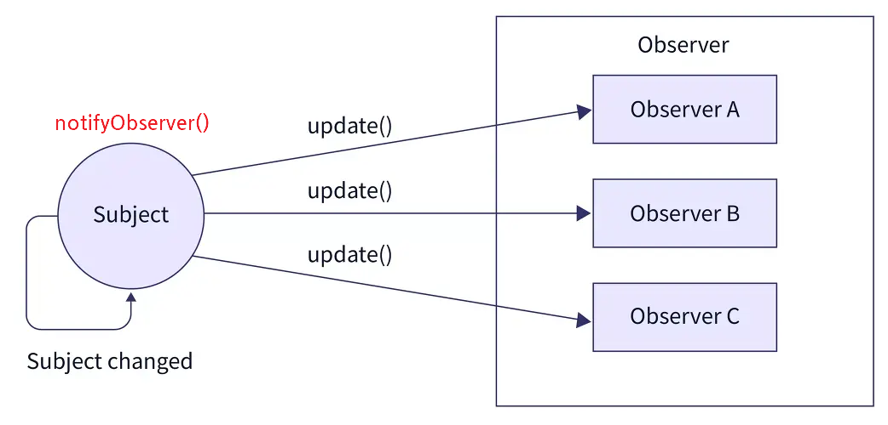
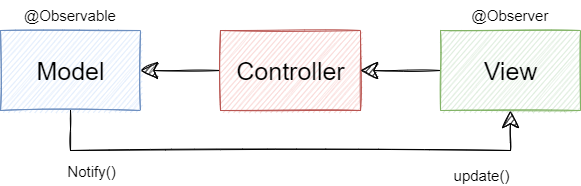

# 옵저버 패턴

- 주체가 어떤 객체의 상태 변화를 관찰하다가 상태 변화를 감지하여 목록에 있는 옵저버들에게 변화를 알려주는 패턴
- 주체는 객체의 상태 변화를 보고 있는 관찰자이다.
- 옵저버들은 객체의 상태 변화에 따라 전달되는 메서드 등을 기반으로 '추가 변화 사항'이 생기는 객체들을 의미한다.
- 일대다(one-to-many) 의존성을 가지는데, 분산 이벤트 핸들링 시스템을 구현하는 데 사용한다.



- 유튜브 영상을 구독해둔 구독자(Observer)들이 영상이 올라오면 알림을 받게된다.
- 패턴 구조로 구독자들은 구독함으로 채널의 변화가 생기게 되면 연락을 받아 탐지하는 것이다.
- 반대로 구독자(Observer)들의 행위로 인한 구독 해지는 알림이 가지 않는다.

## 옵저버 패턴 흐름

- 한개의 관찰 대상자(Subject)와 여러개의 관찰자(Observer A, B, C)로 일대 다 관계로 구성되어 있다.
- Observer 패턴에서는 관찰 대상 Subject의 상태가 바뀌면 변경 사항을 옵저버 한태 통보해준다. (notifyObserver)
- 대상자로부터 통보를 받은 Observer는 값을 바꿀수도 있고, 삭제하는 등 적절히 대응한다. (update)
- Observer들은 언제든 Subject의 그룹에서 추가/삭제 될 수 있다. Subject 그룹에 추가되면 Subject로부터 정보를 전달받게 될 것이고, 그룹에서 삭제될 경우 더이상 Subject 정보를 받을 수 없게 된다.



## 옵저버 패턴 특징

**패턴 사용 시기**

- 앱이 한정된 시간, 특정한 케이스에만 다른 객체를 관찰해야 하는 경우
- 대상 객체의 상태가 변경될 때마다 다른 객체의 동작을 트리거해야 할때
- 한 객체의 상태가 변경되면 다른 객체도 변경해야 할때 어떤 객체들이 변경되어야 하는지 몰라도 될 때
- MVC 패턴에서도 사용됨(Model, View, Controller)
  - MVC의 Model과 View 관계는 Observer 패턴의 Subject 역할과 Observer 역할의 관계에 대응된다.
  - 하나의 Model에 복수의 View가 대응한다.



### 패턴 장점

- Subject의 상태 변경을 주기적으로 조회하지 않고 자동으로 감지할 수 있다.
- 발행자의 코드를 변경하지 않고도 새 구독자 클래스를 도입할 수 있어 OCP 준수한다.
- 런타임 시점에서 발행자와 구독 알림 관계를 맺을 수 있다.
- 상태를 변경하는 객체(Subject)와 변경을 감지하는 객체(Observer)의 관계를 느슨하게 유지할 수 있다. (느슨한 결합)

### 패턴 단점

- 구독자는 알림 순서를 제어할수 없고, 무작위 순서로 알림을 받음
  - 하드 코딩으로 구현할수는 있겠지만, 복잡성과 결합성만 높아지기 때문에 추천되지 않는 방법이다.
- 옵저버 패턴을 자주 구성하면 구조와 동작을 알아보기 힘들어져 코드 복잡도가 증가한다.
- 다수의 옵저버 객체를 등록 이후 해지하지 않는다면 메모리 누수가 발생할 수도 있다.

## 자바스크립트에서의 옵저버 패턴

- 프록시 객체를 이용하여 어떠한 대상의 기본적인 동작(속성 접근, 할당, 순회, 열거, 함수 호출 등)의 작업을 가로챌 수 있는 객체
- 두 개의 매개변수를 가진다.
  - target : 프록시 대상
  - handler : 프록시 객체의 target 동작을 가로채서 정의할 동작들이 정해져 있는 함수

```JS
    const handler = {
        get: function(target, name) {
            return name === 'name' ? `${target.a} ${target.b}` : target[name]
        }
    }

    const p = new Proxy({a: 'KUNDOL', b: 'IS AUMUMU ZANGIN'}, handler)
    console.log(p.name) // KUNDOL IS AUMUMU ZANGIN
```

- p 변수에 name 이라는 속성을 선언하지 않았는데도 p.name으로 name 속성에 접근하려고 할 때 그 부분을 가로채 문자열을 만들어 반환
