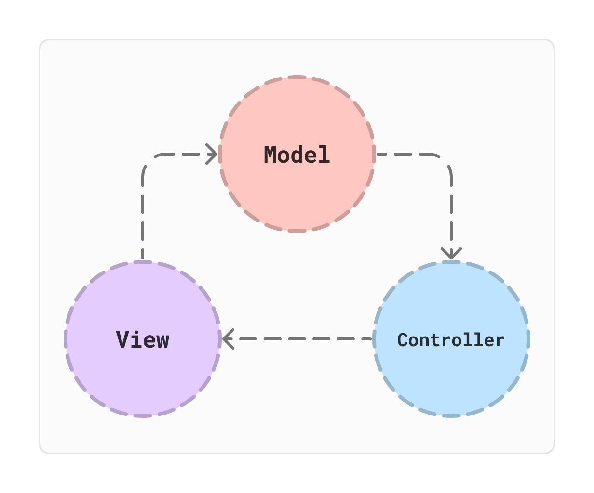
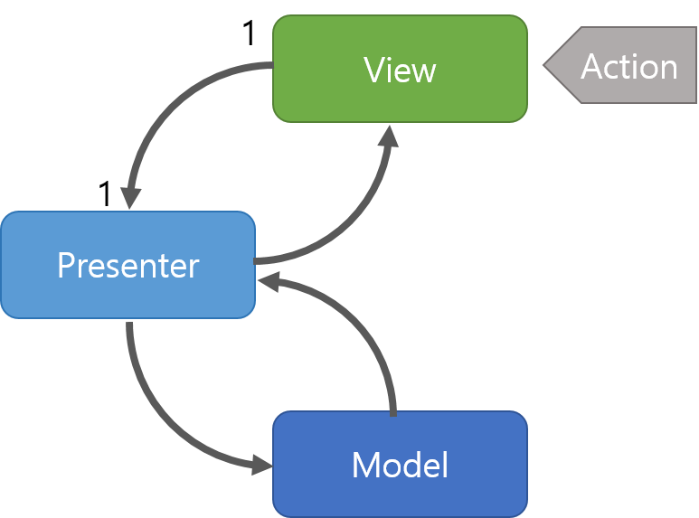
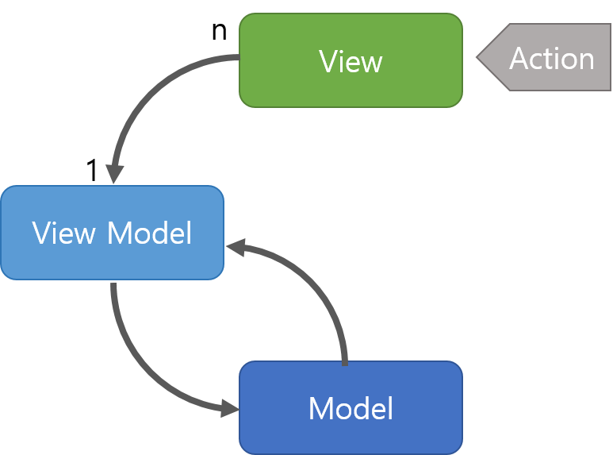

# 이터레이터 패턴

- iterator 한 요소들에 접근하는 패턴 => 반복기능 가능한 요소들에 접근한다고 보면 됨

# 노출모듈 패턴

- 전역 혹은 지역 등 접근 제어자를 만드는 패턴
- JS 의 경우 별도의 접근 제한자는 없고 전역에서 실행

```JS
const Test = (function() {
  let privateVar = 'I am private';

  function privateMethod() {
    console.log(privateVar);
  }

  function publicMethod() {
    console.log('This is a public method');
    privateMethod();
  }

  return {
    publicMethod: publicMethod // 공개할 메서드만 반환
  };
})();

Test.publicMethod()
```

### 용어

- 즉시 실행 함수

```JS
// 보통 함수 구조
function test() {
    console.log("hello")
}
test()
// 즉시 실행 함수
(function () {
    console.log("hi")
})()
```

- Public
  - 클래스에 정의된 함수에서 접근 가능, 자식 클래스와 외부 클래스에서 접근 가능
- Protected
  - 클래스에 정의된 함수에서 접근 가능, 자식 클래스에서 접근 가능하지만 외부에서는 불가능
- Private
  - 클래스에 정의된 함수에서 접근 가능하지만 자식과 외부에서 접근 불가능한 범위

# MVC 패턴



- Model, View, Controller 패턴
- 구성 요소를 세 가지 역할로 구분하여 각각 요소에만 집중해서 개발하는 것
- 재사용성과 확장성이 용이하지만 애플리케이션이 복잡할수록 모델과 뷰의 관계가 복잡한 단점이 있음

## 관계


1. 사용자의 요청을 Controller가 받음
2. Controller가 Service에 로직을 처리한 결과를 Model에 담음
3. Model에 저장된 결과를 바탕으로 시각적 요소를 담당하는 View를 제어하여 전달

- User : 사용자가 웹 사이트에 접속하는 것
- Manipulates : Controller는 사용자가 요청한 웹 페이지를 보여주기 위해 Model을 호출
- Updates : Model이 비즈니스 로직을 통해 DB 및 파일같은 데이터 제어 후 결과를 반환 View에 반영
- Sees : 데이터를 받아온 View가 사용자에게 웹 페이지를 출력하여 보여줌

## Model

- 데이터베이스, 상수 ,변수
- Controller에 받은 데이터를 조작하는 역할
- 사용자가 편집하길 원하는 모든 데이터를 가지고 있어야함
- View나 Controller에 대해서 어떤 정보도 모름
- 변경이 일어나면 변경 통지에 대한 처리방법을 구현 ( 알고리즘 적 로직 )

## View

- inputbox, checkbox, textarea 사용자 인터페이스 요소
- 데이터를 시각적으로 보여주기 위한 역할
- Model 정보를 따로 저장하면 안됨
- Model Controller에 대해 아무것도 모름
- 변경이 발생하면 변경결과에 대한 처리방법

## Controller

- 하나 이상의 모델과 하나 이상의 뷰를 잇는 다리
- 이벤트등 메인 로직을 담당
- 요청에 대한 로직을 처리한 후 Model에 저장하고 View에 전달
- Model 이나 View 의 변경을 모니터링함

# MVP 패턴



- Model, View, Presenter 구조를 가진 패턴

1. View를 통해 사용자 요청을 받음
2. Presenter에 데이터 요청
3. Presenter에서 Model에 데이터 요청 및 응답을 받음
4. 다시 Presenter에서 View에 데이터 응답
5. 렌더링

- View 와 1:1 관계이기 때문에 강한 결합을 지닌 패턴
- View 와 Model간 의존성이 없음

# MVVM 패턴



- Model, View, View Model 구조를 가짐

1. View를 통한 Action이 들어오면 Command 패턴으로 View Model에 요청을 보냄
2. View Model은 Model에 데이터 요청 받은 후 데이터를 받음
3. View Model은 응답받은 데이터를 가공 후 저장
4. View에서 View Model과 Data Binding하여 화면에 나타냄

- 뷰와 뷰모델 사이 데이터 바인딩을 통해 UI를 별도의 코드 수정없이 재사용 가능
