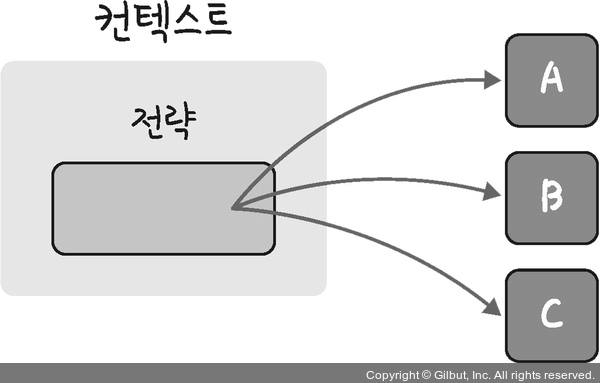
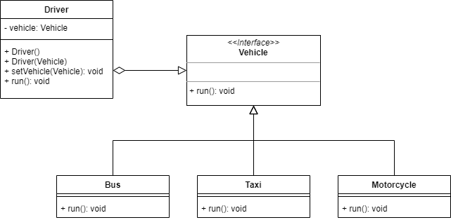

# 전략 패턴

- 정책 패턴(policy pattern)이라고도 하며 객체 행위를 바꾸고 싶은 경우 사용한다.
- '직접' 수정하지 않고 전략이라고 부르는 '캡슐화한 알고리즘'을 컨텍스트 안에서 바꿔주며 상호 교체가 가능하게 한다. ( 캡슐화 된 알고리즘이 상호교환이 가능하도록 함 )
- 특정 컨텍스트에서 알고리즘을 별도로 분리하는 설계 방법
- 객체가 할 수 있는 행위들 각각을 전략으로 만들어 놓고 사용하며, 동적으로 전략 수정이 가능한 패턴



## 전략 패턴 예시



```Java
    // Vehicle.java
    public interface Vehicle {
        public void run();
    }

    // Bus.java
    public class Bus implements Vehicle {

        @Override
        public void run() {
            System.out.println(x: "버스입니다.");
        }
    }

    // Taxi.java
    public class Taxi implements Vehicle {

        @Override
        public void run() {
            System.out.println(x: "택시입니다.");
        }
    }

    // Motorcycle.java
    public class Motorcycle implements Vehicle {

        @Override
        public void run() {
            System.out.println(x: "오토바이 입니다..");
        }
    }
```

- Vechicle 이라는 탈것 class를 생성하여 각각의 매체들을 캡슐화 시킨다.
- 각각 Bus, Taxi, Motorcycle 이라는 전략 객체 class를 만들어 Vechicle 인터페이스를 상속시켜준다.

```Java
    public class Driver implements Vehicle {
        private Vehicle vehicle;

        public Driver() {}

        public Driver(Vehicle vehicle) {
            this.vehicle = vehicle;
        }

        public void setVehicle(Vehicle vehicle) {
            this.vehicle = vehicle;
        }
    }

    @Override
    public void run() {
        if(vehicle == null) System.out.println(x:"걸어갑니다.");
        else vehicle.run();
    }
```

- 전략 객체들을 관리하는 컨텍스트 객체 클래스인 Driver를 생성하고 Vechicle 인터페이스를 상속시켜준다.

```Java
    // Main.java
    public class Main {
        public static void main(String[] args) {

            Driver driver = new Driver();
            driver.run()

            Vehicle bus = new Bus();

            driver.setVehicle(bus)
            driver.run();
        }
    }
```

- Main 이라는 코드를 만들어 앞서 만든 Driver 라는 전략 객체를 만들어 원하는 이동수단을 선택하여 움직일 수 있게 만들어준다.

### 전략 패턴의 장점

- 컨텍스트 코드의 변경 없이 새로운 전략을 추가할 수 있다.
- 요구사항이 변경되었을 때 기존 코드를 변경하지 않아도 된다.
- OCP 원칙을 준수할 수 있는 패턴이다.

### 전략 패턴의 단점

- 모든 상황에서 전략패턴이 사용되는 것이 유용하지 않다.
- 추상화기법이기 떄문에 단순한 경우에도 전략패턴을 사용해야하는 경우도 있다.
