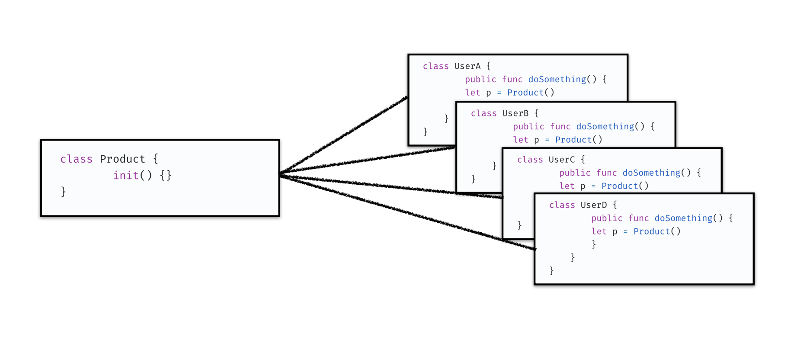
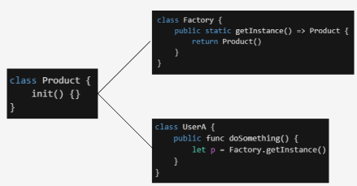

# 팩토리 패턴

- 객체 생성 부분을 떼어내 추상화한 패턴
- 상속관계에 있는 두 클래스에서 상위 클래스가 중요한 뼈대를 결정
- 하위 클래스에서 객체 생성에 관한 구체적 내용을 결정
- 상위, 하위가 나뉘어진 느슨한 결합을 가지기 때문에 더 많은 유연성을 가짐 => 유지 보수성 증가

## 왜 Factory Pattern이 필요한가?

- 객체 지향 디자인 패턴의 기본 원칙은 확장에 있어서는 열려 있어야 하며, 수정에 있어서는 닫혀 있어야 한다. (OCP, Open Closed Principle)
- 수정이 일어날 가능성이 큰 부분과 그렇지 않은 부분을 분리하는 것이 좋다.
- 객체는 속성과 함수가 변경, 추가 될 수 있고 이에 따라 객체 생성을 담당하는 코드 변경의 가능성이 높다.
- 객체 생성을 담당하는 클래스를 한 곳에서 관리하여 결합도를 줄이기 위해 팩토리 패턴이 등장함.

### 결합도가 높은 예시



- 위 그림과 같이 한 Product 에 여러 User 가 묶여있으며 Product 가 변경될 경우 많은 User에 영향을 주게 되며 이것을 결합도가 높다고 얘기한다.
- 이러한 사항을 방지하기 위해서 팩토리 패턴을 사용하여 결합도를 줄인다.

### 팩토리 메소드 패턴 예시



- 위 그림처럼 Factory class를 생성하여 Product를 관리해주는 식으로 구현한다.
- User의 입장에서는 Factory 클래스 인스턴스를 요청하기만 하면 Factory에서는 Product라는 클래스를 인스턴스로 리턴해준다.
- 이 과정에서 Product의 생성자가 변경될 경우 Factory 내부의 Product 생성자만 바꿔줘도 모든 User 가 쉽게 적용이 가능하다.

### Factory Method 의 장점

- 객체간 결합도를 낮출 수 있다.
- 단일 책임 원칙을 따르고 프로그램 코드에서 생성자 코드를 분리함으로써 코드를 간결하게 만들 수 있다.
- 개방 폐쇄 원칙을 따르고 기존 Client 코드를 파괴하지 않고 새로운 타입을 추가할 수 있다.

### Factory Method 의 단점

- 패턴을 구현할 많은 서브 클래스를 도입함으로써 코드가 복잡 해 질 수 있다.

### JS 에서의 팩토리 패턴

- 간단하게 new Object()로 구현이 가능하다

```JS
    const num = new Object(42)
    const str = new Object("ab")
    num.constructor.name; // Number
    str.constructor.name; // String
```

- 전달받은 값에 따라 다른 객체를 생성하며 인스턴스 타입 등을 정한다.

```JavaScript
// 예시

class Latte {
    constructor() {
        this.name = "latte"
    }
}

class Espresso {
    constructor() {
        this.name = "Espresso"
    }
}

class LatteFactory {
    static createCoffee() {
        return new Latte()
    }
}

class EspressoFactory {
    static createCoffee() {
        return new Espresso()
    }
}

const factoryList = { LatteFactory, EspressoFactory}

class CoffeeFactory {
    static createCoffee(type) {
        const factory = factoryList[type]
        return factory.createCoffee()
    }
}

const main () => {
    // 라떼를 주문한다.
    const coffee = CoffeeFactory.createCoffee("LatteFactory")
    // 커피 이름을 부른다.
    console.log(coffee.name) // latte
}
main()
```

- 위 예시를 보면 CoffeeFactory 상위 클래스가 뼈대를 결정하고 하위 클래스인 LatteFactory 가 구체적인 내용을 결정한다.
- LatteFactory에서 생성한 인스턴스를 CoffeeFactory에 주입하는 것처럼 보이며 '의존성 주입' 이라고도 한다.
- 정적 메서드를 쓰면 클래스의 인스턴스 없이 호출이 가능하여 메모리를 절약할 수 있고 개별 인스턴스에 묶이지 않고 클래스 내의 함수를 정의할 수 있다.
