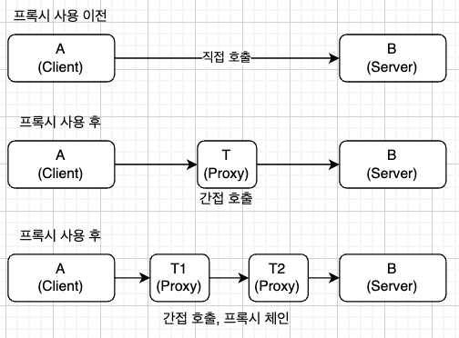
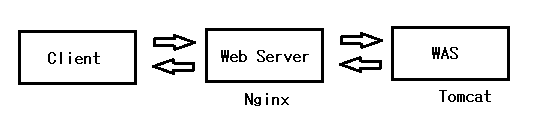

# 프록시 패턴과 프록시 객체

- 대상 객체에 접근하기 전 그 접근에 대한 흐름을 가로채는 것
- 객체의 속성 변화, 보안, 데이터 검증, 캐싱, 로깅 등에 사용
- 캐시안에 정보를 저장 후 캐시 안에 있는 정보를 요규하는 요청에 대해 내부에서 처리

## 프록시 서버

- 클라이언트가 자신을 통해 다른 네트워크 서비스에 간접적 접속할 수 있게 하는 프로그램( 중계기 역할 )
- 보통 nginx 사용하며 비동기 이벤트 기반의 구조 및 다수의 연결을 효과적으로 처리가능한 웹 서버

### nginx

- 비동기 이벤트 기반의 구조와 다수의 연결을 효과적으로 처리 가능한 강력한 웹 서버

- 프록시 서버 및 로드 밸런서로 활용
- Event-Driven 구조로 한 개의 프로세스만 생성하여 사용하며 어떠한 일에 대해 반응이 발생하는 구조

## CloudFlare

- CDN(Content Delivery Network) 및 보안 서비스
- 서버 네트워크를 통해 웹 사이트 콘텐츠 보안 담당
- DDOS 공격 방어 및 HTTPS 구축
- Nginx 앞단에 위치하여 Nginx로 향하는 트래픽 조절 캐싱을 통한 관리
- SSL 인증서 사용

## CORS

- Cross-Origin Resource Sharing => 개발할때 자주 마주침 다른 주소에서 접근을 막는 자체적 보안
- 포트번호가 달라도 CORS 에러 발생
- 프록시 서버를 통해서 앞단에서 요청하는 포트 번호를 뒷단에서 요구하는 번호로 변경하거나 방법이 여러개 존재
