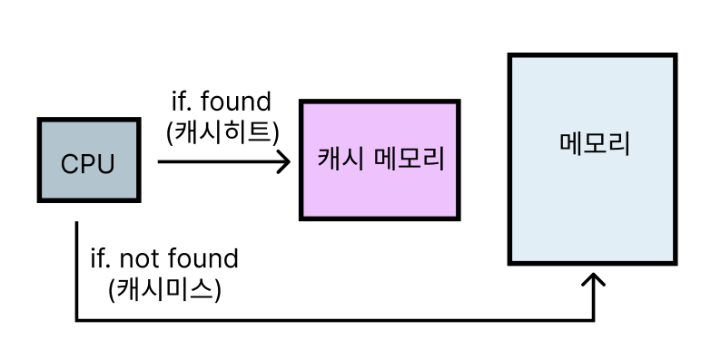

# 메모리

- 여러가지 기억장치를 필요에 따라 속도, 용량, 성능에 따라 계층적으로 나누어 둔 것을 의미

### 3.2.1 메모리 계층

- 레지스터, 캐시, 메모리, 저장장치 존재

- 레지스터 : CPU 안에 있는 작은 메모리, 휘발성, 가장 속도가 빠름, 용량이 작음
- 캐시 : L1, L2 캐시를 지칭, 휘발성, 속도 빠름, 기억 용량이 적음
- 주기억장치 : RAM을 가리킴, 휘발성, 속도 중간, 기억 용량 보통
- 보조기억장치 : HDD, SDD 휘발성, 속도 낮음, 기억 용량 많음

- 레지스터와 캐시는 CPU 내부에 존재하고 CPU 접근이 빠름

#### 보조기억장치

- 물리적 디스크가 연결된 기억장치
- 주기억장치보다는 느리지만 데이터가 사라지지않고 영구적으로 보관됨

##### HDD(Hard Dist Driver)

- 물리적 디스크를 고속으로 회전시켜 데이터를 저장
- 충격에 약하며 소음이 다소 발생

##### SDD(Solid State Driver)

- 반도체 기반의 정보 저장 장치
- 전기적으로 데이터를 저장하기 때문에 HDD에 비해 속도가 월등히 빠르고 소음도 발생하지 않음
- 전력소모가 적고, 경량화, 소형화 가능

#### 주기억장치

- 컴퓨터 내부에 현재 CPU가 처리하는 내용을 저장하는 장치

##### RAM(Random Access Memory)

- 읽고 쓰기가 가능하고 응용 프로그램, 운영체제 등을 불러와 CPU가 작업할 수 있도록 하는 장치
- 데이터 읽는 속도와 기록 속도가 같고 프로그램을 로딩 혹은 데이터를 임시 저장하는 곳에 사용
- 휘발성 메모리로 전원이 끊기면 데이터가 날라감

##### ROM(Read Only Memory)

- 비휘발성 메모리로 전원이 끊겨도 데이터가 기록되지만 기억된 데이터를 읽기만 가능

##### 주기억장치 구조

**코드**

- 실행할 프로그램 코드가 저장되는 영역으로 텍스트 영역 ( CPU는 여기서 저장된 명령어를 하나씩 가져와서 처리 )

**데이터 영역**

- 프로그램의 시작과 동시에 할당되며, 프로그램이 종료되면 소멸한다. 전역변수(Global Variable), 정적변수(Static Variable), 배열(Array), 구조체(Structure) 등이 저장되는 영역

**힙 영역**

- 사용자가 직접 관리하는 메모리 영역
- 주소값에 의해 참조만 되고 참고타입에 대한 저장 공간

**스택 영역**

- 지역 변수, 매개변수, 메소드, return 값 등이 저장되는 영역
- 프로그램이 자동으로 사용하는 임시 메모리 영역으로 함수 호출이 완료되면 소멸한다.

###### 스택(Stack) vs 힙(Heap) 영역

- Heap: 힙은 메모리 위쪽 주소부터 할당(낮은 주소→높은주소)한다.
- Stack: 스택은 메모리 아래쪽부터 할당(높은 주소→낮은 주소)한다.
- Stack/Heap Overflow: 이렇게 서로 다른 시작점에서 할당되다가 서로 겹치는 것을 Stack/Heap Overflow라고 한다.

#### 캐시

- 자주 사용하는 데이터 값을 미리 복사해 놓는 임시 저장소
- 대량의 연산 혹은 많은 시간이 필요한 작업에 결과를 저장
- 빠른 속도로 인해 중간에 레지스터 계층을 통해 속도 차이를 해결

##### 캐시의 작동 원리

- 일반적으로 RAM(Random Access Memory)과 같이 빠르게 액세스 가능한 하드웨어에 저장
- 기본 스토리지 계층(SSD,HDD)에 액세스하여 데이터 가져오는 느린 작업 요구를 줄이고 검색 성능을 높임
- 데이터 하위 집합을 일시적으로 저장

**시간 지역성**

- 최근에 사용한 데이터에 다시 접근하려는 특성
- for, while 반복문에 사용되는 데이터들은 참조 가능성이 높기 때문에 다시 저장

**공간 지역성**

- 최근 접근한 데이터를 이루는 공간이나 가까운 공간에 접근하는 특성

##### 캐시히트와 캐시미스

- 원하는 데이터를 찾으면 캐시히트라고 하며, 데이터가 없으면 메모리로 가서 데이터를 찾는것이 캐시미스라고 한다.

- 캐시히트는 CPU 내부 버스를 기반으로 작동하기 때문에 빠르지만 캐시미스는 메모리에서 가져오기 때문에 시스템 버스를 기반으로 작동하기 때문에 느리다.

##### 캐시매핑

- 캐시히트가 되기 위해 매핑하는 방법

| 이름                                    | 설명                                                                                                              |
| --------------------------------------- | ----------------------------------------------------------------------------------------------------------------- |
| 직접 매핑(directed mapping)             | 메모리가 1~100이 있고 캐시가 1~100이 있으면 1:1~10, 2:1~20 등 직접 매칭하는 것을 의미 속도가 빠르지만 충돌이 잦음 |
| 연관 매핑(associative mapping)          | 순서를 일치시키지 않고 관련 있는 캐시와 메모리를 메핑, 충돌이 적지만 모든 블록을 탐색해야 해서 속도가 느림        |
| 집합 연관 매핑(set associative mapping) | 직접 매핑과 연관 매핑을 합친 것,순서는 일치시키지만 집합을 둬서 저장하며 블록화되어 있기 때문에 검색은 더 효율적  |

#### 쿠키

- 만료기한이 있는 Key-Value 저장소
- 요청과 응답만이 존재했던 HTTP 웹세계에 이전에 서버와 클라이언트가 주고 받은 내역을 기억하고 불러올 수 있는 역할

##### 쿠키 동작 원리

- 클라이언트가 서버에 HTTP 요청
- 서버가 HTTP 응답시 set-cookie를 통해 쿠키 생성하여 전달
- 클라이언트는 이제부터 매 HTTP Request시 HTTP Header에 쿠키담아서 전송
- 만료 기간 전이라면, 쿠키는 브라우저에 저장되어 있으며, 항상 요청시 사용 가능
- 만료됬다면, 클라이언트가 새로 서버에 요청하여 쿠키 새로 발급

##### 쿠키 장단점

- 장점

  - 대부분 브라우저가 지원
  - 데이터 유효기간 지정 가능
  - XSS(사이트간 악성 JS 코드 심는 것)으로 부터 안전

- 단점
  - 매우 작은 데이터 용량 (4kb)
  - 매번 서버에 HTTP 요청이 같이 전달되어 서버에 부담
  - CSRF 위협
  - 문자열만 저장 가능

#### 웹 스토리지

- 로컬 스토리지와 세션 스토리지 존재
- Key-Value 쌍으로 데이터 저장
- HTML5 부터 클라이언트에 데이터를 저장할 수 있도록 하는 데이터 저장소

##### 웹 스토리지 장단점

- 장점

  - 서버에 불필요하게 데이터 저장 하지 않음
  - 넉넉한 데이터 저장 용량 (모바일: 2.5MB, 데스크탑: 5~10MB)
  - 문자열 외에도 자바스크립트의 모든 원시형 데이터와 객체 저장 가능
  - 도메인 단위로 접근이 제한되는 CORS 특성 덕분에 CSRF로부터 안전

- 단점
  - HTML5 지원하는 브라우저만 사용 가능
  - XSS 위험성 존재

**로컬 스토리지**

- 지속적으로 필요한 데이터 저장이 필요할 때

**세션 스토리지**

- 일시적 필요한 데이터 저장이 필요할 때

### 3.2.2 메모리 관리

- 컴퓨터 내의 한정적인 메모리를 극한으로 관리하는 것
- 프로세스 실행 전후 메모리 할당 및 할당을 해제
- 프로세스 실행하는 동안 데이터 무결성 유지

#### 가상 메모리

- 컴퓨터가 실제로 이용 가능한 메모리 자원을 추상화 하여 사용자들에게 큰 메모리로 보이게 함
- 당장 실행에 필요한 부분은 주기억장치에 넣고 나머지 부분을 보조기억장치에 넣어둔다

#### 동적 적재

- 프로그램 실행에 반드시 필요한 루틴과 데이터만 적재

#### 동적 연결

- 라이브러리 루틴연결을 컴파일 시점이 아닌 실행 시점까지 미루는 것

#### 스와핑

- CPU에서 실행중이지 않는 프로세스는 저장장치 Swap 영역으로 이동하여 메모리 확보
- 문맥 교환으로 인해 오버헤드가 발생할 수 있고 속도가 느려지지만 데이터 확보는 효율적

#### 페이지 폴트

- 주소 공간에는 존재하지만 컴퓨터 RAM에는 없는 데이터 접근시 발생

1. CPU가 물리 메모리를 확인하여 해당 페이지가 없으면 트랩을 발생해서 운영체제에 전달
2. CPU 동작을 잠시 멈춤
3. 페이지 테이블을 확인하여 가상 메모리에 페이지 존재여부를 체크
4. 없으면 프로세스를 중단 후 물리 메모리에 비어있는 프레임을 찾고 물리 메모리에도 없으면 스와핑이 발생
5. 비어있는 프레임에 해당 페이지를 로드 후 테이블을 최신화
6. 중단된 CPU를 다시 시작

#### 스레싱

- 메모리의 페이지 폴트율이 높은 것을 의미
- 컴퓨터의 성능 저하를 초래
- CPU 이용률이 저하되고 운영체제는 CPU 이용률이 낮은 것을 바탕으로 가용성을 높이기 위해 메모리를 더 사용할려고함
- 페이지 상한선과 하한선을 만들거나 미리 메모리에 로드하는 방식으로 해결

#### 메모리 할당

- 프로그램을 할당할 때는 시작 메모리 위치, 할당 크기를 기반으로 할당하며 불연속 할당과 연속 할당으로 나뉨

##### 연속 메모리 할당

- 프로세스를 메모리에 연속적으로 할당하는 기법
- 고정 분할 방식과 가변 분할 방식이 나뉨

**고정 분할 방식**

- 메모리를 미리 나누어 관리
- 융통성이 없고 내부 단편화가 발생 => 크기가 메모리보다 커서 들어가는 공간이 없는 것

**가변 분할 방식**

- 프로그램의 크기에 맞게 동적으로 메모리를 나눠 사용
- 외부 단편화 발생 => 크기를 나눴지만 나눈 크기보다 한개의 프로그램 크기가 큰 경우

| 이름     | 설명                                               |
| -------- | -------------------------------------------------- |
| 최초적합 | 위쪽이나 아래부터 시작해 홀을 찾으면 바로 할당     |
| 최적적합 | 프로세스 크기 이상인 공간 중 가장 작은 홀부터 할당 |
| 최악적합 | 프로세스 크기와 가장 많이 차이가 나는 홀에 할당    |

##### 불연속 할당

- 메모리를 동일한 크기의 페이지로 나누어 프로그램 마다 페이지 테이블을 두어 메모리에 프로그램을 할당하는 것

**페이징**

- 논리 메모리는 고정크기의 페이지, 물리 메모리는 고정크기의 프레임 블록으로 나누어 관리
- 프로세스가 사용하는 공간을 논리 메모리에서 여러 개의 페이지로 나누어 관리하고, 개별 페이지는 순서에 상관없이 물리 메모리에 있는 프레임에 매핑되어 저장
- 주소 변환이 복잡해짐

**세그멘테이션**

- 페이징 기법과 반대로 논리 메모리와 물리 메모리를 같은 크기의 블록이 아닌, 서로 다른 크기의 논리적 단위인 세그먼트로 분할
- 홀 크기가 균일하지 않은 문제가 발생

**페이징 세그멘테이션**

- 프로세스를 세그먼트(논리적 기능 단위)로 나눈 다음 세그먼트를 다시 페이지 단위로 나누어 관리
- 매핑 테이블을 두 번 거쳐야하므로 속도가 느려

#### 페이지 교체 알고리즘

- 오프라인 알고리즘 : 먼 미래에 참조되는 페이지와 현재 할당되는 페이지를 바꾸는 알고리즘
- FIFO : 선입 선출로 가장 먼저 온 페이지를 바꾸는 것
- LRU : 가장 오래된 페이지를 바꾸는 것
- NRU : clock 알고리즘이라고도 하며 0, 1 비트를 가지고 최근에 참조되지 않은 페이지를 교체하는 것
- LFU : 가장 참조 횟수가 적은 페이지를 교체
