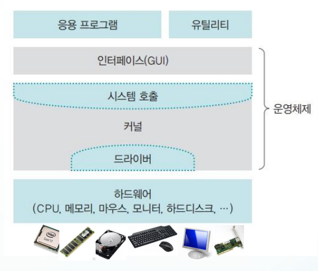
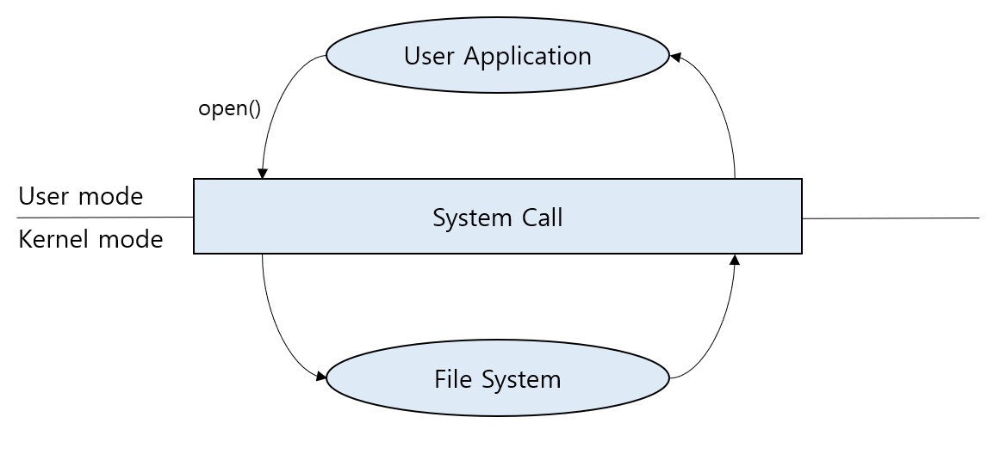
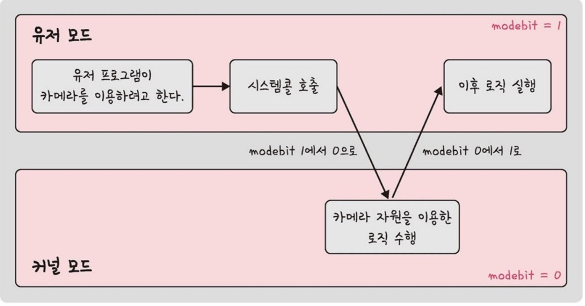

# 3.1 운영체제와 컴퓨터

- 하드웨어, 소프트웨어를 관리하는 일꾼인 운영체제와 CPU, 메모리 등으로 이루어짐

## 3.1.1 운영체제의 역할과 구조

- 운영체제의 역할
  1. CPU 스케줄링과 프로세스 관리 : CPU 소유권을 어떤 프로세스에 할당할지, 프로세스 생성과 삭제 자원 할당 및 반환을 관리
  2. 메모리 관리 : 한정된 메모리를 어떤 프로세스에 얼마만큼 할당할지 관리
  3. 디스크 파일 관리 : 디스크 파일을 어떠한 방법으로 보관할지 관리
  4. I/O(In,Out) 디바이스 관리 : 마우스, 키보드와 컴퓨터간 데이터 주고받는 것을 관리

- 인터페이스 => CLI, GUI, NUI, OUI 등
  - 커널에 사용자 명령어를 전달, 실행결과를 알려주는 역할
- 커널
  - 프로세스 관리, 메모리 관리, 입출력 장치 관리, 파일 관리와 같은 핵심적인 기능을 모아둔곳

### 시스템 콜

- 운영체제가 커널에 접근하기 위한 인터페이스
- 운영체제는 사용자 모드(User Mode)와 커널 모드(Kernel Mode)로 나뉘어 동작 => 이중 동작 모드(Dual Mode Operation)
- 유저의 I/O 요청으로 트랩이 발동하며 유저모드가 시스템콜을 통해 커널모드로 변환되어 실행

1. 사용자 프로세스가 시스템 콜 호출(커널 모드 진입)
2. 커널 내부적으로 시스템 콜을 구분하기 위해 기능별 고유번호를 할당 후 번호에 해당하는 제어 루틴을 정의
3. 커널은 받은 요청을 시스템 콜에 대응하는 고유번호 확인 후 맞는 서비스를 호출
4. 서비스 루틴을 처리 후 사용자 모드로 전환

#### 이중 동작 모드

- 두개의 독립된 동작 모드(커널모드, 사용자 모드)로 돌아가며 작동하는 것
- 시스템을 보호하기 위해서 모드를 나뉨
- 사용자 모드(User Mode) : 메모리 영역이 사용자에게 허용된 정도로 제한되며 하드웨어에 직접 접근이 불가능
- 커널 모드(Kernel Mode) : 모든 시스템 메모리와 CPU에 접근 가능, 하드웨어에 직접적으로 접근할 수 있음
- modebit 이라는 장치를 통해서 커널과 사용자 모드를 구분

#### 시스템 콜 유형

1. 프로세스 제어(Process control) => 프로세스 실행, 생성, 대기 등

   - fork() : 새로운 프로세스 공간을 만들고 시스템 콜을 호출한 부모 프로세스 공간 데이터를 모두 복사
   - exec() : 시스템 콜을 호출한 프로세스 공간의 영역을 새로운 프로세스 이미지로 덮어씌움
   - wait() : 자식 프로세스가 종료될 때까지 blocked 상태로 잠들어 있음
   - exit() : 모든 자원 반납 후, 부모 프로세스에게 알림

1. 파일 조작(File Manipulation) => 파일 열기, 읽기, 쓰기 등

   - open()
   - read()
   - write()
   - close()

1. 장치 관리(Device management) => 디바이스 부착, 분리, 읽기, 쓰기

   - ioctl()
   - read()
   - write()

1. 정보 유지(Information maintenance) => 시간, 날짜 설정

   - getpid()
   - alarm()
   - sleep()

1. 통신(Communication) => 통신 연결 생성, 제거, 상태 정보 전달

   - pipe()
   - shm_open()
   - mmap()

## 3.1.2 컴퓨터의 요소

- CPU, DMA, 컨트롤러, 메모리, 타이머, 디바이스 컨트롤러 등으로 구성

### CPU(Central Processing Unit)

- 산술논리연산장치, 제어장치, 레지스터로 구성
- 인터럽트에 의해 단순히 메모리에 존재하는 명령어를 해석 실행하는 일꾼
- 커널이 프로그램을 메모리에 올려 프로세스로 만들면 CPU가 처리
- 컴퓨터의 대뇌

#### 인터럽트

- 어떤 신호가 들어왔을 때 CPU를 잠시 정시키는 것
- 인터럽트 발생시 하던 일을 멈추고 우선적으로 처리해야하는 일을 처리한 뒤 원래 동작 시행

#### 제어장치

- 프로세스 조작을 지시하는 **CPU의 부품**
- 입출력장치 간 통신 제어, 명령어들을 읽고 해석하며 데이터 처리를 위한 순서를 결정

#### 레지스터

- CPU 내부에 있는 매우 빠른 임시기억 장치
- CPU와 직접 연결되어 있어 연산 속도가 메모리보다 수십 배에서 수백 배까지 빠름
- CPU 자체적으로 데이터 저장할 방법이 없기 때문에 레지스터를 거쳐 데이터를 전달

##### 레지스터 종류

- DR 레지스터
  - Data Register를 의미하고 메모리에서 전달되는 데이터를 저장하는데 사용
- AR 레지스터
  - I/O Address Register를 의미하고 특정 I/O 입출력 장치의 주소를 지정하는데 사용
- PC 레지스터
  - Program Counter를 의미하고 프로세서가 수행할 다음 명령의 주소를 일시적으로 저장 (항상 가져올 다음 명령의 주소나 현재 명령의 주소만 가르킴)
- IR 레지스터
  - Instruction Register를 의미하고 주기억장치에서 가져온 명령을 저장
  - 레지스터가 제어장치에 지시를 하면, 컴퓨터의 해당 구성요소로 신호를 전송후 명령을 해석하여 실행
- MAR 레지스터
  - Memory Address Register를 의미하고 CPU가 데이터를 읽거나 쓰려는 메모리 주소를 일시적 저장
- MBR 레지스터
  - Memory Buffer Register를 의미하고 메모리에 읽거나 쓰려는 데이터 또는 명령을 일시적 저장
  - MBR 레지스터에 배치된 명령은 IR로 전송되고, 데이터 내용은 AC or I/O 레지스터로 전송된다
- PSR 레지스터
  - Program Status Register를 의미하고 주로 ARM CPU에서 사용됨 (CPSR과 SPSR이 있음)
    - CPSR : 현재 코어 내부 동작을 모니터링하고 제어 (특권모드일 경우에만 제어가 가능 기본적으론 읽기 모드)
    - SPSR : 프로세스의 동작 모드가 변경될 때 사용되고 CPSR 내용을 저장

#### 산술논리연산장치

- ALU(Arithmetic Logic Unit)라고 불리며 덧셈, 뺄셈, 같은 산술 연산, 배타적 논리합 곱 같은 논리연산 등을 계산하는 디지털 회로

#### DMA(Direct Memory Access) 컨트롤러

- CPU를 거치지 않고 주변장치(예: 하드 드라이브, 네트워크 카드, 사운드 카드 등)가 시스템 메모리에 직접 접근할 수 있도록 해주는 기능
- CPU의 부담을 줄이고 데이터 전송의 효율성을 높이는 것
- 입출력 장치와 메모리 간의 빠른 데이터 전송이 가능
- 프로그램 수행 중 인터럽트의 발생 횟수 최소화 및 시스템 효율성 증대

#### 메모리

- 데이터나 상태 명령어 등 기록하는 장치
- RAM(Random Access Memory)를 일컬어 말함 => CPU는 계산 담당, 메모리는 기억을 담당
- 공간에 비유해서 큰 공간을 가질수록 많은 것을 담을 수 있음
