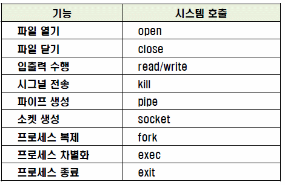
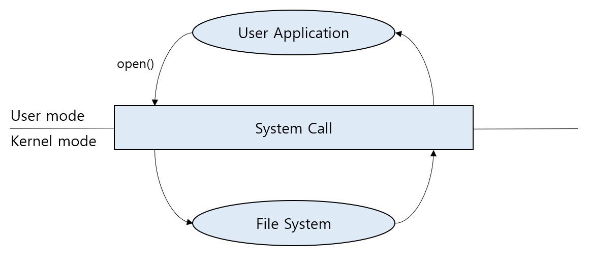
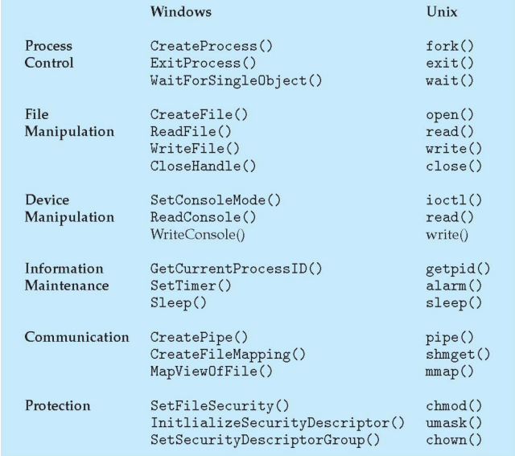

## 1. 시스템 콜이 무엇인지 설명해 주세요.

- 응용 프로그램이 하드웨어 자원에 접근하거나 운영체제가 제공하는 서비스를 이용하기 위한 요청

- 우리가 사용하는 시스템 콜의 예시를 들어주세요.

- open, read, write, close 등 파일을 열거나 닫고 쓰고 읽고 등이 있다.

- 시스템 콜이 운영체제에서 어떤 과정으로 실행되는지 설명해 주세요.

1.  사용자 프로그램 실행 : 사용자가 작성한 프로그램을 사용자 모드에서 실행
2.  시스템 콜 호출 : 운영체제의 특정 기능을 사용해야 할 때, 그 기능을 사용하기 위한 요청을 보냄
3.  커널 모드 전환 : 사용자 모드에서 커널 모드로 전환 (커널 모드에서만 핵심 기능과 하드웨어 자원에 접근이 가능)
4.  요청 분석 및 처리 : 커널 내부적으로 서비스 루틴에 대응되는 인덱스 테이블 보유 (들어오는 요청에 대응되는 동작 => 파일 읽기 찾아서 읽기)
5.  작업 수행 및 결과 반환 : 요청된 작업을 수행 후 결과를 메모리 혹은 레지스터에 반환
6.  사용자 모드 전환 : 요청한 작업이 완료되면 운영체제는 다시 사용자 모드로 전환
7.  프로그램 실행 재개 : 시스템 콜 이후 다음 작업을 수행

- 시스템 콜의 유형에 대해 설명해 주세요.

- **Process Control(프로세스 제어)**
  - fork() : 새로운 프로세스 생성
  - exec() : 새로운 프로그램 실행
  - exit() : 현재 프로세스 종료
  - wait() : 자식 프로세스가 종료될 떄까지 대기
- **File Manipulation(파일 제어)**
  - open() : 파일 열기
  - read() : 파일 읽기
  - write() : 파일 쓰기
  - close() : 파일 닫기
- **Device Manipulation(장치 관리)**
  - read() : 장치 읽기
  - write() : 장치 쓰기
  - icotl(): 장치 제어
- **Infomation Maintenance(정보 유지)**
  - getpid() : 현재 프로세스 ID 가져오기
  - alarm() : 지정한 시간 후 알람 시그널 보내는 타이머 설정
  - sleep() : 현재 프로세스를 지정한 시간 동안 멈춤
- **Communication(통신)**
  - pipe() : 두 프로세스 간 단방향 통신 파이프 생성
  - shm_open() : 공유 메모리 객체를 생성하거나 열기
  - mmap(): 파일의 내용을 메모리에 매핑하여 읽거나 쓸 수 있도록 변경
- **Protection(보호)**

  - chmod() : 파일 또는 디렉토리 권한 변경
  - umask() : 새로운 파일 생성 시 기본 권한 제한 설정
  - chown() : 파일 또는 디렉토리 소유자와 그룹 소유자 변경

- 운영체제의 Dual Mode 에 대해 설명해 주세요.

  - 운영체제를 보호하고 시스템 자원에 대한 안전한 접근을 보장하기 위해 사용자 모드, 커널 모드로 나누는 기법이다. 사용자는 프로세스에 제한된 권한을 가지고 하드웨어 자원에 직접 접근할 수 없으며 시스템 콜을 통하여 커널 모드로 전환하여 접근할 수 있는 것

- 왜 유저모드와 커널모드를 구분해야 하나요?

  - 시스템 자원에 자유롭게 접근이 가능할 경우 시스템 장애 혹은 불필요한 정보 유출등 보안적인 문제에서 큰 문제가 발생할 수 있기 떄문

- 서로 다른 시스템 콜을 어떻게 구분할 수 있을까요?
  - 시스템 콜은 여러 종류 기능으로 나뉘어져 있으며 각 시스템 콜 별 인덱스 테이블을 관리하여 서로 다른 시스템 콜을 구분할 수 있다.
