# 프로세스와 스레드

- 프로세스 : 컴퓨터에서 실행되는 프로그램 CPU 스케줄링 대상이 되는 작업(task)
- 스레드 : 프로세스 내 작업의 흐름
- 프로그램 : 어떤 작업을 하기 위해 해야할 일들을 순서대로 나열한 것

### 프로그램

- 사용자가 원하는 일을 처리할 수 있도록 프로그래밍 언어를 사용하여 올바른 수행절차를 표현해 놓은 명령어들의 집합
- 필요한 데이터를 묶어 놓은 파일로 보조 기억장치에 저장됨
- 컴퓨터에서 어떠한 작업을 위해 실행할 수 있는 "정적인 상태"의 파일

### 프로세스

- 컴퓨터에서 연속적으로 실행되고 있는 "동적인 상태"의 프로그램
- 운영체제가 메모리 등의 필요한 자원에 할당해준 "실행중인 프로그램"
- 프로그램 실행 => 자원을 할당받아 프로세스

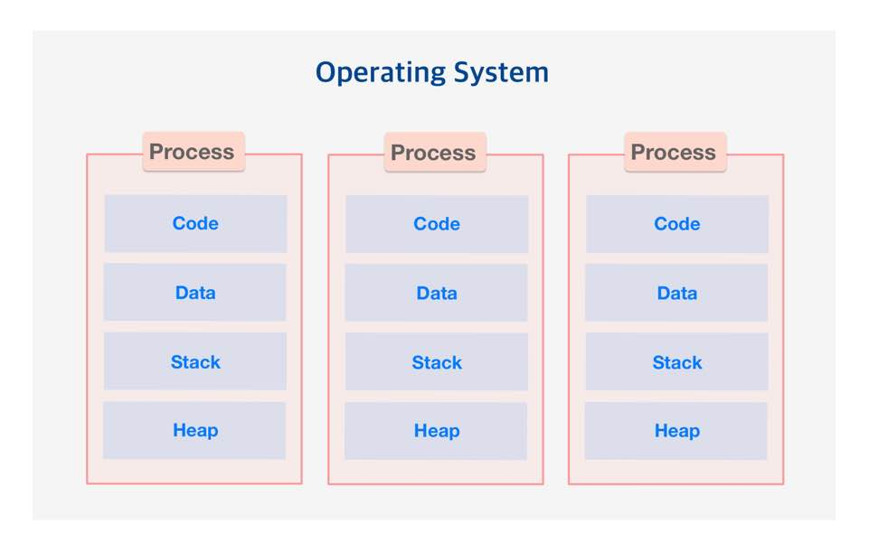

- Code, Data, Stack, Heap의 구조로 이루어진 독립된 메모리 영역을 할당
- 각 프로세스는 별도의 주소 공간에서 실행되며, 서로 독자적인 메모리 공간을 가짐
- 다른 프로세스 자원에 접근하기 위해서는 프로세스간 통신(IPC)을 사용해야 한다.
- 최소 하나 이상의 스레드를 포함한다.

### 스레드

- 프로세스가 할당받은 자원을 이용하는 실행단위
- 프로세스 내에서 실행되는 여러 흐름의 단위
- 프로세스 자원을 이용해서 실제로 작업을 수행하는 일꾼
- 프로세스가 할당받은 자원을 스레드가 사용하며 프로세스는 최소 한 개 이상의 스레드를 가지고 이 스레드를 메인 스레드라고 한다.

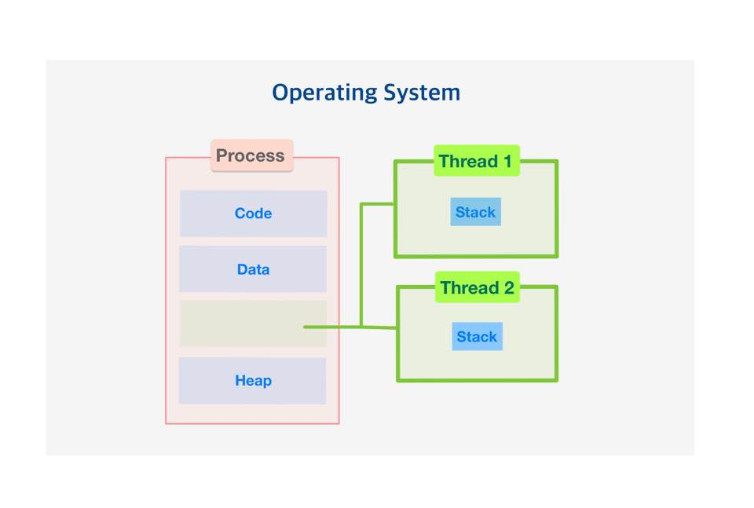

- 독자적인 스택 메모리를 가짐
- 프로세스 내에서 각각 스택만 할당받고 Code, Data, Heap 영역을 공유한다.
- 여러 실행의 흐름으로, 프로세스 내의 주소공간이나 자원들을 같은 프로세스 내의 스레드끼리 공유하며 실행된다.
- 한 스레드가 프로세스 자원을 변경 할 경우 다른 스레드도 그 변경 결과를 알 수 있다. ( 프로세스 내의 자원이 변경되기 때문에 접근 가능 )

| 차이점        | 프로세스          | 스레드                    |
| ------------- | ----------------- | ------------------------- |
| 정의          | 실행중인 프로그램 | 프로세스의 실행단위       |
| 생성/종료시간 | 많은 시간 소요    | 적은 시간 소요            |
| 컨텍스트 전환 | 많은 시간 소요    | 적은 시간 소요            |
| 상호작용      | IPC 사용          | 공유 메모리 사용          |
| 자원 소모     | 많음              | 적음                      |
| 독립성        | 각각 독립적       | 스택만 독립적 외에는 공유 |

## 3.3.1 프로세스와 컴파일 과정

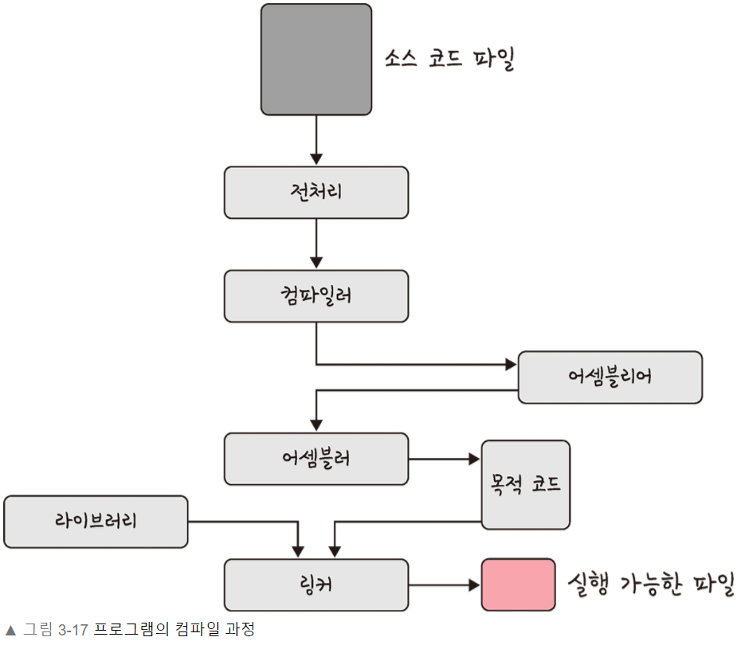

#### 전처리

- 소스 코드 주석제거, 헤더 파일을 병합하여 매크로로 치환

#### 컴파일러

- 오류 처리, 코드 최적화 작업을 하여 어셈블리어로 변환

#### 어셈블러

- 목적 코드(object code)로 변환됩니다.

#### 링커

- 프로그램 내의 라이브러리 함수 or 다른 파일들과 목적 코드를 결합하여 .exe 파일로 만듬

### 정적라이브러리

- 장점

  - 컴파일 시 필요한 라이브러리 프로그램 내에 가지고 있기 때문에 이식성이 좋다.
  - 런타임 시 외부를 참조할 필요가 없어 속도가 빠름

- 단점
  - 라이브러리를 가지고 있는 만큼 프로그램의 크기가 커집니다.
  - 라이브러리를 가진 여러 프로그램을 실행할 경우 코드가 중복되어 메모리를 낭비
  - 라이브러리 변경이 필요할 때, 변경된 라이브러리만 재배포 하는 것이 아닌 프로그램을 다시 재배포

### 동적라이브러리

- 라이브러리를 복사하지 않고 해당 내용의 주소만 가지고 있다가, 실행 파일에서 라이브러리 기능을 사용할 때 주소를 통해 필요한 내용을 가져오는 방식
- \*.lib, \*.dll 파일

  - lib : 파일을 링크할 때 필요
  - dll : 파일을 실행할 때 필요 ( Windows 운영체제에서만 사용 )

- 장점

  - 정적 라이브러리와 비교했을 때 실행 파일에 라이브러리를 포함하지 않기 때문에 실행 파일 크기가 작아진다.
  - 여러 프로그램이 하나의 메모리에 있는 동적 라이브러리를 공유하여 사용할 수 있기 때문에 메모리 자원을 효율적으로 사용할 수 있다.
  - 라이브러리에서 수정할 부분이 있다면 실행 파일을 새로 컴파일할 필요 없이 동적 라이브러리만 다시 컴파일하여 재배포 가능하다.
  - 언어 형식이 다른 여러 프로그램을 지원하고, 함수의 호출 규칙만 준수하면 다른 언어로 작성된 여러 프로그램에서 동일한 동적 라이브러리 함수를 호출할 수 있다.

- 단점

  - 실행파일은 동적 라이브러리가 필요하기 때문에 외부 의존도가 생겨서 이식성이 낮음
  - 프로그램 영역에서 라이브러리가 저장된 주소로 이동하는 과정이 필요하고 성능 저하가 발생

## 3.3.2 프로세스의 상태

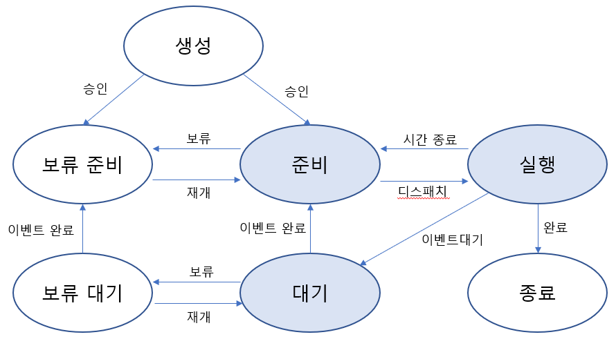

### 생성 상태

- 프로그램이 커널 영역에서 PCB(Process Control Block)를 부여받은 상태 => PCB : 특정한 프로세스를 관리할 필요가 있는 정보를 포함하는, 운영체제 커널의 자료구조
- 주 기억장치 공간이 여유로운지 체크 후, 공간이 충분하면 프로세스 주소 공간을 할당한 후 프로세스를 준비 상태로 바꿈

### 준비 상태

- CPU의 순서를 기다리며 대기하는 상태 대기가 끝나면 실행 상태로 변경 ( 상태 변경을 디스패치라고 함 )

### 실행 상태

- CPU를 할당받아 실행중인 상태( 소유권과 메모리를 할당받고 인스트럭션을 수행 중인 상태 )

### 대기 상태

- 프로세스 실행 도중 입출력장치를 사용하는 경우

### 종료 상태

- 프로세스가 종료된 상태
- PCB, 프로세스 메모리 영역을 정리

## 3.3.3 프로세스 메모리 구조

- 운영체제는 프로세스에 적절한 메모리를 할당하는데 구조를 기반으로 할당

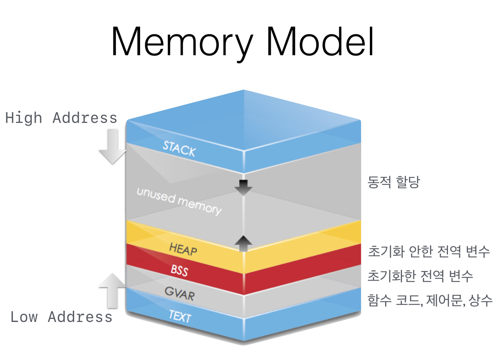

### 스택

- 지역변수, 매개변수, 함수가 저장되며 컴파일 시 크기가 결정되며 '동적'인 특징
- 함수가 종료될 경우반환
- stack 사이즈는 각 프로세스마다 할당되지만 메모리에 로드될 때 stack 사이즈가 고정되어 런타임일 경우 사이즈를 바꿀 수 없다.
- 높은 주소에서 낮은 주소로 내려감

### 힙

- 동적 메모리 영역으로 필요에 의해 메모리를 할당 함
- 사용자가 직접 관리할 수 있고 관리해야는 영역
- 낮은 주소에서 높은 주소로 올라감

### 데이터 영역

- 프로그램이 실행될 때 생성되고 프로그램이 종료되면 시스템에 반환되며, 전역변수, 정적변수, 배열, 구조체 등이 저장됨
- BSS영역, Data 영역으로 나뉨
  - BSS(block started by symbol) : 초기화 되지 않은 변수를 0으로 초기화 하여 저장
  - Data : 0이 아닌 다른 값으로 할당된 변수들을 저장

### 코드 영역

- 실행 명령을 포함하는 코드들이 들어가는 부분
- 프로그램 시작 시 컴파일한 프로그램이 저장되고, 읽기 전용 영역이기 때문에 프로세스가 함부로 변경할 수 없다
- 기계어로 제어되는 메모리 영역

## 3.3.4 PCB(Process Control Block)

- 운영체제가 프로세스 스케줄링을 위해 모든 정보를 가지고 있는 블록
- 특정 프로세스를 관리할 필요가 있는 정보를 포함하는 운영체제 커널의 자료구조
- 프로세스가 생성될 때마다 고유의 PCB가 생성되고, 프로세스가 완료되면 PCB는 제거됨
- 프로세스를 실행하는 데 필요한 중요한 정보를 보관하는 자료 구조

### PCB 구조

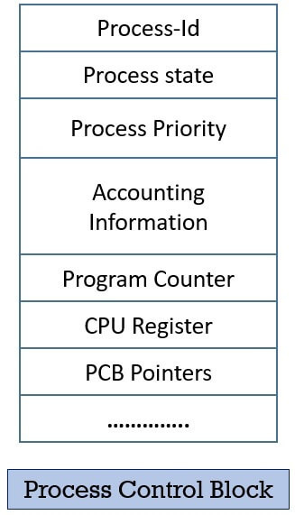

- 프로세스 ID(Process ID) : 프로세스 ID, 해당 프로세스의 자식 프로세스 ID
- 프로세스 스케줄링 상태(Process state) : '준비', '일시중단' 등 프로세스가 CPU에 대한 소유권을 얻은 이후의 상태
- 프로세스 우선순위(Process Priority) : 프로세스의 실행 순서를 결정하는 우선순위
- 프로세스 권한 : 컴퓨터 자원 또는 I/O 디바이스에 대한 권한 정보
- 프로그램 카운터(Program Counter) : 프로세스에서 실행해야 할 다음 명령어의 주소에 대한 포인터
- CPU 레지스터(CPU Register) : 프로세스를 실행하기 위해 저장해야 할 레지스터에 대한 정보
- CPU 스케줄링 정보 : CPU 스케줄러에 의해 중단된 시간 등에 대한 정보
- 계정 정보(Accounting Information) : 프로세스 실행에 사용된 CPU 사용량, 실행한 유저의 정보
- I/O 상태 정보 : 프로세스에 할당된 I/O 디바이스 목록

### 컨텍스트 스위칭

- PCB를 교환하는 과정
- 할당된 시간이 끝나거나 인터럽트에 의해 발생
- 진행중인 프로세스 상태를 PCB에 저장 후 다음 진행할 프로세스 정보를 PCB에서 읽어 적용하는 과정 (저장하고 불러오기)

- CPU가 한 번에 하나의 프로세스만 수행이 가능 하지만 실제 삶에서는 여러 프로세스를 동시에 수행하는 것처럼 보이는 것이 이러한 이유

## 3.3.5 멀티프로세싱

- 2개 이상의 프로세스가 동시에 실행되는 것
- 프로세스들이 CPU와 메모리를 공유하게 됨

### 장단점

- 장점
  - 독립된 구조로 안정성이 높음
  - 프로세스 하나에 문제가 생겨도 다른 프로세스에 영향을 주지 않음
  - 여러 프로세스가 처리되어야 할 때 동일한 데이터를 사용하고, 이러한 데이터를 하나의 디스크에 두고 모든 프로세서가 공유하면 비용적 저렴
- 단점
  - 독립된 메모리 영역이기 때문에 작업량이 많을 수록 오버헤드 발생
  - 컨텍스트 스위칭 과정에서 캐시 메모리 초기화 등 무거운 작업이 진행되고 시간이 소모되는 등 오버헤드 발생

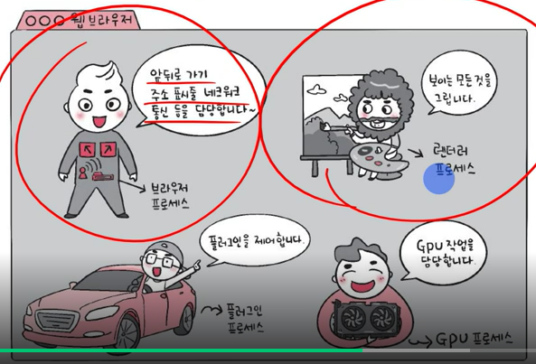

### IPC(Inter Process Communication)

- 프로세스 끼리 데이터를 주고받고 공유 데이터를 관리하는 메커니즘
- 각 프로세스가 독립적인 메모리 공간을 가지고 보호하고 있기 때문에 이를 통신하기 위해 사용

#### 공유 메모리

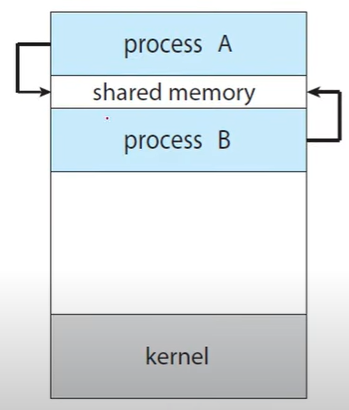

- IPC를 위해 공유 메모리 영역을 구축하고, 공유 영역을 통해 자원이나 데이터를 주고받음
- 커널 의존성이 낮아 속도가 매우 빠르고 유저 레벨에서 IPC가 가능하기 때문에, 통신이 자유로움
- 자원과 데이터를 공유하기 때문에 동기화 이슈가 발생

#### 파일

- 디스크에 저장된 데이터 또는 파일 서버에서 제공한 데이터

#### 소켓

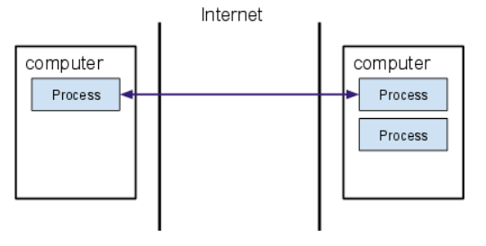

- 동일한 컴퓨터의 다른 프로세스나 네트워크의 다른 컴퓨터로 네트워크 인터페이스를 통해 전송하는 데이터 (TCP/UDP 존재)

#### 익명 파이프

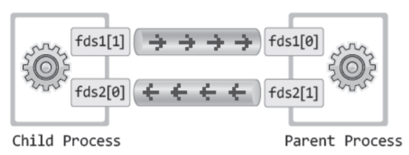

- 프로세스 간 FIFO 방식으로 읽히는 임시 공간인 파이프 기반
- 단방향 읽기 전용, 쓰기 전용 파이프를 만들어 작동
- 부모 자식간 관계만 가능 ( 타 네트워크 X )

#### 명명된 파이프

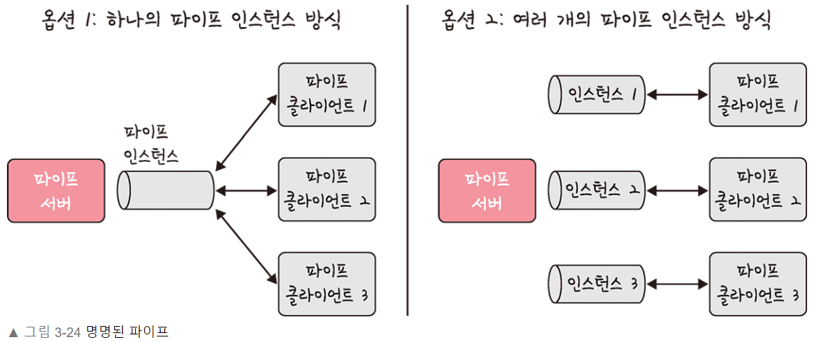

- 파이프 서버와 하나 이상의 파이프 클라이언트 간 통신을 위해 명명된 단방향 혹은 이중 파이프
- 네트워크 및 다중 서버 인스턴스를 통한 양방향 통신

#### 메세지 큐

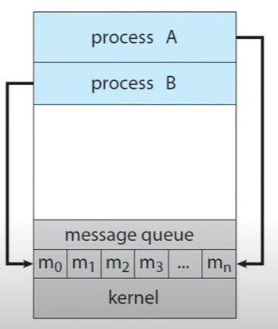

- IPC를 위해 커널을 통해 메세지를 전달하는 방식 자원이나 데이터를 주고받음
- 구현이 간단하고 적은 양의 데이터 전달에 적합
- 별도로 다른 것을 구축할 필요 없이 커널을 이용하기 때문에 구현이 비교적 쉽다
- 커널을 이용하기 때문에, 시스템 콜(System call)이 필요하며 이로 인해 오버헤드가 발생한다. 매번 커널을 통하여 정보/메세지를 전달하기 위해 두 번 복사(매번 시스템 호출 사용)

## 3.3.6 멀티스레딩

- 프로세스 내 자겁을 여러 스레드로 처리하는 기법
- 스레드 끼리 자원을 공유하기 때문에 효율성이 높음
- 동시성에 큰 장점을 가짐 => 독립적인 작업들을 작은 단위로 나누고 동시에 실행되는 것처럼 보여주는 것

## 3.3.7 공유 자원과 임계 영역

### 공유자원

- 시스템 안에서 각 프로세스, 스레드가 함께 접근할 수 있는 모니터, 프린터, 메모리, 파일, 데이터 등 자원이나 변수
- 공유 자원을 두 개 이상의 포르세스가 동시에 읽거나 쓰는 상황을 경쟁 상태 라고 함
- 예시
  - 공유 자원 item = 1이 있고 A 프로세스가 item에 2를 더하고 B 프로세스는 3을 더했다. 만약 여기서 A와 B가 같이 item을 읽고 A가 먼저 2를 더해주고 늦게 B가 3을 더하면 item은 4가된다. 옳바른 답은 6(1+2+3)이 나와야하는데 타이밍이 꼬여서 잘못된 값이 나온 것

### 임계영역

- 공유 자원에 접근하는 순서 같은 이유로 결과가 달라지는 영역
- 임계 영역을 해결하기 위해 뮤텍스, 세마포어, 모니터 세 가지가 있으며, 상호 배제, 한정 대기, 융통성이란 조건을 만족
  - 상호 배제 : 임계 영역에 프로세스가 있다면 다른 프로세스는 못들어감
  - 한정 대기 : 특정 프로세스가 영원히 임계 영역에 들어가지 못하면 안됨
  - 융통성 : 한 프로세스가 다른 프로세스의 일을 방해하면 안됨

#### 뮤텍스

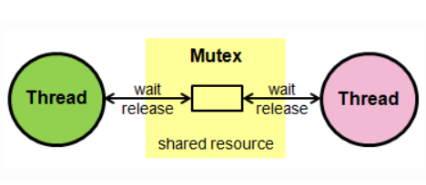

- 공유 자원을 사용하기 전 설정하고 사용한 후 해제하는 잠금
- 한 프로세스에 의해 소유될 수 있는 Key를 기반으로 한 상호배제 기법
- 뮤텍스 객체를 두 스레드가 동시에 사용할 수 없음

#### 세마포어

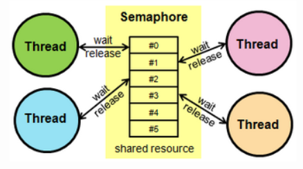

- 멀티 프로그래밍 환경에서 공유된 자원에 대한 접근을 제한하는 방법
- 공유 자원에 접근할 수 있는 프로세스의 최대 허용치만큼 동시에 사용자가 접근할 수 있음
- 신호를 기반으로 상호 배제가 일어나는 신호 메커니즘
- 자원을 사용하지 않는 상태가 될 때, 대기하던 프로세스가 즉시 자원을 사용
- 이미 다른 프로세스에 의해 사용중이라는 사실을 알게 되면, 재시도 전에 일정시간 대기
- 세마포어를 사용하는 프로세스는 그 값을 확인하고, 자원을 사용하는 동안에는 그 값을 변경함으로써 다른 세마포어 사용자들이 대기하도록 해야 함

#### 모니터

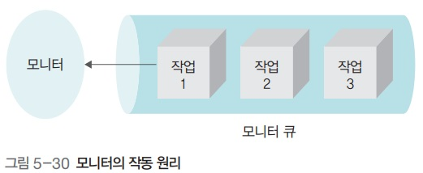

- 둘 이상의 프로세스나 스레드가 공유 자원에 안전하게 접근이 가능하도록 자원을 숨기고 접근에 대해 인터페이스만 제공
- 모니터는 요청받은 작업을 모니터 큐에 저장하고 순서대로 처리, 결과만 프로세스에 알려줌

## 3.3.8 교착 상태

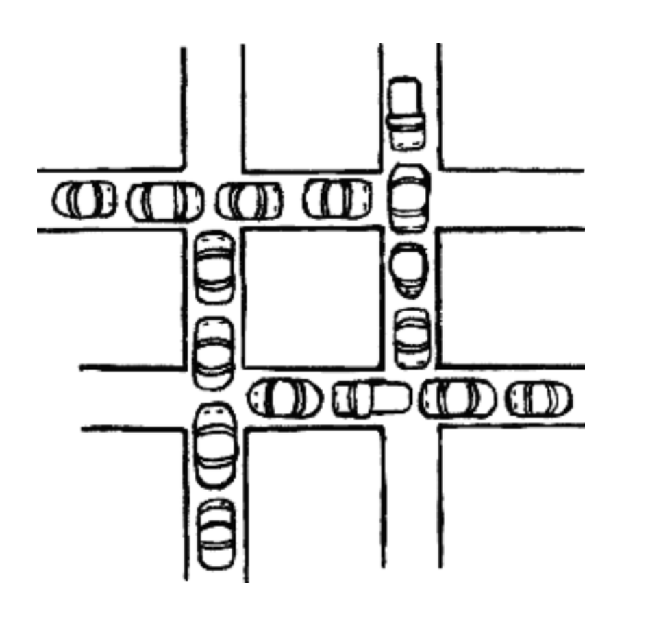

- 두 개 이상의 프로세스들이 서로 가진 자원을 기다리며 중단된 상태
- 조건
  - 상호 배제 : 한 번에 한 프로세스만이 자원을 사용할 수 있다.
  - 점유와 대기 : 최소한 하나의 자원을 점유하고 있으면서 다른 프로세스에 의해 점유된 자원을 추가로 요구하는 프로세스가 있다.
  - 비선점 : 점유중인 자원을 강제로 빼앗을 수 없다.
  - 환영 대기 : 각 프로세스는 순환적으로 다음 프로세스가 요구하는 자원을 점유하고 있다.
- 해결 방법
  - 교착 상태는 두 개 이상의 프로세스가 공유 불가능한 자원을 사용하기 때문에 발생하는 것이므로 공유 불가능이라는 조건을 제거하면 상호 배제 조건을 제거 ( 상호 배제 조건 제거 )
  - 한 프로세스에 수행되기 전에 모든 자원을 할당시키고 나서 점유하지 않을 때에는 다른 프로세스가 자원을 요구하도록 하는 방법 ( 점유 대기 조건 제거 )
  - 비선점 프로세스에 대해 선점 가능한 프로토콜을 만듬 ( 비선점 조건의 제거 )
  - 자원의 유형에 따라 우선순위 부여 ( 순환 대기 조건 제거 )
