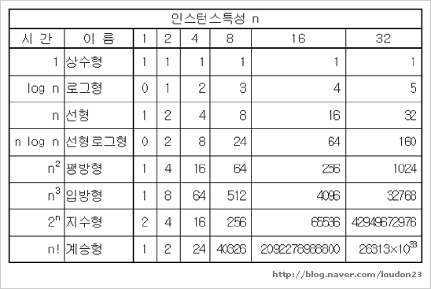
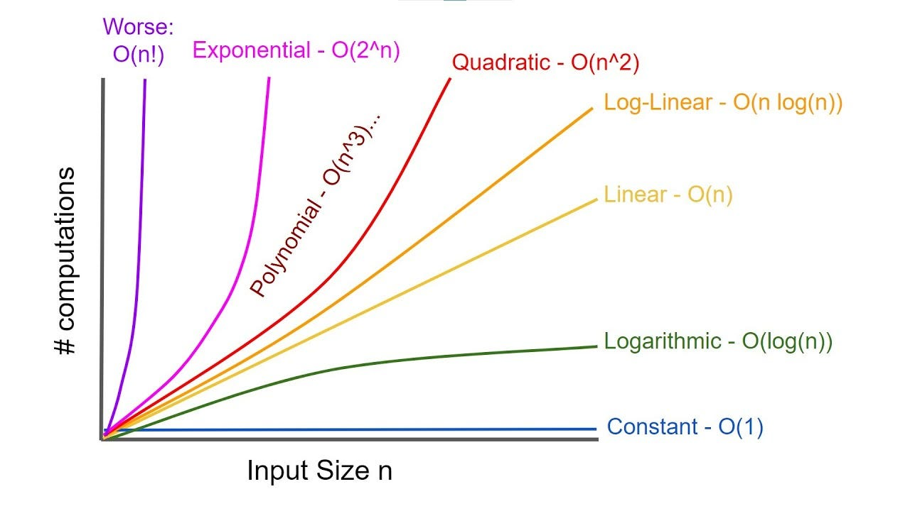
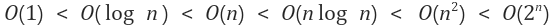

# 복잡도

- 시간복잡도
- 공간복잡도

## 시간복잡도

- 알고리즘을 실행하는데 걸리는 시간을 입력 길이의 함수로 정의한 것
- 알고리즘에서 연산 수가 증가하거나 감소할 때 실행 시간의 변화에 대한 정보를 제공

### 빅오(Big O)표기법

- 알고리즘의 효율성을 표기해주는 표기법
- 입력 길이의 함수로 나타나는 시간
- 입력 데이터 크기(n)과 연산 수(N) 사이에 관계가 존재
- 입력 'n'에 대한 얼마나 빠르게 증가하는지 N 개의 연산 수를 기준으로 표현





1. 상수 시간 - O(1)

   - 알고리즘 입력 크기 n에 의존하지 않을 때 O(1)의 상수 시간 복잡도를 가짐
   - 입력 크기 n의 여부와 상관없이 실행 시간은 항상 동일
   - +,-,\*,/,stack에서 push, pop 등

2. 선형 시간 - O(n)

   - 입력 데이터의 모든 값을 검사하는 경우 O(n)의 시간 복잡도
   - for 문

3. 로그 시간 - O(log n)

   - 입력 크기가 증가함에 따라 연산 횟수가 줄어드는 구조
   - 배열 두 개로 분할하여 한쪽 부분에서 검색을 시작하여 배열에 주어진 값을 검색
   - 이분 트로 or 이분 탐색

4. 제곱 시간 - O(n\*\*2)

   - 실행 시간이 입력 길이의 제곱에 따라 비선형 증가 (n\*\*2)
   - 중첩 루프문이 O(n\*\*2) 시간 복잡도를 가짐
   - 삽입 정렬(Insertion sort), 거품 정렬(bubble sort), 선택 정렬(selection sort)

5. O(n log n)
   - 퀵 정렬, 병합 정렬, 힙 정렬

#### 빅오 속도



fast => slow

### 시간 복잡도 존재 이유

- 실무에서 코드 성능, 서비스 품질에 영향을 미침
- 시간 복잡도를 고려하며 개발하면 성능 좋은 코드를 작성할 수 있음
- 좋은 습관처럼 몸에 배여 향후 코드 품질이 향상됨
- 기술 면접에서는 코드를 통해 물어보거나 코딩 테스트를 통해 확인함

## 공간 복잡도

- 알고리즘에서 사용하는 메모리의 양
- 컴퓨터의 발달로 예전보다는 중요도는 떨어짐
- 최근에는 시간 복잡도를 우선으로 작성

```python
result = 0
for i in range(1, 100):
	result += i
```

- N번만큼 반복해도 for문 안에서 지역변수이므로 공간 복잡도는 여전히 O(1)

```python
def factorial(n):
    if n == 1:
        return 1
    return n * factorial(n - 1)
```

- 재귀 함수의 경우 매개변수 n 값에 따라서 공간 복잡도가 달라짐
- n 이 1일때 까지 공간을 사용하기 때문에 O(n)의 공간 복잡도를 가짐

**공간 복잡도를 결정하는 것은 배열의 크기, 동적 할당, 재귀 함수 등이 공간의 복잡도를 결정함**

- 보통 int 는 4Byte, 문자는 1Byte 를 차지함 1KB는 1024Byte, 1MB는 1024KB
- 1000 개의 int 배열 => 4000Byte => 약 4KB
- 1000 \* 1000 개의 int 배열 => 1,000,000 int 형이 필요하기 때문에 4MB

## 자료구조 시간 복잡도

**평균 시간 복잡도**

| 자료 구조        | 접근    | 탐색    | 삽입    | 삭제    |
| ---------------- | ------- | ------- | ------- | ------- |
| 배열             | O(1)    | O(n)    | O(n)    | O(n)    |
| 스택             | O(n)    | O(n)    | O(1)    | O(1)    |
| 큐               | O(n)    | O(n)    | O(1)    | O(1)    |
| 이중 연결 리스트 | O(n)    | O(n)    | O(1)    | O(1)    |
| 해시 테이블      | O(1)    | O(1)    | O(1)    | O(1)    |
| 이진 탐색 트리   | O(logn) | O(logn) | O(logn) | O(logn) |
| AVL 트리         | O(logn) | O(logn) | O(logn) | O(logn) |
| 레드 블랙 트리   | O(logn) | O(logn) | O(logn) | O(logn) |

**최악의 시간 복잡도**

| 자료 구조        | 접근    | 탐색    | 삽입    | 삭제    |
| ---------------- | ------- | ------- | ------- | ------- |
| 배열             | O(1)    | O(n)    | O(n)    | O(n)    |
| 스택             | O(n)    | O(n)    | O(1)    | O(1)    |
| 큐               | O(n)    | O(n)    | O(1)    | O(1)    |
| 이중 연결 리스트 | O(n)    | O(n)    | O(1)    | O(1)    |
| 해시 테이블      | O(n)    | O(n)    | O(n)    | O(n)    |
| 이진 탐색 트리   | O(n)    | O(n)    | O(n)    | O(n)    |
| AVL 트리         | O(logn) | O(logn) | O(logn) | O(logn) |
| 레드 블랙 트리   | O(logn) | O(logn) | O(logn) | O(logn) |
