# 비선형 자료 구조

- 일렬로 나열하지 않고 순서나 관계가 복잡한 구조
- 하나의 자료 뒤에 여러개의 자료가 존재할 수 있는 형태
- 트리나 그래프, 계층적 구조를 나타내기에 적합

## 그래프

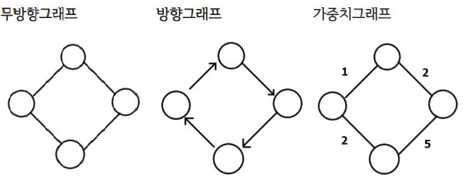

- 정점과 간선으로 이루어진 자료 구조
- 사이클이 존재할 수 있음
- 정점(vertex) : 위치라는 개념 (node라고도 부름) => 데이터가 저장
- 간선(edge) : 위치 간의 관계. 노드를 연결하는 선 link, branch 라고도 부름 => 노드간 관계
- 가중치 : 간선과 정점 사이에 드는 비용

## 트리

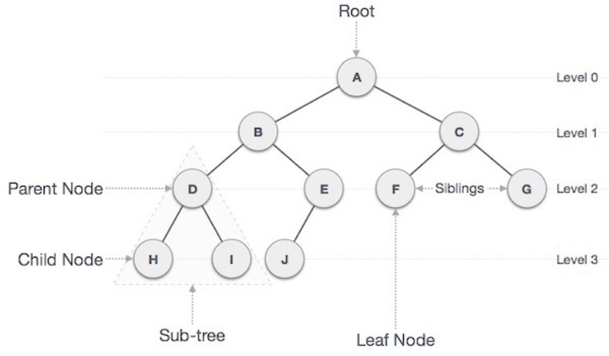

- 데이터 각 요소들을 계층적으로 연관되도록 구조화 한 것
- 부모 - 자식 관계의 계층적 구조
- 노드와 간선으로 이루어진 자료 구조

### 특징

1. 단 하나의 루트 노드를 가짐
2. 루트 노드는 0개 이상의 자식 노드를 가짐
3. 자식 노드도 0개 이상의 자식 노드를 가짐
4. 각 노드들은 서로 연결하는 간선으로 이어짐
5. 노드가 N개인 트리는 항상 N-1 개의 간선을 가짐
6. 트리는 사이클이 존재할 수 없다

### 용어

- 루트 노드(root node) : 부모가 없는 노드
- 단말 노드(leaf node) : 자식이 없는 노드, 말단 노드
- 내부 노드(internal node) : 말단 노드가 아닌 노드
- 간선(edge) : 노드를 연결하는 선 (link, branch 라고도 부름)
- 형제(sibling) : 같은 부모를 가지는 노드
- 노드의 크기(size) : 자신을 포함한 모든 자손 노드의 개수
- 노드의 깊이(depth) : 루트에서 어떤 노드에 도달하기 위해 거쳐야 하는 간선의 수
- 노드의 레벨(level) : 트리의 특정 깊이를 가지는 노드의 집합
- 노드의 차수(degree) : 하위 트리 개수 / 간선 수 (degree) = 각 노드가 지닌 다음 레벨의 하위 가지 수
- 트리의 차수(degree of tree) : 트리의 최대 차수(각 노드의 차수 중 가장 높은 차수)
- 트리의 높이(height) : 루트 노드에서 가장 말단 노드의 깊이

## 이진 트리

- 자식 노드 수가 두 개 이하인 트리
- 자식 노드는 자신이 부모의 왼쪽 자식인지 오른쪽 자식인지 지정됨
- 완전 이진 트리, 포화 이진 트리, 정이진 트리, 편향 이진 트리

### 완전 이진 트리

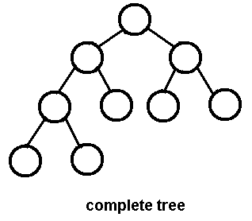

- 왼쪽 자식 노드부터 순서대로 노드가 채워지며 마지막 레벨을 제외하고 모든 자식 노드가 채워진 트리

### 포화 이진 트리

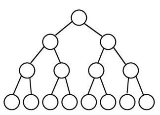

- 모든 노드가 0개 혹은 개의 자식 노드를 가지고 모든 리프노드가 똑같은 레벨에 있는 경우

### 정이진 트리

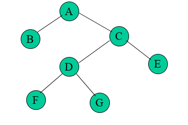

- 모든 노드가 0개 혹은 2개의 자식 노드를 가지는 트리

### 변질 이진 트리

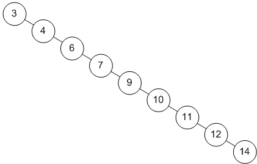

- 자식 노드가 하나밖에 없는 이진 트리

### 균형 이진 트리

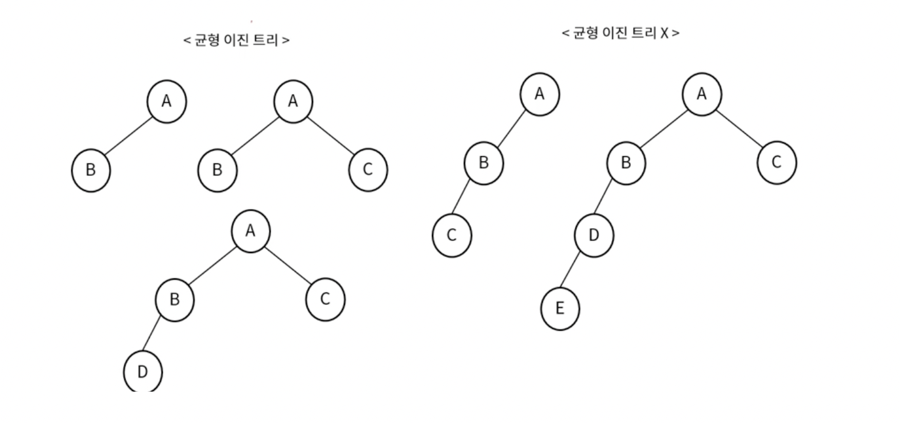

- 왼쪽과 오른쪽 노드의 높이 차이가 1 이하인 이진 트리

### 이진 탐색 트리

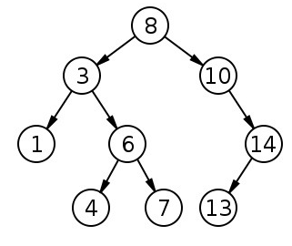

- 왼쪽 자식 노드가 루트 노드보다 값이 작고, 오른쪽 자식 노드가 루트 노드보다 값이 큰 트리
- 트리의 구조에 따라서 탐색 속도가 달라짐 최악 O(n) 기존 O(logn)

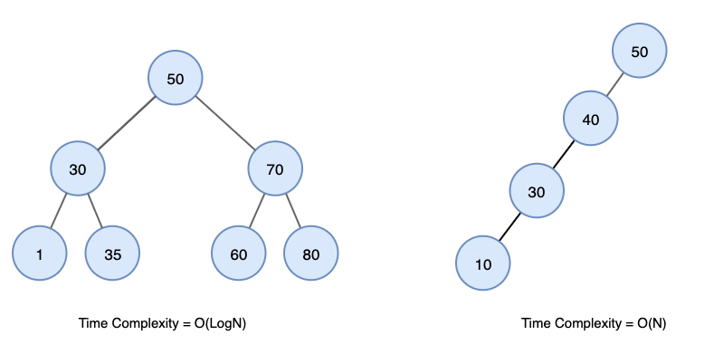

### AVL 트리

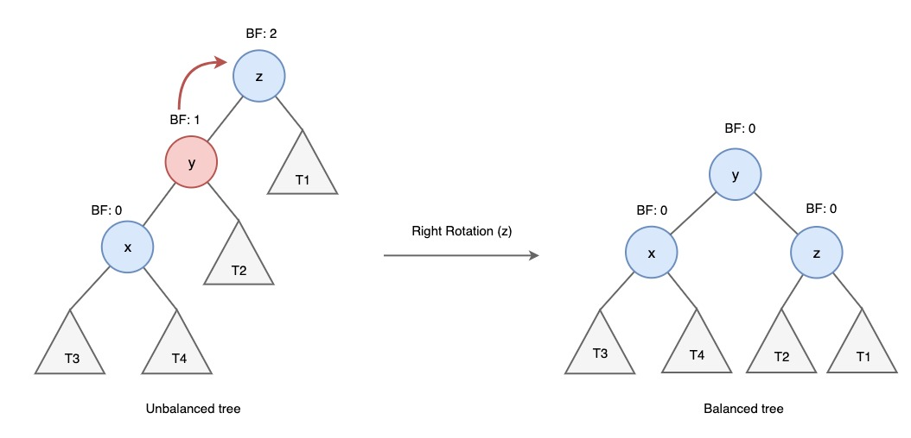

- 이진 탐색 트리가 최악의 경우로 선형 트리가 되는 것을 방지하기 위한 트리
- 스스로 균형을 잡는 이진 탐색 트리
- 두 자식 서브트리의 높이가 항상 최대 1만큼 차이난다는 특징
- 높이 차이를 체크하고 차이가 1보다 커지면 회전을 통해 균형을 잡음

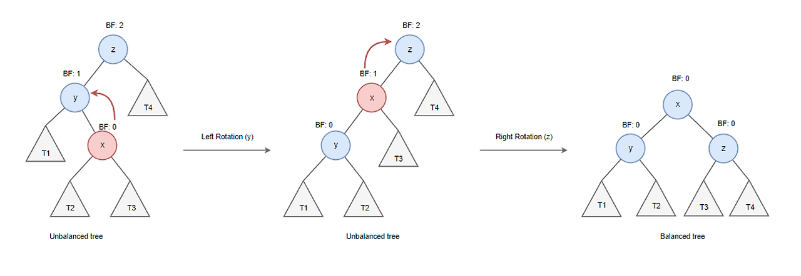

### 레드 블랙 트리

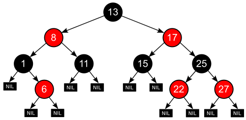

- 자가 균형 이진 트리
- 모든 노드는 빨간색 혹은 검은색
- 루트 노드, 리프 노드는 검은색
- 빨간색 노드의 자식은 검은색
- 모든 리프 노드에서 Black Depth는 같다

## 힙

- 완전 이진 트리 기반의 자료 구조
- 최소힙과 최대힙 두 가지가 존재
- 중복된 값을 허용

### 최대힙

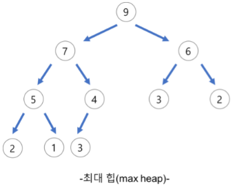

- 부모 노드의 키 값이 자식 노드의 키 값보다 크거나 같은 완전 이진 트리
- 루트 노드가 가장 큰 값이 됨

### 최소힙

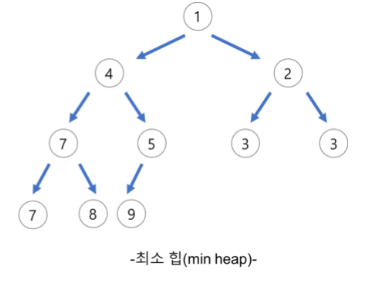

- 부모 노드의 키 값이 자식 노드의 키 값보다 작거나 같은 완전 이진 트리
- 루트 노드가 가장 작은 값이 됨

### 힙 삽입 삭제

- 삽입

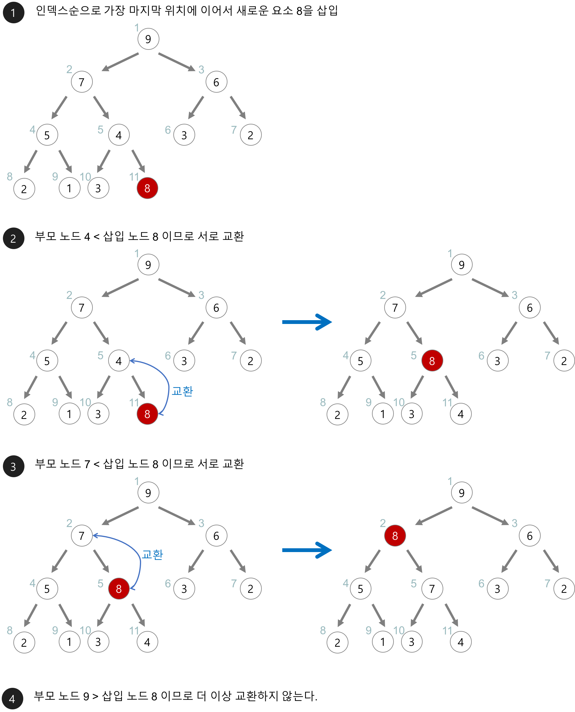

- 삭제

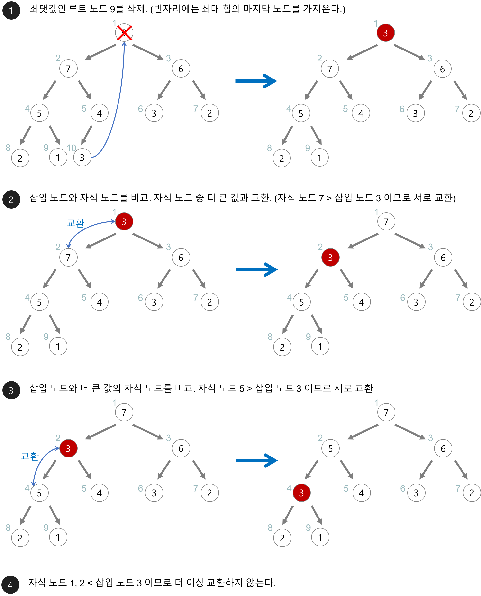

[그림출처](https://velog.io/@holicme7/%EC%9E%90%EB%A3%8C%EA%B5%AC%EC%A1%B0-%ED%9E%99heap-ktk49na9c3)

## 우선순위 큐

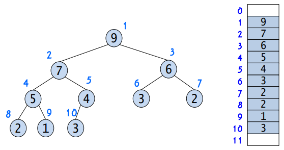

- 우선순위가 높은 데이터가 먼저 나가는 형태의 자료구조
- 일반적으로 힙을 이용하여 구현함
- 힙은 완전 이진트리이기 떄문에 중간에 빈 요소가 없다
- 왼쪽 자식을 구하고 싶을 때 => index = (부모 index) \* 2
- 오른쪽 자식 구하고 싶을 때 => index = (부모 index) \* 2 + 1
- 부모 노드 구하고 싶을 때 => index = (자식 index) / 2

## 맵

- 키-값 쌍으로 데이터를 저장하는 추상적인 자료구조
- 키를 통해 데이터를 효율적으로 검색, 추가, 삭제 가능
- 중복된 키를 허용하지 않음 => 값 중복은 가능
- 레드 블랙트리 자료 구조를 기반으로 형성되어 순서를 보장
- HashMap, HashTable, LinkedHashMap, TreeMap 에 사용

### HashMap

- 중복을 허용하지 않고 순서를 보장하지 않음
- 키와 값으로 null이 허용

### Hashtable

- HashMap 보다는 느리지만 동기화가 지원됨
- 키와 값으로 null이 허용되지 않음

### TreeMap

- 이진 탐색 트리의 형태를 가짐
- 데이터를 정렬된 순서로 저장한다. => 저장된 상태 유지를 위해 시간이 다소 오래 걸림

### LinkedHashMap

- HashMap과 상당히 흡사함
- 데이터를 넣을 때 입력한 Key 순서를 지키지 않는 HashMap과 달리 Key의 순서를 보장

## 셋

- 집합
- 중복된 데이터를 허용하지 않음
- 순서를 유지하지 않음
- 검색기능이 없어 하나씩 꺼내야함
- contains로 값을 찾을 순 있음

### HashSet

- 순서 및 정렬을 하지 않은 가장 단순한 Set
- 가장 빠른 임의 접근 속도를 가짐

### LinkedHashSet

- HashSet과 흡사함
- 연결 리스트를 사용해서 데이터를 저장하기 떄문에 Key 순서를 보장

### TreeSet

- 이진 탐색 트리(RB-Tree) 형태
- 데이터를 정렬된 순서로 저장, 정렬된 상태를 유지하기 위해 다소 오래 걸림

## 해시 테이블

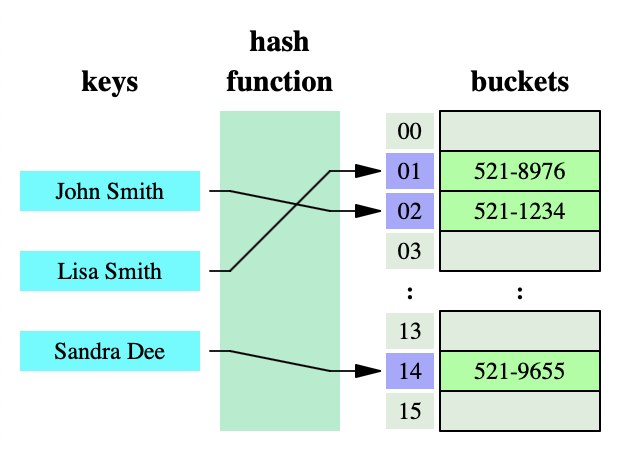

- 삽입, 삭제, 탐색 평균적으로 O(1) 시간 복잡도를 가짐
- 해시 함수를 이용하여 구현 => 키를 해시 값으로 인코딩하는 함수
- 입력 개수 n 이 저장하는 m 보다 큰 경우 m에 대해서 입력값이 다른 충돌이 발생할 수 있음

### 개별 체이닝

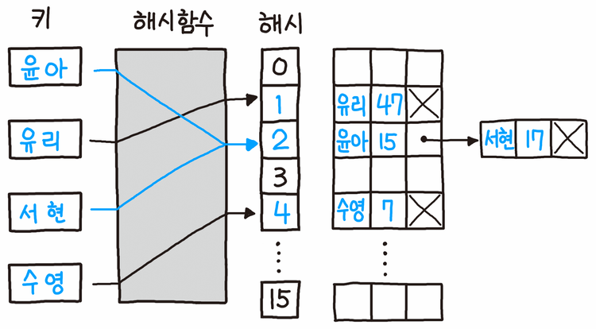

- 인덱스값 충돌시 연결 리스트로 연결하는 방식
  1. 키의 해시 값 계산
  2. 해시 값을 이용한 배열의 인덱스 계산
  3. 충돌 시 연결 리스트 연결

### 오픈 어드레싱

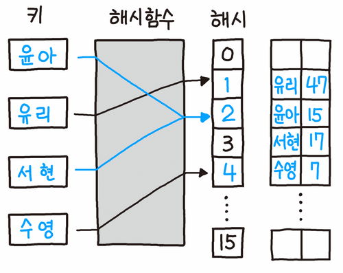

- 충돌 시 탐사를 통해 다른 빈 공간을 찾아나서는 방식
- 모든 원소가 반드시 자신의 해시 값에 대응하는 주소에 저장되는 보장은 없음

| 언어   | 방식          |
| ------ | ------------- |
| C++    | 개별 체이닝   |
| Java   | 개별 체이닝   |
| Python | 오픈 어드레싱 |
