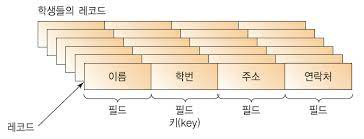
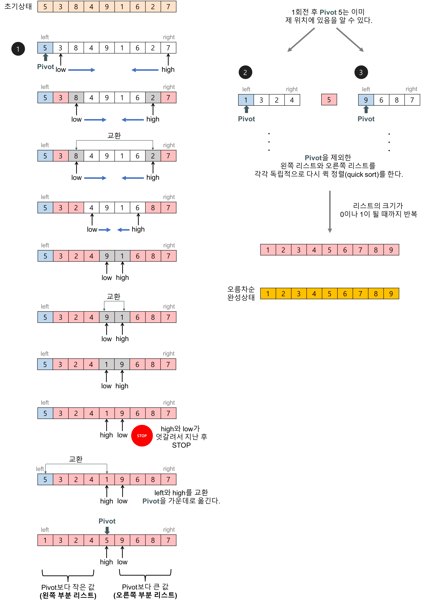
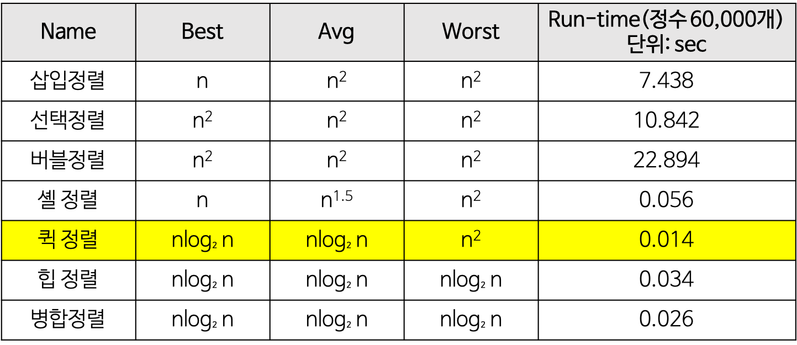

# 정렬

- 데이터를 특정한 조건에 따라 일정한 순서가 되도록 나열하는 것
- 기초적이고 매우 중요한 알고리즘
- 정렬 대상을 레코드(Record) / 레코드는 필드(Field) 단위로 나뉘고 레코드와 레코드를 식별하는 필드를 키라고 부름

- 최적의 정렬은 없으므로 상황에 맞는 알고리즘을 사용해야함
- 기초적인 정렬 알고리즘으로는 선택 정렬, 버블 정렬, 삽입 정렬 존재
- 구현이 비교적 쉽고 메모리를 적게 사용함

## 선택 정렬(Selection Sort)

- 정렬 데이터 요소 중 가장 작은 값 또는 가장 큰 값을 찾아서 이동 과정을 모든 요소에 대해 반복하는 정렬 알고리즘
- 오름차순 정렬의 경우, 처음 배열에서 가장 작은 값을 찾아 맨 앞 요소와 교환하고 이후 정렬된 부분을 제외하고 나머지를 찾아 수행
- 모든 요소에 교환 발생이 일어나기 때문에 시간 복잡도는 n(n-1)/2 로 n\*\*2 유지
- 예시
  - [5, 2, 6, 3, 1, 4]
  - [1, 2, 6, 3, 5, 4] => [1, 2, 6, 3, 5, 4] => [1, 2, 3, 6, 5, 4] => [1, 2, 3, 4, 5, 6]
- 선택 정렬은 버블 정렬보다 일반적으로 빠름
- 불안정 정렬

## 버블 정렬(Bubble Sort)

- 인접한 두 요소를 비교하며 요소 자리를 바꾸는 과정을 반복
- 큰 요소들이 뒤로 옮겨질 때 거품내며 물에 가라앉은 모습 같다해서 버블 정렬이라함
- 예시
  - [6, 3, 5, 4, 2, 1]
  - [(3, 6), 5, 4, 2, 1] => [3, (5, 6), 4, 2, 1] => [3, 5, (4, 6), 2, 1] => [3, 5, 4, (2, 6), 1] ...
- n(n-1)/2 시간 복잡도로 n\*\*2 가짐
- 정렬 중 교환 여부를 확인하여 교환이 이뤄지지 않았으면 정렬이 완료된 것으로 판단
- 외부 내부 반복문을 통해서 정렬을하며 외부 플래그 변수를 만들어 교환 여부를 체크

## 삽입 정렬(Insertion Sort)

- 처음 인덱스부터 끝까지 반복하며 현재 요소 값이 왼쪽 요소보다 작은 경우 위치를 바꿔준다.
- 예시
  - [6, 3, 5, 4, 2, 1]
  - [3, 6, 5, 4, 2, 1] => [3, 5, 6, 4, 2, 1] => [3, 5, 4, 6, 2, 1] => [3, 4, 5, 6, 2, 1] .... => [1, 2, 3, 4, 5, 6]
- 이동 여부를 체크하여 조기 종료가 가능
- 최악의 경우 n\*\*2

## 합병 정렬(Merge Sort)

- 분할 정복 방식으로 설계된 알고리즘
- 연산 중 두개의 배열로 쪼게 나가며 합치면서 정렬한 후 최후에는 하나의 정렬을 출력

## 퀵 정렬(Quick Sort)

- 분할 정복 방식으로 설계된 알고리즘
- pivot point라는 기준이 되는 값을 설정 후 이를 기준으로 작은 값은 왼쪽, 큰 값은 오른쪽으로 옮기는 정렬

## 정렬 알고리즘 시간 복잡도

