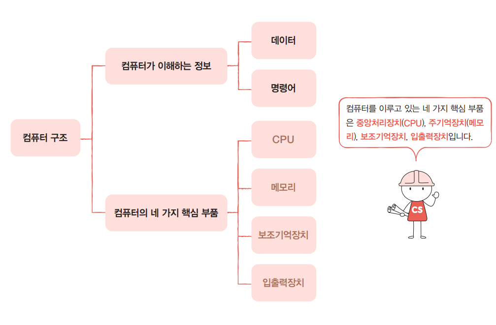
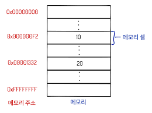
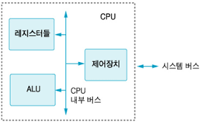
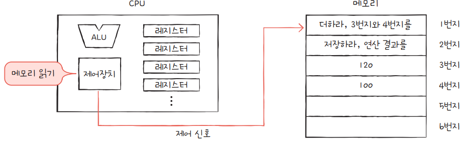
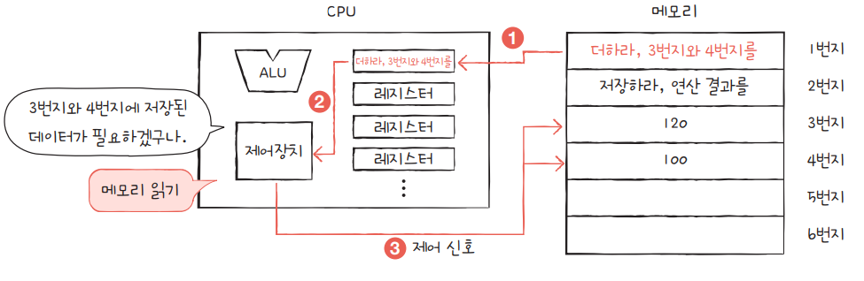

# 컴퓨터 구조

- 많은 컴퓨터들의 종류가 존재하지만 결국 그 컴퓨터들을 구성하는 핵심 부품은 크게 다르지 않다

  1.  중앙처리장치 - CPU(Central Processing Unit)
  2.  주기억장치 - Memory(Main Memory)
  3.  보조기억장치 - Secondary Storage
  4.  입출력장치 - I(Input)/O(Output) device

- 위 네 가지 부품의 역할만 이해하면 컴퓨터 작동 원리를 대부분 파악이 가능하다.

## 메모리

 - 컴퓨터가 이해하는 정보는 명령어와 데이터이다.
 - 메모리는 현재 실행되는 프로그램의 명령어와 데이터를 저장하는 부품이다.
 - 컴퓨터가 빠르게 동작하기 위해서는 메모리 속 명령어와 데이터가 정돈되어 있어야 한다.
 - 이렇게 정리된 메모리에 빠르고 효율적으로 접근하기 위해서 주소(address) 라는 개념이 사용된다.
 - 현실에서 우리가 원하는 주소로 위치를 찾아갈 수 있는 것처럼 컴퓨터 에서도 주소로 메모리에 접근을 할 수 있다.
 
 
 
 - 메모리가 저장되는 방식은 위 그림과 같이 특정 주소에 특정한 값이 할당되는 것처럼 보인다.
 
 - 메모리에 대해서는
   - 프로그램이 실행되기 위해 반드시 메모리에 저장되야 한다.
   - 현재 실행되는 프로그램의 명령어와 데이터를 저장한다.
   - 메모리에 저장된 값의 위치는 주소로 알 수 있다.
 - 위 3개를 기억하면 된다.

## CPU

 - 컴퓨터의 두뇌로 메모리에 저장된 명령어를 읽어 들고 해석하고 실행한다.

 

 - CPU 내부 구성요소는
   - 산술논리연산장치 - ALU(Artihmetic Logic Unit)
   - 레지스터 - register
   - 제어장치 - CU(Control Unit)

### 산술논리연산장치 - ALU

 - 컴퓨터 내부에서 수행되는 대부분의 계싼을 수행하는 역할

### 레지스터 - register

 - CPU 내부의 작은 임시 저장 장치
 - 프로그램을 실행하는 데 필요한 값들을 임시로 저장한다.
 - 여려 개의 레지스터가 존재하고 각기 다른 이름과 역할을 가지고 있다.
  
### 제어장치 - CU(Control Unit)

 - 제어신호(Control Signal)라는 신호를 보내 명령어를 해석하는 장치
 - 제어 신호는 컴퓨터 부품을 관리하고 작동시키기 위한 전기 신호이다.
 - CPU가 메모리에 저장된 값을 읽고 싶을 땐 메모리를 향해 <b>메모리 읽기</b>라는 제어 신호를 보낸다.
 - CPU가 메모리에 어떤 값을 저장하고 싶을 땐 메모리를 향해 <b>메모리 쓰기</b>라는 제어 신호를 보낸다.

### CPU를 구성하는 세 부품의 동작

 

 1. 제어장치는 특정 메모리에 저장된 명령어를 읽기 위해 <b>메모리 읽기</b> 신호를 보낸다.

 

 2. 메모리에서는 요청에 따라 저장된 주소에 명령어를 CPU에 돌려주고 이 명령어는 레지스터에 저장된다.
 3. 제어장치는 읽은 명령어를 해석한 후 다른 메모리에 저장된 값이 필요하다고 판단 후 각각 메모리 주소에 <b>메모리 읽기</b> 신호를 보낸다.

 

 4. 메모리는 제어장치 요청에 따라 필요한 정보를 CPU에 건내주고 데이터들은 서로 다른 레지스터에 저장된다.
 5. ALU에서는 읽어들인 데이터로 연산을 수행한 후 계산의 결과값을 레지스터에 저장한다.

 - 위와 같은 구조를 통해서 CPU에서 메모리에 요청을 보내고 명령을 제어하게 된다.

 - CPU 내용을 정리하면
   - CPU는 메모리에 저장된 값을 읽어 들이고, 해석하고, 실행하는 장치이다.
   - CPU는 내부에 ALU, 레지스터, 제어장치가 있다.
   - ALU는 계산하는 장치, 레지스터는 임시 저장 장치, 제어장치는 제어 신호를 발생시키고 명령어를 해석하는 장치

## 보조기억장치

 - 앞서 얘기한 메모리는 가격이 비싸고 저장용량이 작다는 단점이 있다.
 - 전원이 꺼지면 저장된 내용을 잃는 단점도 있다.
 - 이러한 이유로 컴퓨터가 전원이 꺼져도 저장된 내용을 잃지 않기 위해 메모리를 보조할 저장 장치가 필요하며 이 역할을 해주는 것이 보조기억장치다.