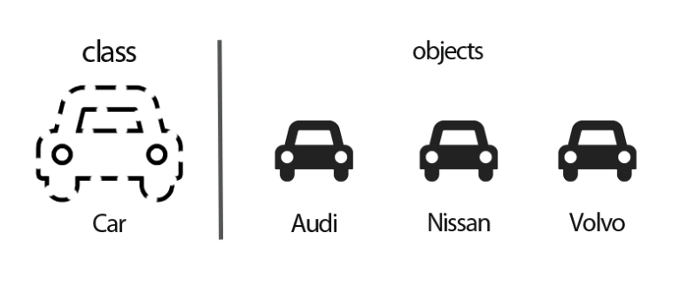
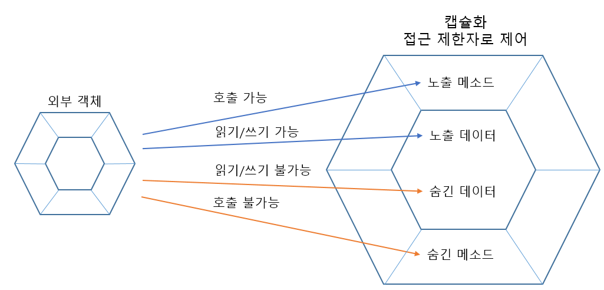
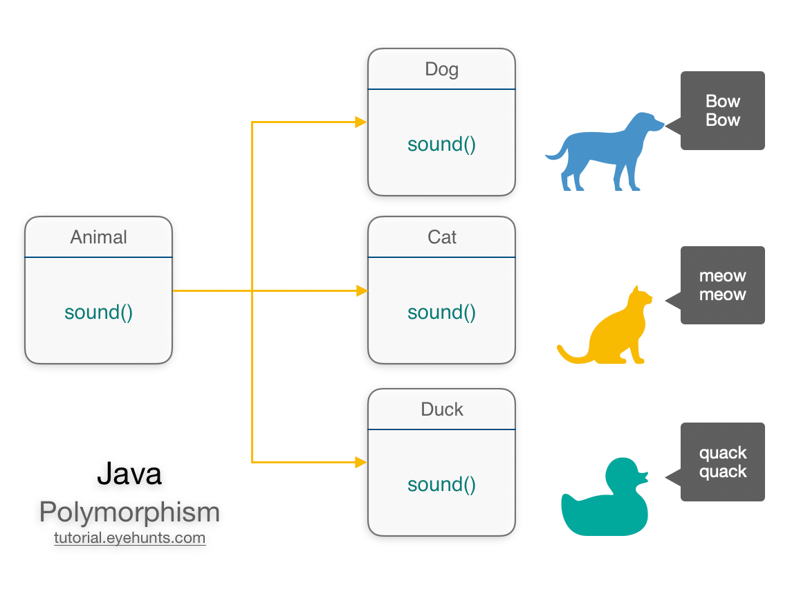

# 객체지향 프로그래밍

- 객체 집합으로 프로그램 상호 작용을 표현하고 데이터를 객체로 취급하여 내부에 선언된 메서드를 활용하는 방식
- 재사용, 유지보수, 확장성 등을 중요시함
- 추상화, 캡슐화, 상속성, 다향성이라는 특징을 가짐

## 추상화



- 필요한 부분만 남기고 나머지 부분을 감추는 방식

## 캡슐화



- 객체의 속성과 메서드를 하나로 묶고 일부를 외부에 감추는 것
- 데이터 무결성 보호, 외부에서 내부에 상태를 직접 변경하지 못하도록 막음

## 상속성

- 상위 클래스 특성을 하위 클래스가 이어 받아 재사용하거나 추가, 확장하는 것
- 코드의 재사용성, 계층적 관계 생성, 유지 보수성 측면에 중요

```python
class Figure:
    def __init__(self, name, color):
        self.__name = name
        self.__color = color

class Quadrangle(Figure):
    def set_area(self, width, height):
        self.__width = width
        self.__height = height

    def get_info(self):
        print (self.__name, self.__color, self.__width * self.__height)
```

## 다형성



- 하나의 메서드나 클래스가 다양한 방법으로 동작하는 것
- 오버라이딩과 오버로딩의 형태로 나타남
  - 오버라이딩 : 부모 클래스에서 정의된 메서드를 자식 클래스에서 재정의 하여 사용하는것
  - 오버로딩 : 같은 이름의 메서드를 여러 형태로 정의

```python
# 오버라이딩
class Animal:
    def speak(self):
        print("Animal is making a sound")

class Cat(Animal):
    def speak(self):
        print("Cat is meowing")

class Dog(Animal):
    def speak(self):
        print("Dog is barking")
# 오버로딩 Python은 지원 X 자바가 지원하는데 예시로 든거임
class Person:
    def eat(a):
        print("I eat " + a)

    def eat(a,b):
        print("I eat " + a " and " + b)
```

## 설계원칙

- SOLID 원칙 준수
  - S : 단일 책임
  - O : 개방-폐쇄
  - L : 리스코프 치환
  - I : 인터페이스 분리
  - D : 의존 역전

### 단일 책임 원칙

- 하나의 클래스는 하나의 책임을 가져야 한다

### 개방-폐쇄 원칙

- 확장에는 열려있고 변경에는 닫혀야함
  - 확장 가능 : 새로운 기능 추가에 기존 코드에 영향이 없어야함
  - 변경 불가 : 기존 클래스나 모듈을 변경하지 않고 새 기능 추가 혹은 인터페이스 구현을 통해 좍장하는 방식

```python
class Shape:
    def area(self):
        pass

class Circle(Shape):
    def area(self):
        return "원 면적 계산"

class Rectangle(Shape):
    def area(self):
        return "사각형 면적 계산"
```

### 리스코프 치환 원칙

- 서브 타입은 언제나 자신의 기반 타입으로 교환 가능
- 부모 객체와 자식 객체가 존재할 경우 부모 객체를 호출하는 동작에서 자식 객체가 부모를 완전히 대체할 수 있다는 원칙

### 인터페이스 분리 원칙

- 특정 클라이언트를 위한 인터페이스 여러 개가 범용 인터페이스 하나보다 낫다

```python
# 큰 인터페이스
class Worker:
    def work(self):
        pass

    def eat(self):
        pass

# 작은 인터페이스로 분리
class Workable:
    def work(self):
        pass

class Eatable:
    def eat(self):
        pass

```

### 의존 역전 원칙

- 상위 모듈은 하위 모듈에 의존해서는 안되고 둘다 추상화에 의존해야 한다

```python
# 상위 모듈이 하위 모듈에 의존
class LightBulb:
    def turn_on(self):
        print("Light bulb turned on")

class Switch:
    def __init__(self, bulb: LightBulb):
        self.bulb = bulb

    def operate(self):
        self.bulb.turn_on()

# 추상화된 인터페이스 사용
class Switchable:
    def turn_on(self):
        pass

class LightBulb(Switchable):
    def turn_on(self):
        print("Light bulb turned on")

class Switch:
    def __init__(self, device: Switchable):
        self.device = device

    def operate(self):
        self.device.turn_on()

```
