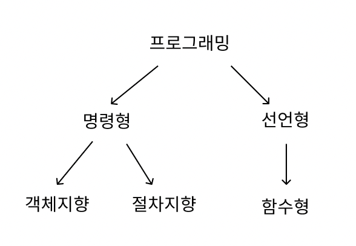

# 프로그래밍 패러다임



- 프로그램은 순차, 분기, 반복, 참조로 구성
- 객체지향은 절차지향의 단점을 극복하기 위해, 함수형은 객체지향의 단점을 극복하기 위해 등장

## 선언형과 함수형 프로그래밍

- 무엇을 풀어내는가에 집중하는 패러다임
- 이중 함수형 프로그래밍은 선언형 패러다임의 일종
- '순수 함수'들을 블록처럼 쌓아 로직을 구현하고 '고차 함수'를 통해 재사용성을 높인 프로그래밍 패러다임

### 특징

- 순수 함수 : 동일한 입력에 대한 항상 같은 출력을 반환하고, 외부 상태를 변경하지 않음
- 불변성 : 변수 값이 정해지면, 모든 데이터는 변하지 않음 상태 변경 대신, 기존 데이터를 복사 혹은 새로운 데이터 생성 후 처리
- 고차 함수 : 함수를 인자로 받거나 함수를 반환하는 함수를 작성
- 일급 객체 : 변수나 메서드에 함수를 할당 가능, 함수 안에 함수를 매개변수로 담음, 함수가 함수를 반환 가능

```JS
const add = (a, b) => a + b; // 순수 함수
const double = x => x * 2; // 순수 함수

const numbers = [1, 2, 3, 4, 5];
const doubled = numbers.map(double); // 고차 함수
const sum = numbers.reduce(add); // 고차 함수
// 객체 조건
// 변수에 할당
const mul = function (num) {
  return num*num;
}

// 다른 함수를 인자로 받음
function mul(num) {
  return num*num;
}

function mulNum(func, number) {
  return func(number);
}

mulNum(mul, 1)

// 다른 함수의 결과로 리턴 될 수 있다
function add(num1) {
  return function (num2) {
    return num1 + num2;
  }
}
```
