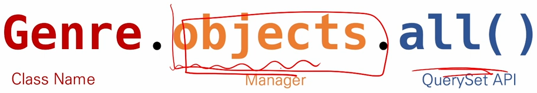

# ORM
  - 객체 => 모든 것
    - 속성 & 메서드 => 값과 함수
  - 클래스 / 인스턴스 => 틀과 사례
  - Object-Relational-Mapping
  - 객체 지향 프로그래밍 언어를 사용하여 호환되지 않은 유형의 시스템 간의 데이터를 변환하는 프로그래밍 기술
  - 파이썬에서는 SQLAlchemy, peewee 등 라이브러리가 있으며 Django 프레임워크 에서는 내장 Django ORM을 활용
  - 객체로 DB를 조작한다.
    > Genre.objects.all()

  - 모델 설계 및 반영
    - 클래스를 생성하여 내가 원하는 DB의 구조를 만든다.
```python
    class Genre(models.Model):
        name = models.CharField(max_length=30)
```

  - 상속을 받는 이유 => 기능들을 활용하고 싶어서 (미리 만들어진)

```python
    from django.db import models

    class Genre(models.Model):
        name = models.CharField(max_length=30)
```

  - 클래스의 내용으로 데이터베이스에 반영하기 위한 마이그레이션 파일을 생성한다. (자동)

```python
    python manage.py makemigrations
```

  - DB에 migrate 한다.
```python
    python manage.py migrate
```

  - Migration(마이그레이션)
    - Model 에 생긴 변화를 DB에 반영하기 위한 방법
    - 마이그레이션 파일을 만들어 DB 스키마를 반영한다.
    - 명령어
      - makemigrations : 마이그레이션 파일 생성
      - migrate : 마이그레이션을 DB에 반영
```sql
BEGIN;
--
-- Create model Genre
--
CREATE TABLE 'db_genre' (
    'id' integer NOT NULL PRIMARY KEY AUTOINCREMENT,
    'name' varchar(30) NOT NULL
);
COMMIT;
```
  - 트랜잭션
    - 쿼리가 오류가 없이 다 시행되었을 경우 추가해 주는 역할을 하지만 오류가 발생하여 도중에 업데이트가 되지 않았을 경우 그 쿼리의 시행자체를 무효화 하여 오류가 업데이트 되는 것을 막아주는 역할

  - 데이터베이스 조작(Database API)

  

## 기본 조작
  **- python manage.py shell_plus 를 사용하여 접근해야 함!!**
  - Create
```python
    # 1. create 메서드 활용
    Genre.objects.create(name='발라드')

    # 2. 인스턴스 조작
    genre = Genre()
    genre.name = '인디밴드'
    genre.save()

    Genre.objects.all()
    # QuerySet ~~~ Genre 의 내용을 모두 출력
    Genre.objects.all()[0]
    # Genre: Genre object (1) << id 값
    Genre.objects.all()[0].name
    # '인디밴드'
```
  - READ

```python
    Genre.objects.get(id=1)
    # PK 를 받아올 때 사용
    # 반드시 하나만을 리턴함 값이 없으면 오류
    # Genre: Genre object (1)
    Genre.objects.filter(id=1)
    # 값을 여러개 리턴할때 사용
    # QuerySet [Genre: Genre object (1)]
```

  - Update

```python
    genre = Genre.objects.get(id=1)
    genre.name = '인디음악'
    genre.save()
```

  - Delete

```python
    genre = Genre.objects.get(id=1)
    genre.delete()
```

  - Artist 모델 만들기
```python
    class Artist(models.Model):
        name = models.CharField(max_length=30)
        debut = models.DateField()
```