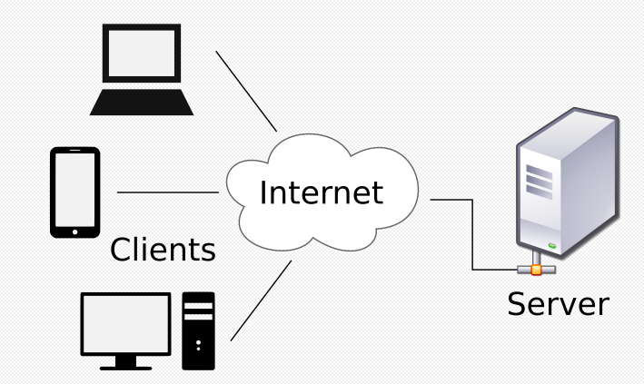

# Django 시작하기
  - Framework 이해하기
    - 누군가 만들어 놓은 코드를 재사용 하는 것은 이미 익숙한 개발 문화
    - 많은 개발자들이 수없이 많이 개발해온 과정에서 필요하고 자주 사용하는 구조의 코드를 가져다 사용하는 것
    - 코드들을 모아 놓은 것, 서비스 개발에 필요한 기능들을 미리 구현해서 모아 놓은 것 = 프레임워크
    - Frame(뼈대, 틀) + Work(일하다)
      = 일정한 뼈대, 틀을 가지고 일한다
      - 제공받은 도구들과 뼈대, 규약을 가지고 무언가를 만드는 일
      - 특정 프로그램을 개발하기 위한 여러 도구들과 규약을 제공
    - 프레임워크는 복잡한 문제를 해결하거나 서술하는 데 사용되는 기본 개념 구조
    - Framework를 잘 사용하면 웹 서비스 개발에 있어서 

  - Django를 배워야하는 이유
    - Python으로 작성된 프레임워크
      - Python이라는 언어의 강력함과 거대한 커뮤니티
    - 수많은 여러 유용한 기능들
    - 검증된 웹 프레임워크

  - Web 이해하기
    - www(World Wide Web) 전 세계에 퍼져 있는 거미줄 같은 연결망

## IP 와 도메인
  
  **인터넷은 웹의 핵심적인 기술이다**
  
  - IP(Internet Protocol Address) : Protocol은 상호간의 약속한 규칙을 의미
  
    - 네트워크에 연결된 각각의 장치를 호스트(Host) 라고 하며 서버(Sever)는 호스트가 자신에게 데이터를 요청(Request)할 경우, 응답(Response) 해주는 역할을 한다.
    - 각 호스트마다 다른 호스트들과 데이터를 주고 받기 위해, 구분하는 특수한 번호를 가지고 있는데 이것을 IP주소 라고 부른다.
    
    > 127.0.0.1 == http://localhost:3000 => localhost == 127.0.0.1

    - IP주소는 4개의 숫자와 점(Dot) 로 구성되어 있으며, 각 숫자는 0~255 사이의 정수를 가진다.

  - Domain
    - https://www.naver.com 에서 naver.com 을 도메인이라고 말함.
    - 도메인의 작명은 웹서비스를 제공할 도메인 소유자의 의도가 반영된 것
    - 웹 브라우저는 도메인과 연결되어 있는 IP 주소를 찾아서 이동해주는 역할
    - IP 주소를 외울 수 없기때문에 사람들이 외우기 쉽게 영문으로 표현한 것

## 클라이언트와 서버
  
  - 대부분 웹 서비스는 클라이언트-서버 구조
  - 클라이언트와 서버 역시 하나의 컴퓨터이며 이들을 어떻게 상호작용하는지에 대한 것

  

  - 클라이언트
    - 웹 사용자의 인터넷에 연결된 장치 (Wi-Fi, 핫스팟)
    - Chrome or Firefox 와 같은 웹 브라우저
    - 서비스를 요청하는 주체

  - 서버
    - 웹 페이지, 사이트 or 앱을 저장하는 컴퓨터
    - 클라이언트가 웹 페이지에 접근하려고 할 때 서버에서 클라이언트 컴퓨터로 웹 페이지 데이터를 응답해 사용자의 웹 브라우저에 표시됨
    - 요청에 대해 서비스를 응답하는 주체
  
  - 상호작용 예시
    - Google 홈페이지 or Naver 홈페이지에 접속 시 Google 홈페이지.html 파일을 달라고 요청을 하는 것이다.
    - 구글 컴퓨터는 이 요청을 받아 우리에게 Google 홈페이지.html 을 인터넷을 통해 우리에게 응답해주는 것

## 동적 웹사이트와 정적 웹 사이트
  - 정적 웹 사이트 : 컴퓨터에 저장된 메모장 파일을 여는 듯 그대로 보는 페이지
    - 웹 서버에 이미 저장된 html 문서를 클라이언트(호스트)에게 전송하는 웹 페이지
    - 사용자는 서버에 저장된 데이터가 변경되지 않는 한 고정된 웹 페이지를 보게 됨G
  - 동적 웹 사이트 : 다양한 변수들에 의해 변경되어 보이는 동적인 웹 페이지