# 기본 설정

### 1. 원하는 폴더에 들어가서 파일 생성

> python -m venv <가상환경이름>
> source <가상환경이름>/Script/activate 통하여 가상환경 실행
> pip install django==3.1.13 
> django-admin startproject <프로젝트이름> <저장할 폴더 위치>

### 2. startapp 실행 후 app 폴더 설정

> python manage.py startapp <이름>

> project 폴더 내부 setting에서 INSTALLED_APPS 내부에 app 이름 추가

### 3. path 설정
  
  - url 설정은 app 단위로 해주는 것이 좋다.

> repeat > urls 에서 path('주소이름/', include('repeating.urls')), 추가

> repeating 폴더로 가서 urls.py 추가 후 app_name 설정

> 왼쪽 : repeating 폴더 url / 오른쪽 : repeat 폴더 url

### 4. view 함수 설정과 templates 생성

> repeating 내부에 templates/repeating 폴더 생성 후 index.html 파일 생성

> views.py 로 들어가 index 라는 함수를 선언해주고
> repeating 내부폴더의 urls.py 에서 path url 을 설정해준다. path("", views.index),
> views를 정의해주기 위해서는 from repeating import views 로 정의를 해준다.

# CRUD

### 1. Model 정의

> repeating 폴더 내부 models.py에 class를 정의
> 정의한 모델을 python manage.py makemigrations / python manage.py migrate 를 통하여 DB 생성

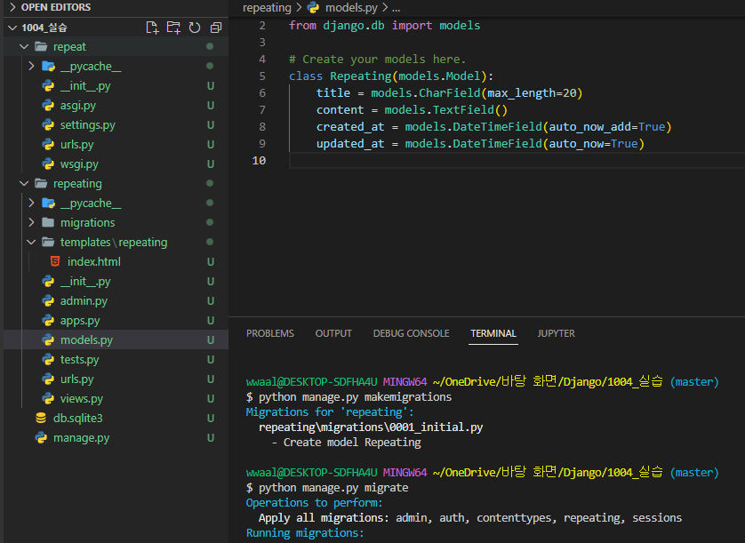

> 정의한 모델을 DB로 만든 후 views.py 파일에 불러오기
> 불러온 DB를 사용할 html 파일을 urls에 추가해준다.

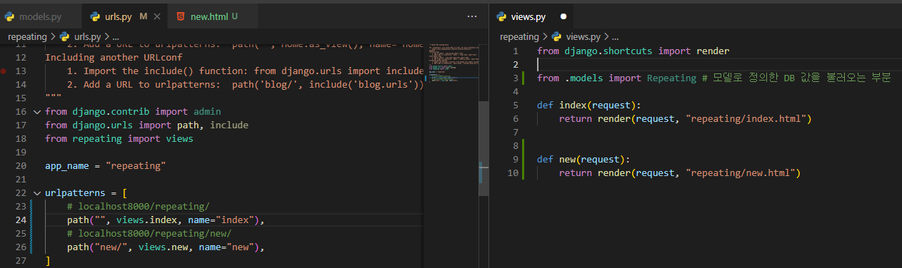

### 2. 입력받은 데이터 처리

> 새로운 주소를 만들어서 form 을 넘겨준다
> <form action="">
> url 에서 path('create/', views.create, name='create'), 선언해준 후 views에서 함수를 조정한다.

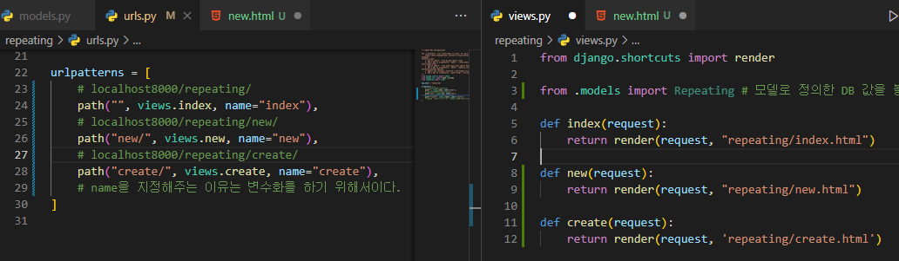

> GET 을통하여 값을 가져온다
> request.GET.get('title') / request.GET.get('content')
> 가져온 값을 Repeating DB모델에 Repeating.objects.create(title=title, content=content) 로 넣어준다
> redirect 를 통하여 생성완료하면 index.html 로 이동한다.

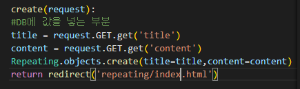

> views.index 에서 위에서 DB에 저장한 값들을 불러와 index.html 로 값들을 넘겨준다.

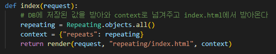

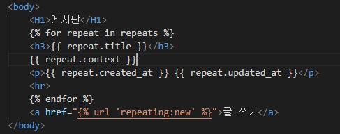

> repeats로 받아왔기 때문에 html 변수를 사용시 repeats 로 변수를 다룬다
> repeating = Repeating.objects.order_by("-pk") 를통하여 최신글 순으로 정렬이 가능하다.

> GET : 서버에서 어떤 데이터를 가져와서 보여줄때 사용. 데이터를 바꾸지 않을경우에 사용한다. (조회)
> POST : 서버로 데이터 값이나 상태를 추가하거나 수정, 값을 저장할 때 사용한다. (제출)

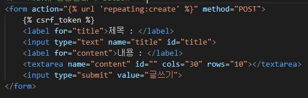

> POST를 사용할 경우  을 사용해줘야지 오류가 발생하지 않는다.
> 기존 create 함수내부에 GET으로 되어있는 부분을 POST로 변경해준다.

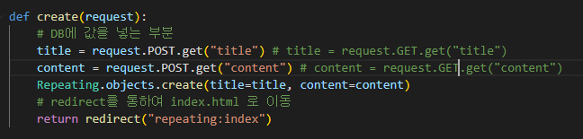

### 3. 데이터 수정

> 글쓰기 항목란에 edit 라는 페이지로 값을 보내주고 수정을 시도한다.
> a tag를 이용하여 href 로 edit.html 로 보내준다.
> url에서 edit 페이지를 추가해주고 수정을 원하는 게시글의 id 값도 같이 보내준다.

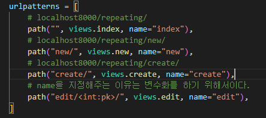

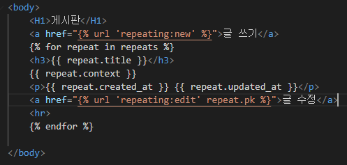

> views 파일에서 edit를 통하여 수정해야 하는 글의 정보를 Primary key를 통하여 넘겨준다.

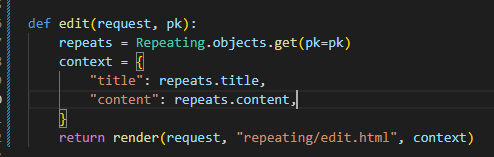

> edit.html 에서 form action 을통하여 저장할 게시물로 값을 보내주는 내용을 구성해준다
> 기존의 내용과 제목은 가지고있던 파일의 제목과 내용을 가져온다.

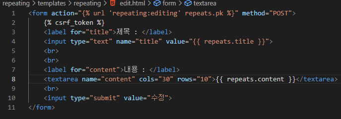

> edit.html 을 만들어줬으므로 내용을 처리할 urls 와 views도 만들어 줘야한다.
> editing 이라는 함수에 인자로 Primary key를 넘겨주어서 edit.html로 POST(수정) 로 받아온 값들을 지정 된 title 과 content에 넣어주면 수정이 완료된다.
> 완료된 수정값을 redirect 를 통하여 index.html로 보내주면 수정완료되면 홈페이지로 이동하게 되는 것이다.

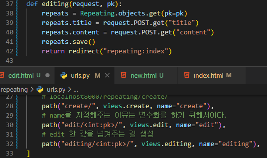