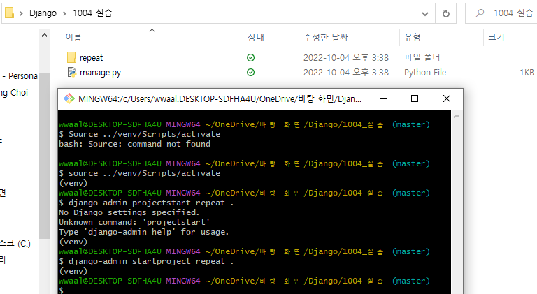
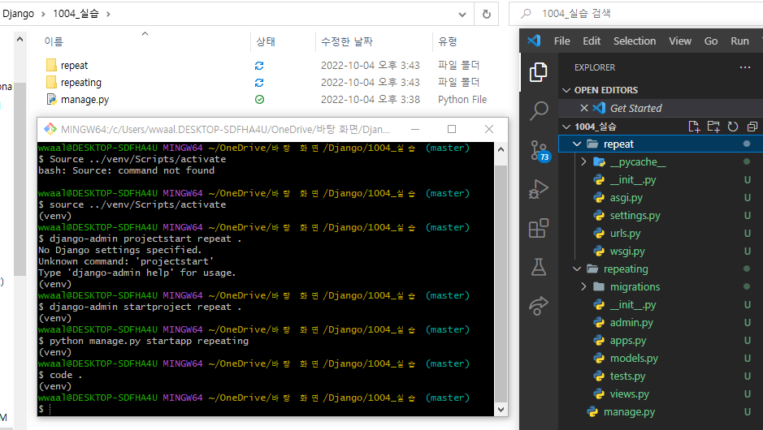
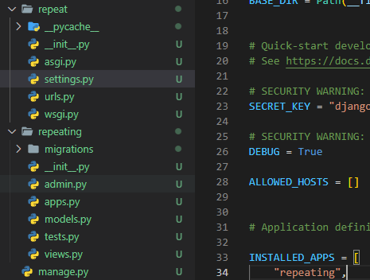
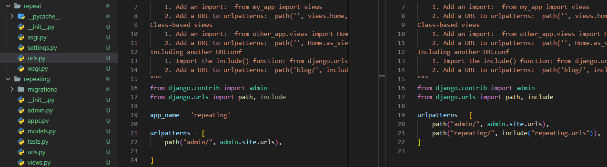
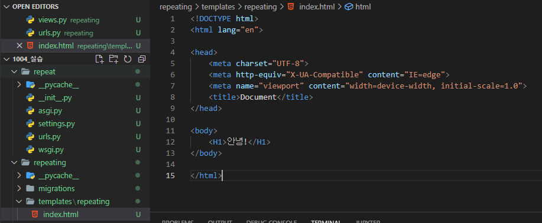
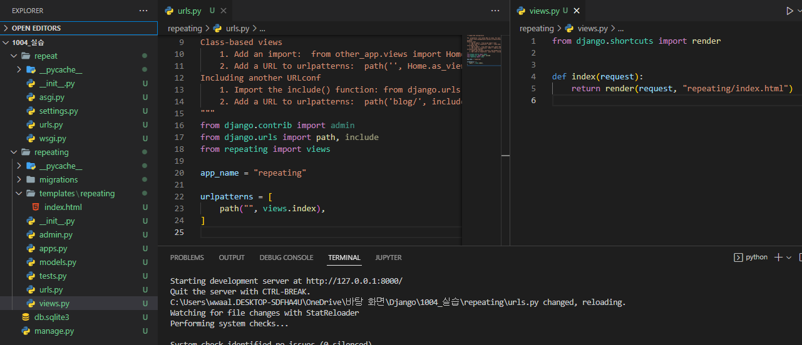

# 기본 설정

### 1. 원하는 폴더에 들어가서 파일 생성

> python -m venv <가상환경이름>
> source <가상환경이름>/Script/activate 통하여 가상환경 실행
> pip install django==3.1.13 
> django-admin startproject <프로젝트이름> <저장할 폴더 위치>

### 2. startapp 실행 후 app 폴더 설정

> python manage.py startapp <이름>

> project 폴더 내부 setting에서 INSTALLED_APPS 내부에 app 이름 추가

### 3. path 설정
  
  - url 설정은 app 단위로 해주는 것이 좋다.

> repeat > urls 에서 path('주소이름/', include('repeating.urls')), 추가

> repeating 폴더로 가서 urls.py 추가 후 app_name 설정

> 왼쪽 : repeating 폴더 url / 오른쪽 : repeat 폴더 url

### 4. view 함수 설정과 templates 생성

> repeating 내부에 templates/repeating 폴더 생성 후 index.html 파일 생성

> views.py 로 들어가 index 라는 함수를 선언해주고
> repeating 내부폴더의 urls.py 에서 path url 을 설정해준다. path("", views.index),
> views를 정의해주기 위해서는 from repeating import views 로 정의를 해준다.

