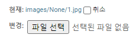

# ImageField Upload 다루기

  - ImageField 에서 images들을 넣을 경우 upload 폴더 내부로 들어가게 된다.
  - 이를 변수화 하여 폴더이름들을 내가 직접 선언해주고 싶어서 정리를 해볼려고 한다.

```python
def user_directory_path(self, filename):
    return f'images/{self.pk}/{filename}'

class StoreImage(models.Model):    
    store = models.ForeignKey(Store, on_delete=models.CASCADE, related_name='store_image')
    image = ProcessedImageField(upload_to=user_directory_path, blank=True,
                                processors=[ResizeToFill(1200, 960)],
                                format='JPEG',
                                options={'quality': 80})
```
  - 위와 같이 진행할 경우 pk 값이 존재하지 않아서 "images/None/파일이름" 이런 형식으로 저장되기 때문에 내가 원하던 저장방식인 "images/pk/파일이름" 으로 저장하기 위해서 다른 방법을 찾아보는 중이다.

    

  - 해결 방법은 매우 간단헀다.

```python
def user_directory_path(instance, filename):
    return f'images/{instance.store.team.name}/{instance.store.name}/{filename}'

class StoreImage(models.Model):    
    store = models.ForeignKey(Store, on_delete=models.CASCADE, related_name='store_image')
    image = ProcessedImageField(upload_to=user_directory_path, blank=True,
                                processors=[ResizeToFill(1200, 960)],
                                format='JPEG',
                                options={'quality': 80})
    
```

  - 위와같이 instance에서 store는 모델이 외래키로 참조되었기 때문에
  - 외래키로 연관된 모델에서 불러오고 싶은 정보를 불러오는 방식으로 진행하니 내가 원하는 /images/팀이름/구장이름/파일이름 형식으로 잘 저장되는걸 확인할 수 있엇다.

    

  - 참고문서
    - [장고 공식문서](https://docs.djangoproject.com/en/4.1/ref/models/fields/)
    - [upload to 한글문서](http://johnnykims.blogspot.com/2016/05/django-imagefield-uploadto.html)
    - [해결한 사이트](https://tothefullest08.github.io/django/2019/06/04/Django17_image/)